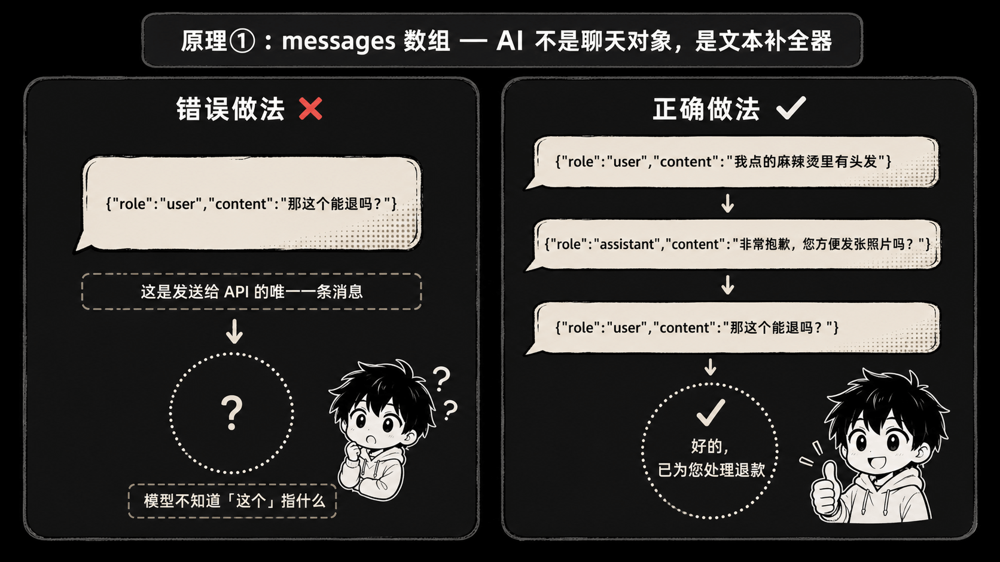
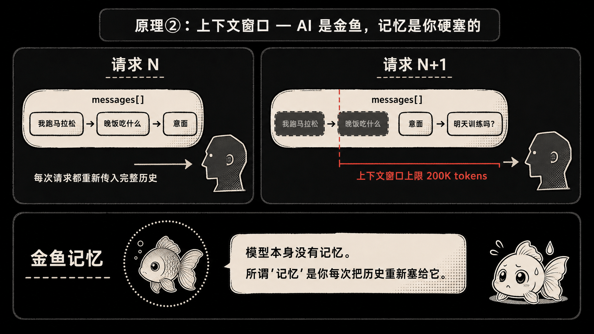
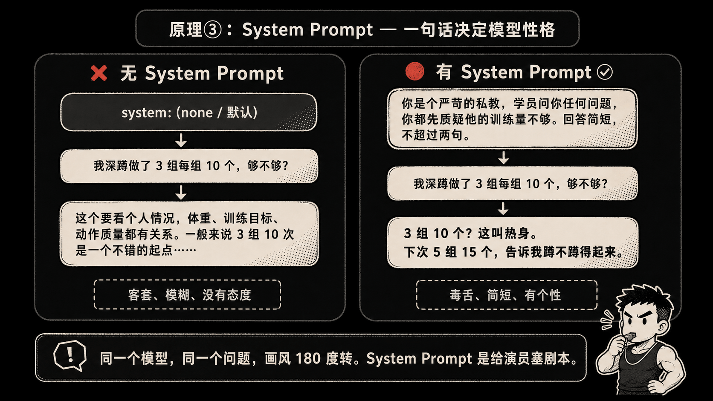
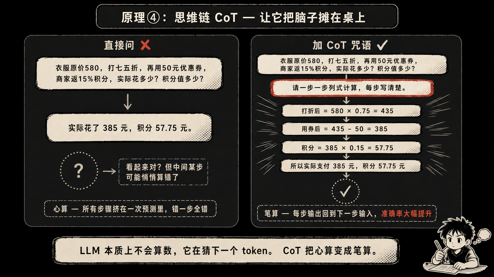
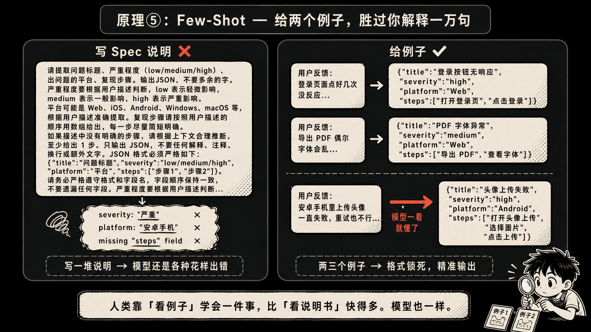
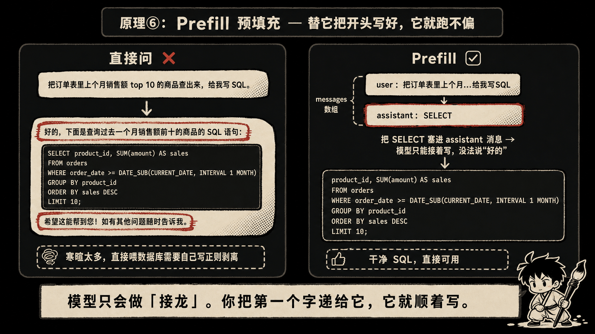

前阵子帮一个朋友 debug，他写了个外卖客服 bot，跑起来一切正常，唯独有个怪问题：用户聊到第三轮，bot 就开始胡言乱语。

朋友怀疑是模型抽风，让我看一眼。我点开他发请求的代码，瞬间笑出声——他每次调 API，`messages` 数组里只塞了用户当前说的那一句。前面聊了啥，模型一无所知。

他特别委屈："不是 AI 自己应该记得吗？我又没让它失忆。"

说实话，这种误解我见得太多了。很多人用了大半年大模型，写过 Prompt，调过 API，但对底层到底怎么跑的，脑子里全是迷雾。今天就聊 6 个原理。不深，但每一个都能让你"哦——原来是这样"。

---

## 原理 ①：messages 数组——AI 跟你说话，就这一根管子

很多人以为 AI 是个有状态的"对话对象"，你跟它说话，它会"听"。

错。

底层就一件事：你每次调 API，传过去一个 JSON 数组，每条带 `role` 和 `content`。`role` 要么是 `user` 要么是 `assistant`。模型读完整个数组，吐一段文字回来。**完事**。

我朋友那个外卖 bot，就是只传了最后一句：

```python
response = client.messages.create(
    model="claude-opus-4-7",
    messages=[
        {"role": "user", "content": "那这个能退吗？"}
    ]
)
```

模型懵了。"这个"指啥？前面用户说的"我点的麻辣烫里有头发"——模型从来没看到过。

正确姿势是把整段对话都塞进去：

```python
messages=[
    {"role": "user", "content": "我点的麻辣烫里有头发"},
    {"role": "assistant", "content": "非常抱歉，您方便发张照片吗？"},
    {"role": "user", "content": "发了，那这个能退吗？"}
]
```

如果你给它一个空数组，它就一个字都不会说。它不是"在等你"，它是"啥也没看到，没法 next-token"。

记住这点很重要：**AI 不是聊天对象，是一个文本补全器，你每次都得把"对话剧本"递给它，它才能写下一句。**



---

## 原理 ②：上下文窗口——AI 是金鱼，记忆是你硬塞的

承接上一条。既然每次都得把对话历史传过去，那……AI 哪里来的记忆？

它没有。一点都没。

你跟它说"我最近在准备马拉松"，三轮之后你问"那晚饭吃什么合适"，它回答"跑步前两小时建议高碳水，比如意面或者燕麦"——你以为它记得你跑马拉松？

不。是你（或者你的框架）把"我最近在准备马拉松"这句话又一次原封不动塞进了 `messages` 数组。模型从头读到尾，看到"哦这哥们在练马拉松"，然后接着补一段。

下次请求来，它又是"刚开机"状态，对你一无所知。每次都是。

这件事的几个推论挺反直觉的：

- 历史越长，token 越多，**你花的钱越多，速度越慢**。
- 一旦超过模型的上下文窗口（比如 200k token），就得做"截断"或者"摘要"——你以为的"长期记忆"其实是工程拼出来的。
- 所谓的"AI Agent 记得用户偏好"，背后基本都是 RAG、向量数据库、或者一个手写的 memory 模块，把过往的关键信息检索出来再塞回 prompt。

理解这一点，你就知道为啥"做一个有记忆的 AI 助手"是个工程问题，不是模型问题。



---

## 原理 ③：system prompt——一句话决定模型的性格

这个参数很多新手会以为"就是 messages 数组里第一条 role 为 system 的消息"。OpenAI 的 API 确实是那样，但 Claude 的 API 里，`system` 是个**独立的顶层参数**。

```python
response = client.messages.create(
    model="claude-opus-4-7",
    system="你是个严苛的私教，学员问你任何问题，你都先质疑他的训练量不够。回答简短，不超过两句。",
    messages=[
        {"role": "user", "content": "我深蹲做了 3 组每组 10 个，够不够？"}
    ]
)
```

不加 system prompt，模型会回："这个要看个人情况，体重、训练目标、动作质量都有关系……"——客套话一堆。

加了上面那段，回答秒变："3 组 10 个？这叫热身。下次 5 组 15 个，告诉我蹲不蹲得起来。"

同一个模型，同一个问题，画风 180 度转。

**system prompt 的作用是给模型设定一个"全局基调"**。它影响每一次回答的语气、立场、输出格式。你可以把它理解成给一个演员塞剧本——这个角色是谁，怎么说话，遇到啥要躲，遇到啥要怼，全在这里定。

很多商用 AI 产品的"个性"，本质就是一段写得很讲究的 system prompt。



---

## 原理 ④：思维链 CoT——让它把脑子摊在桌上

LLM 算数学经常出错。不是它笨，是它**本质上不会算数**——它在猜下一个 token 是啥。从"3 × 7 ="到"21"，对它来说和从"今天天气"到"不错"是同一回事——猜概率最高的字。

举个例子。问它："一件衣服原价 580，打七五折，再用 50 元优惠券，最后商家返 15% 的积分（按支付金额算），实际花了多少？积分值多少？"

直接问，它很可能扔回来一个："实际花了 385 元，积分 57.75 元。"

听起来挺像那么回事。但你拿计算器算一下：

- 580 × 0.75 = 435
- 435 - 50 = 385 ✅ 这步对了
- 385 × 0.15 = **57.75**

哦……这次它居然算对了。但你多问几次，或者换个更绕的题，它就会在某一步翻车。原因是中间步骤都"挤"在一次预测里，没空间出错就出错。

加一句魔法咒语：

> "请一步一步列式计算，每步写清楚。"

模型这下会把过程铺开：

```
第1步：打折后 = 580 × 0.75 = 435
第2步：用券后 = 435 - 50 = 385
第3步：积分 = 385 × 0.15 = 57.75
所以实际支付 385 元，积分 57.75 元。
```

为啥这样准确率就上去了？因为每一步的输出会回到下一步的输入里，模型在"读自己刚写的话"基础上继续算，相当于把心算变成了笔算。

CoT（Chain of Thought）就这点事儿。但威力极大。复杂推理、代码 debug、长链路决策，加一句"一步一步来"，效果立竿见影。



---

## 原理 ⑤：Few-Shot——给两个例子，胜过你解释一万句

你想让 AI 把客服收到的杂乱反馈整理成结构化 bug report。你写一段说明：

> "请提取问题标题、严重程度（low/medium/high）、出问题的平台、复现步骤。输出 JSON，不要多余的字。严重程度要根据用户描述判断..."

写到这你已经累了。但模型给你的还是各种花样——有时候多个字段，有时候少个字段，有时候 severity 给了个"严重"中文，有时候 platform 写成"安卓手机"而不是"Android"。

换个玩法。少说，多举例。

```
用户反馈："那个登录页面，我点了好几次都没反应，特别是用手机的时候，安卓的。"
→
{
  "title": "登录按钮点击无响应",
  "severity": "high",
  "platform": "Android",
  "steps": "登录页面多次点击登录按钮"
}

用户反馈："导出 PDF 偶尔字体会乱，不影响用，但看着挺难受。"
→
{
  "title": "PDF 导出字体偶发异常",
  "severity": "low",
  "platform": "Web",
  "steps": "在浏览器中执行 PDF 导出"
}

用户反馈："{这里塞新的反馈}"
→
```

模型一看就懂了。字段名、枚举值、写法风格，全部锁死。

**人类靠"看例子"学会一件事，比"看说明书"快得多。模型也一样。**

Few-shot 的核心不是 prompt 工程的奇技淫巧，而是承认了一件事：自然语言描述格式特别费劲，例子是更紧凑的语言。两三个例子，比一整页 spec 都管用。



---

## 原理 ⑥：预填充 Prefill——替它把开头写好，它就跑不偏

你让 AI 输出一段 SQL：

> "把订单表里上个月销售额 top 10 的商品查出来，给我写 SQL。"

它回你：

````
好的，下面是查询过去一个月销售额前十的商品的 SQL 语句：

```sql
SELECT product_id, SUM(amount) AS total
FROM orders
WHERE order_date >= '2026-04-01' AND order_date < '2026-05-01'
GROUP BY product_id
ORDER BY total DESC
LIMIT 10;
```

希望这能帮到您！如有其他问题随时告诉我。
````

如果你是想把这个 SQL 直接喂给数据库执行，前后这些寒暄简直是噩梦。你得自己写正则去剥。

有个骚操作：在 `messages` 数组末尾，**塞一条 role 为 assistant 的消息**，内容只写 `SELECT`：

```python
messages=[
    {"role": "user", "content": "把订单表里上个月销售额 top 10 的商品查出来..."},
    {"role": "assistant", "content": "SELECT"}
]
```

模型这下没法开头说"好的"了，因为它接的不是用户消息，是它自己"已经说出口的话"。它只能从 `SELECT` 后面继续写：

```
 product_id, SUM(amount) AS total
FROM orders
WHERE ...
```

你把开头的 `SELECT` 和模型补的拼起来，就是干净的 SQL。

这招叫 **prefill**（预填充）。原理简单到离谱：模型只会做"接龙"，那你就把第一个字递给它，它就只能顺着写。

格式约束、绕过套话、强行让它进入某种"模式"——prefill 都好用。要 JSON 就 prefill 一个 `{`，要 Markdown 表格就 prefill 一个 `|`，要 YAML 就 prefill 一个 `-`。



---

讲完了。

这 6 件事没一件是"复杂"的，但它们才是你写 Agent 时真正在打交道的底层接口。你写过的 LangChain、写过的各种花式 prompt 工程套路，剥到最里面，都是在这 6 件事上做组合拳。

知道这些之后，再看 AI 的"神奇"行为，你就会少很多惊讶。它没记忆，没意图，没"想偷懒"——它只是在每一次请求里，读你递过去的那个数组，然后猜下一个字。

剩下的"智能"，是你设计出来的。

---

本文由 AgentPlanFlow 生成。
