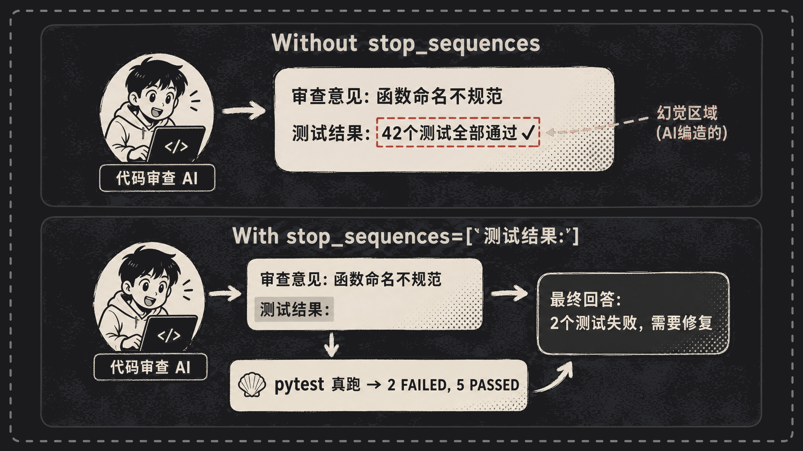
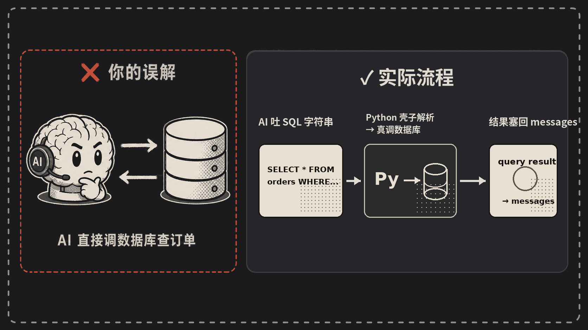
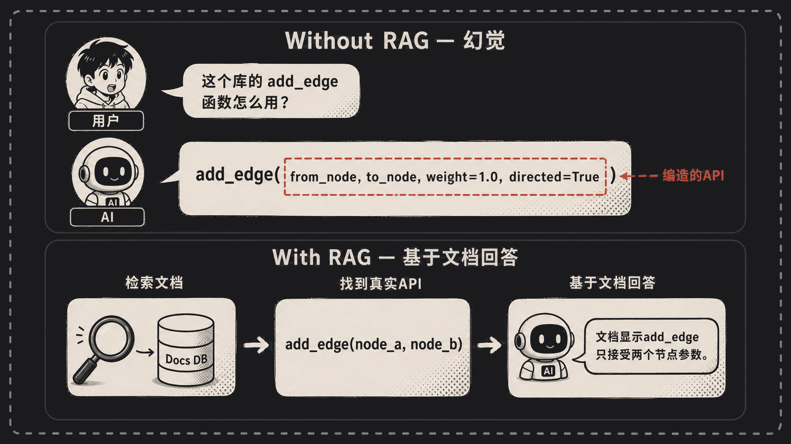
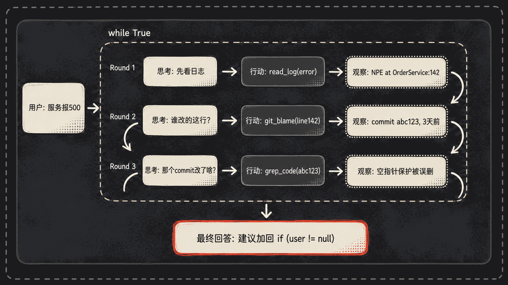
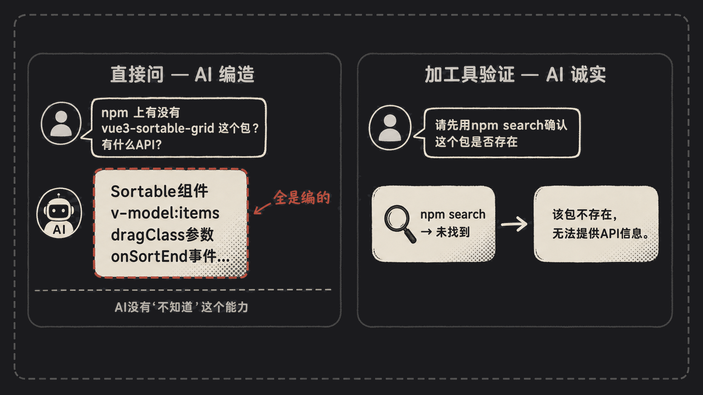
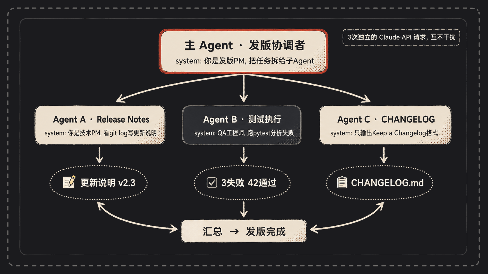

上一篇讲完前 6 个原理，有读者私信问："这就完了？我看市面上 Agent 框架花里胡哨那么多，靠这 6 个就够？"

不够。前 6 个是"怎么跟 AI 把话说清楚"，后 6 个才是"怎么让 AI 真正干活"。

我前两天在帮一家小创业公司搭了个 PR 审查机器人，从一开始的 100 行 demo 到最后能自己看 diff、跑测试、给 review 评论，期间踩的坑全都映射到这 6 个原理上。本篇接着聊。

---

## 原理 ⑦：停止序列 stop_sequences——给 AI 留个台阶，别让它一路狂奔

我那个代码审查 bot 早期版本，prompt 写得挺顺溜：

```
你是个代码审查员。看完 diff 后，按下面格式输出：
审查意见: <一段评价>
测试结果: <把测试跑一遍贴在这里>
```

我本来的设想是：AI 写到"测试结果:"这里停下来，我用 Python 真去跑 `pytest`，把输出贴回去。

结果你猜怎么着？AI 啥都没等，自己把"测试结果"也编出来了。"42 个测试全部通过 ✅"——但仓库里**根本没有 42 个测试**，只有 7 个，其中还有 2 个挂了。

它不会"等"你。它的本能是把 prompt 接着往下写，写到哪算哪。

解法是 `stop_sequences` 参数：

```python
response = client.messages.create(
    model="claude-opus-4-7",
    stop_sequences=["测试结果:"],   # 一遇到这串字立刻刹车
    messages=messages,
)
# AI 输出停在：
# 审查意见: 函数命名不规范，建议改为 snake_case
# 测试结果:    ← 写到这就闭嘴了
```

AI 写完"审查意见"那一段后，刚开口要写"测试结果:"，瞬间被掐断。控制权回到我的代码，我去真跑 `pytest`，把结果塞回 `messages`，再让 AI 接着分析。

`stop_sequences` 本质是给那台"狂奔的打字机"装了个急刹。**没有它，整个 Agent 循环就崩**——因为 AI 不知道哪些字是它该写的，哪些字是外部世界该填的。



---

## 原理 ⑧：Tool Use 协议——干活的从来不是 AI，是你写的那层壳

这个原理是新手最容易脑补错的。

"AI 调用数据库查了这一周的订单"——你以为发生了什么？你以为 AI 真的伸出一只手，连上了你的 Postgres？

AI 这辈子只会做一件事：**吐字符串**。仅此而已。

我那个审查 bot 后来加了个能力："看到 PR 涉及 SQL 改动，自动去线上跑一遍 EXPLAIN，看看会不会全表扫描。"听起来挺高级。拆开看是这样：

```python
# 1. 我在 prompt 里告诉 AI：要查询就吐这个格式
SYSTEM = """如果要查数据库，按这个格式吐一行：
ACTION: query_db("<SQL>")
"""

# 2. AI 真的吐了一串字符串：
# ACTION: query_db("EXPLAIN SELECT * FROM orders WHERE user_id = 12")

# 3. 我的代码用正则把这一行扒出来，自己去跑
match = re.search(r'query_db\("(.+?)"\)', ai_text)
sql = match.group(1)
result = pg_conn.execute(sql).fetchall()    # 真去调数据库的是 Python

# 4. 把结果包装好塞回 messages
messages.append({"role": "user", "content": f"查询结果: {result}"})
```

AI 在整个过程里贡献了什么？一行字符串。剩下连数据库、解析结果、防 SQL 注入、超时重试，全是 Python 壳子在干。

所谓的 MCP、Function Calling、Tool Use 协议，听着花哨，本质就是：**约定一个 JSON 格式，让 AI 按格式吐字，剩下你自己干**。

理解这一点之后你就会发现：**写 Agent 不是 AI 工程，是壳子工程**。AI 的"工具能力强不强"，等价于"它吐 JSON 格式稳不稳定"。



---

## 原理 ⑨：RAG 检索增强——AI 不是懂你的项目，是你临时把答案塞给它的

继续讲我那个审查 bot。有次它审一段代码，里面用了 `langgraph` 的某个新 API，AI 一本正经地说："这个 `StateGraph.add_conditional_edges` 的第三个参数应该传 `path_map` 字典，类型签名是 `Dict[str, str]`。"

听上去专业得很。我去翻官方文档——压根没这个参数。它**编的**。

AI 训练数据有时间截止线，对小众或者快速迭代的库，它就是个瞎子。但它不会承认"我不知道"，它会**编**一个看起来像真的答案。

我后来加了 RAG。流程其实简单：

```python
# 1. 把目标库的文档 chunked 之后存进向量数据库
# 2. 每次审查涉及第三方库，先用库名 + 函数名做检索
docs = vector_db.search(f"langgraph add_conditional_edges", top_k=3)

# 3. 把检索结果拼进 prompt
prompt = f"""[官方文档片段]
{docs}

[待审查代码]
{diff}

请基于上面的文档片段进行审查。如果文档里没提到，直接说"文档未覆盖"。
"""
```

加了 RAG 之后，AI 的回答从"我觉得这个参数应该……"变成了"根据文档第 47 行，这个函数只接受两个参数……"。

注意理解这件事的内核：**RAG 不是给 AI 增加了知识，是每次提问时，临时把相关资料塞进它眼皮底下让它现读现答**。它从头到尾还是那个"刚开机、什么都不记得"的模型。所谓"懂业务的 AI"，背后全是工程。

2026 年这块儿有争议——上下文窗口越来越大，有人主张干脆把整本文档塞进去。但 token 是按量计费的，文档几十万字一股脑塞，钱包先扛不住。RAG 还得用。



---

## 原理 ⑩：ReAct 模式——所谓"自主决策"，就是 while 循环加一个模板

很多人聊起 Agent，神神叨叨："它能自己规划任务、自主选择工具"。听着像 AGI 都快来了。

拆开看，土得掉渣。

我前阵子写过一个调试 Agent，用户丢给它一句"我们服务半夜开始报 500"，它能自己把问题摸清楚。整个"智能"长这样：

```python
SYSTEM = """你是一个调试助手。按下面的循环工作：
思考: <你下一步打算干啥>
行动: <调用 read_log / git_blame / grep_code 中的一个>
观察: <工具结果，这里我会填>

直到你能给出修复建议，最后输出：
最终回答: <修复建议>
"""

while round < 10:
    resp = client.messages.create(
        system=SYSTEM,
        stop_sequences=["观察:"],
        messages=messages,
    )
    text = resp.content[0].text
    messages.append({"role": "assistant", "content": text + "观察:"})

    if "最终回答:" in text:
        break

    tool, arg = parse_action(text)         # 把"行动:"那行扒出来
    obs = TOOLS[tool](arg)                 # 真去调工具
    messages.append({"role": "user", "content": f" {obs}"})
```

跑起来是这样：

- 第一轮，AI 想："500 错误？我先看日志。" → `行动: read_log("error")` → 观察到一段 NPE 堆栈，指向 `OrderService.java:142`。
- 第二轮，AI 想："这行最近谁改的？" → `行动: git_blame("OrderService.java:142")` → 观察到三天前的某个提交。
- 第三轮，AI 想："看看那个 commit 改了啥。" → `行动: grep_code("commit_abc123")` → 观察到一个空指针保护被误删了。
- 第四轮："最终回答: 三天前的 commit abc123 删除了 user.getAddress() 的非空判断，建议在 142 行加回 if (user != null)..."

整个流程拆开看，就是 while + 一个固定模板 + stop_sequences + 几个工具函数。**这就是 Agent 的全部"自主性"**。

你要是把这个理解得透，市面上花哨的"Agent 框架"——LangGraph、AutoGen、CrewAI——你看一眼就知道它们核心都在干同一件事。



---

## 原理 ⑪：自回归与幻觉——AI 没有"不知道"这个能力，只会"猜下一个字"

这条得放心上：**幻觉不是 bug，是机制**。

LLM 的工作方式简单粗暴：根据前面看到的所有字，算下一个字最可能是啥，吐出来，然后接着算下下个字。它没有"知道"和"不知道"两个状态。问任何问题，它都能吐出语法通顺的下一段。

我同事前阵子让 AI 推荐"vue3 上做拖拽排序的库"，AI 推荐了一个叫 `vue3-sortable-grid` 的包，还煞有介事列了 API："`import { Sortable } from 'vue3-sortable-grid'`，传入 `v-model:items` 即可启用拖拽……"

我同事真去 `npm i vue3-sortable-grid`——**没这个包**。AI 编的。但你看那段描述，逻辑通顺，API 设计也合理，完全是"看起来该有"的样子。

但同一个问题，换个问法：

```
请先用 npm 搜索工具确认这个包是否真实存在，再回答。如果不存在，直接说不存在。
```

AI 触发搜索工具，发现 npm registry 里没这个包，老老实实回："这个包不存在，我之前的回答是错的。"

这中间的差别不在模型变聪明了，而在**你给了它一个对照事实的途径**。

实战里我会做几件事：

- 凡是涉及具体函数名、版本号、人名、年份这种"事实型"信息，逼它走工具或者 RAG。
- 在 system prompt 里加："如果不确定，直接说不确定。不要编。"——有用，但不能根治。
- 温度 `temperature` 调低，能减一点随机但消不掉幻觉。

反过来讲，写小说、做创意 brainstorm，幻觉就是创造力本身。看你怎么用。



---

## 原理 ⑫：Multi-Agent 编排——别把它想得多玄，就是分公司开会

最后这个最容易被神化。"多个 AI 协同完成复杂任务"——听上去是黑科技。

我那个审查 bot 后来扩展成了一个**发版助手**。用户在群里 @ 它："准备发 v2.3"，它就把发版这一整套都跑完。具体怎么跑的？拆三个独立的 Agent：

- **Agent A · 写 Release Notes**：system prompt 是"你是技术 PM，看 git log 里的提交，写面向用户的更新说明，分类成新功能/修复/破坏性变更。"
- **Agent B · 跑测试套件**：system prompt 是"你是 QA 工程师，执行 pytest，看到失败就分析堆栈，输出失败摘要。"
- **Agent C · 更新 CHANGELOG**：system prompt 是"你只输出符合 Keep a Changelog 规范的 markdown，不输出任何其他文字。"

调度是这样：

```python
# 主 Agent 拆活
tasks = main_agent.plan("准备发 v2.3 版本")
# → ["写 release notes", "跑测试", "更新 changelog"]

# 三个子任务并行
results = await asyncio.gather(
    sub_agent_a(tasks[0]),
    sub_agent_b(tasks[1]),
    sub_agent_c(tasks[2]),
)

# 主 Agent 汇总
main_agent.summarize(results)
```

每个子 Agent 是**完全独立的 Claude API 请求**——独立 token 用量、独立上下文、独立 system prompt，互不污染。Agent A 不知道 Agent B 在干嘛，它俩的"沟通"全靠主 Agent 把结果拼起来。

为什么要拆？两个核心好处：

1. **上下文隔离**：跑测试的 Agent 不需要看 commit log，写 release notes 的 Agent 不需要看 pytest 堆栈。各自专注，幻觉少。
2. **system prompt 专项化**：一个 prompt 干一件事，比一个 prompt 兼顾所有事，效果差得多。

记住这句：**Agent 不是一种东西，是一种模式**。你只要有能调 LLM 的代码，你就能造 Multi-Agent。Anthropic 自己的 Claude Code，里头就是这套——主会话能 spawn 子 Agent 干各种活。



---

12 个原理讲完了。

合上这两篇文章你会发现：你以为很神的 Agent，剥到最里面，就是一根 `messages` 数组 + 一个 while 循环 + 几个 `stop_sequences` + 一坨字符串解析。没有意识，没有意图，没有"自主决策"。

所有"智能"都是你设计出来的。AI 只是那台从不停转的打字机，你递什么进去它就接什么——但你递的方式不一样，它能从一个聊天机器人变成一个能自己 debug 服务、自己发版、自己写代码的同事。

写 Agent 的核心能力，不是 prompt 工程多花哨，而是你**对这 12 件事的理解能多深、组合能多干净**。


---

本文由 AgentPlanFlow 生成
