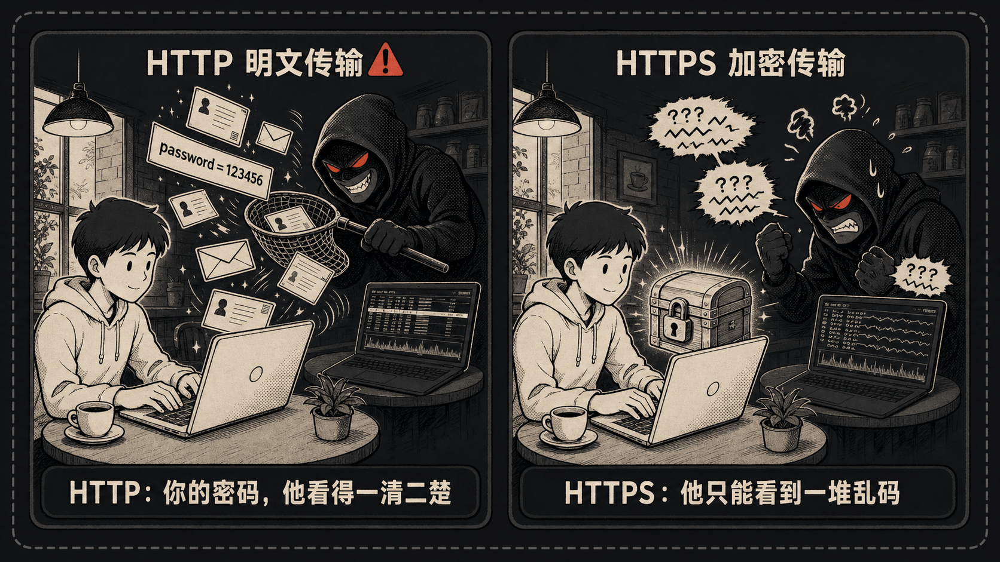
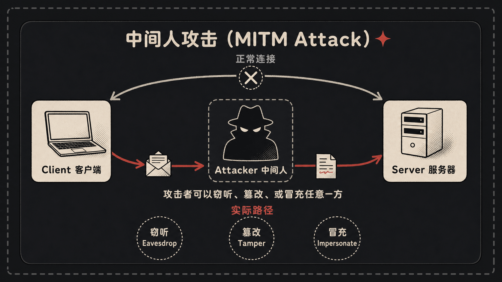
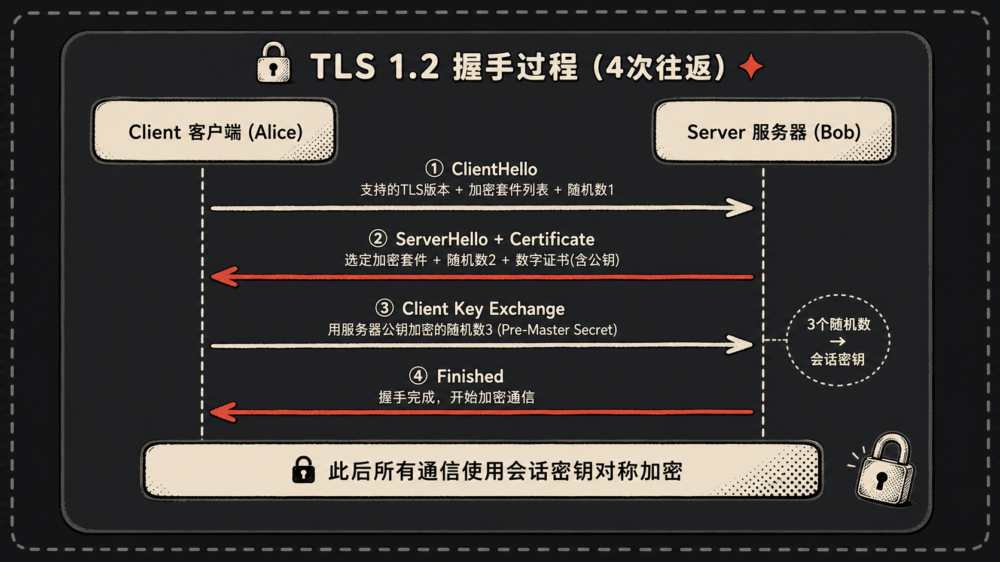
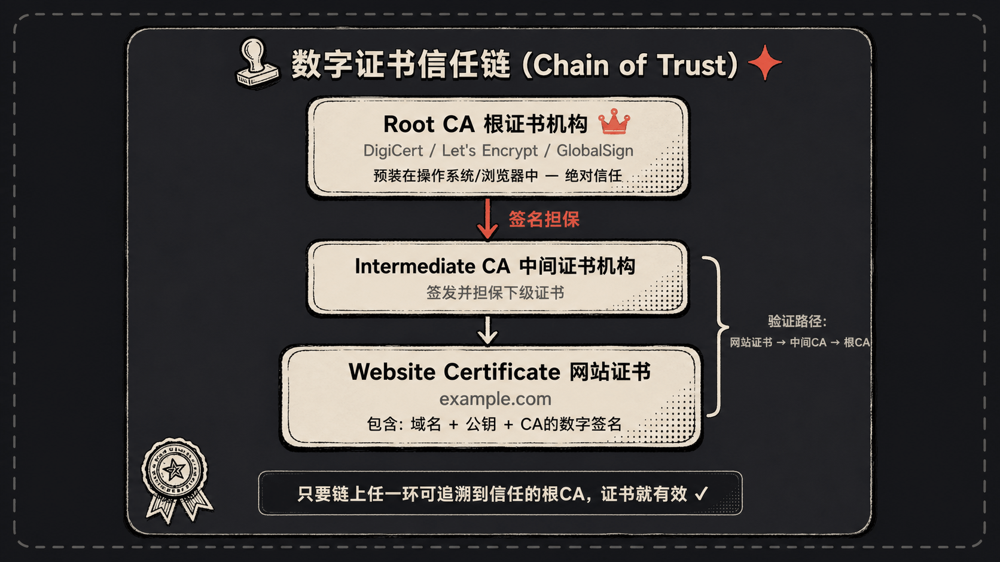

## 一、咖啡馆里的偷窥者



周六下午，你在街角的咖啡馆点了一杯拿铁，连上店里的免费 WiFi，准备登录某个老论坛回个帖子。你输入用户名、密码，回车。

你不知道的是，斜对角那个一直盯着 MacBook 的男人，已经把你的账号密码完整看了一遍。他没有黑你的电脑，也没有破解 WiFi 密码——他只是打开了一个叫 Wireshark 的工具，安安静静等着公共信道上飘过的数据包。

你输的密码，明明白白躺在他的屏幕上。

为什么？因为那个论坛用的是 HTTP，明文传输。在公共 WiFi 这种共享介质上，所有人发的所有数据，物理上就是混在同一段空气里的电磁波。谁愿意听，谁就能听见。

这不是危言耸听，2010 年有个叫 Firesheep 的 Firefox 插件，普通用户点几下鼠标，就能在咖啡馆里劫持周围所有人的 Twitter、Facebook 账号。那一年，半个互联网才如梦初醒。

那 HTTP 到底是个啥？又为啥这么"裸奔"？我们慢慢说。

## 二、HTTP 的本质：互联网的"快递明信片"

打个比方。HTTP 请求就是一张快递明信片。

明信片上写得清清楚楚：寄给谁（URL）、你想要啥（GET 还是 POST）、你是谁、你用啥浏览器、你从哪个页面跳过来的（这些都是 Headers）。然后这张卡片从你家邮筒出发，经过小区门卫、街道邮局、市分拣中心、省转运站……一路传到对方手里。

问题是，明信片**没有信封**。每一个经手的人，只要愿意，都能把内容看个底朝天。

我们抓一个真实例子看看。在终端里敲：

```bash
curl -v http://httpbin.org/get?name=alice
```

`-v` 是 verbose，它会把整个请求和响应的原始报文都打出来。你会看到类似这样的东西：

```
> GET /get?name=alice HTTP/1.1
> Host: httpbin.org
> User-Agent: curl/8.4.0
> Accept: */*
>
< HTTP/1.1 200 OK
< Date: Mon, 18 May 2026 03:14:15 GMT
< Content-Type: application/json
< Content-Length: 312
<
{
  "args": { "name": "alice" },
  "headers": { ... },
  "url": "http://httpbin.org/get?name=alice"
}
```

`>` 是你发出去的，`<` 是服务器回来的。整个交流过程，纯文本，连个加密的影子都没有。如果这中间你传的是 `password=mysecret123`，那它就这么大喇喇地飞过了整个互联网。

响应里那个 `200` 是状态码，简单说：

- **2xx**：成功。`200 OK` 最常见
- **3xx**：重定向。`301` 永久搬家，`302` 临时换地方
- **4xx**：你的锅。`404` 找不到，`403` 不让你看
- **5xx**：服务器的锅。`500` 内部炸了，`502` 网关坏了，`503` 服务暂时不行

记住状态码的开头数字基本就够用了。

## 三、HTTP 的进化：从 0.9 到 3

HTTP 一路从 1991 年活到今天，三十多年的小老头了。

**HTTP/0.9（1991）**——婴儿期，只有一个 GET 方法，服务器只会返回 HTML，连个状态码都没有。请求结束直接断开连接，下次再连。

**HTTP/1.0（1996）**——长大了。加了 Header、状态码、Content-Type，于是图片视频 JSON 都能传了。但每发一个请求都要重新建 TCP 连接，三次握手走一遍。一个页面 30 张图，TCP 握手就握 30 次，浪费得很。

**HTTP/1.1（1997）**——主力军，到今天还在大量服役。`Connection: keep-alive` 默认打开，一个 TCP 连接可以发多次请求。又加了 `Host` 头，一台服务器终于能跑多个域名了（虚拟主机的基础）。

但 1.1 有个老大难：队头阻塞（Head-of-Line Blocking）。一个 TCP 连接上的请求必须按顺序响应，前面那个慢了，后面全堵着。浏览器只好开 6 个连接同时请求，治标不治本。

**HTTP/2（2015）**——一次大手术。二进制分帧，把请求拆成小包；多路复用，一个连接上几十个请求并行不悖；头部压缩（HPACK），重复的 Header 不再每次都发一遍；还有服务器推送（虽然后来基本没人用）。

举个例子：一个页面要加载 5 张图片。

- HTTP/1.1：浏览器开 6 个 TCP 连接，5 张图各占一个，并行下载。如果第 1 张特别大，那个连接就废一会儿。
- HTTP/2：1 个 TCP 连接，5 张图的数据帧交错传输，像车间流水线，谁好了谁先出。

**HTTP/3（2022）**——干脆把 TCP 也换了，底层走 QUIC（基于 UDP）。好处是连接迁移（你从 WiFi 切换到 4G，连接不断）、0-RTT 重连（第二次握手直接发数据）。还在普及中，但 Cloudflare、Google 早就上了。

## 四、明文的代价：谁在偷看你的明信片？

回到最开头那个咖啡馆的故事。HTTP 的明文传输到底会带来什么问题？三件事，对应着后面 SSL/TLS 要解决的三件事。

**第一，窃听。**

`tcpdump -i any -A 'port 80'` 这一条命令，在路由器上跑起来，所有经过的 HTTP 流量就成了一本敞开的书。你登录一个叫 `cat-shop.example.com` 的购物站，提交表单的瞬间，抓包者看到的就是：

```
POST /login HTTP/1.1
Host: cat-shop.example.com
Content-Type: application/x-www-form-urlencoded

username=alice&password=ilovecats2025
```

是的，密码就在那里，连个星号都没有。

**第二，篡改。**

数据飞在路上，中间任何一环都可以改。最经典的就是国内某些运营商的 HTTP 劫持——你访问一个普通新闻网站，页面底部突然冒出来一个浮动的"美女荷官在线发牌"广告。那不是网站加的，是你和网站之间某个节点偷偷塞进去的。

往严重了说，黑客可以把你下载的 .exe 文件中途替换成带病毒的版本。你下载、双击、中招，全程毫无察觉。

**第三，冒充。**

DNS 一旦被劫持，你以为你在访问淘宝，其实地址解析到了钓鱼网站。HTTP 没有身份验证机制，你根本不知道对面到底是不是真的淘宝。



这三件事——窃听、篡改、冒充——就是 HTTPS 要彻底解决的。

## 五、HTTPS = HTTP + SSL/TLS：把明信片装进保险箱

很多人以为 HTTPS 是个新协议，其实不是。HTTPS 就是 HTTP，原封不动，只不过下面垫了一层 SSL/TLS。

类比一下：HTTP 是把信写在明信片上裸递，HTTPS 是把信塞进一个保险箱再递。明信片上的字一个都没改，只是装进了箱子，路上谁也撬不开。

那这个保险箱是怎么做到只让收件人打开的呢？

答案是**非对称加密**。每个人有两把钥匙：公钥和私钥。公钥可以满世界发，私钥死死攥在自己手里。两把钥匙的奇妙关系是：**公钥加密的东西，只有对应的私钥能解；反过来也一样**。

所以你想给 Bob 发个秘密：找到 Bob 的公钥，加密你的消息，发出去。中途谁拦截都没用——他们手里没有 Bob 的私钥，加密后的东西就是一串乱码。只有 Bob 能解开。

听起来完美，但有个问题：非对称加密太慢了，比对称加密慢一两个数量级。如果每个数据包都用非对称加密，那访问个网页可能要等半天。

聪明人想了个办法：**用非对称加密只传递一把"一次性钥匙"（会话密钥），后续通信都用这把钥匙做对称加密**。对称加密快得很，每秒几百 MB 不在话下。

这个"传递钥匙 + 顺便验证对方身份"的过程，就是 SSL/TLS 握手。



## 六、SSL/TLS 握手：保险箱钥匙是如何安全送达的

我们以 TLS 1.2 为例（虽然 1.3 更新，但 1.2 的过程更适合讲清楚原理）。完整握手大致是四个来回：

**第一步，ClientHello。**

客户端张嘴："你好服务器，我支持这些加密套件（一长串名字）、这些 TLS 版本，顺便给你一个随机数 R1。"

**第二步，ServerHello + Certificate。**

服务器回："你好，我们就用 `ECDHE-RSA-AES256-GCM-SHA384` 这套吧，TLS 1.2。这是我的随机数 R2，对了，这是我的数字证书（里面包含我的公钥）。"

**第三步，客户端验证 + Pre-Master Secret。**

客户端拿到证书，先要验证三件事：

1. 这张证书是不是某个我信任的 CA 签的？
2. 还在有效期内吗？
3. 证书上的域名跟我访问的域名对得上吗？

三个 yes 之后，客户端生成第三个随机数 R3（叫 Pre-Master Secret），**用服务器证书里的公钥加密**，发过去。

这一步是关键：因为只有真正的服务器才有对应的私钥能解开 R3。中间人就算截获了这串密文，没有私钥也是干瞪眼。

现在客户端和服务器都有了 R1、R2、R3 三个随机数。两边用同样的算法把三个数搅在一起，各自算出**会话密钥（Session Key）**。两边算出来的密钥是一模一样的，但这个密钥从未在网络上传输过！

**第四步，确认完成。**

双方互发一个 `Finished` 消息（用会话密钥加密的），互相验证一下"我们说的是同一种语言吗"。验证通过，握手结束，正式通信开始。

你可能会问：**为啥要三个随机数？直接用 Pre-Master Secret 不行吗？**

行是行，但不够稳。万一客户端的随机数生成器有 bug（这种事真发生过，比如 2008 年 Debian OpenSSL 那次惨案），生成的随机数可预测，密钥就被破了。三个随机数混合，客户端、服务器各贡献一份，再加上一个保密的，**三个臭皮匠顶个诸葛亮**，任何一方拉胯都不至于全军覆没。

TLS 1.3 在 2018 年发布，做了几件大事：握手从 2-RTT 砍到 1-RTT（重连甚至 0-RTT）；删掉了一大堆老旧不安全的算法（RC4、3DES、MD5 这些）；前向安全成了强制要求。能升 1.3 就升 1.3，没啥理由不升。

## 七、数字证书：网上"身份证"是怎么运作的

握手第三步那里，客户端凭啥相信对方发来的证书？这就要说证书体系。

一张数字证书，本质上是这么个东西：

```
{
  "subject": "*.github.com",
  "public_key": "30 82 01 0a 02 ...",
  "valid_from": "2025-03-01",
  "valid_to": "2026-03-01",
  "issuer": "DigiCert TLS RSA SHA256 2020 CA1",
  "signature": "用 issuer 的私钥对上面所有内容算出来的签名"
}
```

注意最后那个 `signature`——CA（证书颁发机构）用自己的私钥，给上面所有信息签了个名。任何人都可以用 CA 的公钥验证这个签名。验证通过，就说明这张证书没被改过、确实是这个 CA 签发的。

那 CA 的公钥又是怎么被信任的？这就是**证书链**。

你的操作系统和浏览器里，预装了一批"根 CA"的证书。这些根 CA 是 DigiCert、Let's Encrypt、GlobalSign 这种国际权威机构，被默认信任。根 CA 一般不直接签网站证书，而是签"中间 CA"，中间 CA 再签网站证书。

所以一张网站证书的信任链通常是三层：

```
根 CA (操作系统内置信任)
   ↓ 签发
中间 CA
   ↓ 签发
你访问的网站证书
```

只要这条链能一路追溯到内置的根 CA，浏览器就认。



那**自签名证书**为啥浏览器报警？因为没有 CA 担保，相当于自己给自己开了张"我是好人"的证明，谁信啊。当然，你内部测试环境用自签名是没问题的，把根证书加到本机信任列表就行。

想看看真实的证书长啥样？

```bash
openssl s_client -connect www.github.com:443 -servername www.github.com < /dev/null | openssl x509 -text -noout
```

这条命令会把 github.com 的证书全部展开，签发者、有效期、公钥算法、扩展字段、SAN（Subject Alternative Names）都列得清清楚楚。

最后说一嘴 **Let's Encrypt**。2015 年它横空出世，免费、自动化、90 天短期证书。在它之前，一张 SSL 证书一年几百到几千块，小站长根本不舍得花。Let's Encrypt 之后，HTTPS 普及率从不到 30% 一路飙到现在的 85%+。这家伙是真的改变了互联网。

## 八、HTTPS 实战：给你的网站穿上"防弹衣"

如果你有自己的网站，搞个 HTTPS 大概是这个流程。

**第一步，拿证书。** Let's Encrypt + certbot，几乎一键搞定：

```bash
sudo certbot --nginx -d example.com -d www.example.com
```

certbot 会自动验证你确实拥有这个域名，签发证书，甚至顺手帮你改好 Nginx 配置。

**第二步，Nginx 配置。** 大致长这样：

```nginx
server {
    listen 80;
    server_name example.com www.example.com;
    return 301 https://$host$request_uri;
}

server {
    listen 443 ssl http2;
    server_name example.com www.example.com;

    ssl_certificate     /etc/letsencrypt/live/example.com/fullchain.pem;
    ssl_certificate_key /etc/letsencrypt/live/example.com/privkey.pem;

    ssl_protocols       TLSv1.2 TLSv1.3;
    ssl_ciphers         HIGH:!aNULL:!MD5;
    ssl_prefer_server_ciphers on;

    add_header Strict-Transport-Security "max-age=31536000; includeSubDomains" always;

    location / {
        proxy_pass http://127.0.0.1:8080;
    }
}
```

几个关键点：

- 80 端口的请求一律 `301` 跳 443，别留后门
- `listen 443 ssl http2` 顺便把 HTTP/2 打开，几乎免费的性能
- `Strict-Transport-Security`（HSTS）这个头特别重要

**HSTS 是什么？** 它告诉浏览器："我这个域名以后只走 HTTPS，你要是再敢用 HTTP 访问我，直接报错，连服务器都别问。"这能挡住一种叫"SSL 剥离"的攻击——攻击者拦截你第一次的 HTTP 请求，把后续的 HTTPS 跳转截掉，让你一直走明文。HSTS 让浏览器一次记住后就再也不上当。

**Cookie 安全：**

- `Secure`：只在 HTTPS 下发送
- `HttpOnly`：JS 读不到，防 XSS 偷 cookie
- `SameSite=Lax`：防 CSRF

这三个标记加上去，cookie 才算合格。

**混合内容问题：** 你的 HTTPS 页面里要是引了 ``，浏览器会直接拦截或者报警。原因很简单——**一颗老鼠屎坏一锅汤**。攻击者改不了你的 HTML，但能改你引用的那张图，篡改成恶意脚本（如果是 JS 的话）。要么都 HTTPS，要么都别用。

## 九、关于 HTTPS 的几个常见误解

**误解一："HTTPS 很慢，会拖累网站速度。"**

TLS 握手确实多花几十毫秒，但 HTTP/2 的多路复用、头部压缩抵消还有富余。同样的页面，HTTPS + HTTP/2 经常比 HTTP/1.1 还快。Google、Facebook 早就用数据证明过这点。

**误解二："HTTPS 不能缓存。"**

能。Cache-Control 头说了算。浏览器、CDN、反向代理都能缓存 HTTPS 资源，只要你正确设置头部。

**误解三："只有登录页才需要 HTTPS。"**

最经典的反面教材就是开头提的 Firesheep。Twitter 当年只有登录用 HTTPS，登录后切回 HTTP，session cookie 就裸奔了。咖啡馆里点几下鼠标，一堆人的账号就归你了。要么全站 HTTPS，要么别玩。

**误解四："SSL 证书很贵。"**

Let's Encrypt 免费。需要 OV/EV 证书（带组织验证那种）的话，DigiCert、Sectigo 一年也就几十到几百美元。

**误解五："小网站不需要 HTTPS。"**

Chrome 现在对所有 HTTP 网站显示"不安全"。你不加，用户都不敢点。SEO 也偏向 HTTPS。没得选。

## 十、性能真相：HTTPS 到底慢多少？

来实测一下。`curl -w` 可以把每个阶段的耗时打印出来：

```bash
curl -w "DNS: %{time_namelookup}s\nTCP: %{time_connect}s\nSSL: %{time_appconnect}s\nTTFB: %{time_starttransfer}s\nTotal: %{time_total}s\n" \
     -o /dev/null -s https://www.github.com
```

我在自己机器上跑了几次，大致数据：

```
DNS: 0.012s
TCP: 0.038s   <- TCP 三次握手耗时约 26ms
SSL: 0.105s   <- TLS 握手耗时约 67ms
TTFB: 0.198s
Total: 0.215s
```

TLS 握手 67ms，听起来不少，但用户感知几乎为零。原因是：

1. **会话复用**：第二次访问同一个网站时，可以用 Session ID 或 Session Ticket 跳过完整握手，只要 1-RTT
2. **HTTP/2 多路复用**：一个 TLS 连接服务整个页面所有资源，握手成本被摊薄
3. **TLS 1.3**：完整握手只要 1-RTT，重连支持 0-RTT
4. **CDN 边缘节点**：用户离接入点越近，握手 RTT 越小，国内 CDN 把延迟压到几毫秒级别

实际体验上，HTTPS 与 HTTP 的差距，已经远小于一次图片加载的差异。性能问题，真的不该再成为不上 HTTPS 的理由。

## 十一、写在最后

回到开头那个咖啡馆的场景。如果那个论坛用的是 HTTPS，旁边那个男人的屏幕上就只会显示一堆加密后的乱码。你的密码安全，你的隐私安全，他就只能继续假装在工作。

HTTPS 已经不是"要不要"的问题了，而是"怎么做好"的问题。它不是银弹——HTTPS 保护的是**传输过程**，你的服务器要是被人 SSH 进去了，再多的 TLS 也救不了你；XSS、SQL 注入、CSRF 这些应用层漏洞，HTTPS 一个也防不住。

但是，如果连最基本的传输都不加密，那就像在暴风雨里裸奔——你再壮，也扛不住雨。

加上 HTTP/2、HTTP/3 带来的性能提升，加上 Let's Encrypt 把证书成本打到零，加上浏览器对 HTTP 越来越不友好的提示，HTTPS 现在已经没有任何理由不用了。

下次你在咖啡馆打开浏览器，看见地址栏那个小锁，记得跟它说声谢谢。


---

本文由 AgentPlanFlow 生成
