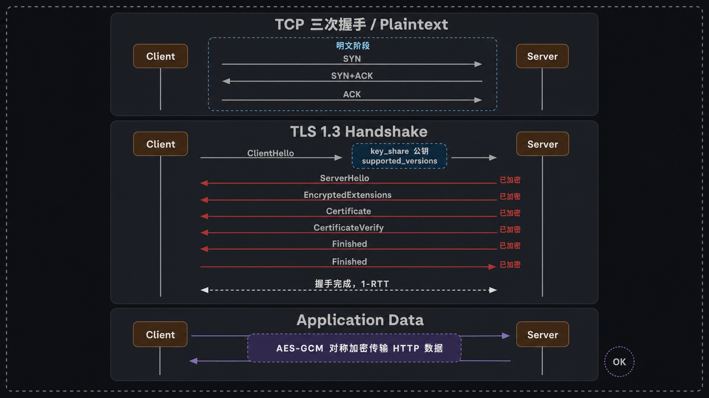
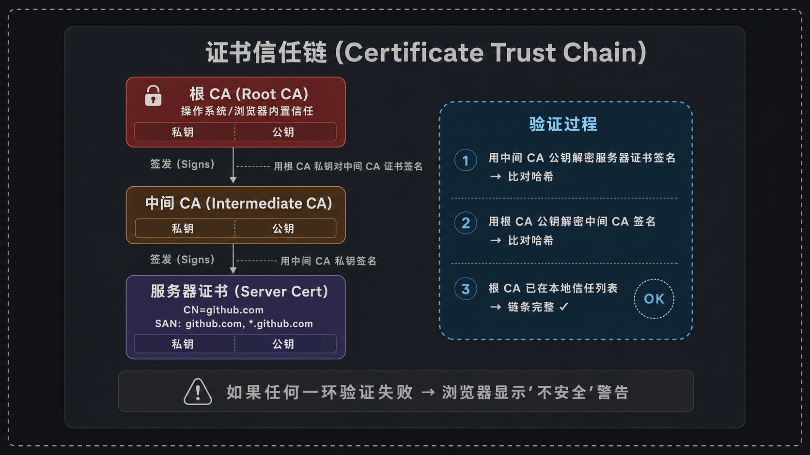
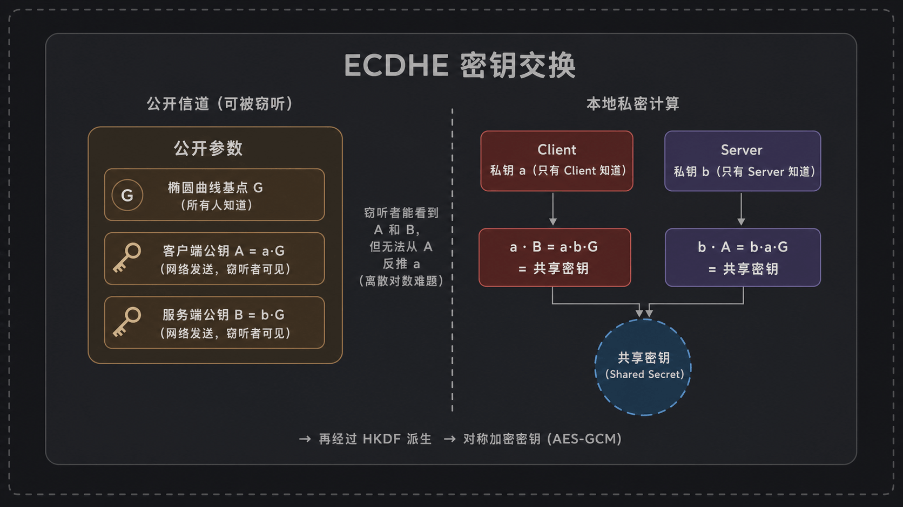
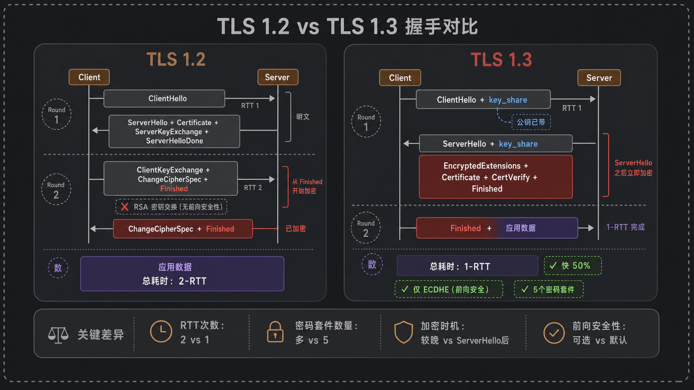
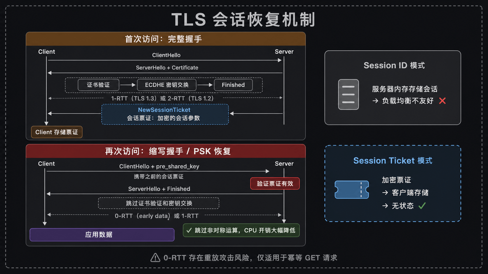

## 一、引言：几百毫秒里发生的事

我今天早上打开浏览器，地址栏敲了 `https://github.com`，回车。0.3 秒后页面就刷出来了。

对绝大多数人来说，这就是一次普通到不能再普通的访问。但如果你愿意把这 300 毫秒切成片放慢看，里面其实塞了一堆相当精巧的事情：DNS 解析、TCP 三次握手、TLS 握手、HTTP 请求、服务端处理、响应返回、浏览器渲染……

我今天想聊的，是中间那一段——TLS 握手。它发生在 TCP 三次握手之后、你发出 `GET /` 之前，平均吃掉 100~300 毫秒。听上去不长，但移动网络下能轻松膨胀到 500 毫秒以上。更重要的是，这一小段时间里，你的浏览器和 GitHub 的服务器要在一条**任何人都能偷听**的线路上完成一件事：商量出一个只有他俩知道的密钥。

我以前一直觉得这事有点玄学。直到我自己抓过几次包、读过 RFC 8446，才发现 TLS 握手设计得真是漂亮——它把"身份验证"、"密钥协商"、"算法协商"三件难事，揉进了一两个往返里完成。

这篇文章我们一步步拆开看。



## 二、TLS握手要解决哪三个问题

在进入字段细节之前，我先把目标讲清楚。TLS 握手本质上要解决三个问题：

**第一个问题：你真的是你吗？**

我浏览器连上 `github.com`，对面发回来一堆字节。我怎么知道这真的是 GitHub 的服务器，而不是某个咖啡馆里挂了热点的攻击者伪装的？这就是**身份验证**——靠的是数字证书和 CA 体系。

**第二个问题：怎么在不安全的信道上商量出一个秘密？**

这听起来像悖论：你和我之间有人在偷听，我们怎么在他眼皮底下约一个只有咱俩知道的密码？这就是**密钥协商**——靠的是 ECDHE 这类非对称密钥交换算法。

**第三个问题：咱俩用哪种"暗号"？**

加密算法有几十种，TLS 1.2 时代密码套件多达几百种组合。客户端和服务端得先对齐：用 AES-128-GCM 还是 ChaCha20-Poly1305？哈希用 SHA-256 还是 SHA-384？这就是**算法协商**——靠的是 Client Hello / Server Hello 这一来一回的"报菜名"。

把这三件事都办完，TLS 握手就结束了。之后双方持有同一把对称密钥，开始用 AES（或类似算法）加密真正的应用数据。

## 三、一次完整的TLS 1.3握手——逐步拆解

我们以 TLS 1.3 为主角（毕竟 2026 年了，TLS 1.0/1.1 早被废弃，1.2 也在快速退场）。下面这一节我会逐条消息讲，每条消息你都能用 openssl 模拟出来。

### 3.1 Client Hello：客户端先开口

TCP 三次握手刚结束，客户端立刻发出第一条 TLS 消息——`ClientHello`。这条消息是明文的，包含以下关键字段：

- `legacy_version`: 固定填 `0x0303`（也就是 TLS 1.2）。这是个历史包袱——为了兼容某些不识货的中间设备，TLS 1.3 也得在这里假装自己是 1.2，真实版本号塞进 `supported_versions` 扩展里。
- `random`: 32 字节随机数，后面派生密钥要用。
- `legacy_session_id`: TLS 1.3 里基本不用了，留作兼容。
- `cipher_suites`: 客户端支持的密码套件列表。TLS 1.3 砍得很狠，常见就 5 个：`TLS_AES_128_GCM_SHA256`、`TLS_AES_256_GCM_SHA384`、`TLS_CHACHA20_POLY1305_SHA256`、`TLS_AES_128_CCM_SHA256`、`TLS_AES_128_CCM_8_SHA256`。
- `extensions`: 一堆扩展，最关键的几个：
  - `supported_versions`: 告诉服务端我真的支持 TLS 1.3。
  - `supported_groups`: 我支持哪些椭圆曲线（x25519、secp256r1 等）。
  - `key_share`: **这是 TLS 1.3 的核心改动**——客户端在第一个消息里就把自己的 ECDHE 公钥发过去了。这意味着不用再等服务端来回一趟，直接进入密钥协商。
  - `server_name` (SNI): 我要访问的域名。一台服务器可能托管几百个 HTTPS 站点，得告诉它你要哪个。
  - `signature_algorithms`: 我能接受哪些签名算法（用来验证证书）。

大致结构长这样：

```
TLSv1.3 Record Layer: Handshake Protocol: Client Hello
    Version: TLS 1.2 (0x0303)
    Random: a3f4...
    Cipher Suites Length: 10
    Cipher Suites (5 suites)
        Cipher Suite: TLS_AES_128_GCM_SHA256 (0x1301)
        Cipher Suite: TLS_AES_256_GCM_SHA384 (0x1302)
        ...
    Extension: supported_versions
        Supported Version: TLS 1.3 (0x0304)
    Extension: key_share
        Group: x25519
        Key Exchange Length: 32
```

你也可以自己跑一下：

```bash
openssl s_client -connect github.com:443 -tls1_3 -msg -state
```

`-msg` 会把每条握手消息的原始字节打出来，`-state` 会打握手状态机的迁移。

### 3.2 Server Hello + 一连串消息

服务端收到 `ClientHello` 后，要在一个网络往返里把剩下的事全办完。它先回一个 `ServerHello`，然后**紧接着**发出一系列消息，这些消息从 `EncryptedExtensions` 开始就**已经加密了**——这是 TLS 1.3 相比 1.2 的一大改进。

`ServerHello` 的关键字段：

- `random`: 服务端的 32 字节随机数。
- `cipher_suite`: 从客户端的列表里挑一个。
- `key_share`: 服务端的 ECDHE 公钥。

**到这一步**，双方都拿到了对方的 ECDHE 公钥（加上各自的随机数和约定的曲线），就可以**各自独立**算出共享密钥了。之后的所有消息都用从这个共享密钥派生出的对称密钥加密。

接下来服务端继续发（已加密）：

- `EncryptedExtensions`: 一些不适合放在 `ServerHello` 里的扩展，比如 ALPN（协商 HTTP/1.1 还是 HTTP/2）。
- `Certificate`: 证书链。注意是"链"——服务器证书 + 一个或多个中间 CA 证书。
- `CertificateVerify`: 服务端用证书对应的私钥，对整个握手过程的哈希做一个签名。客户端用证书里的公钥验签，确认服务端**真的持有**这张证书的私钥（防止某人偷了别人的证书就冒充身份）。
- `Finished`: 一个 HMAC，对整个握手消息序列做完整性校验。

客户端收到这些消息，验证证书链、验证 `CertificateVerify` 签名、验证 `Finished` 完整性——全部通过后，自己也发一个 `Finished`，握手就完成了。

整个过程**一个 RTT 就搞定**：客户端发 ClientHello，服务端回一堆消息，客户端发 Finished（顺便就可以带应用数据了）。

## 四、证书链验证——"这个网站真的是github.com吗"

服务端把证书发过来了，客户端凭什么相信这是真的？

这就涉及到 PKI（公钥基础设施）的核心思想：**信任传递**。



你的操作系统（或浏览器）出厂的时候，就内置了一份**根 CA 证书列表**。macOS 上你可以打开"钥匙串访问"看一眼，Linux 上一般在 `/etc/ssl/certs/ca-certificates.crt`。这些根 CA 是被人类普遍信任的机构——DigiCert、Let's Encrypt、GlobalSign 这些。

但根 CA 不会直接给 `github.com` 签发证书。它们会先签发一些**中间 CA**（intermediate CA），再由中间 CA 去签具体网站的证书。这样做的好处是：根 CA 的私钥可以离线保管，泄露风险小；中间 CA 即使出问题也容易撤销。

所以验证流程是这样的：

1. 客户端拿到服务器证书（比如 `github.com` 的证书）。
2. 看证书里写的 issuer（签发者），找到对应的中间 CA 证书（一般也在握手消息里被一起发过来了）。
3. 用中间 CA 的公钥验证服务器证书上的签名——具体做法是：把服务器证书里除签名外的所有字段做哈希，用中间 CA 的公钥"解密"签名得到一个值，对比这两个值是否相等。
4. 中间 CA 证书又是被某个根 CA 签的，继续往上验证。
5. 一直验到本地信任的根 CA，链条闭合，证书有效。

除了签名校验，客户端还要检查：

- 证书是否过期（`notBefore` / `notAfter`）。
- 域名是否匹配（证书的 SAN 扩展里有没有 `github.com`）。
- 证书是否被吊销——这个有两种机制：
  - **CRL**（Certificate Revocation List）：CA 定期发布的吊销列表，客户端下载比对。
  - **OCSP**（Online Certificate Status Protocol）：客户端向 OCSP 服务器实时查询某证书状态。OCSP 还有个 stapling 模式，让服务器自己定期取 OCSP 响应附在握手里，省得客户端再去查一次。

**一个常见坑：证书链不完整。** 我之前部署过一个 nginx 站点，本地测试一切正常，结果用户用 Android 浏览器访问报"不受信任"。后来发现是只配置了服务器证书，没配置中间证书。Chrome 桌面版会自动用 AIA 扩展去补全中间证书，但很多客户端不会。

怎么检查？

```bash
openssl s_client -connect github.com:443 -showcerts
```

`-showcerts` 会把服务端发的所有证书一股脑打出来。你看 `Certificate chain` 部分，至少应该有两层（服务器证书 + 中间 CA），三层也常见。如果只有一层就要警惕了。

或者用在线工具 `https://www.ssllabs.com/ssltest/` 跑一下，它会明确告诉你"Chain issues: None"还是有问题。

## 五、密钥交换——在不安全的信道上商量秘密

这是我个人觉得 TLS 里最浪漫的一块——ECDHE（椭圆曲线 Diffie-Hellman Ephemeral）。



我用一个不太严格的类比来解释。假设我和你想商量一个共同的颜色，但中间有个人在偷听，我们俩的对话他全听得见。怎么办？

经典的 Diffie-Hellman 类比是这样的：

1. 我和你事先公开约定一个"基准色"，比如黄色。这个颜色全世界都知道。
2. 我自己心里挑一个"私密色"——红色。我把红色和黄色混在一起得到橙色，把橙色发给你。
3. 你自己心里挑一个"私密色"——蓝色。你把蓝色和黄色混在一起得到绿色，把绿色发给我。
4. 我收到绿色，再把我的红色混进去，得到一个最终色。
5. 你收到橙色，再把你的蓝色混进去——得到的最终色和我算出来的**一模一样**。

关键在于：颜色一旦混合就极难分离。偷听者看到了黄色、橙色、绿色，但他无法从橙色里反推出我的红色，也就算不出最终色。

ECDHE 干的就是这件事，只不过把"颜色混合"换成了椭圆曲线上的点乘运算。这种运算正向算很快、反向算（叫做"离散对数问题"）几乎不可能。

具体到 TLS 1.3：

1. 客户端生成一对临时密钥（私钥 a、公钥 A = a·G，G 是约定的椭圆曲线基点）。
2. 服务端生成一对临时密钥（私钥 b、公钥 B = b·G）。
3. 他们交换公钥 A 和 B。
4. 客户端算 a·B，服务端算 b·A，根据椭圆曲线的代数性质，a·B = a·b·G = b·A，俩值相等，这就是共享密钥的种子。
5. 再经过 HKDF（一个密钥派生函数）的几次处理，就得到了用于加密应用数据的对称密钥。

**ECDHE 里那个 E 是"Ephemeral"——临时的**。每次握手都重新生成一对临时密钥，握手结束就丢掉。这带来一个重要性质：**前向安全性**（Forward Secrecy）。

什么意思呢？假设五年后服务器的证书私钥被泄露了，攻击者拿着这把私钥，回去解密五年前抓到的流量包，能解密吗？

在 ECDHE 模式下：**解不开**。因为证书私钥只用来对握手做签名（证明身份），不参与密钥协商。真正的共享密钥来自那对临时的 ECDHE 私钥，而临时私钥在握手结束就销毁了，谁也找不到了。

（对比一下：早期的 TLS 用 RSA 密钥交换——客户端生成对称密钥，用服务器的公钥加密发过去。这种模式下证书私钥泄露 = 所有历史流量都能解密。TLS 1.3 已经彻底把 RSA 密钥交换砍掉了，必须用 ECDHE 或 DHE。）

## 六、TLS 1.2 vs TLS 1.3——为什么要升级



如果你不在乎技术细节，只想知道升级 TLS 1.3 值不值得，答案是：**非常值得，几乎没有理由不升**。我列几个具体差异：

**握手往返数：2-RTT → 1-RTT**

TLS 1.2 的标准握手是这样的：
1. Client → Server: ClientHello
2. Server → Client: ServerHello + Certificate + ServerKeyExchange + ServerHelloDone
3. Client → Server: ClientKeyExchange + ChangeCipherSpec + Finished
4. Server → Client: ChangeCipherSpec + Finished
5. Client → Server: 应用数据

需要两个完整 RTT 才能发应用数据。

TLS 1.3 把它压成了一个 RTT：客户端在 ClientHello 里就把 key_share 带过去了，服务端在 ServerHello 之后立刻发证书、签名、Finished（已加密），客户端收到后回 Finished + 应用数据。

实测在 100ms RTT 的链路上，TLS 1.2 握手要 ~200ms，TLS 1.3 ~100ms，省了一半。

**密码套件大瘦身**

TLS 1.2 的密码套件长这样：`TLS_ECDHE_RSA_WITH_AES_128_GCM_SHA256`——四个部分：密钥交换 + 签名 + 对称加密 + 哈希。组合爆炸出几百种，里面藏着大量已知不安全的（CBC 模式、RC4、SHA-1 等）。运维稍微不留神就配置错了。

TLS 1.3 把密钥交换和签名从套件里抽出去（用扩展单独协商），密码套件就只描述对称加密 + 哈希，总共 5 个，全是经过现代密码学审查的强算法。

**握手消息提前加密**

TLS 1.2 里，证书是明文传输的。这意味着窃听者能看到你访问哪个网站的具体证书（虽然 SNI 也是明文，所以域名本来就能看到，但证书里还有其他元信息）。

TLS 1.3 里，从 `EncryptedExtensions` 开始的所有消息（包括证书）都加密了。隐私性进一步提升。

**0-RTT 恢复**

后面专门讲。

## 七、会话恢复——第二次访问怎么这么快



完整的 TLS 握手是有点贵的——非对称运算（ECDHE 计算、证书签名验证）很烧 CPU。如果你刚和某网站握过手，几分钟后又访问它，再走一遍完整流程就太浪费了。

所以 TLS 设计了**会话恢复**机制。在 TLS 1.2 时代有两套：

**Session ID**：服务端在握手完成后给客户端一个 Session ID，并在自己内存里保存这次握手的关键参数。下次客户端重连时把 Session ID 发过来，服务端查一下、确认有效，就跳过证书验证和密钥协商，直接进入加密通信。问题：服务端要存状态，对负载均衡场景不友好（请求落到另一台机器就失效）。

**Session Ticket**：服务端把会话参数加密成一张"票"（用服务端自己的票根密钥加密），发给客户端。下次客户端把票带回来，服务端解密、恢复会话。好处是服务端不用存状态，多台机器共享票根密钥就行。

TLS 1.3 统一了这套机制，叫做 **PSK**（Pre-Shared Key）恢复，本质上更像 Session Ticket 的演化版本。服务端在握手完成后通过 `NewSessionTicket` 消息发一张票，客户端下次握手在 `ClientHello` 的 `pre_shared_key` 扩展里带回来。

**0-RTT（也叫 early data）：把第一次请求提前**

TLS 1.3 还加了个激进的玩法：恢复会话时，客户端可以在 `ClientHello` 里**直接带上应用数据**（用从上次会话派生的密钥加密）。服务端验证票有效后，立刻处理这个请求，零等待。

听起来很美对吧？但 0-RTT 有个**致命缺陷：重放攻击风险**。

想象一下：攻击者偷偷录下你发的 0-RTT 请求（虽然他解不开内容），过一阵子原封不动地重新发给服务器。服务器看着票有效、解密成功，可能就当成新请求处理了。如果这是个 `POST /transfer?amount=1000`，那就出大事了。

所以 0-RTT 一般只用于**幂等的、副作用小的请求**，比如静态资源的 GET。CloudFlare 默认对 0-RTT 限制到 GET 请求并加各种防御。

实际部署 0-RTT 之前，建议想清楚：你的接口能不能容忍被重放一次？

## 八、实战：用openssl亲手看一次握手

讲了这么多，最有效的学习方式是自己跑命令看一遍。下面这些命令我都验证过能跑。

**用 openssl 看握手过程**

```bash
openssl s_client -connect github.com:443 -tls1_3 -msg
```

`-msg` 会打印每条握手消息的方向（`<<< / >>>`）和类型。你能直接看到 `ClientHello`、`ServerHello`、`EncryptedExtensions`、`Certificate`、`CertificateVerify`、`Finished` 这一串。

想看证书链：

```bash
openssl s_client -connect github.com:443 -showcerts </dev/null 2>/dev/null \
  | openssl crl2pkcs7 -nocrl -certfile /dev/stdin \
  | openssl pkcs7 -print_certs -noout
```

输出里你会看到 `subject=` 和 `issuer=` 一层层往上走，最后到根 CA。

**用 curl 看各阶段耗时**

```bash
curl -w "DNS: %{time_namelookup}s\nTCP: %{time_connect}s\nTLS: %{time_appconnect}s\nFirstByte: %{time_starttransfer}s\nTotal: %{time_total}s\n" \
  -o /dev/null -s https://github.com
```

`time_appconnect - time_connect` 就是 TLS 握手耗时。我刚在自己机器上跑了一下，国内到 GitHub 大概 250ms 左右——RTT 高的时候 TLS 握手的代价相当可观。

**用 openssl 检查证书链是否完整**

```bash
openssl s_client -connect your-site.com:443 -servername your-site.com 2>&1 \
  | grep -E "(verify|depth|chain)"
```

如果看到 `verify error:num=20:unable to get local issuer certificate`，多半是中间证书没配。

另一个快速诊断工具：

```bash
curl -vI https://your-site.com 2>&1 | grep -i "server certificate\|SSL"
```

## 九、写在最后

回头看，TLS 握手的核心精妙之处其实就一句话：**在一条任何人都能偷听的线路上，建立起一个只有两个端点知道的秘密**。

实现这件事，密码学家们用了三个法宝：
- **非对称加密**：解决在公开信道传递信任的问题（证书）。
- **DH 类密钥交换**：解决在公开信道协商秘密的问题（ECDHE）。
- **对称加密**：解决秘密建立之后的数据高效保护问题（AES-GCM）。

三者各司其职，缺一不可。

延伸：

- **mTLS**（双向 TLS）：不仅客户端验证服务端，服务端也用证书验证客户端。微服务之间的服务网格（比如 Istio）默认就开 mTLS，本质上替代了网络层的"白名单"思路。
- **QUIC**：HTTP/3 的底层传输协议，把 TLS 1.3 直接揉进了协议本身，握手只要 1-RTT 甚至 0-RTT，而且解决了 TCP 队头阻塞。
- **后量子密码学**：量子计算机一旦实用化，现有的 RSA、ECDHE 都会被破。NIST 已经标准化了几种抗量子算法（如 ML-KEM/Kyber），各大浏览器和 CDN 已经开始试点混合密钥交换。
- **Certificate Transparency**：所有 CA 签发的证书都要公开到 CT 日志，方便发现"被冒签"。如果你网站突然被某 CA 错签了证书，CT 日志能很快发现。

下次你打开浏览器访问一个 HTTPS 网站，地址栏那把小锁背后，就是这套精巧又严谨的机器在默默运转。挺值得花几百毫秒等它的。


---

本文由 AgentPlanFlow 生成
