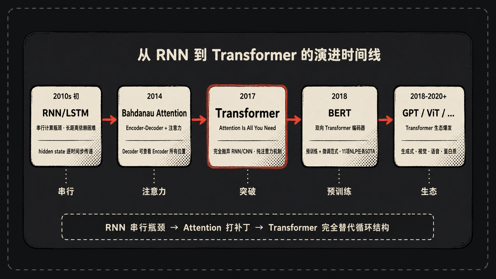
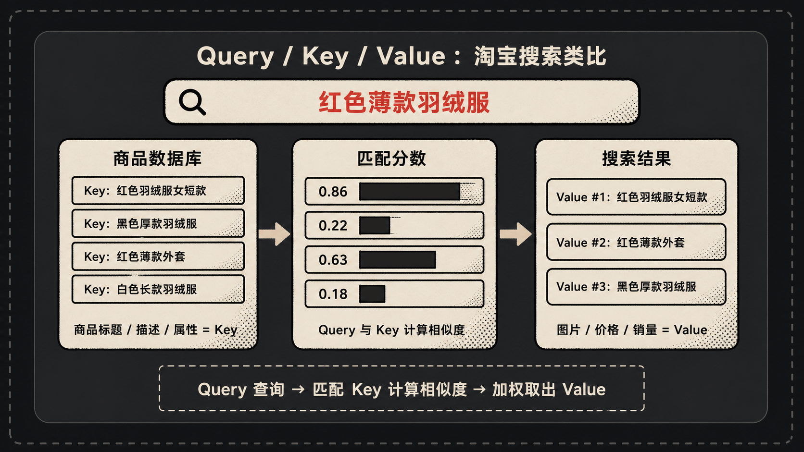
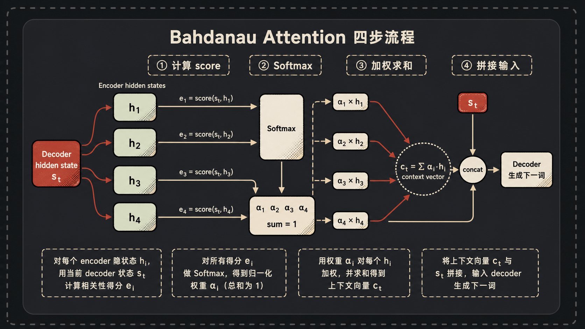
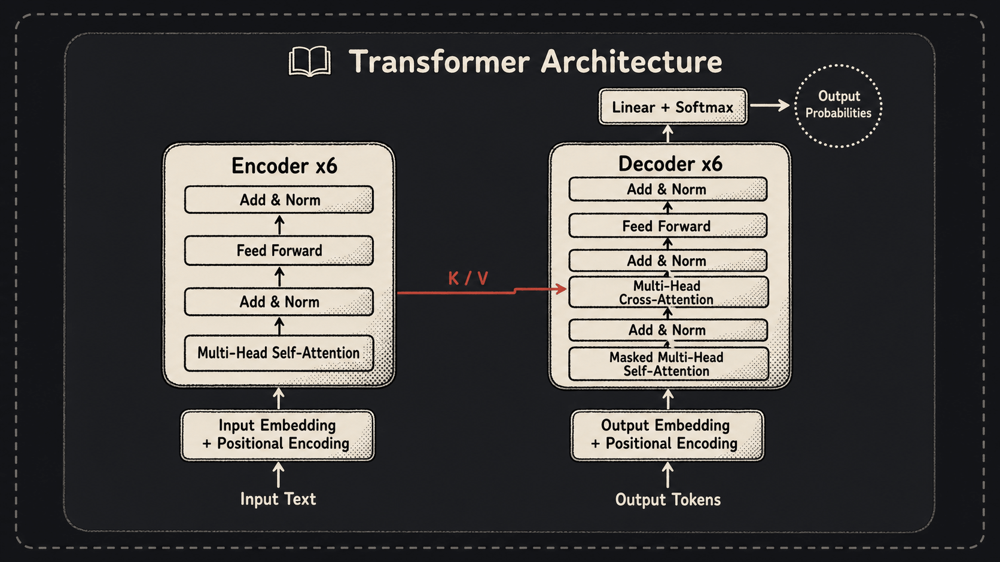
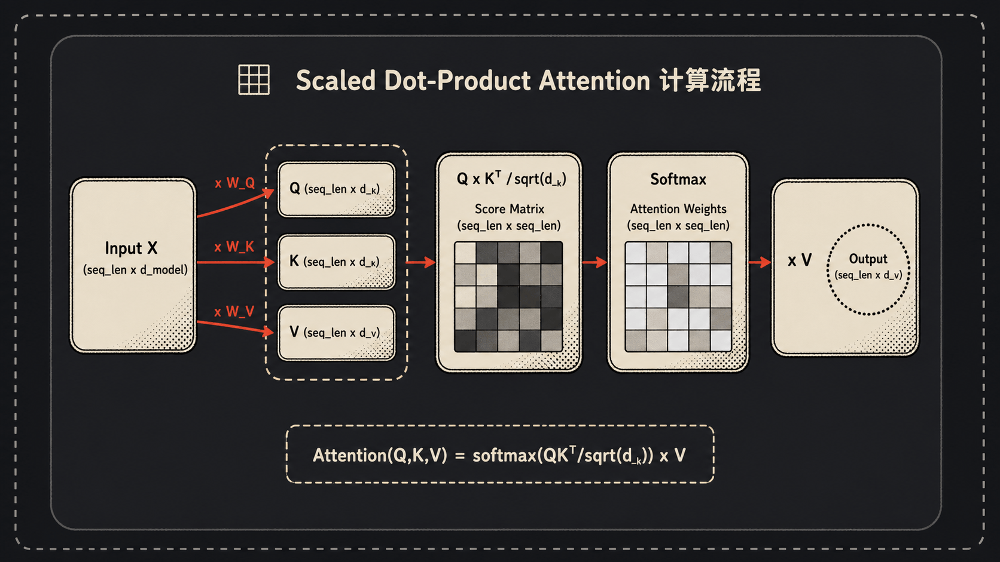
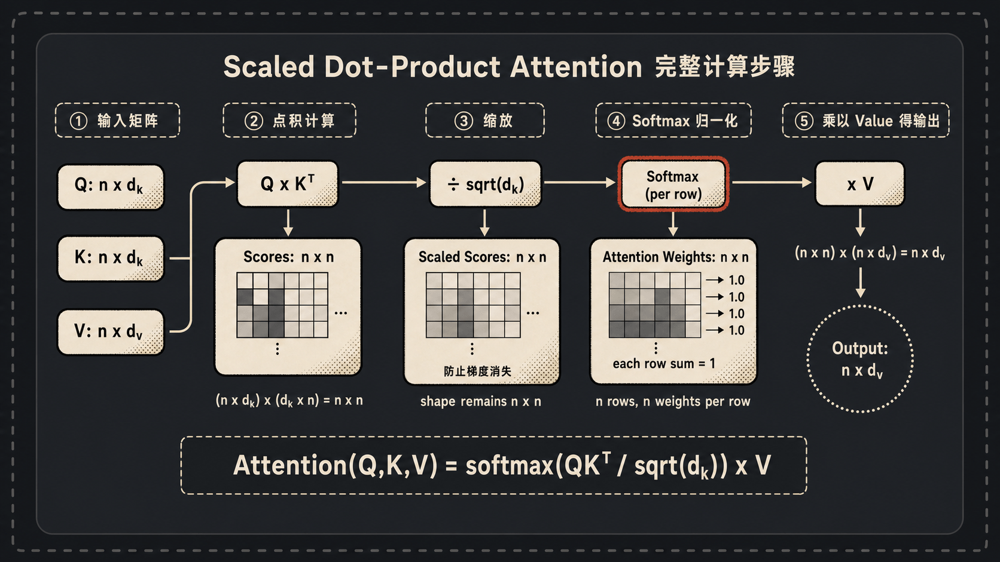
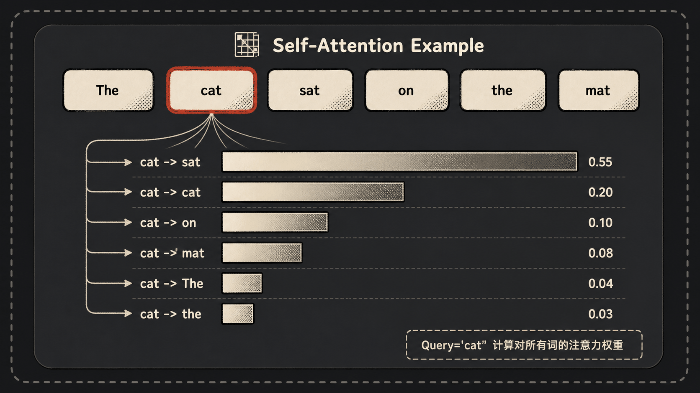
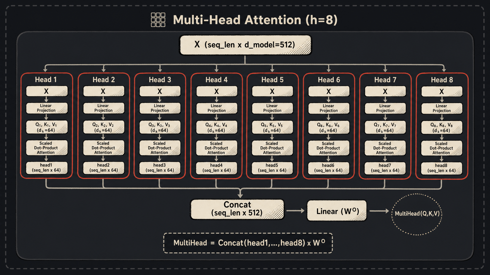
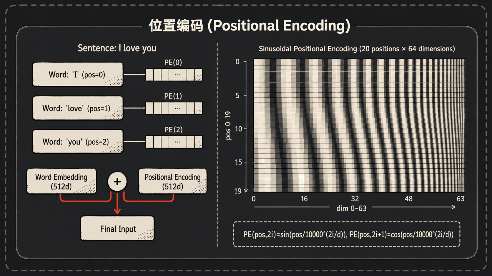
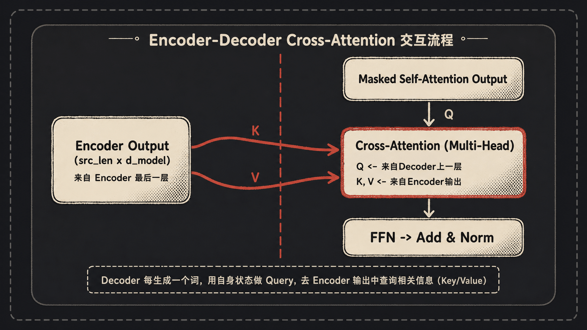

## 一、引言：RNN 的困境与 Attention 的曙光

打开 Google Translate，输入 "I love you"，按一下回车，屏幕上跳出"我爱你"。这事儿看上去稀松平常，但你有没有想过，机器到底是怎么把这三个英文单词，一个一个地变成三个中文字的？

说实话，2017 年之前，这个问题的标准答案是 RNN（Recurrent Neural Network，循环神经网络：按顺序读入序列，并用隐藏状态记住前文），更精确点说，是 LSTM（Long Short-Term Memory，长短期记忆网络：给 RNN 加上门控记忆，尽量保留重要信息）或者 GRU（Gated Recurrent Unit，门控循环单元：更轻量的门控 RNN 变体）这一类带门控机制的模型。RNN 的工作方式特别像人在读书：从左往右一个词一个词地扫，每读一个词，就在脑子里更新一下"我目前理解到了什么"——这个"理解"在论文里叫 hidden state。读完最后一个词，把那个最终的 hidden state 当成整句话的"摘要"，扔给 Decoder 去翻译。

听上去挺合理对吧？但是这套机制有两个绕不开的死结。

**第一个死结：不能并行。** 你算 $t$ 时刻的 hidden state，必须先算完 $t-1$ 时刻的。一句话有 100 个词，你就得老老实实算 100 次，谁也插不了队。GPU 这种为并行而生的玩意儿，到这儿基本上就废了一半。

**第二个死结：长距离依赖。** 你想象一下，让你从左到右一字一句地读一篇 5000 字的小说，读到结尾让你回忆开头第一句话的精确措辞——基本上做不到。RNN 也一样，序列一长，最早的信息就被后来的信息一层一层地稀释掉了。LSTM 加了个"记忆门"，缓解了这个问题，但说真的，没根治。

2014 年，Bahdanau 等人提出了一个叫 **Attention** 的机制。这玩意儿的思路很妙：Decoder 在生成每个词的时候，不再只看那个被压缩了的"最终摘要"，而是回头去看一眼 Encoder 所有位置的 hidden state，按需取用。但 Attention 当时只是 RNN 的小弟，是给 RNN 打补丁的。

到了 2017 年，Google 那帮人——Vaswani 一伙——发了篇论文，标题叫 **《Attention Is All You Need》**。意思相当直白：RNN？不要了。卷积？也不要了。光用 Attention 就够了。

这个标题在当时看挺嚣张。八年过去了，回头看，人家有这个底气。



## 二、先导知识：Attention 到底是什么

在我们一头扎进 Transformer 之前，先把 Attention 这个东西掰扯清楚。

打个比方。你在淘宝搜"红色薄款羽绒服"。你输入的这串字就是 **Query**（查询）。淘宝拿你的 Query 去和数据库里成千上万件商品的标题、描述比对——这些标题描述就是 **Key**（键）。匹配度高的商品，连同它们的图片、价格、销量这些真正展示给你的内容——就是 **Value**（值）——排在最前面给你看。



Attention 干的事就是这个：拿 Query 去和一堆 Key 比相似度，相似度作为权重，然后对对应的 Value 加权求和。

来，咱们一步一步看 Bahdanau 当年是怎么做的。假设 Encoder 已经把一句法语处理完了，得到 4 个 hidden state（咱们叫它 $h_1, h_2, h_3, h_4$，每个都是绿色小方块）；Decoder 这边刚生成了一个 hidden state（红色小方块，叫 $s_t$），现在要生成下一个词。

1. 计算 $s_t$ 和每个 $h_i$ 的相似度（最简单的方式就是点积），得到 4 个 score：$e_1, e_2, e_3, e_4$。
2. 对这 4 个 score 做 softmax，归一化成权重 $\alpha_1, \alpha_2, \alpha_3, \alpha_4$，加起来等于 1。
3. 用这 4 个权重对 $h_1, h_2, h_3, h_4$ 加权求和，得到 **context vector** $c_t = \sum_i \alpha_i h_i$。
4. 把 $c_t$ 和 $s_t$ 拼起来喂给 Decoder，生成下一个词。



这套东西就叫 Bahdanau Attention（也叫 Additive Attention，因为他原版用的是 tanh 加法而不是点积，不过本质思想一样）。它确实把 RNN 的长距离依赖问题缓解了——Decoder 想看哪个位置就看哪个位置，不用等信息一层层传过来。

但它有个根本问题没解决：**Encoder 那边还是 RNN，还是得串行算。**

于是 Transformer 站起来说：那干脆把 RNN 整个扔掉，连 Encoder 内部我都用 Attention 来算，行不行？

事实证明，行。而且行得不能更行。

## 三、Transformer 全景图

在深入细节之前，咱们先看一眼整体长什么样。



Transformer 长成左右对称的样子。左半是 **Encoder**（编码器），负责理解输入；右半是 **Decoder**（解码器），负责生成输出。

**Encoder** 由 6 个一模一样的层堆叠而成（论文里 N=6，没什么神秘理由，就是实验出来的）。每一层里头有两个子模块：

1. **Multi-Head Self-Attention**——多头自注意力
2. **Position-wise Feed-Forward Network**——逐位置前馈网络

每个子模块外面都套了一层 **残差连接 + Layer Normalization**（也就是 Add & Norm）。

**Decoder** 也是 6 层堆叠，但每一层比 Encoder 多一个子模块，所以总共三个：

1. **Masked Multi-Head Self-Attention**——带掩码的自注意力（防止偷看答案）
2. **Encoder-Decoder Attention**（也叫 Cross-Attention）——拿 Encoder 的输出当 K 和 V
3. **Feed-Forward Network**——和 Encoder 一样

所有子模块的输出维度都统一为 $d_{model} = 512$，这是为了让残差连接能直接相加。

数据流是这样的：

> 输入句子 → Input Embedding + Positional Encoding → Encoder × 6 → 输出送进 Decoder 做 Cross-Attention → Decoder × 6 → Linear + Softmax → 输出每个位置的词的概率分布

下面咱们就把里面的每个零件挨个拆开看。

## 四、Self-Attention 深度拆解

这是 Transformer 的灵魂。把这部分搞明白了，剩下的都是装饰。



### Q、K、V 是怎么变出来的

输入是一句话，假设有 $n$ 个词。每个词先被映射成一个 $d_{model}$ 维的向量（这就是 word embedding），整句话拼起来是一个 $(n, d_{model})$ 的矩阵，咱们叫它 $X$。

接下来三个魔法矩阵登场：$W^Q$、$W^K$、$W^V$，每个都是 $(d_{model}, d_k)$ 的形状，参数是模型学出来的。

$$
Q = XW^Q,\quad K = XW^K,\quad V = XW^V
$$

这样我们就拿到了 $Q$、$K$、$V$ 三个矩阵，形状都是 $(n, d_k)$。

注意一个反直觉的地方：在 Self-Attention 里，Q、K、V 都是从**同一个输入** $X$ 算出来的。同一个句子，自己跟自己玩。这就是"Self"的意思。

论文里 $d_{model}=512$，$d_k=d_v=64$。为啥 $d_k$ 比 $d_{model}$ 小？因为后面要分 8 个头，512/8=64。咱们放到下一节再讲。

### Scaled Dot-Product Attention 公式

来，请出这篇论文最有名的一行公式：

$$
\operatorname{Attention}(Q,K,V)
= \operatorname{softmax}\left(\frac{QK^\top}{\sqrt{d_k}}\right)V
$$



这玩意儿看着唬人，咱们一步一步拆。

**第一步：$QK^\top$**

$Q$ 是 $(n, d_k)$，$K^\top$ 是 $(d_k, n)$，乘起来是 $(n, n)$。这个 $n \times n$ 的矩阵很有意思：第 $i$ 行第 $j$ 列的元素，就是第 $i$ 个词的 Query 和第 $j$ 个词的 Key 的点积——也就是"第 $i$ 个词对第 $j$ 个词的注意力分数"。

**第二步：除以 $\sqrt{d_k}$**

为什么要除？论文解释是：当 $d_k$ 比较大时，$QK^\top$ 的值会变得很大，导致 softmax 落入梯度极小的区域（softmax 在输入差距很大时会几乎变成 one-hot，梯度趋近于 0）。

数学上的原因：假设 $Q$ 和 $K$ 的每个分量都是独立的、均值为 0 方差为 1 的随机变量，那么它们点积 $\sum_{i=1}^{d_k} q_i k_i$ 的方差就是 $d_k$。除以 $\sqrt{d_k}$ 把方差压回 1，让 softmax 工作在它擅长的区域。

这个细节看似不起眼，但去掉它训练就不稳定。深度学习里很多看似边边角角的 trick，其实都是踩过坑总结出来的。

**第三步：softmax**

沿着最后一个维度（每一行）做 softmax，让每一行的权重加起来等于 1。这样我们就得到了一个真正的"注意力权重矩阵"。

**第四步：乘以 $V$**

权重矩阵是 $(n, n)$，$V$ 是 $(n, d_k)$，乘起来是 $(n, d_k)$。物理意义是：每个位置的输出，都是用注意力权重对所有位置的 $V$ 做加权求和。



举个具体的句子帮你脑补一下。"The cat sat on the mat" 这句话，当模型处理 "cat" 这个词的时候，它的 Query 会和句子里每个词（包括它自己）的 Key 比对：

- 跟 "sat" 比，发现"动作和发出动作的主体"关系紧密 → 权重高
- 跟 "the" 比，发现这就是个冠词没啥信息 → 权重低
- 跟 "mat" 比，发现"猫坐在垫子上"也是相关的 → 权重中等

最后 "cat" 这个位置的输出，就是用这些权重去加权混合所有词的 $V$ 向量。说白了，每个词都用自己的视角，把整句话重新"读"了一遍，输出一个融合了上下文信息的新表示。

### 给一个小到能心算的例子

假设 $d_k=3$，句子就两个词。$Q$、$K$、$V$ 都是 $(2, 3)$：

$$
Q =
\begin{bmatrix}
1 & 0 & 1 \\
0 & 1 & 1
\end{bmatrix},
\quad
K =
\begin{bmatrix}
1 & 1 & 0 \\
0 & 1 & 1
\end{bmatrix},
\quad
V =
\begin{bmatrix}
1 & 2 \\
3 & 4
\end{bmatrix}
$$

（V 故意设成 2 维，方便看输出。）

$$
QK^\top =
\begin{bmatrix}
1 & 1 \\
1 & 2
\end{bmatrix}
$$

除以 $\sqrt{3} \approx 1.73$：

$$
\begin{bmatrix}
0.58 & 0.58 \\
0.58 & 1.15
\end{bmatrix}
$$

每行 softmax：

$$
\begin{bmatrix}
0.5 & 0.5 \\
0.36 & 0.64
\end{bmatrix}
$$

乘以 $V$：

$$
\begin{aligned}
&\begin{bmatrix}
0.5 \cdot 1 + 0.5 \cdot 3 & 0.5 \cdot 2 + 0.5 \cdot 4 \\
0.36 \cdot 1 + 0.64 \cdot 3 & 0.36 \cdot 2 + 0.64 \cdot 4
\end{bmatrix} \\
&=
\begin{bmatrix}
2.0 & 3.0 \\
2.28 & 3.28
\end{bmatrix}
\end{aligned}
$$

输出还是 $(2, 2)$。第一个词的输出是两个 $V$ 的等权平均，第二个词的输出更偏向于第二行的 $V$。

### NumPy 实现

代码胜过千言万语，下面是 Scaled Dot-Product Attention 的 NumPy 实现，扔进 Jupyter 就能跑：

```python
import numpy as np

def softmax(x, axis=-1):
    x = x - np.max(x, axis=axis, keepdims=True)
    exp_x = np.exp(x)
    return exp_x / np.sum(exp_x, axis=axis, keepdims=True)

def scaled_dot_product_attention(Q, K, V, mask=None):
    d_k = Q.shape[-1]
    scores = np.matmul(Q, K.swapaxes(-1, -2)) / np.sqrt(d_k)
    if mask is not None:
        scores = np.where(mask == 0, -1e9, scores)
    attention_weights = softmax(scores, axis=-1)
    output = np.matmul(attention_weights, V)
    return output, attention_weights
```

整个 Self-Attention 的核心就这么短。一个矩阵乘、一个除法、一个 softmax、再一个矩阵乘。所有 Transformer 神乎其神的能力，本质上都是这几行代码堆起来的。

## 五、Multi-Head Attention：八个脑袋一起看



单头 Self-Attention 已经很强了，但论文还嫌不够，整出个 Multi-Head Attention。

为啥需要多头？论文原话是："allows the model to jointly attend to information from different representation subspaces at different positions."

翻译成人话：一个头可能擅长捕捉"主语-谓语"关系，另一个头可能擅长抓"形容词-名词"关系，第三个头可能在意位置远近，第四个头说不定在琢磨语义相似性……每个头是一个独立的"视角"，组合起来对句子的理解就更立体。

具体怎么搞？说出来你可能要笑——并不是真的复制 8 套权重去算 8 遍。论文是这么干的：把 $d_{model}=512$ 维**切成** 8 份，每份 $d_k=d_v=64$ 维。每个头独立地做一次 Scaled Dot-Product Attention，得到一个 $(n, 64)$ 的输出。8 个头的输出 concat 起来又变回 $(n, 512)$，最后过一个线性变换 $W^O$：

$$
\operatorname{MultiHead}(Q,K,V)
= \operatorname{Concat}(\operatorname{head}_1,\dots,\operatorname{head}_h)W^O
$$

$$
\operatorname{head}_i
= \operatorname{Attention}(QW_i^Q, KW_i^K, VW_i^V)
$$

也就是说每个头都有自己的一套 $W_i^Q, W_i^K, W_i^V$（形状都是 $(d_{model}, d_k)$，不再是 $(d_{model}, d_{model})$）。

这么做的好处是：**计算量和单头全维 attention 差不多**——因为总维度不变，只是分到了不同的子空间里。但表达能力上多了"多视角"的好处。

论文用了 $h=8$ 个头。后面 BERT-base 也是 12 头，BERT-large 是 16 头，反正基本都遵循这个套路。

简单的 NumPy 多头实现：

```python
def multi_head_attention(X, W_Q, W_K, W_V, W_O, num_heads):
    n, d_model = X.shape
    d_k = d_model // num_heads
    Q = X @ W_Q
    K = X @ W_K
    V = X @ W_V
    # 切成 num_heads 个头：(n, d_model) -> (num_heads, n, d_k)
    Q = Q.reshape(n, num_heads, d_k).transpose(1, 0, 2)
    K = K.reshape(n, num_heads, d_k).transpose(1, 0, 2)
    V = V.reshape(n, num_heads, d_k).transpose(1, 0, 2)
    out, _ = scaled_dot_product_attention(Q, K, V)
    # 拼回去
    out = out.transpose(1, 0, 2).reshape(n, d_model)
    return out @ W_O
```

## 六、位置编码：告诉 Transformer 词在哪儿

讲到这儿有个很麻烦的问题，咱们得直面：

**Transformer 根本不知道词的顺序。**

RNN 是一个一个词读的，天然有顺序信息。CNN 有局部感受野，也算一种位置信息。但 Self-Attention 看到的是一锅"集合"——你把 "I love you" 打乱成 "you I love"，Self-Attention 算出来的输出顺序虽然变了，但每个词的表示是一模一样的（只是位置换了下）。

说白了，纯 Transformer 就是个高级版的词袋模型。这显然不行——"我爱你"和"你爱我"差远了。

怎么办？论文的方案叫 **Positional Encoding（位置编码）**：在 Input Embedding 上面**直接加**一个表示位置的向量。

$$
\operatorname{final\_input}
= \operatorname{word\_embedding} + \operatorname{position\_encoding}
$$

注意是相加，不是拼接。这样维度还是 $d_{model}$，不会变胖。

论文选了一个很妙的方式——用 sin/cos 函数：

$$
PE(pos,2i)
= \sin\left(\frac{pos}{10000^{2i/d_{model}}}\right)
$$

$$
PE(pos,2i+1)
= \cos\left(\frac{pos}{10000^{2i/d_{model}}}\right)
$$

其中 $pos$ 是词的位置（0, 1, 2, ...），$i$ 是维度索引（对 $d_{model}=512$，$i$ 从 0 到 255）。偶数维用 sin，奇数维用 cos。



为什么是 sin/cos 而不是直接让模型学一组位置 embedding？两个好处：

1. **可以外推到更长的序列。** 训练时最长见过 100 个词，推理时来了 200 个词的句子，sin/cos 公式直接能给出答案；而 learned embedding 没见过的位置就抓瞎了。
2. **天然编码相对位置。** sin/cos 有个优雅的数学性质：$PE(pos+k)$ 可以被表示为 $PE(pos)$ 的一个线性变换（不依赖于 $pos$，只依赖于 $k$）。这意味着模型可以很容易学到"相对距离 $k$"这种概念。

实现起来也很简单：

```python
def positional_encoding(seq_len, d_model):
    pos = np.arange(seq_len)[:, np.newaxis]      # (seq_len, 1)
    i = np.arange(d_model)[np.newaxis, :]        # (1, d_model)
    angle_rates = 1 / np.power(10000, (2 * (i // 2)) / d_model)
    angle_rads = pos * angle_rates               # (seq_len, d_model)
    pe = np.zeros_like(angle_rads)
    pe[:, 0::2] = np.sin(angle_rads[:, 0::2])
    pe[:, 1::2] = np.cos(angle_rads[:, 1::2])
    return pe
```

后来很多模型（比如 BERT、GPT）改用了 learned positional embedding，简单粗暴效果也不错。再后来又有了 RoPE（旋转位置编码）、ALiBi 这些更花哨的方案。但原版论文的 sinusoidal PE 至今仍然是个理解 Transformer 不可绕过的基本盘。

## 七、残差连接与 Layer Normalization

每个子层外面都包着这么一层：

$$
\operatorname{output}
= \operatorname{LayerNorm}(x + \operatorname{Sublayer}(x))
$$

`Sublayer(x)` 就是 Attention 或者 FFN。这两个零件——残差连接和 Layer Norm——单拎出来都挺简单，但缺一不可。

### 残差连接：让深层网络能训得动

残差连接（Residual Connection）这个想法来自 2015 年的 ResNet。原理就一句话：把输入直接加到输出上。

听上去没啥技术含量，但它解决了一个非常实际的问题——**深层网络的梯度消失**。

当你堆 6 层 Encoder 加 6 层 Decoder，再每层里头两三个子模块……反向传播时梯度要穿过一长串变换。每过一层都被乘上一个 Jacobian，乘着乘着就变成接近 0 的小数了。模型根本学不动深层的参数。

残差连接相当于开了一条"高速公路"，梯度可以直接从输出跳回输入，不被中间层稀释。

还有个直观的好处：**模型至少不会比 identity mapping 更差**。如果某一层学到的 `Sublayer(x)` 是 0，那输出就等于输入，至少不退化。

### Layer Normalization：为啥不用 Batch Norm？

LayerNorm 是把"一个样本的所有特征"做归一化（减均值除标准差）。BatchNorm 则是把"一个 batch 内同一特征"做归一化。

Transformer 里为什么用 LN 不用 BN？两个原因：

1. **序列长度不一致**：NLP 任务里每个 batch 里的句子长度不一样，BN 的统计量会很不稳定。
2. **不依赖 batch size**：LN 对单个样本就能算，哪怕 batch size = 1 也能工作。这在推理阶段尤其重要。

### Post-LN vs Pre-LN

原版论文用的是 **Post-LN**：先算 Sublayer，加上 $x$，再做 LayerNorm。

$$
\operatorname{output}
= \operatorname{LayerNorm}(x + \operatorname{Sublayer}(x))
$$

但后来人们发现这玩意儿训练不太稳定，需要小心翼翼地 warmup。于是有了 **Pre-LN**：先 LN，再算 Sublayer，再加 $x$。

$$
\operatorname{output}
= x + \operatorname{Sublayer}(\operatorname{LayerNorm}(x))
$$

GPT 系列、现在大多数 LLM 都用 Pre-LN，训练更稳，可以用更大的学习率。这是后话，但值得知道。

## 八、前馈网络（FFN）：给 Attention 加一点非线性

每个 Encoder/Decoder 层在 Attention 之后还有一个 FFN：

$$
\operatorname{FFN}(x)
= \max(0, xW_1 + b_1)W_2 + b_2
$$

就是两层全连接，中间夹个 ReLU。第一层把 $d_{model}=512$ 升到 $d_{ff}=2048$，第二层再降回 512。论文设定 $d_{ff} = 4 \cdot d_{model}$，这个 4 倍关系后来基本成了惯例。

这个 FFN 是 **position-wise** 的——也就是对序列里每个位置**独立地**应用同一个变换。完全等价于一个 kernel size = 1 的卷积。位置之间没有交互，那是 Attention 的活儿。

为啥需要它？因为 Attention 本质上是个**加权求和**——虽然 softmax 是非线性的，但那只是用来算权重的，对 $V$ 的操作是线性的。如果只有 Attention 没有 FFN，整个 Encoder 就是一堆线性变换堆叠（再加 LN），表达能力上限有限。FFN 的作用就是塞点真正的非线性进去。

有意思的是，后来人们做参数统计发现：**Transformer 的参数大头其实在 FFN 上**（一层 FFN 是 $512 \times 2048 + 2048 \times 512 \approx 2M$ 参数，而一层 Multi-Head Attention 才 $4 \times 512 \times 512 \approx 1M$）。从某种角度说，Attention 负责"在哪儿取信息"，FFN 负责"取到信息后怎么消化"。

## 九、完整流程走一遍：从 "I love you" 到 "我爱你"

零件都看完了，把它们装起来跑一遍。



### Encoder 侧

输入是 "I love you"，三个词。

1. **Tokenize + Embedding**：先把每个词变成 token id，再查 embedding 表，得到三个 512 维向量，拼成 $(3, 512)$ 的矩阵。
2. **加位置编码**：和对应位置的 PE 相加，输入还是 $(3, 512)$。
3. **6 层 Encoder**：每层依次走 Self-Attention → Add & Norm → FFN → Add & Norm。形状始终保持 $(3, 512)$。
4. **输出 encoder_output**：$(3, 512)$，这个东西要传给 Decoder 的每一层做 Cross-Attention。

整个 Encoder 是**全并行**的——三个词同时被处理，根本不需要等谁算完。

### Decoder 侧

Decoder 复杂一些，每层有三个子模块。咱们假设训练阶段，目标输出是 "\<bos> 我 爱 你"（\<bos> 是起始符）。

**子模块 1：Masked Self-Attention**

Q、K、V 都来自 Decoder 自己的输入。但有个关键区别——加了 **mask**。

为什么要加 mask？训练时我们是把整个目标序列一次性喂进去的（teacher forcing），但生成"我"这个词的时候，模型只应该看到 \<bos>，不能偷看"爱"和"你"。生成"爱"的时候，只能看到 \<bos> 和"我"。生成"你"的时候，可以看到 \<bos>、"我"、"爱"。

Mask 就是个上三角矩阵，对应"未来"位置的注意力分数被设为 $-\infty$，softmax 之后变成 0。这样每个位置只能"看到"自己和左边。

**子模块 2：Cross-Attention**

这个是 Encoder 和 Decoder 之间唯一的桥梁。它的 Q 来自 Decoder 上一个子模块的输出，K 和 V 来自 **Encoder 的输出**。

理解这一步是理解整个 Transformer 翻译流程的关键：Decoder 每生成一个目标词，都用自己当前的"已生成内容"作为 Query，去"询问"Encoder 输出的源句子，看看应该重点关注源句子的哪些位置。

生成"我"时，Cross-Attention 大概率会重点关注 "I"。
生成"爱"时，重点关注 "love"。
生成"你"时，重点关注 "you"。

（实际上每个位置都会关注多个位置，并不是严格一对一。）

**子模块 3：FFN**

和 Encoder 完全一样。

### 输出

Decoder 输出还是 $(3, 512)$。然后过一个 Linear $(512, \text{vocab\_size})$，把每个位置映射到词表大小的向量。再 softmax，得到每个位置上"下一个词"的概率分布。挑概率最高的那个（贪心）或者用 beam search，就拿到了翻译结果。

### 训练 vs 推理

**训练时**用 teacher forcing：不管模型当前预测得对不对，下一步的输入永远用真实的目标词。这样训练才能并行，整个目标序列一次过。

**推理时**只能一个一个词地生成（autoregressive）：先用 \<bos> 生成第一个词，把第一个词拼上再生成第二个，以此类推。这个串行过程是没办法的，Transformer 推理的瓶颈也在这里。后来的 KV cache、speculative decoding 全是冲着这个问题来的。

## 十、总结：为什么 Transformer 改变了世界

把上面这些细节通通忘掉也没关系，记住下面这三句话就行：

**第一，并行化。** 训练时所有位置同时被计算，不受序列长度限制。RNN 是串行——序列长 100 就得算 100 步；Transformer 是并行——一个矩阵乘搞定。这是根本性的差异，不是量变是质变。GPU 时代的训练效率因此提升了一个数量级。

**第二，长距离依赖直接打平。** 在 $QK^\top$ 这张 $n \times n$ 的注意力矩阵里，位置 $i$ 和位置 $j$ 之间的关系**一步**就算出来了，不论 $i$ 和 $j$ 离多远。RNN 要传 $|i-j|$ 步，CNN 要堆 $O(\log |i-j|)$ 层，Transformer 是 $O(1)$。

**第三，通用性强到离谱。** Transformer 不依赖任何序列的先验结构。换句话说，它不假设"左边的词比右边的词更重要"或者"邻居比远处更重要"。把任何东西切成 token 喂进去都行。于是我们见证了：

- **BERT**：双向编码，理解任务一统江湖
- **GPT**：单向解码，生成任务一路狂奔
- **ViT**：把图像切成 16×16 的 patch 当 token，干翻 CNN
- **Whisper**：语音也行
- **AlphaFold**：连蛋白质结构都用 Transformer 来预测
- **现在的所有大模型**：清一色 Transformer 架构

当然它也不是完美无瑕。Self-Attention 的复杂度是 $O(n^2)$——序列一长，显存爆炸算力告急。学术界这些年搞了一堆 Linear Attention、Sparse Attention、Flash Attention，就是想啃这块硬骨头。另外位置编码这事儿，本质上还是个"打补丁"，不如 RNN 天然有时序归纳偏置那么优雅。

但这都掩盖不了一个事实：2017 年那篇论文，是过去十年里最重要的一篇深度学习论文，没有之一。它没有终结深度学习的探索，但它**重新定义了起点**。

接下来要讲什么呢？Transformer 之后的故事——BERT 怎么用它做预训练、GPT 怎么把生成式做到极致、Vision Transformer 怎么把它带到视觉、再到 ChatGPT 引爆全球——那是另一长串故事了。

但起点在这儿。把这个起点理解透，剩下的都好说。


---

本文由 AgentPlanFlow 生成
