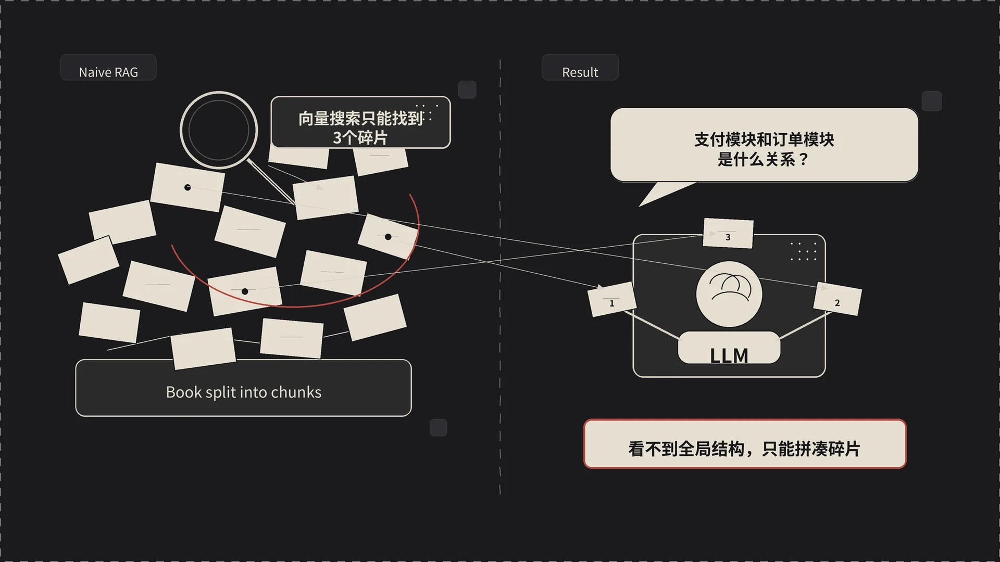
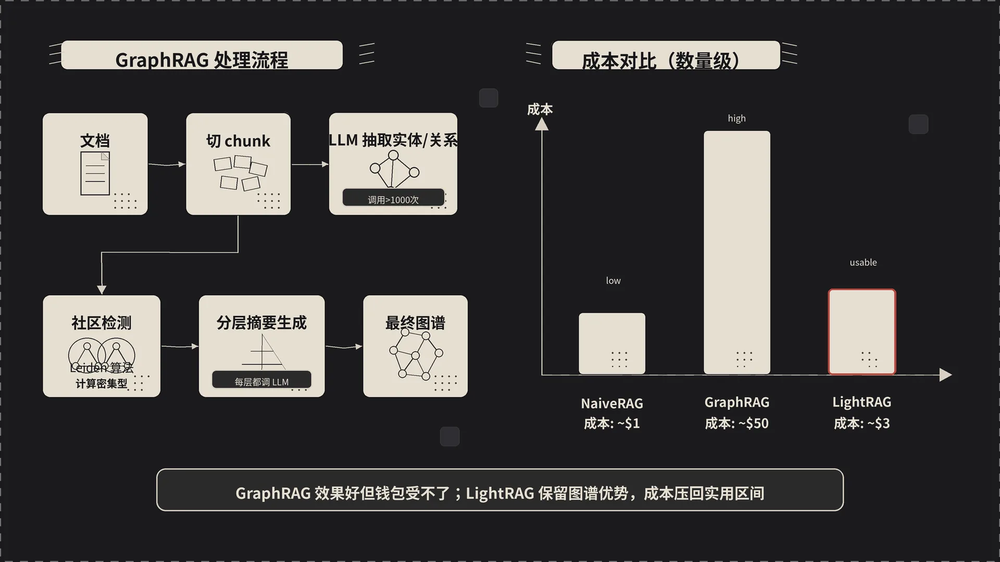
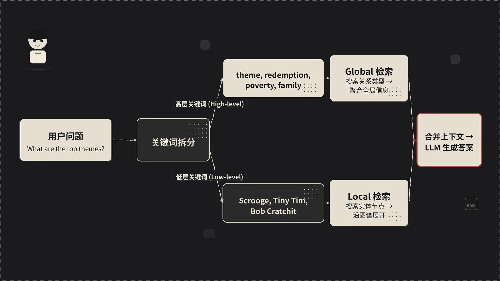
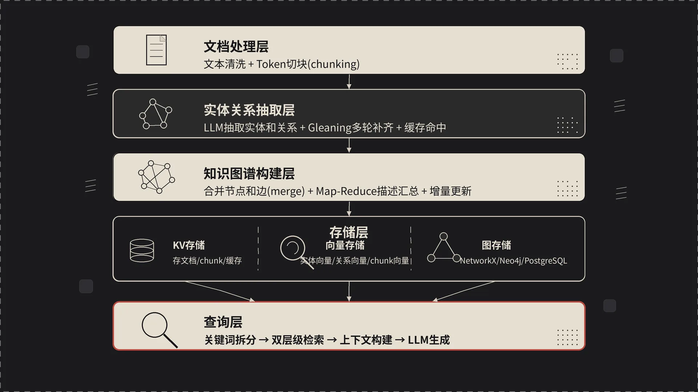

## 一、一个 RAG 系统的翻车现场

去年我帮一个朋友搭了个简单的 RAG 问答系统，用 LangChain + Chroma + OpenAI，往里面灌了一份几百页的产品手册。一开始效果还不错，"这个接口的参数是什么"、"错误码 500 怎么处理"都能答上来。

然后有一天，朋友扔过来一句话：

> "我们这个系统的支付模块和订单模块之间是什么关系？"

RAG 翻车了。返回的是一段关于"支付接口调用方式"的文字，跟"关系"这个词压根没沾边。再换几个问法，"系统里哪些模块依赖了支付服务"、"如果支付挂了会影响什么"——全是这种打太极式的回答，看着像那么回事，仔细一读全是废话。

问题出在哪？Naive RAG 这套东西，干的是"把文档切成块，向量搜索找几块塞给 LLM"的活。它能找到"包含问题里关键词的段落"，但理解不了"这些概念之间到底是什么**关系**"。

## 二、Naive RAG：给 LLM 塞了一堆拼图碎片

打个比方。Naive RAG 就像这样：

你把一本书撕成几百张小纸片，揉成一团扔进箱子。有人问问题，你伸手进去摸几张感觉最相关的纸片，递给一个聪明人让他回答。

聪明人确实挺聪明，但他只看到了几片碎纸。看不见书的目录，不知道章节之间的逻辑关系，更不可能推断出"第三章提到的那个概念其实跟第五章的另一个概念有因果关系"。

具体到技术实现，Naive RAG 的流程是这样的：

1. **文档切块**：用固定大小的滑动窗口把文档切成一个个 chunk
2. **向量化**：embedding 模型把每个 chunk 转成向量，存进向量数据库
3. **检索**：用户提问 → embedding → 向量库里找 top-k 相似 chunk
4. **生成**：把这几个 chunk 和问题一起喂给 LLM，让它生成答案

这套流程对"找某个具体信息"很有效。但它有两个绕不过去的坑：

**第一，碎片化。** 每次检索只看到孤立的几个 chunk，看不到全局结构。一个概念可能在 10 个 chunk 里都被提到，向量搜索只捞回其中 3 个，而且不知道这 10 个 chunk 之间该怎么串起来。

**第二，不理解关系。** 向量相似度只能告诉你"这段文字跟问题长得像"，它不知道"实体 A 和实体 B 之间是什么关系"。所以朋友问"支付模块和订单模块的关系"时，向量搜索能捞回包含"支付"和"订单"的段落，但它不知道这两个模块到底怎么交互的。

## 三、GraphRAG：用知识图谱救场，但钱包受不了

微软在 2024 年开源了 GraphRAG，思路很直接：**在检索之前，先把文档变成知识图谱**。

具体做法：

1. 文档切块（这一步跟 Naive RAG 一样）
2. 对每个 chunk，让 LLM 抽取里面的**实体**（人、地点、概念、事物）和**关系**（谁跟谁是什么关系）
3. 把所有抽取出的实体和关系拼成一个全局知识图谱
4. 用社区检测算法（比如 Leiden）把图谱分成若干"社区"
5. 让 LLM 对每个社区生成一段摘要
6. 查询时，根据问题类型选不同粒度的社区摘要去回答

效果是真的好。微软的测试里，GraphRAG 在回答需要"连接信息"的问题时，比 Naive RAG 强一大截。

但 GraphRAG 有个让人肉疼的毛病：**贵**。

一份几百页的文档，索引一遍可能要调用 LLM 上千次：每个 chunk 抽实体关系要调，每个社区生成摘要也要调，社区还是分层的，每一层都来一遍。算上 GPT-4 的价格，处理一份大文档跑下来几十美金属于常态。

如果你要做的是企业级知识库，文档动辄几万份，那这账就没法算了。更要命的是慢——社区检测和摘要生成是计算密集型的，跑一晚上才出结果都不稀奇。

## 四、LightRAG 登场：既要图谱的好，也要工程上的轻

这就是 LightRAG 出场的地方。全称 "Simple and Fast Retrieval-Augmented Generation"，香港大学数据智能实验室（HKUDS）2024 年 10 月放出来的开源项目。

LightRAG 的卖点就藏在名字里：**Light**（轻量）+ **RAG**。

它保留了 GraphRAG 的核心思路——用知识图谱来理解实体和关系——但在工程实现上动了很多刀，目标是又快又省。

### 4.1 图增强的实体关系抽取

抽实体关系这一步跟 GraphRAG 是一样的，让 LLM 看每个 chunk，吐出里面的实体和关系。LightRAG 在这一步堆了几个工程优化：

**增量更新**。不重建整个图谱。插入新文档时，只抽新文档里的实体和关系，跟已有图谱合并。删文档反过来，定位到相关的实体和关系节点删掉，受影响的部分自动重算。这一点对生产环境太重要了——GraphRAG 那种"加一篇文档就要重新跑社区检测"的做法在线上是没法用的。

**LLM 缓存**。同一个 chunk 不会重复调 LLM。chunk 内容做 hash 当 key，抽取结果直接缓存。改完 prompt 重跑也能命中大部分缓存，调试体验好很多。

**并行处理**。多个 chunk 的抽取请求并行打出去，由一个异步调度器统一管理并发数。索引速度跟 GraphRAG 不是一个量级。

### 4.2 双层级检索：LightRAG 最巧妙的设计

这是 LightRAG 真正的精华。它把用户问题里的关键词分成两层：

- **高层关键词（High-level keywords）**：描述抽象概念、主题、全局关系。比如"这个系统的整体架构是什么"，高层关键词可能是"系统架构、模块设计、数据流"。
- **低层关键词（Low-level keywords）**：描述具体实体、细节。比如"支付接口的参数有哪些"，低层关键词可能是"支付接口、参数、API"。

有了这两层关键词，LightRAG 分别去图谱上做不同的事：

- 拿**低层关键词**去匹配具体的**实体节点**（entity），然后沿着图谱的边把这些实体相邻的实体和关系拽出来——这是 **local 检索**，回答"是什么"。
- 拿**高层关键词**去匹配**关系类型**（relation），找到包含这些关系的子图，再把这些关系涉及的实体拽出来——这是 **global 检索**，回答"怎么样、为什么、整体上"。

两路检索的结果拼到一起，喂给 LLM 生成答案。

### 4.3 四种查询模式

基于双层级检索，LightRAG 对外暴露了几种查询模式，按场景挑：

| 模式 | 干什么 | 适合什么场景 |
|------|--------|--------------|
| **naive** | 纯向量搜索，不走图谱 | 简单的关键词匹配，纯粹的 baseline |
| **local** | 用低层关键词找实体，沿图谱展开 | 问具体实体/细节 |
| **global** | 用高层关键词找关系类型，聚合全局信息 | 问整体关系/主题/总结 |
| **hybrid** | local + global 并行 | 大多数场景的默认选择 |
| **mix** | hybrid + naive 一起上 | 最高召回率，复杂问题用 |

比如你问 **"LightRAG 的作者是谁"**——典型 local 场景。系统抽出低层关键词 "LightRAG"，定位到这个实体，看看跟它直接相连的边里有没有 "作者" 这种关系。

你问 **"GraphRAG 和 LightRAG 的主要区别"**——典型 global 场景。系统抽出高层关键词 "对比、设计差异、性能"，去图谱里找这种关系类型，把两个系统在不同维度上的特征聚合起来。

你问 **"LightRAG 为什么比 GraphRAG 便宜，具体省在哪里"**——这就是 hybrid 场景了。既需要 local（具体的优化点、具体的实体），也需要 global（成本对比的整体逻辑）。

### 4.4 效果方向（不列具体数字）

论文在农业、计算机科学、法律、混合领域四个数据集上做了对比，跟 NaiveRAG、RQ-RAG、HyDE、GraphRAG 这几个方案比。结论可以简单概括成两句话：

- **检索质量上**，LightRAG 在 Comprehensiveness（全面性）、Diversity（多样性）、Empowerment（信息量）这几个维度上明显赢 Naive 系，跟 GraphRAG 持平甚至更好。
- **成本上**，LightRAG 远低于 GraphRAG——索引阶段的 LLM 调用次数差一个数量级以上，token 消耗也是。

具体百分比我就不抄了，论文里给的数字跟评估配置强相关，重要的是趋势：LightRAG 拿到了 GraphRAG 大部分的好处，但工程成本压回了 Naive RAG 那个量级。

## 五、LightRAG 的架构长什么样

在开始下一篇动手实践之前，先扫一眼 LightRAG 的整体架构，心里有个地图。后面每个组件都会有专门的文章展开讲，这一节看个轮廓就够。

五个核心组件，按数据流的方向排：

1. **文档处理层**：接收原始文档，做文本清洗、切块（chunking），生成 chunk 列表
2. **实体关系抽取层**：对每个 chunk 调 LLM，按 prompt 模板抽实体和关系，带去重和合并
3. **知识图谱构建层**：把抽出来的实体和关系合并进全局图谱，支持增量增删，跑实体描述的去重合并
4. **存储层**：分三类——KV 存储（原始文档、chunk、状态）、向量存储（实体/关系/chunk 三套 embedding）、图存储（图谱结构本身）
5. **查询层**：接收问题 → 抽高低层关键词 → 双层级检索 → 拼装上下文 → 调 LLM 生成答案

存储后端这一层 LightRAG 做了很好的抽象。默认用 JSON 文件（本地开发够用），生产环境可以无痛切到 Neo4j、PostgreSQL（带 pgvector 和 AGE 扩展）、MongoDB、Redis、Milvus、Qdrant、OpenSearch 这些。代码里就是改一行配置的事，业务逻辑不用动。
## 六、你应该继续看这个系列吗

这个系列适合下面几类人：

- 用过 LangChain/LlamaIndex 搭过 RAG，但觉得效果不行，想知道还有什么更好的方案
- 对 GraphRAG 感兴趣，但被它的成本和复杂度劝退
- 想在自己的项目里塞一个知识图谱增强的 RAG
- 对 LightRAG 的源码和设计原理好奇，想看看它每一层是怎么拼出来的

如果你完全没接触过 RAG，建议先花半小时了解一下 RAG 的基本概念，然后再回来看这个系列。

下一篇文章我们就动手了。从 pip install 到问出第一个问题，10 分钟搞定。

---

*下一篇：[5 分钟上手 LightRAG——从安装到提问]()*

---

本文由 AgentPlanFlow 生成
