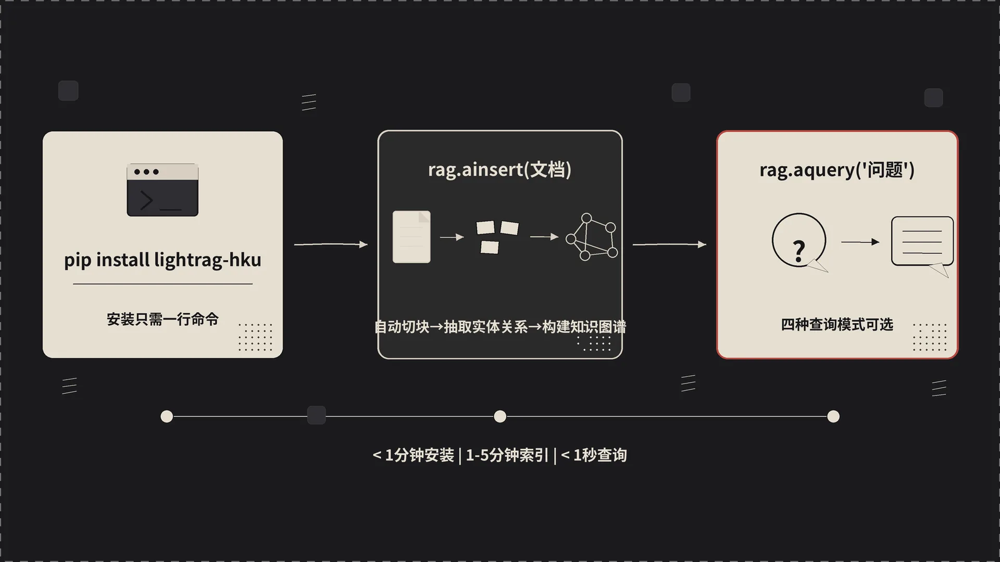
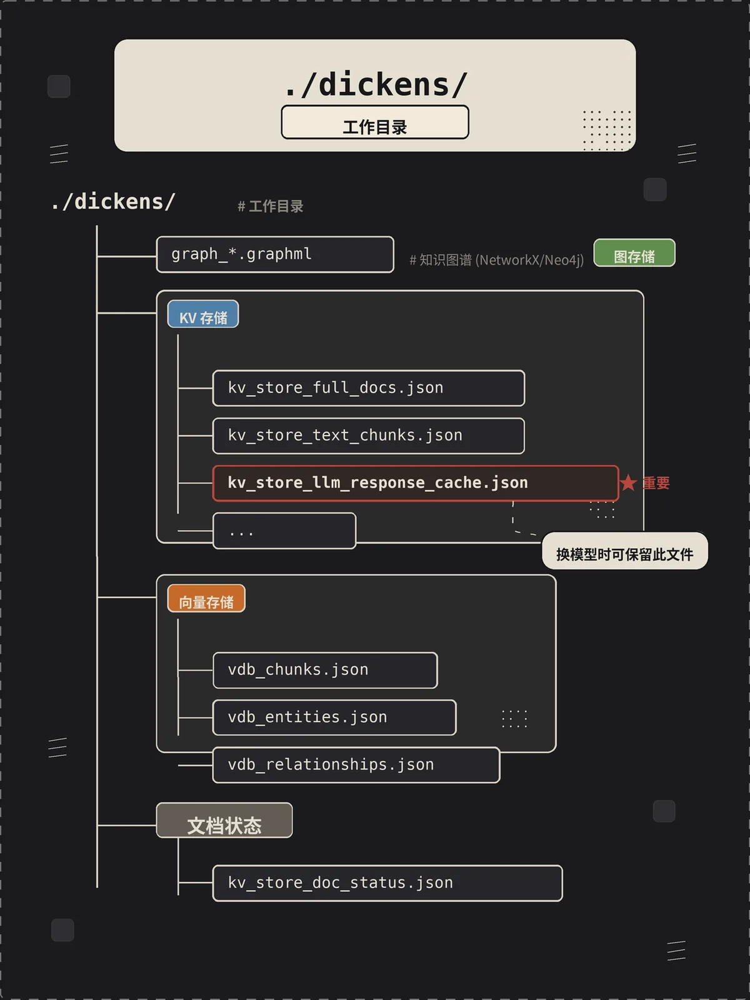

上一篇讲了 LightRAG 在解决什么问题、为什么它比 Naive RAG 和 GraphRAG 都更顺手。这一篇我们不聊原理了，直接动手跑起来。一路顺利的话，从 `pip install` 到看见第一个回答，10 分钟够了。

## 一、动手之前先把三样东西备齐

LightRAG 本身没什么复杂依赖，但 RAG 是个把 Python 代码、模型 API、文本数据缝在一起的活，三样东西必须先准备好：

1. **Python 3.10+**。LightRAG 用了 `asyncio` 和新版的 typing 语法，3.9 跑不起来。我个人推荐 3.11，3.12 也 OK，但留意一下你常用的依赖有没有跟上 3.12。
2. **一个 LLM 入口**。最省事的是 OpenAI 的 `OPENAI_API_KEY`。如果你不想花钱、想离线、或者数据不能出本地，那就准备 Ollama。后面两条路都会讲。
3. **一个能跑 Python 的终端**。Mac / Linux 直接用系统的就行。Windows 推荐 WSL2，省去一堆 path 和编码的麻烦。

如果你打算用国内模型（Qwen、DeepSeek、智谱），它们都提供 OpenAI 兼容的 API，配置上跟用 OpenAI 几乎一样，只是 `base_url` 换一下、模型名换一下。


## 二、安装 LightRAG

最常规的 pip 装法：

```bash
pip install lightrag-hku
```

注意包名是 `lightrag-hku` 不是 `lightrag`——PyPI 上 `lightrag` 这个名字被别人占了。

如果你用 uv（强烈推荐，比 pip 快一个数量级，依赖解析也更靠谱）：

```bash
uv pip install lightrag-hku
```

如果你想用 LightRAG 自带的 Web UI 和 HTTP API（后面文章会讲，做产品时基本会用上）：

```bash
pip install "lightrag-hku[api]"
```

想跟源码、看实现细节、改 prompt 模板，那就源码装：

```bash
git clone https://github.com/HKUDS/LightRAG.git
cd LightRAG
pip install -e .
```

`-e` 是 editable 模式，你在源码里改了什么，import 的时候立刻生效，不用每次都 reinstall。后面我们打算逐步深入源码，建议直接走这条路。

装完之后随手验证一下：

```bash
python -c "import lightrag; print(lightrag.__version__)"
```

能打出版本号就说明环境是干净的。

## 三、用 OpenAI 跑通第一个 Demo

LightRAG 仓库里有一份现成的 demo，灌的是狄更斯的《圣诞颂歌》（A Christmas Carol）。这份语料的好处是篇幅刚好，故事里人物关系丰富，特别能体现"知识图谱式 RAG"和"向量 RAG"的差别。

如果你刚才已经 clone 过仓库，跳到下一步。没有的话先 clone：

```bash
git clone https://github.com/HKUDS/LightRAG.git
cd LightRAG
```

设置 API Key：

```bash
export OPENAI_API_KEY="sk-your-key-here"
```

下载测试文档：

```bash
curl https://raw.githubusercontent.com/gusye1234/nano-graphrag/main/tests/mock_data.txt > ./book.txt
```

跑 demo：

```bash
python examples/lightrag_openai_demo.py
```

第一次跑的时候不要急。你会看到它先在终端打印一堆 `Extracting entities from chunk x/y...`，这是在做索引——LightRAG 把整本书切成 chunk，每个 chunk 调一次 LLM 抽实体和关系，最后再合并成图谱。这步快慢取决于网络、文档大小、并发数，《圣诞颂歌》这种十几 KB 的文本，几分钟内会跑完。

索引跑完之后，进入查询环节，你会看到类似下面的输出：

```
=======================
Test embedding function
========================
Test dict: ['This is a test string for embedding.']
Detected embedding dimension: 1536

=====================
Query mode: naive
=====================
[LightRAG 用纯向量搜索给出的回答……]

=====================
Query mode: local
=====================
[LightRAG 用知识图谱局部搜索给出的回答……]

=====================
Query mode: global
=====================
[LightRAG 用知识图谱全局搜索给出的回答……]

=====================
Query mode: hybrid
=====================
[LightRAG 混合搜索给出的回答……]
```

看到这四段输出，恭喜，LightRAG 跑通了。


## 四
## 四、把 Demo 代码拆开看

`examples/lightrag_openai_demo.py` 的核心部分长这样：

```python
from lightrag import LightRAG, QueryParam
from lightrag.llm.openai import gpt_4o_mini_complete, openai_embed
from lightrag.utils import EmbeddingFunc

rag = LightRAG(
    working_dir="./dickens",
    embedding_func=EmbeddingFunc(
        embedding_dim=1536,
        max_token_size=8192,
        func=openai_embed,
    ),
    llm_model_func=gpt_4o_mini_complete,
)

await rag.initialize_storages()
await initialize_pipeline_status()

with open("./book.txt", "r", encoding="utf-8") as f:
    await rag.ainsert(f.read())

result = await rag.aquery(
    "What are the top themes in this story?",
    param=QueryParam(mode="hybrid"),
)
print(result)
```

几个关键点拆开讲：

**`working_dir`**——LightRAG 的所有持久化数据都落在这个目录里：图谱、向量、KV 缓存全在这里。换一份数据集就换一个目录，互不污染。我自己习惯按 `项目名_模型名` 的格式命名，例如 `./dickens_gpt4o`、`./dickens_qwen32b`，方便对照效果。

**`embedding_func`**——这是个用 `EmbeddingFunc` 包装过的对象，里面三个字段：`embedding_dim` 是向量维度，`max_token_size` 是单次输入的最大 token 数，`func` 是真正干活的异步函数。为什么要这么包一层？因为 LightRAG 内部要根据维度建向量库、根据 max_token 切片输入，光给个函数指针是不够的。

**`llm_model_func`**——一个 `async def` 的函数，签名是 `(prompt, system_prompt=None, history_messages=[], **kwargs) -> str`。LightRAG 自带了一堆封装：`gpt_4o_mini_complete`、`gpt_4o_complete`、`ollama_model_complete`、`azure_openai_complete`、`gemini_complete` 等。要接其它模型，照着抄一份就行。

**`initialize_storages()`** 和 **`initialize_pipeline_status()`**——这两步必须在第一次使用前调一次。前者拉起 KV/向量/图三套存储的 handle，后者初始化插入流水线的全局状态（用来支持并发插入）。漏掉会报奇怪的错。

**`ainsert()`**——异步插入。内部做的事按顺序是：切块 → 写入 chunk KV → 抽实体关系 → 合并到图谱 → 计算 entity/relation/chunk 的 embedding → 写入向量库。整个过程会大量调 LLM，所以一定要异步并发，不然你会等到天亮。

**`aquery()`**——异步查询。`QueryParam` 这个对象除了 `mode`，还有不少有用字段：`top_k`（每路检索取多少个候选）、`max_token_for_text_unit`、`only_need_context`（只返回检索到的上下文，不走 LLM 生成，调试时特别有用）、`response_type`（让 LLM 用什么格式输出，比如 "Multiple Paragraphs" / "Single Paragraph" / "Bullet Points"）。

为什么所有 API 都是 `async`？因为 LightRAG 内部把 LLM 调用、embedding 计算、I/O 全做成异步的，靠 `asyncio.gather` 并发跑。如果你不熟悉 async，最简单的用法是把整段代码包在 `asyncio.run(main())` 里就行，demo 里就是这么干的。

## 五、模型选型

很多人跑通 demo 之后效果不理想，第一反应是去调 prompt、调 chunk size。其实十有八九是模型选错了。

LightRAG 对 LLM 的要求比 Naive RAG 高很多，因为它把"从文档抽实体和关系"这件事压在了 LLM 头上。模型能力不够，抽出来的图谱就稀疏、错位、漏关键，后面所有的检索质量都会跟着崩。


**索引阶段的 LLM**（用在 `llm_model_func`，干的是抽取实体关系）：

- **参数量底线 32B**。7B/8B 的模型抽出来的实体经常张冠李戴，关系也乱。我做过对比，Qwen2.5-7B 抽出来的图谱节点数只有 Qwen2.5-32B 的 60%，关系准确率更是差一大截。
- **上下文最少 32K，推荐 64K+**。chunk 默认 1200 token 左右，但 prompt 模板加上 few-shot 例子很占长度，上下文太短会触发截断。
- **不要用"推理模型"**（o1、o3-mini、DeepSeek-R1 这种）。它们的思考过程对抽取任务是纯浪费，速度慢成本高，而且 reasoning tokens 不计入 output 但照样收费。
- 推荐档位（按性价比）：DeepSeek-V3 > Qwen2.5-72B > GPT-4o-mini > Claude 3.5 Sonnet > GPT-4o。DeepSeek-V3 几乎是目前 LightRAG 索引的最优解，又便宜又抽得准。

**查询阶段的 LLM**（同样是 `llm_model_func`，但用在回答问题时）：

- 这一阶段对模型的"组织语言"能力要求更高，可以用比索引阶段更强的模型。
- 如果你愿意分开配置，LightRAG 也支持给查询单独指定 LLM。复杂业务里我会用 Qwen2.5-32B 索引、用 Claude 3.5 Sonnet 或 GPT-4o 查询，省一大笔钱。

**Embedding 模型**：

- `text-embedding-3-large`（OpenAI，3072 维）质量高但贵。
- `text-embedding-3-small`（1536 维）性价比最高，默认推荐。
- `BAAI/bge-m3`（开源，1024 维，多语言）——中文场景首选，离线可跑。
- 一个**铁律**：索引时用了哪个 embedding 模型，查询时必须用同一个。维度、空间都对不上的话整个向量库就废了。换模型的代价是重新跑一遍索引。

**Reranker（重排模型）**：

- LightRAG 检索阶段会召回一批候选 chunk/entity/relation，但向量召回的"相关性排序"经常不够准。Reranker 在召回之后做一次二次精排，把真正相关的提前。
- 推荐 `BAAI/bge-reranker-v2-m3`（开源，多语言）或 Jina AI 的 reranker 服务。
- 接 Reranker 是性价比最高的优化之一，比换 LLM 便宜，但效果提升非常明显。

## 六、不用 OpenAI 也行：Ollama 跑本地模型

数据涉密、想离线、或者纯粹想省钱，那就走 Ollama。

先装 Ollama 并拉模型：

```bash
# 安装 Ollama（Mac/Linux）
curl -fsSL https://ollama.com/install.sh | sh

# 拉一个 LLM（按你机器配置选）
ollama pull qwen2.5:32b          # 32G+ 显存推荐
ollama pull qwen2.5:14b          # 16G 显存能跑
ollama pull qwen2.5:7b           # 8G 显存兜底，但效果会打折

# 拉 embedding 模型
ollama pull bge-m3
```

启动 Ollama 服务（一般装完会自启，没自启就手动起）：

```bash
ollama serve
```

跑 LightRAG 的 Ollama demo：

```bash
python examples/lightrag_ollama_demo.py
```

代码简化后长这样：

```python
from lightrag import LightRAG, QueryParam
from lightrag.llm.ollama import ollama_model_complete, ollama_embed
from lightrag.utils import EmbeddingFunc

rag = LightRAG(
    working_dir="./dickens_ollama",
    llm_model_func=ollama_model_complete,
    llm_model_name="qwen2.5:32b",
    llm_model_kwargs={"host": "http://localhost:11434", "options": {"num_ctx": 32768}},
    embedding_func=EmbeddingFunc(
        embedding_dim=1024,
        max_token_size=8192,
        func=lambda texts: ollama_embed(texts, embed_model="bge-m3"),
    ),
)
```

几个 Ollama 特有的坑：

- **`num_ctx` 必须显式设大**。Ollama 的默认上下文是 2048，根本装不下 LightRAG 的 prompt，必须改到 32768 以上，不然抽取结果被截断，输出不完整。
- **首次推理会很慢**。Ollama 加载模型到显存要时间，第一次查询多等 30 秒是正常的，之后会快。
- **本地索引比 OpenAI 慢很多**。一份《圣诞颂歌》OpenAI 几分钟，本地 32B 模型可能要半小时甚至更久。这是物理限制，不是 LightRAG 的锅。


## 七、其它 LLM 的接入

LightRAG 在 `lightrag/llm/` 下提供了一堆开箱即用的 LLM/Embedding 封装：

- **Azure OpenAI**：`lightrag.llm.azure_openai`，几乎和 OpenAI 一样，只是 endpoint 和认证不同。
- **Google Gemini**：`lightrag.llm.gemini`。Gemini 上下文长，便宜，但中文实体抽取一般。
- **HuggingFace（transformers 本地推理）**：`lightrag.llm.hf`。适合你已经在本地有 GPU、不想用 Ollama 的场景。
- **vLLM / 任何 OpenAI 兼容服务**：直接复用 `openai_complete_if_cache`，把 `base_url` 改成你的 vLLM endpoint 即可。国产的 DeepSeek、Qwen API、智谱 GLM、Moonshot 全部走这条路。
- **Bedrock、Zhipu、SiliconFlow、LMDeploy**：仓库里都有现成封装，看一眼源码抄一下就行。

接陌生模型时的通用做法：找一个已有封装（推荐 `openai.py`）当模板，复制一份，改改 client 初始化和请求格式。封装的本质就是写一个 `async def your_model_complete(prompt, ...) -> str` 函数，剩下的交给 LightRAG。

## 八、工作目录里都有什么

跑完 demo 之后，`./dickens/` 目录里会冒出一堆文件，长这样：

```
./dickens/
├── graph_chunk_entity_relation.graphml   # 知识图谱（GraphML 格式）
├── kv_store_doc_status.json              # 文档处理状态
├── kv_store_full_docs.json               # 原文存储
├── kv_store_text_chunks.json             # 切块后的 chunk
├── kv_store_llm_response_cache.json      # LLM 响应缓存
├── vdb_chunks.json                       # chunk 向量库
├── vdb_entities.json                     # 实体向量库
└── vdb_relationships.json                # 关系向量库
```


按数据流的顺序解释一下：

- `kv_store_full_docs.json` 装的是你 `ainsert` 进来的原文，按文档 ID 索引。
- `kv_store_text_chunks.json` 是切块的结果，每个 chunk 有自己的 ID、所属 doc、token 数、原文片段。
- `kv_store_doc_status.json` 记录每个 doc/chunk 的处理状态（pending / processing / processed / failed），LightRAG 靠这个文件实现"断点续跑"——索引中途挂了，下次重启会从未处理完的 chunk 继续。
- `kv_store_llm_response_cache.json` 是 LLM 调用缓存。chunk hash + prompt hash 当 key，模型输出当 value。**这个文件特别值钱**——你换了 embedding 想重建向量库，或者改了一点 prompt 想重跑索引，只要这个缓存还在，绝大部分 LLM 调用都能命中，省下大笔钱。
- `vdb_chunks.json` / `vdb_entities.json` / `vdb_relationships.json` 是 NanoVectorDB（LightRAG 自带的轻量 JSON 向量库）存的三套向量，分别对应 chunk、entity、relation。生产上换成 PostgreSQL+pgvector 或 Milvus 之后这些文件就不再产生。
- `graph_chunk_entity_relation.graphml` 是知识图谱本体，GraphML 格式，可以用 NetworkX、Gephi、Neo4j 直接打开看。强烈建议你跑完 demo 后用 Gephi 打开瞄一眼，对"知识图谱长什么样"的直观感受比读十篇论文都强。


## 九、新手最容易踩的几个坑

**1. 换 embedding 模型后报 dimension mismatch**——之前的向量库是按旧维度建的，硬塞新向量进去当然报错。解决：删掉工作目录下所有 `vdb_*.json` 和 `graph_*.graphml`，保留 `kv_store_llm_response_cache.json`，重跑一遍。这样 LLM 抽取走缓存，只重新计算向量，又快又省钱。

**2. 索引慢到怀疑人生**——先确认是不是单线程在跑。LightRAG 默认 `max_async=4`（并发 4 个 LLM 请求）。如果你的 API 没限速，可以调大到 16 甚至 32：`LightRAG(..., max_async=16)`。但注意大并发对应 rate limit 风险，OpenAI 的话留意 TPM/RPM。

**3. 跑大数据集时内存爆掉**——NanoVectorDB 是把整个向量库加载到内存的。几万个 chunk 还行，几十万就吃不消了。生产环境一定换 PostgreSQL + pgvector，或者 Milvus。切换方式只是改几个参数，业务代码不用动。

**4. 中文实体抽得乱七八糟**——LightRAG 默认 prompt 是英文的。处理中文文档时务必带上 `addon_params={"language": "Chinese"}`，让 LLM 用中文输出实体和关系。不加这个参数，你会看到"赵姨娘"被抽成 "Zhao Yi Niang"、"贾宝玉" 被抽成 "Jia Bao Yu"，后续查询基本废了。

**5. 查询返回空或者明显不相关**——先用 `QueryParam(only_need_context=True)` 看检索到的上下文长啥样。如果上下文本身就不相关，那是检索环节的问题（embedding 模型、top_k、mode 选错）。如果上下文相关但回答不行，那是 LLM 的锅，换更强的查询模型。这个分离调试的技巧能帮你少走很多弯路。

下一篇我们专门对比四种查询模式在同一个问题上的输出差异。

---

*上一篇：[RAG 的困局与 LightRAG 的破局之道]()*

*下一篇：[理解四种查询模式——local、global、hybrid、naive 和 mix]()*


---

本文由 AgentPlanFlow 生成
