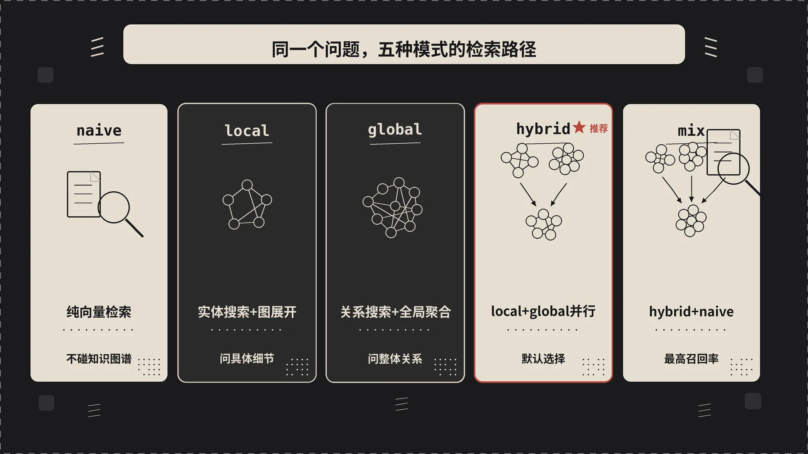
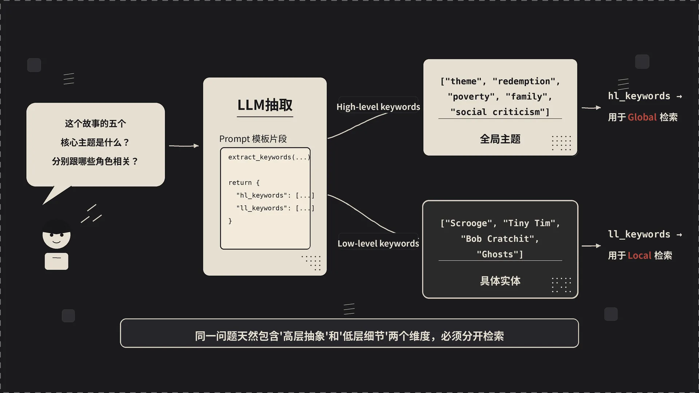
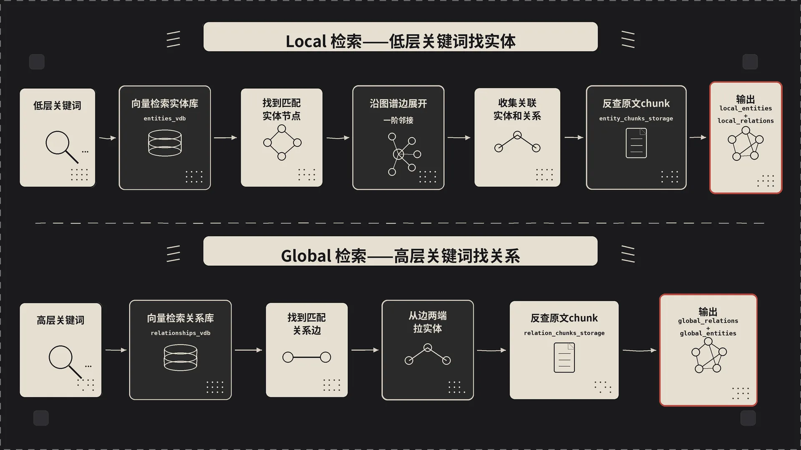

第二篇里我们 demo 跑通了，应该都注意到了 LightRAG 在最后印的那四段输出——同一个问题，四种 `mode`，答案明显不一样。这一篇我们就把这件事搞透：每种模式背后到底是怎么检索的、什么场景该选哪个、源码里关键路径长什么样。


## 一、用一个具体问题开场

我把第二篇用的《圣诞颂歌》语料留着，提一个稍微"刁"一点的问题：

> "这个故事的五个核心主题是什么？分别跟哪些角色相关？"

这个问题同时考验两件事：**全局把握**（"五个核心主题"要从整本书的关系网里抽出来）和**实体绑定**（"哪些角色相关"要落到具体人物上）。一个理想的 RAG 系统应该两边都行。

我把同一段语料分别用 `naive` / `local` / `global` / `hybrid` / `mix` 跑了一遍，输出风格的差别大概是这样的：

- **naive**：返回了若干段原文里出现"theme"的片段做总结，主题罗列得很泛（"good and evil"、"family"），角色基本没绑上，因为它根本不知道实体是什么。
- **local**：列出了 Scrooge、Tiny Tim、Bob Cratchit 这些核心角色和他们的具体行为，但"五个主题"答得很弱，给的更像"角色片段汇总"。
- **global**：主题这部分答得最漂亮——救赎、贫困、社会冷漠、家庭、时间，每个主题还能讲一段，但跟具体角色的绑定不够紧。
- **hybrid**：两者优势都拿到了。先列五个主题，然后每个主题底下挂相关角色，结构清晰，信息密度高。
- **mix**：在 hybrid 基础上还引了几段原文片段做佐证。回答最长、最稳，代价是 token 用得多、慢一点。

如果你嫌懒只想记一个结论：**绝大多数业务场景，hybrid 是默认选择；mix 用在对召回率要求高、追求引用佐证的场景**。但要真讲清楚为什么，得拆开看每种模式背后跑了什么。



## 二、五种模式背后的检索路径

先看一张整体路径图。LightRAG 的查询入口分两支：

- `naive_query`（`lightrag/operate.py:4953`）：完全独立的一条路，纯向量检索，不碰图谱。
- `kg_query`（`lightrag/operate.py:3164`）：local / global / hybrid / mix 全都走这一条，差别在内部 mode dispatch。

`kg_query` 进来之后的第一件事，是**抽关键词**。

### 2.1 关键词抽取——把问题拆成两层

源码位置：`get_keywords_from_query` 在 `lightrag/operate.py:3374`。这个函数干的事很简单：

```python
async def get_keywords_from_query(
    query, query_param, global_config, hashing_kv,
) -> tuple[list[str], list[str]]:
    if query_param.hl_keywords or query_param.ll_keywords:
        return query_param.hl_keywords, query_param.ll_keywords

    hl_keywords, ll_keywords = await extract_keywords_only(
        query, query_param, global_config, hashing_kv
    )
    return hl_keywords, ll_keywords
```

如果你在 `QueryParam` 里手动塞了 `hl_keywords` / `ll_keywords`，它直接用；否则调一次 LLM，按预置 prompt 把问题拆成两组关键词：

- **high-level keywords（hl_keywords）**：抽象概念、主题。比如对那个问题，hl 大概是 `["theme", "redemption", "poverty", "family", "social criticism"]`。
- **low-level keywords（ll_keywords）**：具体实体、细节。对同一个问题，ll 大概是 `["Scrooge", "Tiny Tim", "Bob Cratchit", "Ghosts"]`。

注意这一步本身也带 cache（`cache_type="keywords"`），同样的问题不会重复调 LLM。



### 2.2 按 mode 分发——核心 dispatcher

抽完关键词，进入 `_perform_kg_search`（`lightrag/operate.py:3573`）。这个函数是真正的"模式调度中心"，源码里写得很清楚：

```python
mode = query_param.mode
need_ll = mode in ("local", "hybrid", "mix") and bool(ll_keywords)
need_hl = mode in ("global", "hybrid", "mix") and bool(hl_keywords)
```

也就是说：

- `local`：只用 `ll_keywords`，只查实体路径
- `global`：只用 `hl_keywords`，只查关系路径
- `hybrid`：两路都走
- `mix`：两路都走，**额外**再走一遍 chunk 向量检索



然后函数里有这一段分支（`operate.py:3658`-`3692`）：


```python
if query_param.mode == "local" and len(ll_keywords) > 0:
    local_entities, local_relations = await _get_node_data(...)
elif query_param.mode == "global" and len(hl_keywords) > 0:
    global_relations, global_entities = await _get_edge_data(...)
else:  # hybrid or mix
    if len(ll_keywords) > 0:
        local_entities, local_relations = await _get_node_data(...)
    if len(hl_keywords) > 0:
        global_relations, global_entities = await _get_edge_data(...)
    if query_param.mode == "mix" and chunks_vdb:
        vector_chunks = await _get_vector_context(...)
```

逻辑非常干净。下面我们分别看 `_get_node_data` 和 `_get_edge_data` 是怎么干活的。

### 2.3 local 的核心：从实体出发

`_get_node_data` 在 `lightrag/operate.py:4359`。流程拆开来就三步：

1. 用 ll_keywords 在 **entities_vdb**（实体向量库）里查 top_k 个最相似的实体；
2. 把这些实体的 ID 拿去 `knowledge_graph_inst.get_nodes_batch` / `node_degrees_batch` 批量取节点详情和度数；
3. 调 `_find_most_related_edges_from_entities`，把这些实体在图上**直接相连的边**拽出来。

```python
results = await entities_vdb.query(
    query, top_k=query_param.top_k, query_embedding=query_embedding
)
node_ids = [r["entity_name"] for r in results]
nodes_dict, degrees_dict = await asyncio.gather(
    knowledge_graph_inst.get_nodes_batch(node_ids),
    knowledge_graph_inst.node_degrees_batch(node_ids),
)
```

注意几个细节：

- 入口是**实体向量库**，不是 chunk 向量库。能召回什么取决于索引阶段抽出了哪些实体。
- 排序按 cosine 相似度（实体）+ rank/weight（关系），见 `operate.py:4414`-`4415` 的注释。
- "Scrooge" 这种核心实体会被高优先级返回，连带它在图上的所有邻边一起进入上下文。

这就是为什么前面 demo 里 local 模式擅长回答"某某角色做了什么"——它的检索起点就是实体。


### 2.4 global 的核心：从关系出发

`_get_edge_data` 在 `lightrag/operate.py:4634`。结构跟 local 对称，但起点变了：

1. 用 hl_keywords 在 **relationships_vdb**（关系向量库）里查 top_k 条相似关系；
2. 把这些关系（src_id, tgt_id 对）批量去图里取边属性 `get_edges_batch`；
3. 调 `_find_most_related_entities_from_relationships`，反过来把这些关系**两端的实体**收集起来。

```python
results = await relationships_vdb.query(
    keywords, top_k=query_param.top_k, query_embedding=query_embedding
)
edge_pairs_dicts = [{"src": r["src_id"], "tgt": r["tgt_id"]} for r in results]
edge_data_dict = await knowledge_graph_inst.get_edges_batch(edge_pairs_dicts)
```

global 的精妙在于：它检索的不是"包含某个词的段落"，而是"匹配某种关系语义的连接"。比如查 "redemption"（救赎）这个 hl 关键词，匹配上的可能是 "Ghost-of-Christmas-Past → Scrooge → 'reveals'" 这条边——这种"关系层面的语义匹配"是 Naive RAG 完全做不到的。


### 2.5 hybrid / mix 怎么合并两路

hybrid 是 local 和 global 并行跑，结果合并。mix 在此基础上多加一路 chunk 向量检索。合并算法在 `_perform_kg_search` 里（`operate.py:3714`-`3768`），用的是 **round-robin 去重**：

```python
max_len = max(len(local_entities), len(global_entities))
for i in range(max_len):
    if i < len(local_entities):
        entity = local_entities[i]
        if entity_name not in seen_entities:
            final_entities.append(entity)
            seen_entities.add(entity_name)
    if i < len(global_entities):
        # 同样处理
```

为什么用 round-robin 而不是简单 concat？因为两路的相似度分布不一样，简单拼接会让一路的低质结果挤掉另一路的高质结果。轮流取相当于强制保留两路 top 的结果，是个很聪明的工程选择。

关系（edges）也做同样的 round-robin 去重，key 是 `tuple(sorted([src, tgt]))`。

最后 `_perform_kg_search` 吐出 `{final_entities, final_relations, vector_chunks, chunk_tracking, query_embedding}` 这个原始检索结果，**还没做 token 截断、也没拼成 prompt**。


### 2.6 拼装上下文——四阶段流水线

`_build_query_context`（`lightrag/operate.py:4239`）是查询管线的总指挥，注释写得很到位：

```
1. Search -> 2. Truncate -> 3. Merge chunks -> 4. Build LLM context
```

- **Stage 1**：调 `_perform_kg_search` 拿到原始 entities / relations / vector_chunks
- **Stage 2**：`_apply_token_truncation` 按 `max_entity_tokens` / `max_relation_tokens` 截断，控制喂给 LLM 的预算
- **Stage 3**：`_merge_all_chunks` 把截断后的 entities/relations 关联到 chunks（实体出现在哪些 chunk 里、关系来自哪些 chunk），跟向量召回的 vector_chunks 合并去重
- **Stage 4**：`_build_context_str` 拼出最终给 LLM 的 context 字符串

这套四阶段流水线的好处是每一层职责清晰。如果你想做检索优化，知道改哪一层不会动到其它环节。

## 三、QueryParam 完整字段，挑重要的讲

源码：`lightrag/base.py:85`。挑实战里常调的几个：

| 字段 | 默认值 | 干啥用 |
|------|--------|--------|
| `mode` | `"mix"` | 五种模式 + `bypass`（跳过检索直问 LLM，做对照实验用）|
| `top_k` | 环境变量 `TOP_K` 或默认值 | local 模式查实体的 top_k，global 模式查关系的 top_k |
| `chunk_top_k` | 环境变量 `CHUNK_TOP_K` | chunk 向量检索取多少，Reranker 之后保留多少 |
| `only_need_context` | `False` | **调试神器**——只返回检索到的 context，不走 LLM 生成 |
| `only_need_prompt` | `False` | 返回最终拼好的完整 prompt，做 prompt 调优用 |
| `response_type` | `"Multiple Paragraphs"` | 输出格式：`"Single Paragraph"` / `"Bullet Points"` / 自定义 |
| `stream` | `False` | 流式输出 |
| `hl_keywords` / `ll_keywords` | `[]` | **手动指定关键词**，跳过 LLM 抽取那一步 |
| `max_entity_tokens` / `max_relation_tokens` / `max_total_tokens` | 见默认值 | 上下文 token 预算的三个上限 |
| `enable_rerank` | `True`（env `RERANK_BY_DEFAULT`）| 开启 reranker 二次精排 |
| `model_func` | `None` | **本次查询临时换 LLM**，例如索引用便宜模型，查询切换到 GPT-4o |
| `user_prompt` | `None` | 在 system prompt 之外追加用户自定义指令 |
| `conversation_history` | `[]` | 多轮对话上下文 |
| `include_references` | `False` | 输出里是否带引用元数据 |

`only_need_context=True` 是我个人用得最多的开关，单独拎出来讲一下。

## 四、`only_need_context` ——你应该一直在用的调试模式

调 RAG 最难的地方是"答得不对"很难定位是哪个环节出的问题。LLM 没编出来吗？还是检索就没召回到关键 chunk？

把 `only_need_context` 设为 True，LightRAG 不会调 LLM 生成回答，直接返回拼好的 context 字符串：

```python
context = await rag.aquery(
    "故事的五个核心主题是什么？分别和哪些角色相关？",
    param=QueryParam(mode="hybrid", only_need_context=True),
)
print(context)
```

你能直接看到：

- 拉回了哪些 entities（按相似度排序）
- 拉回了哪些 relations（带权重）
- 拉回了哪些原文 chunks
- 整体的 token 占用

如果 context 里 "Scrooge"、"redemption" 这些核心实体都没出现，那问题在检索端——可能 top_k 太小、可能 embedding 模型质量差、可能索引阶段没抽出来。
如果 context 里啥都有，但 LLM 还是答得很烂，那问题在生成端——换更强的查询 LLM，或者调 prompt。

把检索质量和生成质量解耦诊断，是 RAG 调优的第一性原理。

## 五、Reranker 在查询里到底干了啥

`enable_rerank=True` 时，LightRAG 在 chunk 召回之后会塞一道 reranker。流程是：

1. 向量召回 `chunk_top_k * N`（N 是放大系数）个候选
2. Reranker 对（query, chunk）做相关性打分
3. 留下分数最高的 `chunk_top_k` 个

Reranker 跟 embedding 模型的本质区别：embedding 是把 query 和 chunk **各自**编码成向量、然后算距离（双塔），快但精度有限；reranker 是把 query 和 chunk **拼到一起**喂给一个 cross-encoder，输出一个分数（单塔），慢但精度高得多。

实测下来，加 `BAAI/bge-reranker-v2-m3` 的 reranker 经常能把"看起来相关但答非所问"的 chunk 滤掉，对中文场景尤其明显。配置方式见仓库 `examples/` 目录下的 reranker 示例。

## 六、实战选型表——一句话决策

| 场景 | 推荐模式 | 理由 |
|------|----------|------|
| 找具体事实（"某接口的参数"、"某人是谁"）| `local` | 实体级精确召回，token 用得最少 |
| 主题/概述/对比（"两个模块的区别"、"全书核心思想"）| `global` | 关系级语义匹配，把握全局 |
| 大多数复合问题 | `hybrid` | 两路兼顾，默认就用这个 |
| 追求最高召回 + 原文引用 | `mix` | 多一路 chunk 向量，作为佐证 |
| 纯粹做 baseline 对照 | `naive` | 只走 chunk 向量，跟传统 RAG 对齐 |
| 想跳过检索直接问 LLM | `bypass` | 调试 / 对照实验用 |


我自己的默认策略：

- **生产**：上线 `hybrid`，开 reranker，response_type 按业务调（FAQ 用 Single Paragraph，技术文档用 Multiple Paragraphs）。
- **离线评估**：跑 `naive` / `local` / `global` / `hybrid` / `mix` 五路对比，看在你的语料上哪个最稳。
- **复杂查询场景**（法律、医学、跨章节推理）：切到 `mix`，开 reranker，max_total_tokens 调大。

## 七、到这里，关于查询你已经知道

- 关键词抽取把问题拆成两层（hl / ll），驱动两套不同的检索路径
- local = 实体路径，global = 关系路径，hybrid = 两路并行，mix = 加一路向量
- 五种模式的源码 dispatch 集中在 `_perform_kg_search`，合并用 round-robin 去重
- 拼装上下文走"搜索 → 截断 → 合并 chunks → 拼 prompt"四阶段流水线
- `only_need_context` 是检索/生成解耦调试的关键开关
- Reranker 是性价比最高的检索质量优化

查询这一头的图你心里应该有了。但有件事我们一直没碰：**索引阶段那张图，到底是怎么从原始文档变出来的**？LLM 抽实体抽关系的 prompt 长什么样？增量更新怎么不破坏已有图谱？

下一篇我们就钻进索引这一头，把 `ainsert` 内部那几百行代码拆开看。

---

*上一篇：[5 分钟上手 LightRAG——从安装到提问]()*

*下一篇：[文档是怎样变成知识图谱的——LightRAG 索引流程全解析]()


---

本文由 AgentPlanFlow 生成
