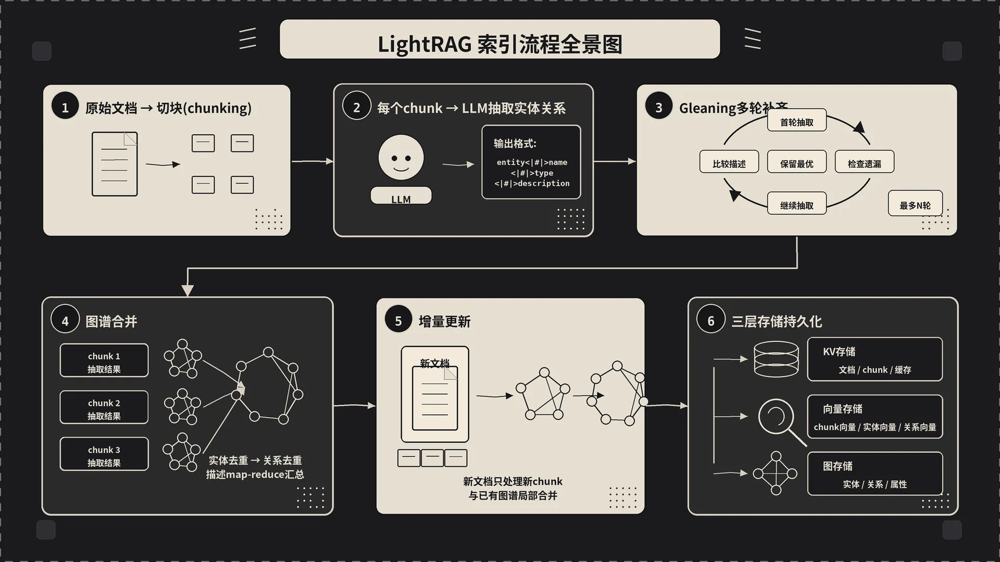

     1|---
     2|title: 文档是怎么变成知识图谱的——LightRAG 索引流程剖析
     3|author: sanyinchen
     4|date: 2026-05-19
     5|categories: [ AI ]
     6|tags: [LightRAG, RAG, 知识图谱, 索引流程]
     7|render_with_liquid: false
     8|toc: true
     9|---
    10|
    11|第三篇我们把"查"这条路走完了。但还有一个绕不开的问题：那张被查询的知识图谱，到底是什么时候、怎么从一坨文本变出来的？
    12|
    13|下面我们钻进 `ainsert` 内部，把这条索引流水线从头到尾拆一遍。
    14|
    15|
    16|
    17|

## 二、ainsert 的全貌——两阶段提交
    19|
    20|入口在 `lightrag/lightrag.py:1237`：
    21|
    22|```python
    23|async def ainsert(
    24|    self,
    25|    input: str | list[str],
    26|    split_by_character: str | None = None,
    27|    split_by_character_only: bool = False,
    28|    ids: str | list[str] | None = None,
    29|    file_paths: str | list[str] | None = None,
    30|    track_id: str | None = None,
    31|) -> str:
    32|    if track_id is None:
    33|        track_id = generate_track_id("insert")
    34|    await self.apipeline_enqueue_documents(input, ids, file_paths, track_id)
    35|    await self.apipeline_process_enqueue_documents(
    36|        split_by_character, split_by_character_only
    37|    )
    38|    return track_id
    39|```
    40|
    41|`ainsert` 本身没干啥重活，它只是把工作拆成两步：
    42|
    43|- **入队**：`apipeline_enqueue_documents`（`lightrag.py:1344`）。把传进来的文档（不管是字符串还是字符串列表）算出 doc_id（MD5 hash 当默认 id）、写进 doc_status KV，标记成 `pending`。这一步是同步的、轻量的，能在毫秒级返回。
    44|- **出队执行**：`apipeline_process_enqueue_documents`（`lightrag.py:1740`）。从 pending 队列里拿文档，一篇一篇过流水线：切块 → 抽实体关系 → 合并入图 → 写存储。这一步重，长跑也在这里。
    45|
    46|把"声明要插入"和"实际处理"切开的好处是：
    47|
    48|1. 调用方能立刻拿到 `track_id`，后续用这个 ID 查进度，不用阻塞等几小时。
    49|2. 进程挂了重启，pending 和 processing 状态会保留在 KV 里，下次自动续跑。
    50|3. 多篇文档可以排队、批处理、限流，避免并发把 LLM API 打挂。
    51|
    52|接下来我们沿着 `apipeline_process_enqueue_documents` 里的核心三步走：切块、抽取、合并。
    53|
    54|## 二、第一步：把文档切成 chunk
    55|
    56|切块函数是可配置的（`lightrag.py:328` 的 `chunking_func`），默认实现是 `chunking_by_token_size`，源码在 `lightrag/operate.py:101`。
    57|
    58|核心逻辑只有十来行：
    59|
    60|```python
    61|def chunking_by_token_size(
    62|    tokenizer, content,
    63|    split_by_character=None, split_by_character_only=False,
    64|    chunk_overlap_token_size=100, chunk_token_size=1200,
    65|) -> list[dict]:
    66|    tokens = tokenizer.encode(content)
    67|    results = []
    68|    # 默认走的是这条 else 分支：纯按 token 切
    69|    for index, start in enumerate(
    70|        range(0, len(tokens), chunk_token_size - chunk_overlap_token_size)
    71|    ):
    72|        chunk_content = tokenizer.decode(tokens[start : start + chunk_token_size])
    73|        results.append({
    74|            "tokens": min(chunk_token_size, len(tokens) - start),
    75|            "content": chunk_content.strip(),
    76|            "chunk_order_index": index,
    77|        })
    78|    return results
    79|```
    80|
    81|几个关键参数：
    82|
    83|- **`chunk_token_size`**：默认 1200，是单个 chunk 的目标长度。
    84|- **`chunk_overlap_token_size`**：默认 100，相邻两块之间的重叠 token 数。这个 overlap 看着浪费，其实非常重要——如果一句话刚好横跨两个 chunk 边界，没 overlap 的话两边都抽不全这条句子里的实体关系，加 100 token 的重叠等于给 LLM 留个"上下文喘息"的余地。
    85|- **`split_by_character`**：如果你想优先按某个字符（比如 `\n\n` 段落分隔符）切，再在每段内部按 token 限制兜底，传这个参数。
    86|- **`split_by_character_only`**：硬性按字符切，即便超出 `chunk_token_size` 也不再二次切——这会直接抛 `ChunkTokenLimitExceededError`（见 `operate.py:123`），所以一般用于"我已经预先按 Markdown 章节切好了"的场景。
    87|
    88|注意 tokenizer 是按你配的 LLM 来的（`tiktoken` 默认用 `gpt-4o` 的编码器），不是按字符。中文文档实际切出来的字数会比 token 数多得多，建议不要调太小——中文文档 token 数远大于字数，太小的话一句话都切不完整。
    89|
    90|
    91|切完之后每个 chunk 是一个字典：`{tokens, content, chunk_order_index, full_doc_id, file_path, ...}`。chunk_id 是按内容 hash 算出来的（`chunk-` 前缀 + MD5），同样的内容永远是同一个 chunk_id——这是后面缓存能命中的基础。
    92|
    93|## 三、第二步：让 LLM 抽实体和关系
    94|
    95|切完块之后，进入 `extract_entities`（`lightrag/operate.py:2883`），整个索引最耗时、最花钱的一步就是它。
    96|
    97|### 3.1 prompt 长什么样
    98|
    99|LightRAG 把抽取 prompt 拆成三段：
   100|
   101|1. **system prompt**——`entity_extraction_system_prompt`（`prompt.py:11`）。这一段定义抽什么、怎么抽、用什么分隔符、用什么语言输出。
   102|2. **user prompt**——`entity_extraction_user_prompt`（`prompt.py:63`）。把当前 chunk 的内容塞进去，触发抽取。
   103|3. **gleaning user prompt**——`entity_continue_extraction_user_prompt`（`prompt.py:84`）。第二轮"补漏"用的，下一节细讲。
   104|
   105|为什么 system 和 user 分开？源码注释（`operate.py:2950`）写得明白：
   106|
   107|> Format system prompt without input_text for each chunk (enables OpenAI prompt caching across chunks)
   108|
   109|OpenAI 的 prompt caching 是按前缀匹配的。如果你每个 chunk 都把内容拼进 system prompt，那每个 chunk 的 system 都不一样，缓存命不中。把 system 固定下来（只放规则）、把内容塞到 user 里，OpenAI 就能把 system 那一大段命中缓存，省一大笔钱。
   110|
   111|### 3.2 输出格式：自定义分隔符的妙处
   112|
   113|很多人第一次看 LightRAG 的 prompt 会奇怪：为什么不让 LLM 输出 JSON？答案在分隔符的设计上。
   114|
   115|`prompt.py:8-9`：
   116|
   117|```python
   118|PROMPTS["DEFAULT_TUPLE_DELIMITER"] = "<|#|>"
   119|PROMPTS["DEFAULT_COMPLETION_DELIMITER"] = "<|COMPLETE|>"
   120|```
   121|
   122|让 LLM 按这个格式输出：
   123|
   124|```
   125|entity<|#|>Scrooge<|#|>Person<|#|>A miserly old businessman in London...
   126|entity<|#|>Tiny Tim<|#|>Person<|#|>The youngest son of Bob Cratchit...
   127|relation<|#|>Scrooge<|#|>Bob Cratchit<|#|>employment,exploitation<|#|>Scrooge is Bob's employer...
   128|<|COMPLETE|>
   129|```
   130|
   131|四段一个实体、五段一个关系，最后一个 `<|COMPLETE|>` 标志结束。这种"自定义带尖括号的分隔符"比 JSON 有几个实打实的优势：
   132|
   133|- **不会被实体描述里的标点干扰**。JSON 怕实体描述里的引号和花括号，要做转义；这种分隔符在自然语言里几乎不可能出现。
   134|- **流式输出友好**。一行解析一条记录，不需要等整个 JSON 闭合才能开始处理。
   135|- **LLM 输出稳定性高**。LLM 输出 JSON 经常少个引号、多个逗号，定制分隔符的容错性强得多。
   136|- **`<|COMPLETE|>` 是显式终止符**。LLM 因为 max_tokens 截断、还是真的抽完了，看这个标志一清二楚。
   137|
   138|
   139|### 3.3 Gleaning：让 LLM 自己查漏补缺
   140|
   141|这是 LightRAG 一个挺聪明的设计。配置 `entity_extract_max_gleaning > 0`（`lightrag.py:289`，默认就是 1），每个 chunk 会跑两轮：
   142|
   143|1. **首轮**：跑标准的抽取 prompt。
   144|2. **Gleaning 轮**：把首轮的输出当 history，喂给 LLM，让它"看看刚才漏了啥"。
   145|
   146|源码在 `operate.py:2987` 起：
   147|
   148|```python
   149|if entity_extract_max_gleaning > 0:
   150|    # 先检查 token 预算够不够
   151|    if token_count > max_input_tokens:
   152|        logger.warning(f"Gleaning stopped: input tokens exceeded limit")
   153|    else:
   154|        glean_result, timestamp = await use_llm_func_with_cache(
   155|            entity_continue_extraction_user_prompt,
   156|            ...,
   157|            history_messages=history,
   158|            cache_type="extract",
   159|        )
   160|        glean_nodes, glean_edges = await _process_extraction_result(...)
   161|
   162|        # 合并：比较描述长度，留更长的那个
   163|        for entity_name, glean_entities in glean_nodes.items():
   164|            if entity_name in maybe_nodes:
   165|                original_desc_len = len(maybe_nodes[entity_name][0].get("description", ""))
   166|                glean_desc_len = len(glean_entities[0].get("description", ""))
   167|                if glean_desc_len > original_desc_len:
   168|                    maybe_nodes[entity_name] = list(glean_entities)
   169|            else:
   170|                maybe_nodes[entity_name] = list(glean_entities)
   171|```
   172|
   173|合并规则有意思：同一个实体两轮都抽到了，留**描述更长的那个**——粗粒度地把"信息量更大"作为代理指标。新抽出来的实体或关系直接加进结果集。
   174|
   175|为什么不是无限轮？因为收益递减得很快——首轮能抽出 80% 的实体，gleaning 一轮能再补 15%-20%，再多轮基本就在重复抽同样的东西、白烧钱。默认 1 轮 gleaning 是工程上比较甜的点。
   176|
   177|
   178|### 3.4 LLM 缓存：换 embedding 也能省钱的关键
   179|
   180|抽取这一步全程走 `use_llm_func_with_cache`。cache_type 是 `"extract"`，cache key 是 `(chunk_content_hash, prompt_hash, llm_model_name)` 的组合。
   181|
   182|也就是说：
   183|
   184|- 同一个 chunk 内容 + 同一个 prompt + 同一个模型 = 命中缓存，不调 LLM
   185|- chunk 内容改了 / prompt 改了 / 换模型了 = 重新调
   186|
   187|这个缓存的实际意义：你删掉所有 `vdb_*.json` 想换 embedding 重建向量库时，LLM 抽取这一步全部命中缓存——重建只是重新算 embedding，没有任何 LLM 调用。一份大文档第一次跑可能花 $50，重建只要几毛钱的 embedding 成本。
   188|
   189|并发控制在 `extract_entities` 末尾（`operate.py:3093`-`3094`）：
   190|
   191|```python
   192|chunk_max_async = global_config.get("llm_model_max_async", 4)
   193|semaphore = asyncio.Semaphore(chunk_max_async)
   194|```
   195|
   196|`max_async` 同时控制多少个 chunk 在打 LLM。默认 4，调到 16 / 32 能显著加速，但小心 rate limit。
   197|
   198|抽完之后，每个 chunk 吐出 `(maybe_nodes, maybe_edges)` 两个 dict：实体名/边 key → 实体或关系详情列表。**注意是列表**——同一个 chunk 里同一个实体可能被多次提及，gleaning 还会再补一遍，每次都追加一份。怎么合并是下一步的事。
   199|
   200|## 四、第三步：把多个 chunk 的抽取结果合并成全局图谱
   201|
   202|
   203|`merge_nodes_and_edges` 在 `lightrag/operate.py:2501`。它干的是两件事：**把多个 chunk 的局部抽取合并成一个全局图**，**把合并结果同步进图存储、实体向量库、关系向量库**。
   204|
   205|源码注释（`operate.py:2519`）写得清楚：
   206|
   207|```
   208|Two-phase merge: process all entities first, then all relationships
   209|1. Phase 1: Process all entities concurrently
   210|2. Phase 2: Process all relationships concurrently (may add missing entities)
   211|3. Phase 3: Update full_entities and full_relations storage with final results
   212|```
   213|
   214|### 4.1 实体合并
   215|
   216|第一阶段，先把所有 chunk 的 `maybe_nodes` 收集到一个 `defaultdict(list)`：
   217|
   218|```python
   219|all_nodes = defaultdict(list)
   220|for maybe_nodes, maybe_edges in chunk_results:
   221|    for entity_name, entities in maybe_nodes.items():
   222|        all_nodes[entity_name].extend(entities)
   223|```
   224|
   225|同一个实体名（按 title case 归一化过的）所有 chunk 的版本全聚到一起。然后并发处理每个实体名：拿到已有图里的旧版本（如果有），跟新一批合并，写回图存储和实体向量库。
   226|
   227|合并的核心是处理"同一个实体被多次描述"的问题。"Scrooge" 在 30 个 chunk 里被提到，会有 30 段不同侧重的描述。LightRAG 的做法是把这些描述塞给 `_handle_entity_relation_summary`（`operate.py:167`）做 map-reduce 汇总：
   228|
   229|1. 全部描述加起来 token 不大、且数量不多（小于 `force_llm_summary_on_merge`）→ 直接 `separator.join`，根本不调 LLM。
   230|2. 总 token 够小但描述数量多 → 让 LLM 一次性 summary。
   231|3. 总 token 超限 → 切成多组，每组单独 summary（map），再把这些 summary 合并（reduce），递归到结果够短为止。
   232|
   233|这套 map-reduce 设计很关键，否则一个高频实体的描述会撑爆 LLM 的上下文。
   234|
   235|边（关系）的合并同样套路，但 key 是 `tuple(sorted([src, tgt]))`——LightRAG 默认把图当成无向图，A→B 和 B→A 是同一条边。
   236|
   237|### 4.2 为什么要"两阶段"
   238|
   239|为什么必须先实体后关系？因为：
   240|
   241|- 关系两端的实体必须已经在图里，否则关系会变成"悬空边"。
   242|- LLM 抽出来的关系里偶尔会出现"在实体列表里没显式提到、但在关系里被引用"的实体。第二阶段处理关系时如果发现这种情况，会**自动补回缺失的实体**到图里。
   243|- 把实体和关系分两阶段并发，能用 `asyncio.Semaphore` 独立控制每阶段的并发度（`graph_max_async = llm_model_max_async * 2`，关系阶段并发更高）。
   244|
   245|### 4.3 写向量库
   246|
   247|合并完之后，每个实体/关系都会算 embedding 写进对应的向量库（`entity_vdb` / `relationships_vdb`）。embedding 输入是 `"实体名: 描述"` 或 `"关系关键词: 关系描述"`，这是后面查询时 local / global 检索能命中的基础。
   248|
   249|到这里，整个 ainsert 的核心三步走完。
   250|
   251|## 五、增量更新：插一篇新文档，发生了什么
   252|
   253|LightRAG 一个杀手锏是"增量更新不重建"。具体怎么做的？
   254|
   255|新文档进来，走的还是 `apipeline_enqueue_documents` → `apipeline_process_enqueue_documents`。但因为：
   256|
   257|- chunk 是按内容 hash 算 id 的，老文档已经有的 chunk_id 直接跳过（doc_status 标记成 processed）。
   258|- 新 chunk 抽实体关系时，LLM 缓存能让"内容相同的 chunk"直接命中。
   259|- `merge_nodes_and_edges` 处理实体时，会先 `knowledge_graph_inst.get_node(entity_name)` 把图里已有的旧版本拿出来，跟新一批一起做 map-reduce summary，再写回。
   260|
   261|也就是说**只对新 chunk 产生的新实体/新关系做增量合并**，不碰其他已有节点。如果新文档里"Scrooge"被提到了，图里 Scrooge 节点的描述会被合并更新；如果新文档里没提到的实体，原封不动。
   262|
   263|删除文档同理：找到这个 doc 关联的 chunks 和实体/关系（`full_entities_storage` 和 `full_relations_storage` 记录了这个 mapping），把这些 chunk 引用从实体的"出现 chunks 列表"里去掉。如果某个实体的引用 chunks 全空了，就把它从图里删掉。
   264|
   265|
   266|这就是为什么 LightRAG 能在线上跑——增量更新不需要重建图谱，新文档只影响关联的局部节点。
   267|
   268|## 六、三层存储干了什么
   269|
   270|整个索引流程往三种存储里塞东西：
   271|
   272|- **KV 存储**：`kv_store_full_docs`（原文）、`kv_store_text_chunks`（切块结果）、`kv_store_doc_status`（每个 doc/chunk 的处理状态）、`kv_store_llm_response_cache`（LLM 调用缓存）。
   273|- **向量存储**：`vdb_chunks`（chunk 向量）、`vdb_entities`（实体向量）、`vdb_relationships`（关系向量）。三套独立的 embedding 索引。
   274|- **图存储**：图节点（实体）、边（关系）、属性、邻接关系。GraphML / Neo4j / Memgraph 等。
   275|
   276|每种存储都有自己的 base class（`base.py` 里的 `BaseKVStorage` / `BaseVectorStorage` / `BaseGraphStorage`），后端是可插拔的。从 JSON 文件切到 PostgreSQL 只是改配置，索引流程一行不用动——这是工程上做得最干净的一层。
   277|
   278|
   279|## 七、缓存策略全景
   280|
   281|索引这一头有三类缓存，搞清楚谁缓存谁能省下大笔时间和钱：
   282|
   283|1. **LLM 抽取缓存（cache_type="extract"）**：每个 chunk 的实体关系抽取结果。换 embedding 不会失效，改 prompt 会失效。
   284|2. **LLM summary 缓存**：`_handle_entity_relation_summary` 里调 LLM 做 map-reduce 也会过 cache。同一组描述只 summary 一次。
   285|3. **Doc status**：哪些 chunk 已经 processed、哪些还 pending。跑到一半挂了，重启会从 pending 的继续，已 processed 的不重跑。
   286|
   287|查询这一头还有：
   288|
   289|4. **关键词抽取缓存（cache_type="keywords"）**：同一个 query 不重复抽关键词。
   290|5. **查询响应缓存（cache_type="query"，可选）**：默认关闭，开了之后同一个 query 命中过的话直接复用上一次 LLM 生成的回答。
   291|
   292|这套缓存层在调试阶段几乎是省命用的。我自己的 LightRAG 项目里，`kv_store_llm_response_cache.json` 经常涨到几百兆——但每次它救我命的时候，那点磁盘代价完全值得。
   293|
   294|索引这条流水线就拆到这里。下一篇我们专门讲存储层——三类 base storage 的接口设计、各种后端（JSON / PostgreSQL+pgvector+AGE / Neo4j / Milvus / MongoDB）的取舍、生产环境怎么选。
   295|
   296|---
   297|
   298|*上一篇：[理解四种查询模式——local、global、hybrid、naive 和 mix]()*
   299|
   300|*下一篇：[三层存储架构——KV、向量、图数据库如何协同]()
   301|
   302|
   303|---
   304|
   305|本文由 AgentPlanFlow 生成
   306|