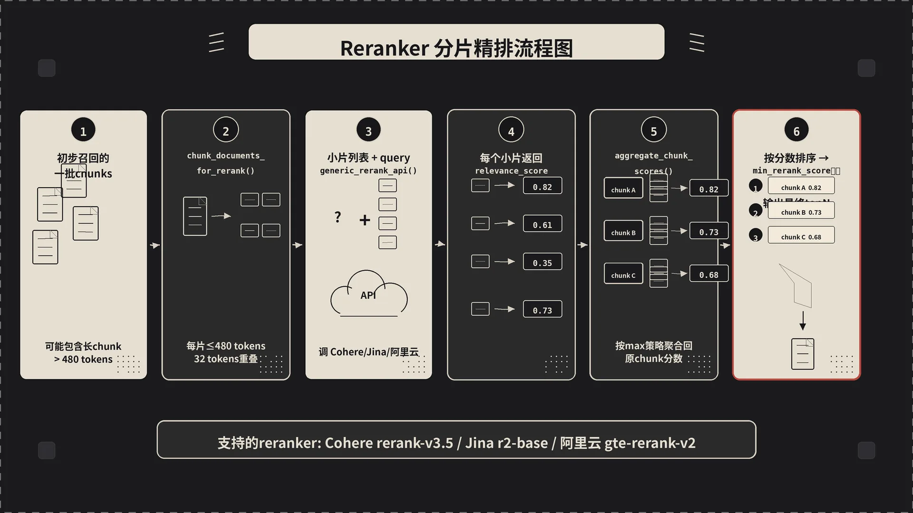

第三篇里我们把双层级检索的骨架走了一遍——关键词怎么拆成 hl / ll、按 mode 怎么分发到 local 或 global、怎么 round-robin 合并。骨架清楚了，今天补几个让它在生产环境里跑得动的工程细节。

具体讲四件事：

- 三路 embedding 一次性 batch 发出去的小优化为啥能省几百毫秒
- KG 路径捞 chunk 时 VECTOR / WEIGHT 两种策略到底怎么选
- `related_chunk_number` 这个不起眼的参数为啥要调
- Reranker 内部把长文档切片打分再聚合的那套机制

源码全在 `/home/sanyinchen/Downloads/LightRAG/lightrag/`。


## 一、三路 embedding 凭什么并成一次请求

我们在第三篇说过，`_perform_kg_search`（`operate.py:3573`）会按 mode 分发去 local / global。但在分发之前，有一段藏在中间的小逻辑——`operate.py:3621-3655` 这 35 行：

```python
mode = query_param.mode
need_ll = mode in ("local", "hybrid", "mix") and bool(ll_keywords)
need_hl = mode in ("global", "hybrid", "mix") and bool(hl_keywords)

if actual_embedding_func:
    texts_to_embed: list[str] = []
    text_purposes: list[str] = []

    if query and (kg_chunk_pick_method == "VECTOR" or chunks_vdb):
        texts_to_embed.append(query);     text_purposes.append("query")
    if need_ll:
        texts_to_embed.append(ll_keywords); text_purposes.append("ll")
    if need_hl:
        texts_to_embed.append(hl_keywords); text_purposes.append("hl")

    if texts_to_embed:
        all_embeddings = await actual_embedding_func(
            texts_to_embed, context="query", _priority=5
        )
        for i, purpose in enumerate(text_purposes):
            if purpose == "query":   query_embedding = all_embeddings[i]
            elif purpose == "ll":    ll_embedding   = all_embeddings[i]
            elif purpose == "hl":    hl_embedding   = all_embeddings[i]
```

这段干的事很简单：把这次查询里"待会儿要用的所有 embedding"先攒成一个数组，一次 API 请求拿回来。

为啥这是个值得专门讲的优化？因为如果不这样做，代码自然的写法是：

- 走到 `_get_node_data` 里，调一次 embedding 算 ll_keywords 的向量
- 走到 `_get_edge_data` 里，再调一次 embedding 算 hl_keywords 的向量
- 走到 chunk vector pick 那里，再调一次 embedding 算 query 的向量

三次串行调用。OpenAI / Cohere / 任何托管 embedding API 在国内调用，单次 round-trip 也得 150-300ms，三次就是 0.5-1 秒。**单次请求传数组**的接口设计就是为这种场景准备的——服务端拿到三段文本，并发计算，一次返回。同样的工作量，延迟接近三分之一。


还有几个细节值得拎出来：

- **按 mode 智能跳过**。`need_ll` 和 `need_hl` 这两个标志位让 local 模式不会白算 hl 的 embedding。看似省一次调用，但放到千万级 QPS 的线上，累计省的成本可观。
- **`_priority=5`**。LightRAG 的 LLM/embedding 调度器是带优先级的（高优先级抢先调度），查询路径标 5，索引路径默认 1。这意味着在同一个 LightRAG 实例同时跑索引和查询时，查询请求会优先穿过队列——线上的可用性体验直接好一截。
- **失败有 fallback**（`operate.py:3654`）：批量预计算失败时只 log 一条 warning，让下游各自走自己的 embedding 调用。不让一个优化把主流程拖死，这是工程上的修养。

预计算之后，`ll_embedding` / `hl_embedding` / `query_embedding` 这三个变量被透传到后面的 `_get_node_data` / `_get_edge_data` / `_get_vector_context`——它们拿到非空 embedding 就直接用，不再重复算。

## 二、KG 路径捞 chunk：VECTOR 还是 WEIGHT

第三篇我们说过 local 走实体路径、global 走关系路径，但有件事当时一笔带过——**实体找到了，相关的原文 chunk 怎么捞**？这一步藏着 LightRAG 一个挺关键的策略选择。

入口是 `_find_related_text_unit_from_entities`（`operate.py:4475`，local 用）和 `_find_related_text_unit_from_relations`（`operate.py:4726`，global 用）。两边逻辑镜像对称，下面以 local 这一支为例。

每个实体在图里都带一个 `source_id` 字段，记录的是"这个实体在索引阶段出现在哪些 chunk 里"。比如 "Scrooge" 这个实体可能出现在 32 个 chunk 里。但 32 个全塞给 LLM 显然太多——top 实体加起来几百个 chunk，token 预算秒爆。所以必须挑。

LightRAG 给了两种挑法（`operate.py:4517`）：

```python
kg_chunk_pick_method = text_chunks_db.global_config.get(
    "kg_chunk_pick_method", DEFAULT_KG_CHUNK_PICK_METHOD  # "VECTOR"
)
```


**VECTOR（默认）**：把用户 query 的 embedding 跟"实体出现过的 chunks 的 embedding"算 cosine，按相似度排序选 top。

这个策略的好处是显而易见的——你问 "Scrooge 的转变" 时，召回的 32 个 Scrooge 相关 chunk 里，"Scrooge 大半夜冷得发抖被鬼吓到" 这种描述外观的 chunk 会被打低分，而 "Scrooge 第二天醒来抱着账本笑" 这种讲转变的会被打高分。**chunk 选择是 query-aware 的**，跟用户真正想要的内容对齐。

**WEIGHT**：不用 query embedding，纯粹按图结构打分——一个 chunk 提到的实体越多、出现频次越高，分数越高。

这套策略的核心思想是 "chunk 跟 top 实体的重合度越高，越值得保留"。它的好处是不依赖 query embedding，速度快、稳定。坏处是同一组 top 实体对所有 query 返回同样的 chunk，缺少针对性。

实际用哪个？看场景：

- **开了 Reranker 的话**：用 VECTOR，因为 Reranker 会在后面做更精细的 query-doc 相关性排序，前面 VECTOR 召回 query-aware 的 chunk 给 Reranker 用更顺。
- **没开 Reranker 的话**：源码注释里直接写了（`operate.py:4596`），"当 reranking 关闭时，WEIGHT 给 LLM 更纯粹的 KG 相关 chunk"。这个判断挺反直觉——但合理，因为没有 Reranker 二次精排时，VECTOR 召回里"看起来像 query"的 chunk 不一定真的相关，反而 WEIGHT 召回的"实体浓度高"的 chunk 信息密度更高。

更妙的是这层有 **自动 fallback**：VECTOR 路径失败时（缺 embedding_func、`pick_by_vector_similarity` 抛错、或者算出来一片空），代码会自动降级到 WEIGHT（`operate.py:4565`/`4579`/`4592`）：

```python
if kg_chunk_pick_method == "VECTOR" and query and chunks_vdb:
    ...
    try:
        selected_chunk_ids = await pick_by_vector_similarity(...)
        if selected_chunk_ids == []:
            kg_chunk_pick_method = "WEIGHT"
            logger.warning("No entity-related chunks selected by vector similarity, falling back to WEIGHT method")
    except Exception as e:
        logger.error(f"Error in vector similarity sorting: {e}, falling back to WEIGHT method")
        kg_chunk_pick_method = "WEIGHT"

if kg_chunk_pick_method == "WEIGHT":
    selected_chunk_ids = pick_by_weighted_polling(...)
```

降级而不是抛错——这就是"工程代码的修养"。线上一个偶发的 embedding 调用失败，不应该让整个查询挂掉。

## 三、`related_chunk_number`：一个没人调但很重要的参数

`constants.py:53` 默认 `DEFAULT_RELATED_CHUNK_NUMBER = 5`。这个参数控制的是：**KG 路径每条 entity / relation 最多拽多少个相关 chunk**。

为啥要限制？因为有些核心实体的 `source_id` 列表是真的长。我之前测过一份技术文档语料，"API" 这个实体出现在 200 多个 chunk 里。如果不限制，光这一个实体就能把上下文预算榨干，剩下 39 个 top 实体的 chunk 一个也进不来。

5 这个默认值是个挺保守的设定。我自己的调参经验：

- **文档密集、实体复用率高**（技术手册、API 文档）：保持 5 甚至下调到 3。同一个概念在多个 chunk 里被反复定义，召回 3-5 个最重要的就够。
- **文档稀疏、实体出现少**（小说、新闻、案例集）：调到 8-10。每个实体的 chunk 池本来就小，限太严反而召不回来。
- **开了 Reranker**：可以再放大一点（10-15），Reranker 会把不相关的过滤掉。

注意这个值跟 `chunk_top_k`（QueryParam 里的字段，默认 20）是两层不同的"漏斗"。`related_chunk_number` 限的是"每个实体最多拉多少 chunk"，`chunk_top_k` 限的是"Reranker 之后最终保留多少 chunk"。所以你要算的实际 token 占用大致是：

> 实际 chunk 数 ≤ min(top_k 实体数 × related_chunk_number, chunk_top_k)

调这俩参数前，先用 `QueryParam(only_need_context=True)` 看看现在到底召回了多少 chunk，再决定加多减少。


## 四、Reranker 内部：长文档怎么分片打分

第三篇提过 LightRAG 在 `process_chunks_unified`（`utils.py:2772`）里调 Reranker。但 Reranker 这一层内部还有一个非常容易被忽略的细节——**长文档的分片处理**。

Reranker 模型一般是 cross-encoder 架构，把 query 和 doc 拼在一起喂进 BERT 类模型，输入长度通常卡 512 token。LightRAG 里很多 chunk 是 1200 token 的，直接喂进去会被截断，截断的部分等于在打分时被忽略，可能本来高度相关的内容因为在 chunk 后半段而被低估。

`rerank.py:22` 的 `chunk_documents_for_rerank` 就是干这事的：

```python
def chunk_documents_for_rerank(
    documents: List[str],
    max_tokens: int = 480,
    overlap_tokens: int = 32,
    tokenizer_model: str = "gpt-4o-mini",
) -> Tuple[List[str], List[int]]:
    ...
    for idx, doc in enumerate(documents):
        tokens = tokenizer.encode(doc)
        if len(tokens) <= max_tokens:
            chunked_docs.append(doc); doc_indices.append(idx)
        else:
            start = 0
            while start < len(tokens):
                end = min(start + max_tokens, len(tokens))
                chunk_tokens = tokens[start:end]
                chunk_text = tokenizer.decode(chunk_tokens)
                chunked_docs.append(chunk_text); doc_indices.append(idx)
                if end >= len(tokens):
                    break
                start = end - overlap_tokens
    return chunked_docs, doc_indices
```

逻辑很清晰：每个长 chunk 按 480 token 切（留 32 token 给 query + 特殊符号），相邻切片重叠 32 token 保证语义连续。重要的是返回值——除了切片后的文档列表，还有一个 `doc_indices`：每个切片对应原始哪个 chunk。

为啥要这个映射？因为切片是为了打分，但**最终用户看到的还是原始 chunk**。Reranker 打完分之后，得把多个切片的分数合并回每个原始 chunk 上。这就轮到 `aggregate_chunk_scores`（`rerank.py:116`）登场：

```python
def aggregate_chunk_scores(
    chunk_results, doc_indices, num_original_docs,
    aggregation: str = "max",
):
    doc_scores: Dict[int, List[float]] = {i: [] for i in range(num_original_docs)}

    for result in chunk_results:
        chunk_idx = result["index"]; score = result["relevance_score"]
        if 0 <= chunk_idx < len(doc_indices):
            original_doc_idx = doc_indices[chunk_idx]
            doc_scores[original_doc_idx].append(score)

    aggregated_results = []
    for doc_idx, scores in doc_scores.items():
        if not scores:
            continue
        if aggregation == "max":     final_score = max(scores)
        elif aggregation == "mean":  final_score = sum(scores) / len(scores)
        elif aggregation == "first": final_score = scores[0]
        else: final_score = max(scores)
        aggregated_results.append({"index": doc_idx, "relevance_score": final_score})

    aggregated_results.sort(key=lambda x: x["relevance_score"], reverse=True)
    return aggregated_results
```

三种聚合策略，每种背后的假设都不一样：


- **max（默认）**：原始 chunk 的最终分 = 它所有切片里**最高的那个分**。背后的假设是"只要这个 chunk 里有任何一段跟 query 高度相关，整个 chunk 就应该被认为相关"。适合长文档里"答案藏在某一段"的场景。
- **mean**：所有切片分数取平均。假设"整个 chunk 平均相关性更重要"。适合 chunk 内容主题统一、不希望被局部高分误导的场景（比如想避免长 chunk 因为偶然有一段相关就被全文召回）。
- **first**：只看第一段的分。隐含假设"chunk 开头最重要"。RAG 场景下用得少，更多是处理新闻 lead-paragraph 那种结构化文本。

我自己测下来 90% 场景 max 就够用。要做严肃的对比实验，可以三个都跑一遍看在你的语料上哪个更稳。


## 五、`generic_rerank_api`：用一份代码接三种 Reranker

LightRAG 的 Reranker 接入抽象做得很取巧。它没有为 Jina / Cohere / 阿里云每家写一个 client，而是写了一个 `generic_rerank_api`（`rerank.py:182`），把这三家收敛到同一个函数：

```python
async def generic_rerank_api(
    query, documents, model, base_url, api_key,
    top_n=None, return_documents=None,
    extra_body=None,
    response_format: str = "standard",   # "standard" (Jina/Cohere) or "aliyun"
    request_format: str = "standard",
    enable_chunking: bool = False,
    max_tokens_per_doc: int = 480,
):
    ...
    if request_format == "aliyun":
        # 阿里云那一套：嵌套的 input / parameters 结构
        payload = {
            "model": model,
            "input": {"query": query, "documents": documents},
            "parameters": {},
        }
        if top_n is not None: payload["parameters"]["top_n"] = top_n
        ...
    else:
        # Jina / Cohere / 自部署的 OpenAI 兼容服务
        payload = {"model": model, "query": query, "documents": documents}
        if top_n is not None: payload["top_n"] = top_n
        ...
```

`request_format` / `response_format` 这两个字段把 API 的差异给抽象掉了。Jina 和 Cohere 用扁平的 `{query, documents, top_n}`，阿里云非要套一层 `input / parameters`，那就用 if 分两条路。

`cohere_rerank`（`rerank.py:368`）和 `jina_rerank`（`rerank.py:435`）只是 `generic_rerank_api` 的薄包装——调一次它，传不同的 `base_url` 和 `request_format`。你要接其它 Reranker 服务（比如自己用 vLLM 部署的 `BAAI/bge-reranker-v2-m3`），照着写一个调用 `generic_rerank_api` 的小函数就行。

另外注意第二行 `enable_chunking` 这个开关——它在 API 这一层把上面讲的"长文档分片"功能默认关掉了。LightRAG 默认调用时是关的（避免对那些"只接受短文档"的 Reranker API 多调几次），需要时显式开。如果你的 chunk 都比较长（> 512 token），强烈建议把这个开关打开 + `max_tokens_per_doc=480` 一起用，Reranker 的精度会有可见的提升。

retry 也写得很标准：`@retry(stop_after_attempt(3), wait_exponential(...))`，遇到 `ClientError` 自动重试，指数退避，对 Reranker 服务偶发抖动很友好。

## 六、几条结论

- **三路 embedding 批量预计算**这种细节，在论文里你绝不会看到，但它每次查询省的几百毫秒对线上体验是肉眼可见的。
- **VECTOR vs WEIGHT** 不是哪个更好的问题，是和 Reranker 搭配着看的。开 Reranker 用 VECTOR，没开用 WEIGHT；都失败了自动降级，写代码的人在防御性思维上下了功夫。
- **`related_chunk_number=5`** 是个保守默认，按你的语料密度调，配合 `only_need_context` 一起调，比改 prompt 见效快得多。
- **Reranker 的长文档分片**不是 LightRAG 发明的（Cohere/Jina 自己也有切片策略），但 LightRAG 把切片 + 聚合做成了可控的客户端逻辑，让你能选 max / mean / first，对要做对比实验的团队特别友好。

整套查询管线里还有一层我们没拆——动态 token 预算的具体计算公式，以及 entities/relations/chunks 三者怎么在 token 紧张时被截断。这部分留到下一篇讲完整查询管线时一起说，那里能看到这些组件怎么在端到端时序里咬合起来。

---

*上一篇：[三层存储架构——KV、向量、图数据库如何协同](/posts/lightrag-5-storage/)*

*下一篇：[查询管线全景——从用户提问到最终回答的完整链路](/posts/lightrag-7-pipeline/)*


---

本文由 AgentPlanFlow 生成
