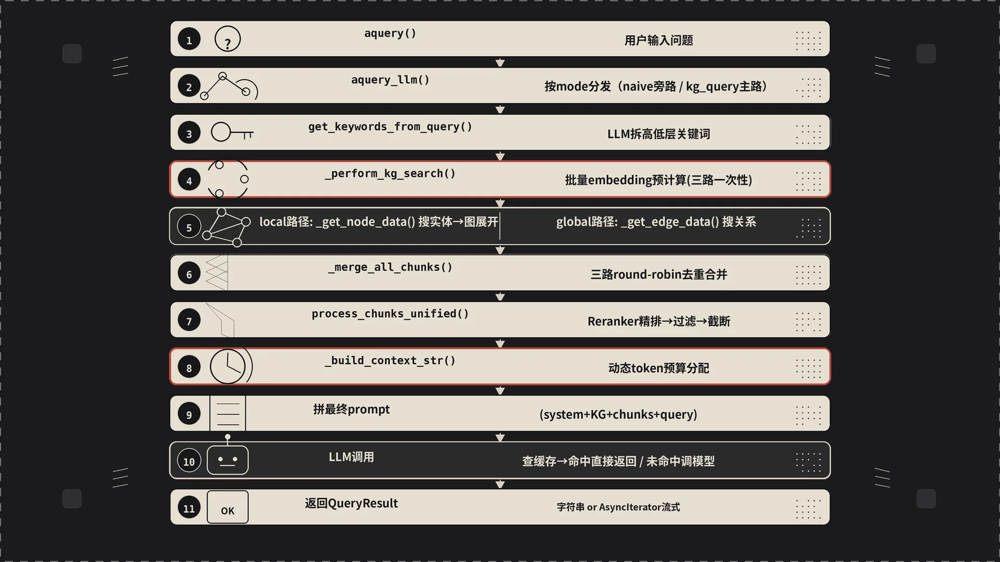

前面几篇（模式、索引、检索）都是从某个角度切进去看。这一篇把它们串起来——一条完整链路，从你敲下 `rag.aquery("xxx")` 到屏幕上吐出回答，中间到底跑了什么、数据怎么流转、哪些环节能插手调参。

我们不堆架构图、不讲道理，就跟着源码走一遍。




## 一、入口分两条路，但最终汇到同一条管线

先看调用关系。`aquery` 本身（`lightrag.py:2622`）只是一个兼容包装，它内部调 `aquery_llm`，然后从返回的字典里把 `llm_response` 剥出来。所以真正的入口是 `aquery_llm`（`lightrag.py:2884`）。

`aquery_llm` 按 mode 分发，`naive` 和 `bypass` 是旁路（第 3 篇讲过），正文路径只有 `kg_query`（`operate.py:3164`）。下面只走这一条。


## 二、从 query 到关键词：LLM 帮你"拆题"

`kg_query` 进来先调 `get_keywords_from_query` 拆 hl/ll 关键词（带缓存，第 3 篇 2.1 节和第 6 篇详细拆过）。hl 走 global，ll 走 local。

抽完关键词之后还有一个兜底：如果两组都为空、且 query 本身少于 50 个字符，就把 query 原样塞进 ll_keywords；否则直接返回失败。这是防止短问题连 LLM 都拆不出来的情况。

## 三、四阶段管线：Search → Truncate → Merge → Build

关键词到手，进入 `_build_query_context`（`operate.py:4239`）。源码注释写得明白：四个阶段。

### 3.1 Stage 1 — 搜索：_perform_kg_search

`_perform_kg_search`（`operate.py:3573`）按 mode 分发到 local / global / hybrid / mix，最后 round-robin 合并出 `{final_entities, final_relations, vector_chunks, chunk_tracking, query_embedding}` 这套裸数据。这一阶段第 3 篇和第 6 篇都拆过，这里不展开。

### 3.2 Stage 2 — 截断：_apply_token_truncation

搜出来的实体和关系可能很多，全塞进 prompt 里撑爆 token 上限。所以第二阶段用 `_apply_token_truncation`（`operate.py:3783`）做第一轮截断。

做法很朴素：把搜出来的实体/关系序列化成一坨 JSON，扔给 tokenizer 算 token 数，超过 `max_entity_tokens` / `max_relation_tokens` 就尾部截断。截断时会把 `file_path` 和 `created_at` 字段拿掉再算 token（这两个字段进 LLM 没意义），截完再拼回去。

截断后输出的 `entities_context` 和 `relations_context` 是精简版的一行一个 JSON，只保留 `entity/type/description` 或 `entity1/entity2/description`。

### 3.3 Stage 3 — 合并chunk：_merge_all_chunks

`_merge_all_chunks`（`operate.py:3954`）的任务是把三个来源的文本片段——向量检索来的 vector_chunks、从实体关联找来的 entity_chunks、从关系关联找来的 relation_chunks——合并成一个列表。

合并策略还是 round-robin：先取 vector，再取 entity，再取 relation，循环。同一个 chunk_id 只保留第一次出现的，后面重复的丢掉。

entity_chunks 和 relation_chunks 的获取通过 `_find_related_text_unit_from_entities` 和 `_find_related_text_unit_from_relations`，相当于"从实体/关系反查原文"。这个反查逻辑往前翻第四篇索引流程就能对上——实体和关系在入库时都记了 `source_id` 指向原文 chunk。

### 3.4 Stage 4 — 构建上下文：_build_context_str

`_build_context_str`（`operate.py:4056`）是整条管线里算账最细的一步。它的核心逻辑是一个**动态 token 预算分配**：

1. 先算系统 prompt 模板（不填 context）需要多少 token
2. 再算实体+关系构成的 KG context 模板需要多少 token
3. 再算用户 query 自己的 token
4. 留 200 token 的 buffer（给 reference list 和各种开销）
5. 剩余的全部给 text chunks——这就是 `available_chunk_tokens`

```
available_chunk_tokens = max_total_tokens
  - sys_prompt_tokens
  - kg_context_tokens
  - query_tokens
  - 200(buffer)
```

然后拿这个动态算出来的限额去调 `process_chunks_unified`，做第二轮 chunk 截断。截完的 chunk 再统一生成 reference id（`[1]`、`[2]` 这类引用标记），最后拼成完整的 `context_data` 字符串。

这个四阶段走完，`_build_query_context` 返回一个 `QueryContextResult`，里面有两个东西：`context`（纯文本上下文）和 `raw_data`（结构化数据，方便 API 返回）。


## 四、QueryParam 里值得单独拎出来的旋钮

整套 `QueryParam` 字段（`base.py:85`）的完整解释见第 3 篇——`mode` / `top_k` / `chunk_top_k` / `enable_rerank` / `stream` / `only_need_context` / `hl_keywords` / `ll_keywords` / `conversation_history` / `model_func` 这些这里不重复。

这一节只展开一个前面没讲透的东西：**三个 token 预算字段的联动**。

| 字段 | 默认值 |
|------|--------|
| `max_entity_tokens` | 4000 |
| `max_relation_tokens` | 4000 |
| `max_total_tokens` | 8000 |

很多人第一次配这三个会以为是"三个独立的上限"，然后发现怎么调都不对。其实它们是 **两阶段截断的联动结构**：

- `max_entity_tokens` / `max_relation_tokens` 是 **Stage 2** 的硬上限——实体表和关系表分别截断到这个 token 数，独立生效。
- `max_total_tokens` 是 **Stage 4** 的总预算——下一节会讲的动态公式里，它是分子，被减掉的是 sys prompt / KG context / query / buffer 200，剩下的才给 chunks。

所以当你发现 chunks 永远只能进来一两个的时候，先看 `max_total_tokens` 是不是太小、或者 `max_entity_tokens + max_relation_tokens` 占的份额是不是太大。三个一起调才有意义。

## 五、only_need_context 与 only_need_prompt

`only_need_context=True` 拿检索结果不调 LLM，`only_need_prompt=True` 拿到拼好的完整 prompt——两个开关的用法和调试套路第 3 篇已经讲过，源码出口在 `operate.py:3256`。

## 六、缓存：第二个 query 几乎不花钱

LightRAG 的缓存设计有两层，而且两层之间的 hash 计算维度是递进的——关键词缓存维度少、命中率高；回答缓存维度多、精确匹配。

**第一层：关键词缓存。** `extract_keywords_only` 里，先 `compute_args_hash(mode, text, language)`，拿 hash 去 `hashing_kv` 里查。命中就直接返回 hl/ll 关键词，省一次 LLM 调用。未命中才调 LLM 拆题，然后把结果存回 cache（`cache_type="keywords"`）。关键词缓存的粒度很粗糙——同一个问题、同一个模式、同一种语言，换其他任何参数都不影响关键词，所以命中率相当高。

**第二层：回答缓存。** `kg_query` 里（`operate.py:3290`），算一个更大的 hash——包含了 `mode`、`query`、`response_type`、`top_k`、`chunk_top_k`、`max_entity_tokens`、`max_relation_tokens`、`max_total_tokens`、`hl_keywords`、`ll_keywords`、`user_prompt`、`enable_rerank` 所有可能影响最终回答的参数。命中就直接跳过 LLM 调用，把之前存好的回答字符串返回。

缓存的 key 格式是扁平的：`{mode}:{cache_type}:{hash}`。存在你配置的 KV 存储里（默认是本地 JSON 文件，也可以接 Redis 等）。用 `enable_llm_cache` 环境变量控制开关。

注意流式响应的内容**不进缓存**——`save_to_cache` 里检测到内容是 async iterator 就直接跳过。这很合理，流式数据没法原样缓存。


## 七、stream 模式：AsyncIterator 的链路

`stream=True` 时的数据流跟普通模式不同。在 `kg_query` 末尾（`operate.py:3365`）：

```python
# 非流式（字符串）
return QueryResult(content=response, raw_data=context_result.raw_data)

# 流式（AsyncIterator）
return QueryResult(
    response_iterator=response,
    raw_data=context_result.raw_data,
    is_streaming=True,
)
```

流式模式下，`content` 字段是 `None`，`response_iterator` 是一个 `AsyncIterator[str]`。上层 `aquery`（兼容包装）会判断 `is_streaming`，按类型返回：字符串就返回字符串，iterator 就透传 iterator。

到 `aquery_llm` 层，返回的 raw_data 里会嵌一个 `llm_response` 字段标明它是流式的还是非流式的，方便 API 层做 SSE 输出。


## 八、conversation_history：缝合多轮对话

`conversation_history` 的用法简单但有两个常见的理解误区。第一个误区是以为它会参与检索——不会。检索阶段完全不管你之前的对话历史，只根据当前 query 拆关键词、搜图。第二个误区是以为传了历史就能让模型"记住一切"——也不会，它只是把历史作为多一条上下文喂给 LLM。

源码里（`operate.py:3319`）历史消息只在调 LLM 时传进去：

```python
response = await use_model_func(
    user_query,
    system_prompt=sys_prompt,
    history_messages=query_param.conversation_history,
    enable_cot=True,
    stream=query_param.stream,
)
```

所以如果你想实现真正的多轮对话，就得自己维护一个列表 `[{"role":"user","content":"..."},{"role":"assistant","content":"..."}]`，每轮 append 完塞进 `conversation_history`。模型会基于历史生成连贯回答，但每次查询的检索结果都是新鲜的——这既是限制（没法让历史影响召回），也是优点（不会因为对话偏离导致检索越来越歪）。实际使用中建议控制历史长度，太长会把上下文窗口挤满，挤占检索内容的空间。

## 九、完整链路回顾（11步）

把每一步的入口函数列出来就是：

1. `aquery` (lightrag.py:2622) → 兼容包装
2. `aquery_llm` (lightrag.py:2884) → 真正的查询入口，按 mode 分发
3. `kg_query` (operate.py:3164) → 图谱查询核心
4. `get_keywords_from_query` (operate.py:3374) → 拆题抽关键词（带缓存）
5. `_build_query_context` (operate.py:4239) → 四阶段管线总调度
6. `_perform_kg_search` (operate.py:3573) → Stage 1：搜索实体/关系/chunk
7. `_apply_token_truncation` (operate.py:3783) → Stage 2：第一轮 token 截断
8. `_merge_all_chunks` (operate.py:3954) → Stage 3：多源 chunk 合并去重
9. `_build_context_str` (operate.py:4056) → Stage 4：动态 token 预算 + 拼上下文
10. `handle_cache` / LLM 调用 → 缓存命中直接返回；未命中调 LLM
11. 返回 `QueryResult` → 根据 stream 标志分路返回字符串或 AsyncIterator

走完这 11 步，一个用户问题就变成了屏幕上那段回答。

下一篇聊生产环境——部署、存储、并发，那些真正让人头疼的事。

---
*上一篇：[双层级检索原理——高低层关键词与 Reranker]()*

*下一篇：[生产环境部署与最佳实践]()


---

本文由 AgentPlanFlow 生成
