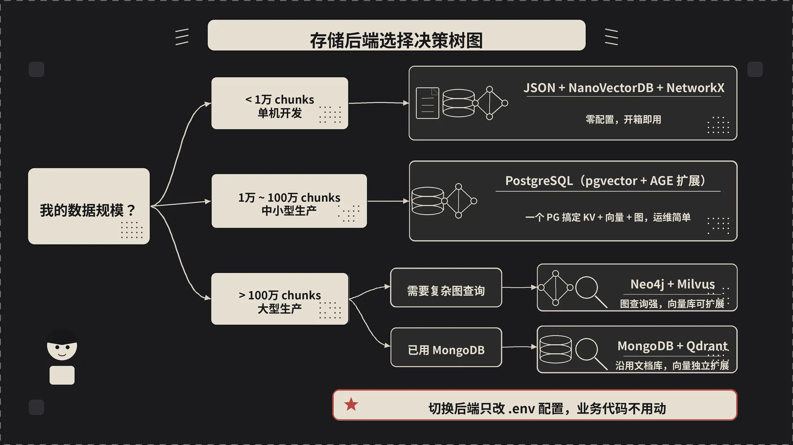

     1|---
     2|title: LightRAG：生产环境部署与最佳实践（八）
     3|author: sanyinchen
     4|date: 2026-05-19
     5|categories: [AI, RAG]
     6|tags: [LightRAG, RAG, 部署, 生产环境, Docker, 性能优化]
     7|render_with_liquid: false
     8|toc: true
     9|---
    10|
    11|走到第八篇了。前面七篇我们把 LightRAG 从原理到管线、从检索到索引、从存储到全链路都拆透了。这一篇换个角度——你现在要在公司里真把它跑起来，给真实业务用。
    12|
    13|笔记本上 `pip install` + 跑 demo 是一回事，生产上线又是另一回事。这一篇就讲讲两者之间那道沟里都藏着什么。
    14|
    15|## 一、笔记本跑得好好的，为什么上线就跪了
    16|
    17|我帮三个团队上过 LightRAG，跪的姿势惊人地一致：
    18|
    19|- **第一周**：本地 JSON 后端跑得飞起，效果很惊艳。
    20|- **第二周**：放到测试环境，灌进真实业务数据（几十万文档），开始 OOM、API 限流、索引跑半天没动静。
    21|- **第三周**：手忙脚乱换 PostgreSQL、调 max_async、加 reranker、套 nginx、配监控……
    22|- **第四周**：终于稳了，发现一开始就该按生产标准设计。
    23|
    24|省事的做法是反过来：**一开始就按生产假设搭**，再回到笔记本上简化。下面按部署、存储、模型、性能、可观测、安全六块讲。
    25|
    26|## 二、部署方式怎么选
    27|
    28|LightRAG 仓库提供了三种部署方式，从轻到重：
    29|
    30|**1. pip 直接装（Server 模式）**
    31|
    32|```bash
    33|pip install "lightrag-hku[api]"
    34|# 配置 .env
    35|lightrag-server
    36|```
    37|
    38|适合：个人项目、内部小工具、单机 PoC。Gunicorn + Uvicorn 多 worker，能扛住几百 QPS 的查询。但所有东西都在一台机器上，存储扩展性差。
    39|
    40|**2. Docker Compose（推荐）**
    41|
    42|仓库根目录有两个 compose 文件：
    43|
    44|- `docker-compose.yml`：单服务，只起 LightRAG，存储用本地卷。
    45|- `docker-compose-full.yml`：全套，把 PostgreSQL（pgvector）、Neo4j、Milvus、vLLM（embedding + reranker）都拉起来。这份配置里 LightRAG 已经按服务名连各个后端（`POSTGRES_HOST: postgres`、`NEO4J_URI: neo4j://neo4j:7687`、`MILVUS_URI: http://milvus:19530`），改改密码就能跑。
    46|
    47|`make base && make storage` 是仓库提供的交互式 setup wizard，会按你的选择生成 `docker-compose.final.yml`，比手撸 yaml 友好得多。详见 `docs/InteractiveSetup.md`。
    48|
    49|**3. Kubernetes（Helm Chart）**
    50|
    51|`k8s-deploy/` 下提供了 Helm chart 和一键脚本：
    52|
    53|```bash
    54|# 轻量部署（用内置存储，测试用）
    55|bash ./install_lightrag_dev.sh
    56|
    57|# 生产部署（外接 Postgres + Neo4j）
    58|bash ./install_lightrag.sh
    59|```
    60|
    61|适合：已经在 K8s 上的团队、需要多副本和滚动升级。Helm values 里把所有 env 都暴露出来了，按 `k8s-deploy/lightrag/values.yaml` 改。
    62|
    63|**4. 离线部署**
    64|
    65|如果你的服务器没有公网（金融、政府、内网客户），`docs/OfflineDeployment.md` 详细讲了怎么打离线包。核心思路是：
    66|
    67|```bash
    68|# 在联网环境
    69|pip install lightrag-hku[offline]
    70|lightrag-download-cache              # 把 tiktoken 模型下载到本地
    71|pip download lightrag-hku[offline] -d ./offline-packages
    72|# 打 tar 包带过去，在离线环境 pip install --no-index --find-links= 装上
    73|```
    74|
    75|注意 LightRAG 用 `pipmaster` 做动态依赖安装（用到哪个存储后端就装哪个），离线必须提前把所有可能用到的包都下好，否则跑起来会突然报缺包。
    76|
    77|
    78|

## 三、存储后端选择——最重要的决策
    80|
    81|三档规模（JSON / PostgreSQL 一把梭 / Neo4j+Milvus 分层）的取舍第 5 篇已经摊开讲过。这里只补一种生产里非常常用的**混搭组合**：
    82|
    83|```
    84|LIGHTRAG_KV_STORAGE=MongoKVStorage
    85|LIGHTRAG_VECTOR_STORAGE=MilvusVectorDBStorage
    86|LIGHTRAG_GRAPH_STORAGE=Neo4JStorage
    87|LIGHTRAG_DOC_STATUS_STORAGE=MongoDocStatusStorage
    88|```
    89|
    90|KV / 状态走 MongoDB（文档型存储 + 现成的 schema 灵活性），向量走 Milvus（专业活让专业的干），图走 Neo4j（Cypher 查询能力是 PG 比不上的）。三家各干各的，不互相牵制。代价是要维护三套基础设施——团队规模够、运维带得动再上。
    91|
    92|切换存储不需要改业务代码，`.env` 改完重启就行。
    93|
    94|## 四、模型选型——别在小钱上栽大跟头
    95|
    96|模型选型的基本原则（索引要 32B+、查询可以更强、embedding 选定不要换、reranker 别省）第 2 篇已经讲过。这里只补一份生产视角的 **TCO 对比**——一年下来真正花多少钱。
    97|
    98|
    99|假设一份**百万级 chunks 的语料**，第一次索引 + 每天 10 万次查询的规模：
   100|
   101|| 方案 | 索引一次 | 月度查询 | 一年总成本 | 备注 |
   102||------|----------|----------|------------|------|
   103|| 全 OpenAI（gpt-4o-mini 索引 + gpt-4o 查询）| ~$500 | ~$3000 | **~$36500** | 起步快但长期烧钱 |
   104|| DeepSeek-V3 索引 + Claude 3.5 Sonnet 查询 | ~$200 | ~$1500 | **~$18200** | 性价比甜点 |
   105|| Qwen2.5-72B 本地 vLLM 全包 | $0 + 2 张 A100 折旧 | 0 | **~$15000**（GPU 摊销）| 量越大越划算 |
   106|| DeepSeek-V3 全包 | ~$200 | ~$600 | **~$7400** | 内容质量要求不极致就选它 |
   107|
   108|几个真实经验值得留意：
   109|
   110|- **DeepSeek-V3 的 input cache 命中率会让长期成本再降一半**。LightRAG 的 prompt 模板是固定的，prompt caching 起码省 50%。
   111|- **本地 vLLM 的隐性成本**：GPU 服务器要有人运维、电费、机房成本，小团队跑下来未必比 API 便宜。
   112|- **混合策略最稳**：索引用便宜模型（DeepSeek-V3 / Qwen），查询用强模型（Claude / GPT-4o）。`QueryParam(model_func=...)` 一行代码切换。
   113|- **Reranker 单独算账**：`bge-reranker-v2-m3` 自部署一台中端 GPU 跑得动；用 SiliconFlow / Cohere 托管的话按 query 计费，10 万次/天大约 $50/月。生产环境千万别省这个钱。
   114|
   115|## 五、性能调优——把每个旋钮拧到位
   116|
   117|`env.example` 里有几十个可调参数，绝大部分用默认就行。真正需要调的就这几个：
   118|
   119|
   120|**并发控制**
   121|
   122|```bash
   123|MAX_ASYNC=4               # 单个 chunk 抽取的 LLM 并发上限
   124|MAX_PARALLEL_INSERT=2     # 同时处理几个 doc
   125|```
   126|
   127|`MAX_ASYNC` 是 LightRAG 整个调优最关键的一个。默认 4 太保守，OpenAI/DeepSeek 这种成熟 API 调到 16 / 32 都没问题。本地 vLLM 调到 64 也行（取决于显存）。
   128|
   129|但**别盲目调大**：
   130|
   131|- 触发上游 rate limit 反而更慢
   132|- 内存压力变大（每个并发的 prompt + response 都在内存里）
   133|- 出错时调试更难（多个并发请求的 log 交叉）
   134|
   135|**chunk 参数**
   136|
   137|```bash
   138|CHUNK_SIZE=1200            # 单个 chunk 的 token 数
   139|CHUNK_OVERLAP_SIZE=100     # 相邻 chunk 重叠
   140|```
   141|
   142|中文场景这俩可以适当调大（CHUNK_SIZE=1600、CHUNK_OVERLAP=150），因为中文一个 token 信息密度比英文高、句子也更长。技术文档类语料尤其需要大 chunk。
   143|
   144|**检索参数**
   145|
   146|```bash
   147|TOP_K=40                   # local/global 各自的实体/关系召回数
   148|CHUNK_TOP_K=20             # rerank 后保留的 chunk 数
   149|RELATED_CHUNK_NUMBER=5     # 每个实体最多关联多少 chunk
   150|MAX_TOKENS=30000           # 总上下文预算
   151|COSINE_THRESHOLD=0.2       # 向量相似度过滤阈值
   152|MIN_RERANK_SCORE=0.0       # reranker 分数下限
   153|```
   154|
   155|`MAX_TOKENS` 是按你查询 LLM 的上下文来调的：GPT-4o 128K 可以开到 60K，Claude 200K 可以开到 100K。但**不一定越大越好**——多塞的 chunk 如果 reranker 没顶住，就是噪声。
   156|
   157|`MIN_RERANK_SCORE` 建议设到 0.3-0.5。砍掉低分 chunk 比堆量更有效。
   158|
   159|**缓存**
   160|
   161|```bash
   162|ENABLE_LLM_CACHE=true                  # 总开关
   163|ENABLE_LLM_CACHE_FOR_EXTRACT=true      # 索引阶段缓存
   164|```
   165|
   166|线上**这两个一定开**。索引缓存能让重建、改 prompt、换 embedding 的代价直接降到几乎为零。
   167|
   168|## 六、可观测性——出问题之前你得能看见
   169|
   170|LightRAG 自带的 log 已经不错（每个 chunk 的抽取、每条 query 的检索都打 log），但生产环境光看 log 不够。
   171|
   172|
   173|**Langfuse 接入**
   174|
   175|Langfuse 是 LLM 应用的 trace + 评估平台，开源、可自部署。每次 LLM 调用都记录耗时、token、prompt、response。LightRAG 没有内置 Langfuse 集成，但因为它的 LLM 调用都走 `llm_model_func`，自己包一层就能拦截：
   176|
   177|```python
   178|from langfuse.decorators import observe
   179|
   180|@observe()
   181|async def traced_llm(prompt, system_prompt=None, **kwargs):
   182|    return await original_llm_func(prompt, system_prompt=system_prompt, **kwargs)
   183|
   184|rag = LightRAG(llm_model_func=traced_llm, ...)
   185|```
   186|
   187|接上之后能在 Langfuse 看板看到：每个 query 走了几轮 LLM、每轮耗时多久、哪个 chunk 抽取是慢的、token 花在哪。
   188|
   189|**RAGAS 评估**
   190|
   191|RAGAS 是评估 RAG 质量的标准工具。从 faithfulness（回答忠实度）、answer_relevancy（相关性）、context_precision/recall 四个维度量化。
   192|
   193|线下定期跑评估集，能在改 prompt / 换模型 / 调参数后立刻看到是变好了还是变差了。**没评估指标盲调，是 RAG 项目最大的坑。**
   194|
   195|**日志聚合**
   196|
   197|LightRAG 输出标准 Python `logging`，对接 Loki / ELK / Datadog 都很顺。重点关注几个 log：
   198|
   199|- `Chunk N of M extracted X Ent + Y Rel`：索引进度
   200|- `Round-robin merged chunks: X -> Y`：检索去重情况
   201|- `Token allocation - Total: ... Available for chunks: ...`：动态预算分配
   202|- `Final chunks S+F/O: E5/2 R2/1 C1/1`：最终 chunk 的来源追踪（E=entity、R=relation、C=vector）
   203|
   204|最后这条 S+F/O log 是调检索质量时的金矿——能看到答案到底是被 local / global / vector 哪一路救回来的。
   205|
   206|## 七、安全配置——一份清单
   207|
   208|
   209|**1. API 鉴权（必做）**
   210|
   211|```bash
   212|# .env 二选一
   213|LIGHTRAG_API_KEY=your-secure-api-key-here
   214|
   215|# 或者多账号
   216|AUTH_ACCOUNTS='admin:admin123,user1:{bcrypt}$2b$12$...'
   217|JWT_SECRET=your-jwt-secret
   218|```
   219|
   220|API Key 走 header `X-API-Key`，账号密码走 JWT。生产环境**绝不要裸跑**（默认是无鉴权）。
   221|
   222|**2. SSL/TLS**
   223|
   224|```bash
   225|SSL=true
   226|SSL_CERTFILE=/path/to/cert.pem
   227|SSL_KEYFILE=/path/to/key.pem
   228|```
   229|
   230|或者前面套 nginx / Traefik 终结 TLS，LightRAG 跑 HTTP，更灵活。
   231|
   232|**3. Workspace 多租户隔离**
   233|
   234|```bash
   235|WORKSPACE=tenant_a   # 全局 workspace 名
   236|# 或针对单个存储
   237|POSTGRES_WORKSPACE=tenant_a
   238|```
   239|
   240|LightRAG 的 workspace 机制会给每个表 / 节点 / 向量加 workspace 前缀，做到完全的数据隔离。SaaS 模式下多租户必备。
   241|
   242|**4. PostgreSQL SSL**
   243|
   244|```bash
   245|POSTGRES_SSL_MODE=require
   246|POSTGRES_SSL_CERT=/path/to/client-cert.pem
   247|POSTGRES_SSL_KEY=/path/to/client-key.pem
   248|POSTGRES_SSL_ROOT_CERT=/path/to/ca-cert.pem
   249|```
   250|
   251|云数据库（RDS、Cloud SQL）一定开。本机 docker network 内部可以不开。
   252|
   253|**5. 速率限制**
   254|
   255|LightRAG 本身没做 rate limit。前面套 nginx / API Gateway / Cloudflare 来限。对查询接口按 IP / API Key 限流，对索引接口限并发上传。
   256|
   257|**6. 数据备份**
   258|
   259|- KV / Graph / Vector 三类存储分别按各自后端的备份方案。
   260|- 特别提示：`kv_store_llm_response_cache.json`（或 PG 里对应表）必须备份——这玩意是命根子，丢了重跑要重新花钱抽实体。
   261|
   262|## 八、生产里几个最常见的坑
   263|
   264|**1. OOM**
   265|
   266|征兆：索引大语料时进程被 OOMKilled，或者查询时突然卡死。
   267|
   268|根因 90% 是 NanoVectorDB 把整个向量库塞内存。
   269|
   270|解法：换 PostgreSQL+pgvector 或 Milvus。`docker-compose-full.yml` 直接抄。
   271|
   272|**2. API rate limit / 502**
   273|
   274|征兆：索引到一半 LLM 报 429。
   275|
   276|解法：
   277|
   278|- `MAX_ASYNC` 调小
   279|- 上一层加 retry + exponential backoff（LightRAG 自带 tenacity 重试，但默认次数有限）
   280|- 切到 DeepSeek 这种宽松的 API
   281|- 实在不行就分批 insert，每批 500 doc
   282|
   283|**3. 索引慢到怀疑人生**
   284|
   285|先看 log 确认是抽取慢还是合并慢：
   286|
   287|- 抽取慢 → `MAX_ASYNC` 调大、换更快的 LLM
   288|- 合并慢 → `summary_max_tokens` 调小、看是不是有某个实体被合并几百次（map-reduce 在递归）
   289|
   290|**4. 图谱"损坏"**
   291|
   292|征兆：查询突然返回空 / 报字段缺失。
   293|
   294|解法（按代价从低到高）：
   295|
   296|1. 先 backup 一份 `kv_store_llm_response_cache.json`
   297|2. 删 `vdb_*` 和 `graph_*`，重跑——LLM 抽取全走缓存，几分钟搞定
   298|3. 还不行就重跑 ainsert，cache 兜底
   299|
   300|**5. 中文实体抽得乱**
   301|
   302|老话题：`addon_params={"language": "Chinese"}` 加上。**没加这个参数中文场景效果腰斩，没有之一。**
   303|
## 九、写在最后

这个系列从 RAG 的局限和 LightRAG 的设计动机开始，一路拆了查询管线、索引流程、存储架构、检索细节，到今天这篇生产实践——该看的源码和该踩的坑都过了一遍。

LightRAG 是个少见的学术想法落得扎实的开源项目。论文不长，但工程上花的功夫很密：prompt 缓存对齐 OpenAI 的前缀缓存、round-robin 合并、VECTOR/WEIGHT 双策略 fallback、map-reduce 的 summary、workspace 隔离。这些都不是炫技，是被真实场景逼出来的。

希望这个系列帮你少踩几个坑。
   311|
   312|---
   313|
   314|*上一篇：[查询管线全景——从用户提问到最终回答的完整链路]()
   315|
   316|
   317|---
   318|
   319|本文由 AgentPlanFlow 生成
   320|