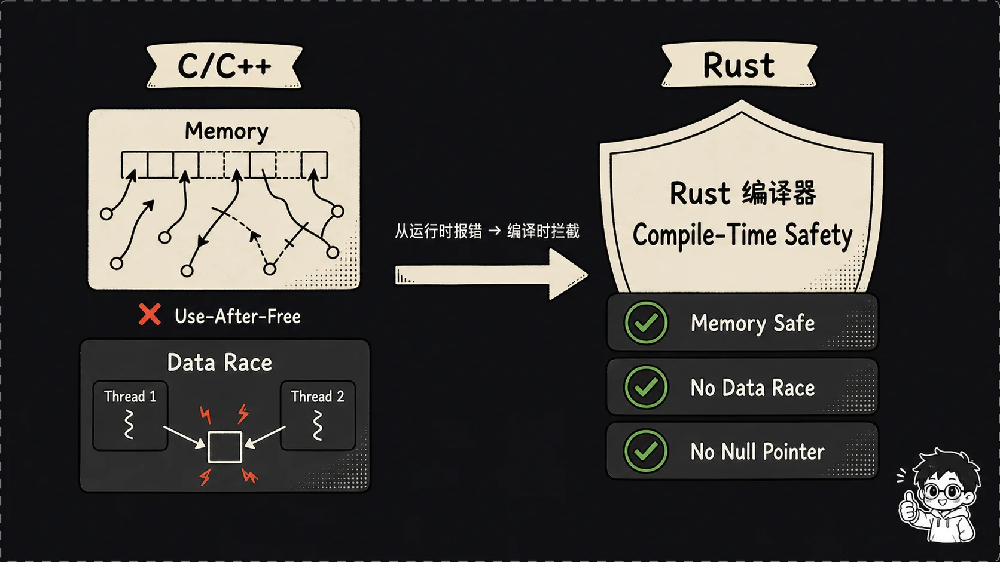
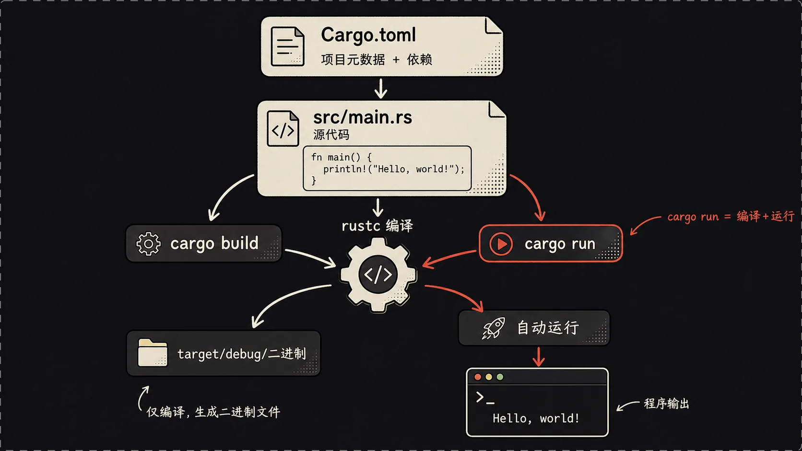
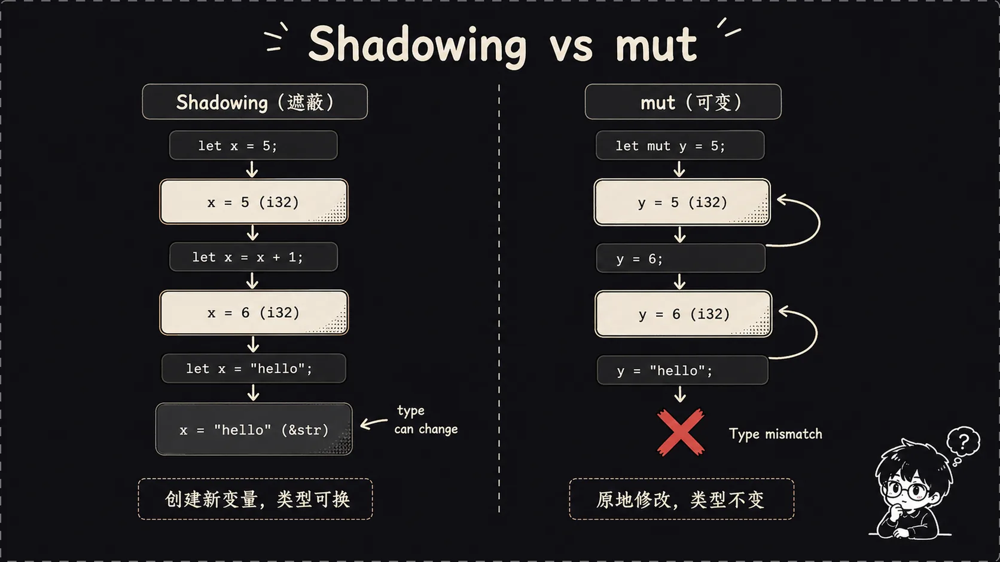
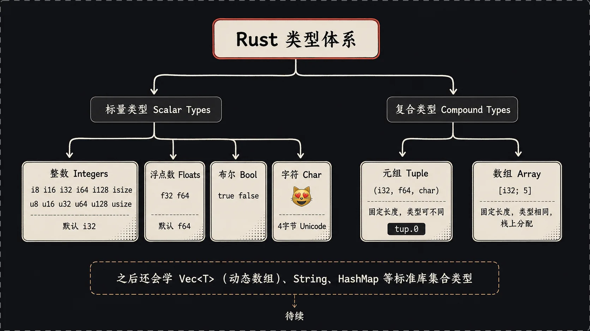
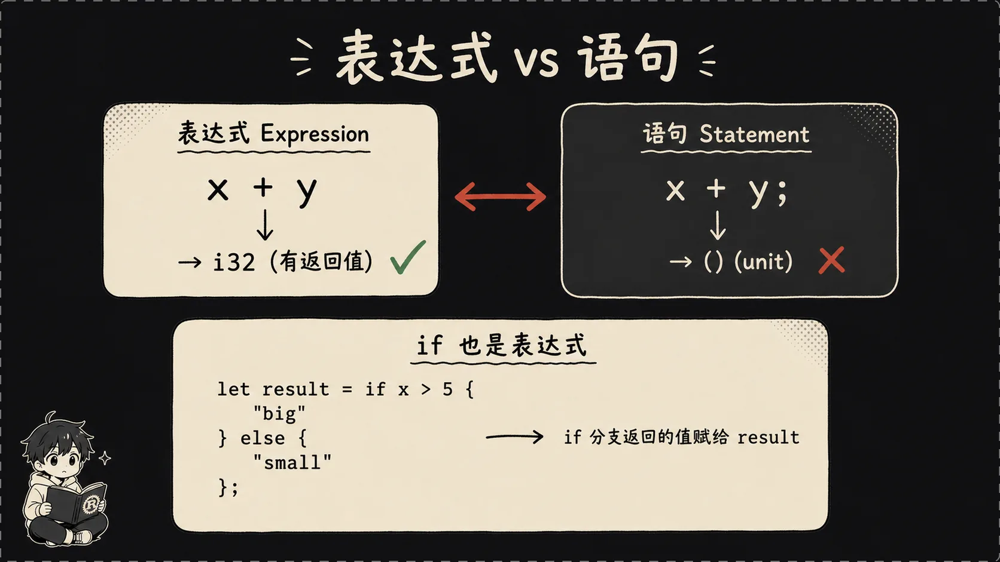

## 一、引言：从一个C++线上事故说起

去年我们组有个C++服务半夜崩了，报错是最难查的`SIGSEGV`。追着日志和core dump排查了一整天，最后定位到一个低频 use-after-free：某个回调持有了已经释放对象的指针，流量一上来就触发。修复只改了两行，但我一直在想——变量在哪儿创建的、谁拥有它、谁能用它、什么时候该释放，这些信息编译器明明都知道，为什么非得等到线上爆炸才让我去查？

后来我接触到Rust，第一感受就是这哥们儿把我那个朴素的疑问当回事了。Rust的slogan里有一句话叫"fearless concurrency"，翻译过来就是"敢写并发"。它的核心卖点不是性能（虽然性能确实顶），也不是语法多花哨（语法说实话有点反人类），而是：**编译时就把内存安全和数据竞争挡在门外，运行时零开销**。

这个系列从零开始讲Rust，本篇先过一遍变量、类型、函数、控制流这些任何现代语言都有的基础，下一篇正式啃所有权（ownership）。

## 二、装好工具箱

Rust的安装一行命令搞定，官方推荐用`rustup`这个工具链管理器。Linux和Mac直接：

```bash
curl --proto '=https' --tlsv1.2 -sSf https://sh.rustup.rs | sh
```

Windows的话去 rust-lang.org 下载 `rustup-init.exe`，双击装就行。装完重启一下终端，让PATH生效。

`rustup`这一行命令其实给你装了三个东西，搞清楚它们各自是干嘛的能省不少事：

- **rustc**：Rust的编译器，负责把你写的 `.rs` 文件编译成二进制。日常开发里你基本不会直接调它，但它是整个工具链的核心。
- **cargo**：包管理器+构建工具+测试运行器+文档生成器，缝合怪一样的存在。你以后90%的时间都在和它打交道。类比一下，cargo相当于 npm + webpack + jest 的组合，但官方原生集成，不用你自己拼。
- **rustup**：管理上面这俩的工具。可以切换Rust版本（stable/beta/nightly），可以装交叉编译的target，可以加组件比如 `rustfmt`（格式化）和 `clippy`（lint工具）。

装完验证一下版本：

```bash
rustc --version
cargo --version
rustup --version
```

三条命令都能输出版本号就算成了。顺手把clippy和rustfmt也装上，写代码会舒服很多：

```bash
rustup component add clippy rustfmt
```

## 三、Hello World——带着问题看

别用编辑器直接新建文件，那是上个时代的写法。Rust项目都是cargo管的，习惯一开始就养好：

```bash
cargo new hello_rust
cd hello_rust
```

进去`ls`一下，你会看到这样的结构：

```
hello_rust/
├── Cargo.toml
├── .gitignore
└── src/
    └── main.rs
```

`Cargo.toml`是项目的配置文件，里面写项目名、版本、依赖。注意是 TOML 格式不是 JSON 也不是 YAML，刚开始可能会写错。

`src/main.rs`是入口文件，cargo自动给你生成了一段Hello World：

```rust
fn main() {
    println!("Hello, world!");
}
```

先别管 `fn` 是啥、`println!` 那个感叹号为啥要加，跑起来再说：

```bash
cargo run
```

第一次运行会慢一点，因为cargo要下载依赖、编译、链接，输出大概长这样：

```
   Compiling hello_rust v0.1.0
    Finished dev [unoptimied + debuginfo] target(s) in 1.23s
     Running `target/debug/hello_rust`
Hello, world!
```

成了。



日常开发用 `cargo run`（编译+运行 debug 版），发布前用 `cargo build --release` 拿优化产物到 `target/release/`——debug 编译快但跑得慢，release 反之；target 目录会膨胀到几百MB，但 .gitignore 默认已忽略。

回头看那段Hello World：`fn`是定义函数的关键字，`main`是入口函数（和C/C++一样），`println!`里那个`!`表示这是一个**宏**（macro）而不是普通函数。为什么打印要用宏？因为Rust的`println!`在编译期就把格式字符串和参数类型都校验了，类型不匹配直接编译不过——这事儿普通函数干不了，得用宏。

先记住这个区别：**函数没感叹号，宏有感叹号**。具体宏是怎么工作的，那是后话。

## 四、变量：不可变是默认

OK，重头戏来了。下面这段代码是Rust给新人的第一个下马威：

```rust
fn main() {
    let x = 5;
    x = 6;
    println!("{}", x);
}
```

如果你写过Python，这代码看起来再正常不过——定义x是5，然后改成6，打印出来。完事。

但你`cargo run`一下，Rust编译器会甩你一脸：

```
error[E0384]: cannot assign twice to immutable variable `x`
 --> src/main.rs:3:5
  |
2 |     let x = 5;
  |         - first assignment to `x`
3 |     x = 6;
  |     ^^^^^ cannot assign twice to immutable variable
```

翻译一下：**`x`是不可变的，你不能给它赋两次值**。

这是Rust和大部分语言最大的哲学差异之一：**变量默认不可变**。你想改？可以，但得明确告诉编译器你想改：

```rust
fn main() {
    let mut x = 5;
    x = 6;
    println!("{}", x);
}
```

加一个`mut`关键字，意思是 mutable，可变。这下就编译过了。

默认不可变 + 显式 `mut` = code review 时一眼看出哪些状态会变。



但是Rust还有一个东西叫 **shadowing（变量遮蔽）**，第一次见容易和`mut`搞混：

```rust
fn main() {
    let x = 5;
    let x = x + 1;
    let x = x * 2;
    println!("{}", x);  // 输出 12
}
```

这段代码居然编译能过，而且x还"变"了三次。这就是shadowing：用同名的`let`重新绑定一个新变量，旧的x被新的x遮蔽（shadow）掉了。

**重点：shadowing和mut完全不是一回事**。

- `mut`：原地修改同一个变量的值，类型不能变。
- shadowing：用同名新变量遮盖旧变量，**类型可以变**。

举个例子，下面这段代码用mut会报错：

```rust
let mut spaces = "   ";
spaces = spaces.len();  // 报错！类型从 &str 变成了 usie
```

但用shadowing就行：

```rust
let spaces = "   ";
let spaces = spaces.len();  // OK，新的spaces是usize
```

shadowing的好处之一就是省名字。你parse一个字符串变成数字，不用想个 `input_str`、`input_num` 这种破名字，直接shadow就完事。

## 五、类型系统：静态但聪明

Rust是**静态强类型**语言，每个变量在编译期都有确定的类型。但它有强大的类型推断，大部分时候你不用显式写类型：

```rust
let x = 5;        // 编译器推断 x: i32
let y = 3.14;     // 编译器推断 y: f64
let s = "hello";  // 编译器推断 s: &str
```

但有些场景编译器推不出来，必须你显式标注。最典型的是 `parse`：

```rust
let guess: u32 = "42".parse().expect("不是数字");
```

`parse`这个函数能把字符串转成各种数字类型，编译器不知道你想要哪种，所以你得在`guess`后面写`: u32`告诉它。



Rust的类型分两大块：**标量类型**（scalar，单值）和**复合类型**（compound，多值）。

### 标量类型

**整数全家桶**：

| 长度 | 有符号 | 无符号 |
|------|--------|--------|
| 8位  | i8     | u8     |
| 16位 | i16    | u16    |
| 32位 | i32    | u32    |
| 64位 | i64    | u64    |
| 128位 | i128  | u128   |
| 架构相关 | isize | usize |

（isize/usize 位数跟随系统架构，常用于索引。）整数字面量默认推断为`i32`，因为它在大部分场景下都够用而且最快。

**浮点**：只有`f32`和`f64`，默认是`f64`（精度更高，现代CPU上速度也不慢）。

**布尔**：`bool`，只有`true`和`false`。注意Rust对bool的检查极其严格，下面这种C/Python里的奇技淫巧在Rust里**不编译**：

```rust
if 1 {  // 报错！expected `bool`, found integer
    println!("hi");
}
```

必须明确写`if x != 0`。一开始觉得啰嗦，写多了你会感谢这种严格——再也没有 `if (x = 5)` 这种把赋值当判断的祖传bug了。

**字符**：`char`，用单引号，**4字节**，能存任何Unicode码点：

```rust
let c = 'z';
let z = 'ℤ';
let emoji = '🦀';  // 完全合法
```

注意`char`是4字节而不是1字节，所以字符串`String`内部用的是UTF-8编码，按字节存储，char和String/&str之间的转换有点绕，这是后面要踩的坑。

### 复合类型

**元组（tuple）**：把不同类型的值打包：

```rust
let tup: (i32, f64, char) = (500, 6.4, 'A');

// 解构
let (x, y, z) = tup;
println!("{}", y);  // 6.4

// 下标访问
println!("{}", tup.0);  // 500
```

**数组**：**固定长度**，所有元素同类型：

```rust
let a = [1, 2, 3, 4, 5];           // 类型推断
let b: [i32; 5] = [1, 2, 3, 4, 5]; // 显式标注，5是长度
let c = [3; 5];                     // [3, 3, 3, 3, 5]

println!("{}", a[0]);  // 1
```

注意Rust的数组**越界检查是运行时的**，越界访问会直接panic（可以理解为程序主动崩溃并报错）：

```rust
let a = [1, 2, 3];
let idx = 10;
println!("{}", a[idx]);  // 运行时panic！
```

这是Rust一个很关键的点——它不会像C那样让你越界访问到野指针、读到垃圾数据，**它宁可让你的程序crash也不让你访问到不该访问的内存**。这就是所谓"内存安全"的一个具体体现。

需要可变长度的话用`Vec<T>`，那是后面要讲的。

## 六、函数

函数用`fn`定义，参数必须显式标注类型（这点和变量不一样，变量能推断，函数签名不行）：

```rust
fn add(x: i32, y: i32) -> i32 {
    x + y
}

fn main() {
    let result = add(3, 5);
    println!("{}", result);  // 8
}
```

返回值类型写在`->`后面。**返回值不用`return`关键字**——函数体最后一个表达式就是返回值。

注意上面那个`x + y`，**没有分号**。这是Rust一个很重要的概念——**表达式 vs 语句**。



- **语句（statement）**：执行操作，不返回值（或者说返回`()`，unit类型）。以分号结尾。
- **表达式（expression）**：求值并返回一个值。不带分号。

`let x = 5;` 是一个**语句**。`5` 是一个**表达式**。`x + y` 是一个**表达式**。

最神奇的是，**`{}` 代码块也是表达式**：

```rust
let y = {
    let x = 3;
    x + 1  // 没分号，这是块的返回值
};
println!("{}", y);  // 4
```

如果你把 `x + 1` 后面加个分号：

```rust
let y = {
    let x = 3;
    x + 1;  // 加了分号，变成语句，块返回()
};
```

那y的类型就变成了`()`（unit），等于啥也没有。

## 七、控制流

`if/else`没啥好说，唯一要注意的就是**条件必须是 `bool`**，不能写 `if x` 然后期望非零为真——前面讲过了。

```rust
if x > 5 {
    println!("大");
} else if x == 5 {
    println!("等于5");
} else {
    println!("小");
}
```

`loop`是Rust独有的"无限循环"关键字，相当于`while true`：

```rust
loop {
    println!("一直跑");
}
```

但`loop`有个特别牛的地方——**`break`可以带返回值**：

```rust
let result = loop {
    counter += 1;
    if counter == 10 {
        break counter * 2;  // 跳出并返回 20
    }
};
```

"无限循环带一个返回值"这设计第一次见我直接拍大腿。日常很多场景需要"反复尝试直到成功，成功了把结果带出来"，其他语言要么用标志位+`while`，要么用函数包一层return，Rust这写法又优雅又直观。

`while`就是常规条件循环，没啥惊喜：

```rust
let mut n = 3;
while n != 0 {
    println!("{}", n);
    n -= 1;
}
```

`for`是Rust里最重要、最常用的循环。它用来遍历任何实现了`Iterator`这个Trait的东西——数组、范围、Vec、HashMap、字符串、自定义类型……都行。

```rust
let a = [10, 20, 30, 40, 50];
for elem in a.iter() {
    println!("{}", elem);
}

// 范围
for i in 1..5 {     // 1, 2, 3, 4    左闭右开
    println!("{}", i);
}

for i in 1..=5 {    // 1, 2, 3, 4, 5  双闭区间
    println!("{}", i);
}
```

`1..5` 和 `1..=5` 的区别要记住，差一个`=`就差一个元素，写边界条件的时候容易栽。

我提一句但先不展开——`for`能跟着各种各样的可迭代对象跑，是因为Rust有一套叫 **Trait** 的机制（约等于其他语言的接口，但更强大）。`Iterator`只是众多Trait之一。这个我们后面专门讲，先留个钩子。

## 八、第一关毕业：FizzBuzz

经典的FizzBuzz题目，3的倍数打印Fizz，5的倍数打印Buzz，15的倍数打印FizzBuzz，其他打印数字本身：

```rust
fn main() {
    for n in 1..=20 {
        if n % 15 == 0 {
            println!("FizzBuzz");
        } else if n % 3 == 0 {
            println!("Fizz");
        } else if n % 5 == 0 {
            println!("Buzz");
        } else {
            println!("{}", n);
        }
    }
}
```

这段代码 `cargo run` 直接跑。

我想强调一件事：**这二十几行代码，没有任何一处可能出现内存安全问题**。没有空指针解引用、没有数组越界、没有use-after-free、没有数据竞争。哪怕你把它跑一万年，跑在10万并发下，跑在嵌入式芯片上，它都不会突然给你来个段错误。

而这种"安全感"是免费的——你没付出运行时性能，没引入垃圾回收器，编译出来的二进制依然是原生机器码，跑得飞快。

这就是Rust的核心承诺：**安全和性能不是二选一**。

## 九、预告：现代语言都有的部分讲完了

到这里掌握的变量、类型、函数、控制流，其他现代语言（Go/Swift/Kotlin/TS）全都有。Rust独有的杀手锏是下一篇要啃的**所有权（Ownership）系统**——它在编译期就把所有内存问题挡掉了。

---

*下一篇：[Rust快速入门：所有权——Rust最硬的骨头（二）]()*


---

本文由 AgentPlanFlow 生成
