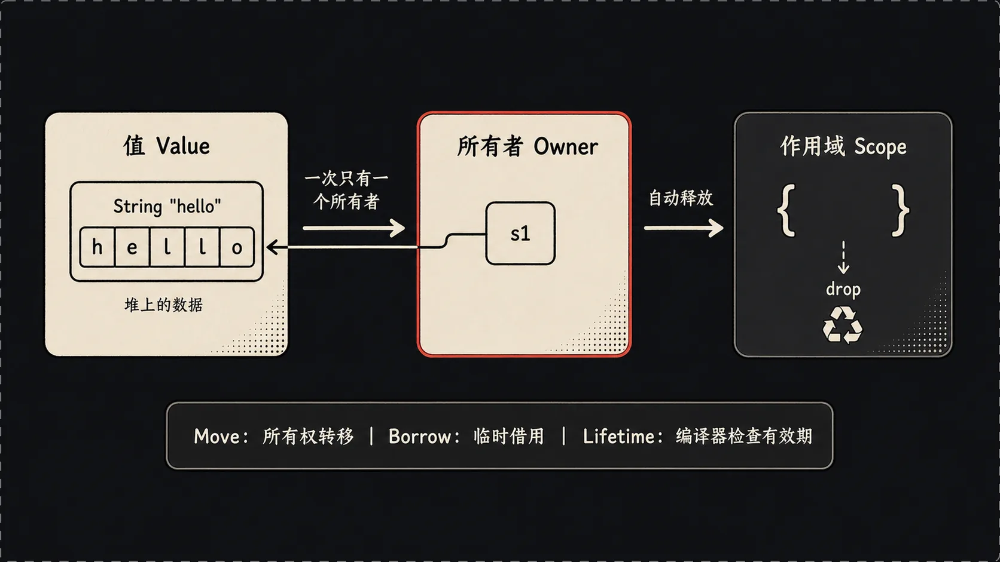
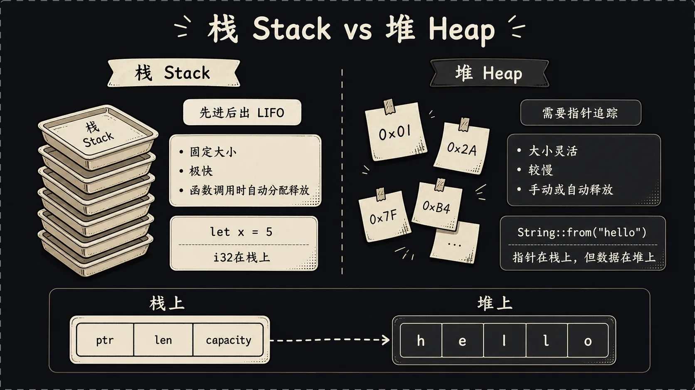
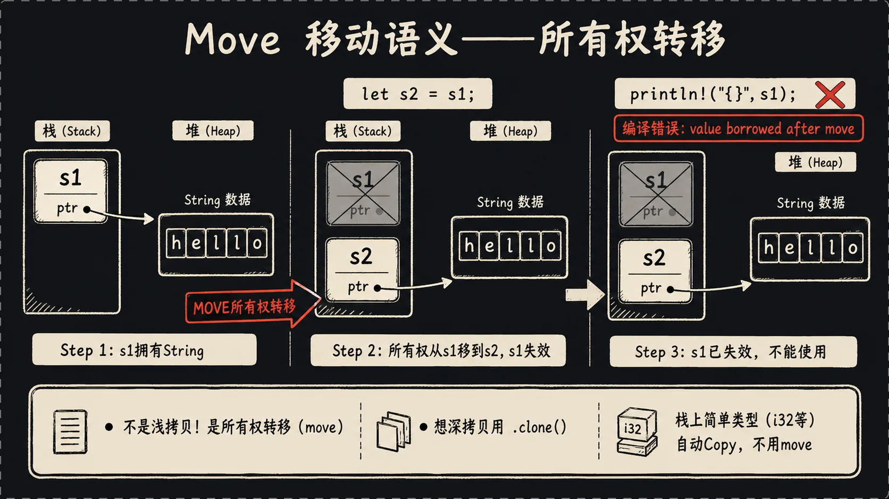
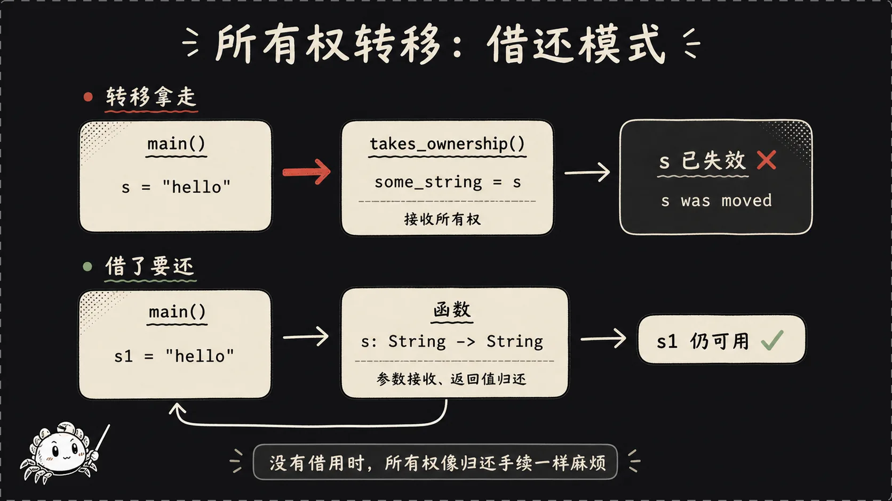
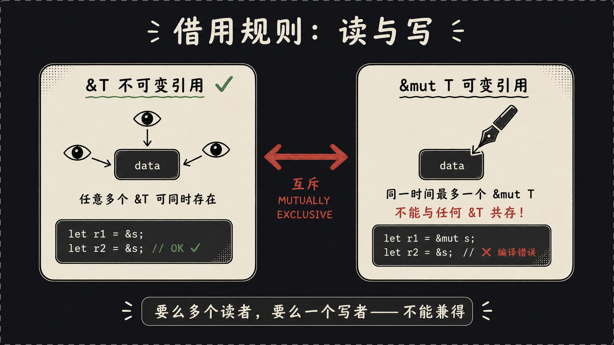
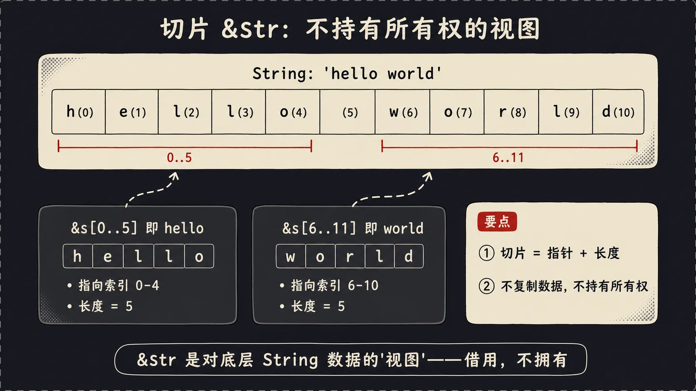

## 一、引言：上篇结束的地方，正题才刚开始

上一篇我们把变量、类型、函数、控制流都过了一遍，你可能心里嘀咕："就这？这玩意儿和Go、Swift也没啥区别啊，凭什么吹得这么神？"

别急。上篇是热身，从这篇开始才是Rust的灵魂——**所有权（Ownership）**。

用图书馆借书打个比方：一本书同一时间只能借给一个人；想多人一起读也行，但前提是没人把它借走单独看；做批注得"专属借出"，期间别人既看不了也借不走。**Rust的所有权系统，本质上就是把这套规则强加到内存上**。

带来的好处是什么？没有GC，没有手动`malloc`/`free`，没有引用计数，没有智能指针的循环引用问题，编译期就把所有内存安全问题挡掉了。代价是什么？你得花一两个星期被编译器爆打，重新学习一下"变量"到底是什么。

来吧，开始啃。

## 二、栈和堆——讲所有权之前先讲内存

在讲所有权之前，必须先搞清楚一件事：**内存其实分两块，栈（stack）和堆（heap）**。

很多写高级语言的同学这辈子都没认真区分过这两个东西，因为Python/Java/JS都帮你藏起来了。但在Rust里，栈和堆的区别决定了变量行为的差异，绕不开。



**栈像食堂叠盘子**。你打饭的时候，阿姨把盘子从最上面拿一个给你，吃完你把盘子放回最上面。先进后出（LIFO）。每个盘子大小一样、位置固定、操作快。你函数里的局部变量（整数、布尔、固定大小的数组）都放在栈上，进函数压一层，出函数弹一层，干净利落。

为什么需要堆？因为栈上的东西必须**编译期就知道大小**。一个`i32`是4字节，一个`[i32; 5]`是20字节，编译器一看就知道。但是用户输入的字符串呢？运行时才知道有多长，可能是一个字也可能是一万字，没法在栈上预留固定空间，只能去堆上动态分配。

Rust里这俩的典型代表：

```rust
let s1 = "hello";              // &str，字符串字面量
let s2 = String::from("hello"); // String，动态字符串
```

`s1`是字符串字面量，它的内容是**写在二进制可执行文件里的常量**，程序启动就在那儿了，`s1`本身在栈上，存的是一个指向那段只读内存的指针+长度。它不可变，不可增长。

`s2`是`String`类型，它的**内容存在堆上**——`String::from`这一步就是问操作系统要了一块堆内存，把"hello"五个字节拷进去。`s2`变量本身在栈上，存的是三个东西：堆指针、当前长度、容量。

栈上的`s2`这个"小本本"指向堆上的"hello"。当`s2`离开作用域，Rust知道它管的堆内存也得释放——这就引出了所有权。

## 三、所有权三大规则

来，记住这三条：

1. **Rust中每个值都有一个所有者（owner）**。
2. **同一时间只能有一个所有者**。
3. **当所有者离开作用域，值会被自动丢弃（drop）**。

举个最简单的例子：

```rust
fn main() {
    {
        let s = String::from("hello");
        // s 在这里有效
        println!("{}", s);
    } // s 离开作用域，String在堆上的内存被自动释放
    // 这里再用 s 就编译报错——s根本不存在了
}
```

注意第三条规则——所有者离开作用域时，Rust会自动调用一个叫`drop`的函数，把这个值占用的资源（包括堆内存）全部释放。这个机制其实和C++的RAII（资源获取即初始化）一模一样，但Rust把它变成了语言强制规则而不是程序员的自觉。

听起来很美好对吧？但第二条"同一时间只能有一个所有者"才是真正坑人的地方，准备好。

## 四、移动语义——Rust最让人困惑的设计

来看这段代码，写过任何高级语言的你都会觉得这没问题：

```rust
fn main() {
    let s1 = String::from("hello");
    let s2 = s1;
    println!("{}", s1);
}
```

逻辑很直白：把s1赋值给s2，然后打印s1。Python能跑，Java能跑，Go能跑，JS能跑。但Rust编译报错：

```
error[E0382]: borrow of moved value: `s1`
 --> src/main.rs:4:20
  |
2 |     let s1 = String::from("hello");
  |         -- move occurs because `s1` has type `String`
3 |     let s2 = s1;
  |              -- value moved here
4 |     println!("{}", s1);
  |                    ^^ value borrowed here after move
```

翻译：**s1的值被move（移动）到s2了，你不能再用s1**。

什么叫"move"？这就要回到栈和堆的图了。



`s1`这个变量在栈上有三块：指针、长度、容量。它指向堆上的`hello`。

当你写 `let s2 = s1;` 时，Rust做的事情是：

- **把栈上的指针、长度、容量这三个字段拷贝给s2**（浅拷贝）。
- 然后**把s1标记为失效**——s1这个名字从此不能再用了。

为什么不深拷贝堆上的`hello`？因为深拷贝在内存大的时候很贵——想象你有个10MB的`String`，赋值一下就翻倍，太亏。Rust的选择是默认不拷贝，谁也别想白嫖。

为什么不留两个指针都指向`hello`？因为这就违反"同一时间只能有一个所有者"了。如果s1和s2都指向同一块堆内存，谁先离开作用域谁释放？另一个就成野指针了。这种问题叫**二次释放（double free）**，是C++里又一个经典bug。Rust用move直接掐死这种可能性。

对比一下：C++ 默认深拷贝（贵但安全），Go/Java/Python 默认浅拷贝两个引用靠 GC 兜底，Rust 默认 move——编译期保证只有一个所有者，零运行时开销。

那如果我真的就是想要两个独立的`String`怎么办？显式调用`.clone()`：

```rust
let s1 = String::from("hello");
let s2 = s1.clone();  // 深拷贝堆上数据
println!("{}, {}", s1, s2);  // 两个都能用
```

`.clone()`这一调用，Rust会真的去堆上申请新内存、拷数据、生成新的`String`。性能开销是有的，但你**显式**调用了它，你知道自己在干什么。这是Rust的一贯设计哲学：**贵的操作必须长得贵**，不让你不小心写出性能炸裂的代码。

那么问题来了，整数为啥不move？

```rust
let x = 5;
let y = x;
println!("{}, {}", x, y);  // 这居然能编译！
```

因为整数这种**完全存在栈上、大小固定的类型**，复制起来和move一样便宜（拷贝几个字节而已），所以Rust给它们打了个特殊标记叫 `Copy` trait。带`Copy`标记的类型，赋值时会自动拷贝而不是move，原变量依然有效。

哪些类型有`Copy`？

- 所有整数类型（`i32`、`u64`等）
- 浮点类型（`f32`、`f64`）
- `bool`
- `char`
- 只包含`Copy`类型的元组，比如`(i32, bool)`

**只要某个类型涉及堆分配，就不会是`Copy`**。`String`、`Vec<T>`这些都不是Copy，赋值就是move。

## 五、所有权与函数

函数调用也遵循同样的规则。**传参的本质就是赋值**——把外面的变量move进函数。

```rust
fn main() {
    let s = String::from("hello");
    takes_ownership(s);
    println!("{}", s);  // 编译报错！s已经被move进函数了
}

fn takes_ownership(some_string: String) {
    println!("{}", some_string);
}  // some_string离开作用域，被drop
```

`s`传进`takes_ownership`之后，所有权就转给函数内部的`some_string`了。函数结束，`some_string`被drop，堆上的`hello`释放。外面的`s`从此不能用。

如果你想用完之后还能继续用，函数得**把所有权还回来**：

```rust
fn main() {
    let s1 = String::from("hello");
    let s1 = takes_and_gives_back(s1);  // shadowing接住返回值
    println!("{}", s1);
}

fn takes_and_gives_back(s: String) -> String {
    println!("{}", s);
    s  // 把所有权返回出去
}
```



这就很魔幻了。你只是想让函数读一下你的字符串，结果得"借出去再要回来"？要是函数还要返回别的值咋办，硬塞个元组吗？

```rust
fn calculate_length(s: String) -> (String, usize) {
    let length = s.len();
    (s, length)  // 把s还回来，再带上长度
}
```

写两次能忍，写一百次想跳楼。所以Rust引入了**借用**——只借不拿。

## 六、引用与借用——只借不拿

`&`这个符号在Rust里是"引用"。引用不获取所有权，只是临时借用一下。

```rust
fn main() {
    let s = String::from("hello");
    let len = calculate_length(&s);  // 传引用进去
    println!("{} 长度是 {}", s, len);  // s还能继续用！
}

fn calculate_length(s: &String) -> usize {
    s.len()
}  // s离开作用域，但因为只是引用，不会drop底层数据
```

这就舒服多了。`&s`是"对s的引用"，类型是`&String`。函数收到的是引用，能读取数据，但不拥有它。函数结束时，引用被丢弃，但**真正的数据还在外面好好的**。

这个动作叫**借用（borrowing）**。

我换个生活类比：

你（main函数）有一本书（`String`）。函数要读这本书，有两种做法：

1. **直接把书拿走**（move）——你就没书了。函数读完要么把书还你（return），要么自己读完撕了（drop）。
2. **借给函数看一眼**（borrow）——书还在你手里，函数只是凑过来读读。

第二种就是借用，显然比第一种方便得多。



但借用有一套严格规则，**这是Rust安全保证的核心**：

### 借用的两条铁律

1. **同一时间，要么有一个可变引用（&mut T），要么有任意多个不可变引用（&T）。两者不能共存。**
2. **引用必须始终有效（不能悬垂）。**

来看不可变引用：

```rust
let s = String::from("hello");
let r1 = &s;
let r2 = &s;
let r3 = &s;
println!("{} {} {}", r1, r2, r3);  // 完全合法，三个不可变引用共存
```

可变引用：

```rust
let mut s = String::from("hello");
let r = &mut s;
r.push_str(" world");
println!("{}", r);
```

注意可变引用要求源变量也是`mut`的——逻辑上很自然，源都不可变你借来怎么改。

违反规则的情况：

```rust
let mut s = String::from("hello");
let r1 = &s;
let r2 = &mut s;  // 报错！已经有不可变引用了，不能再借可变引用
println!("{}, {}", r1, r2);
```

```rust
let mut s = String::from("hello");
let r1 = &mut s;
let r2 = &mut s;  // 报错！可变引用只能有一个
println!("{}, {}", r1, r2);
```

这种规则看上去严格得变态，但它干掉了一类极其难查的bug——**数据竞争**。多线程下两个线程同时写一块内存、或者一边读一边写，结果完全不可预测。C++里这种bug要靠程序员自觉加锁，错了线上才能发现。Rust在编译期就阻止你写出这种代码。

### NLL：非词法作用域生命周期

新人最容易卡的一个点：下面这代码其实**合法**：

```rust
let mut s = String::from("hello");
let r1 = &s;
let r2 = &s;
println!("{} {}", r1, r2);  // 这之后r1、r2就没人用了

let r3 = &mut s;  // OK！前面的不可变引用已经"用完了"
r3.push_str(" world");
```

新版Rust（NLL，Non-Lexical Lifetime）认为引用的"生命"是到**最后一次使用**为止，而不是到所在作用域的`}`。所以前面的`r1`、`r2`在`println!`之后就算死了，后面再借可变引用没问题。

这个改进让借用规则人性化了很多，省了一堆莫名其妙的报错。

## 七、切片——不持有所有权的"视图"

借用还可以更精细——不光能借整个`String`，还能借一段。这就是**切片（slice）**。



```rust
let s = String::from("hello world");
let hello = &s[0..5];   // &str, 借用s的前5个字节
let world = &s[6..11];  // &str, 借用s的6-10字节
```

`&s[0..5]`这个语法返回的是一个`&str`——**字符串切片**。它的本质很简单：**一个指向源字符串某个起始位置的指针 + 长度**，就这两个字段。不拥有数据，不复制数据，只是"开个视图看一段"。

字符串字面量`"hello"`其实也是`&str`——指向二进制文件里的常量数据，和`&s[..]`一样都是"指向某段UTF-8字节的视图"。

切片有个隐藏威力：**因为切片借用了源数据，源数据被改/被drop会让切片失效**——而编译器会帮你检查这点：

```rust
let mut s = String::from("hello world");
let word = first_word(&s);  // word是&str，借用了s
s.clear();  // 试图清空s——但s还有借用！报错！
println!("{}", word);
```

如果允许这种代码跑起来，`word`就成了野指针，指向已经被清空的内存。Rust把这种情况直接堵死在编译期。

数组切片同理：

```rust
let a = [1, 2, 3, 4, 5];
let slice: &[i32] = &a[1..3];  // [2, 3]
```

`&[i32]`就是i32数组的切片，结构和`&str`一样：指针+长度。

## 八、生命周期初探——别慌，只讲皮毛

这一节只讲皮毛，让你看到`'a`这种东西不慌就行，深入的留到后面。

来看一个"找两个字符串中较长的那个"的函数：

```rust
fn longest(x: &str, y: &str) -> &str {
    if x.len() > y.len() { x } else { y }
}
```

逻辑没毛病吧？但这代码**编译不过**：

```
error[E0106]: missing lifetime specifier
```

Rust说："你返回了一个引用，但我搞不清楚它是借x的还是借y的，所以我不知道它能活多久。你得告诉我。"

正确写法：

```rust
fn longest<'a>(x: &'a str, y: &'a str) -> &'a str {
    if x.len() > y.len() { x } else { y }
}
```

那个`'a`（读作"tick a"或"a的生命周期"）是**生命周期标注**。这段签名翻译成人话：

> "这个函数接收两个字符串引用，它俩的生命周期我都叫`'a`。返回值的生命周期也是`'a`。也就是说——**返回值的生命周期，等于x和y中较短的那一个**。"

生命周期标注**不改变任何引用的实际寿命**，它只是告诉编译器"这几个引用之间的关系是什么"。编译器拿到这个信息就能检查：你在外面用这个返回值的时候，原来的x和y都还活着吗？活着就放行，死了就报错。

那是不是每个函数都得写`'a`？不用，Rust有**生命周期省略规则**（三条，简单概括）：

1. 每个引用参数自动分配一个生命周期参数。
2. 如果只有一个输入引用，所有输出引用的生命周期都跟它一样。
3. 如果有 `&self`（方法），所有输出引用的生命周期都跟`self`一样。

90%的日常函数符合这三条之一，编译器自动给你补上`'a`你看不见。只有像`longest`这种**多个输入引用、还要返回引用**的场景，才需要你手写。

## 九、总结：你已经摸到Rust的命门了

- **所有权**：没有 free、没有 GC，编译器靠"谁拥有谁负责释放"自动处理。
- **借用**：读取数据不必转移所有权，多读者共享 / 单写者独占两套规则保证无数据竞争。
- **切片**：借用数据的一段，零拷贝、零成本、有边界检查。
- **生命周期**：编译器用来验证所有引用都"活着"——大部分情况自动推断，少数复杂场景需要显式标注。

下一篇讲**结构体、枚举与错误处理**——如何用 Rust 类型系统建模真实世界，以及 `Result` / `Option` 到底是个啥。

---

*上一篇：[Rust快速入门：从Hello World到所有权门前（一）]()*

*下一篇：[Rust快速入门：结构体、枚举与错误处理（三）]()*


---

本文由 AgentPlanFlow 生成
