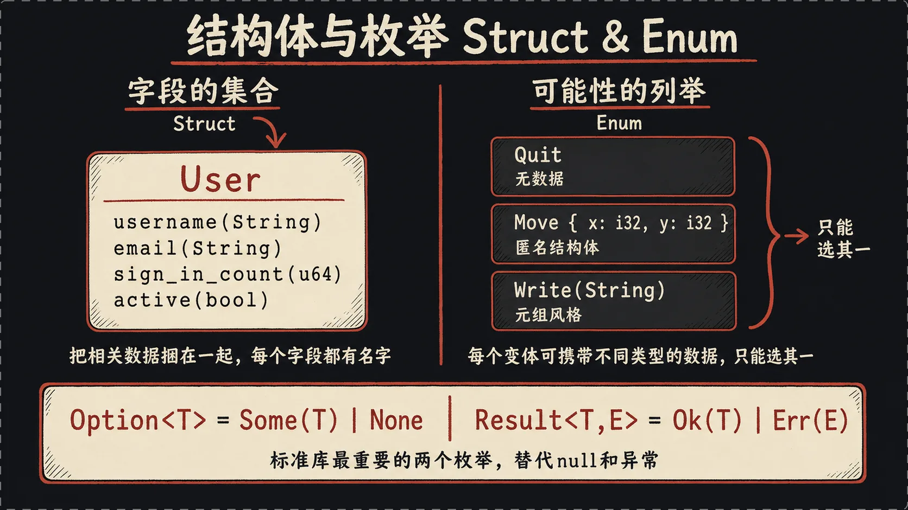
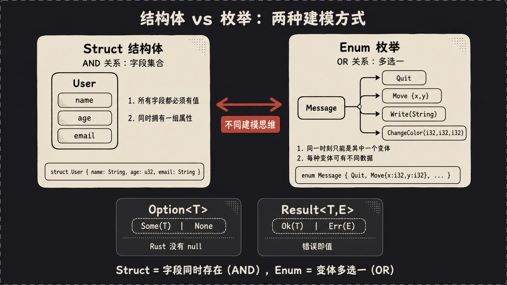
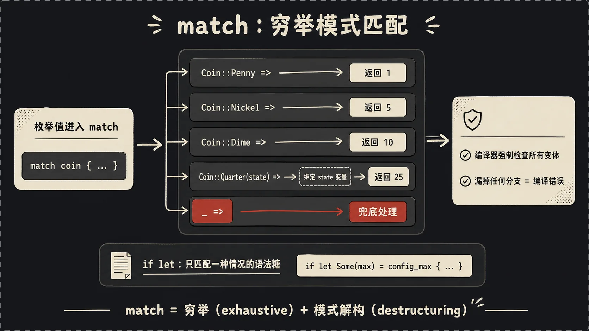
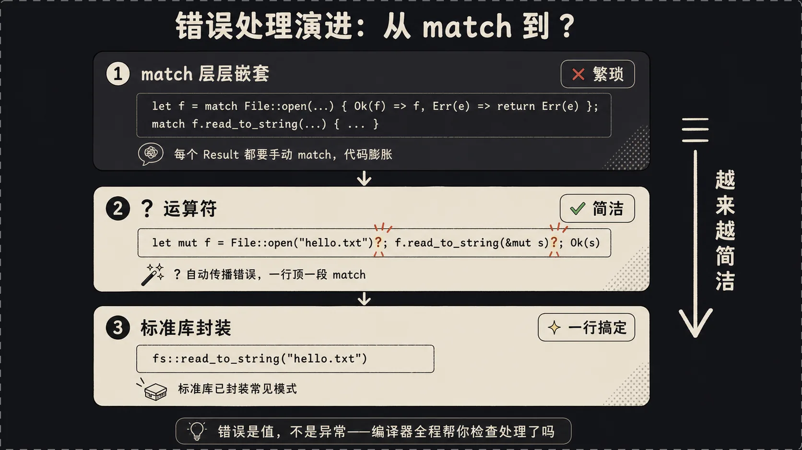

## 一、引言：给数据起名字这件小事

上一篇啃完了所有权，理论上你已经能写出内存安全的Rust代码了。但你试着写点真东西就会发现一个问题：**只用元组和数组组织数据，代码很快就成屎山**。看这两行：

```rust
let user = (String::from("alice"), String::from("alice@example.com"), 42u64, true);
```

当时写的时候很清楚——名字、邮箱、登录次数、是否活跃。一个月后回来看`user.2`、`user.3`，你得翻回最初的定义那行才能搞清楚谁是谁。

所以这一篇我们讲三个东西，它们配合起来让Rust的类型系统变成你最得力的助手而不是绊脚石：

- **结构体（struct）**：给一组数据的每个字段起个名字。
- **枚举（enum）**：给"这东西可能是A也可能是B"这种情况起个名字。
- **模式匹配（match）**：安全地处理枚举的每一种可能。

最后我们还会看到Rust独特的**错误处理**机制——没有异常，用枚举类型`Result`代替，配合`?`运算符干净利落。

## 二、结构体：给字段起名字的艺术

把上面那个用户元组换成结构体，世界立刻清爽了：

```rust
struct User {
    username: String,
    email: String,
    sign_in_count: u64,
    active: bool,
}

let user = User {
    username: String::from("alice"),
    email: String::from("alice@example.com"),
    sign_in_count: 42,
    active: true,
};

println!("{}", user.email);
```

每个字段都有名字，访问的时候是 `user.email` 而不是神秘的 `user.1`。一个月后回来看代码，根本不用想。

### 三种结构体

Rust的结构体其实有三种长相，新手经常只学第一种就以为完了：

**1. 普通结构体（命名字段）**：上面那个`User`就是。最常用的形式。

**2. 元组结构体**：长得像元组但有名字，底层结构相同的两种（如 `Color(i32,i32,i32)` 和 `Point(i32,i32,i32)`）在类型层面被严格区分，不能互传。

```rust
struct Color(i32, i32, i32);
struct Point(i32, i32, i32);

let black = Color(0, 0, 0);
let origin = Point(0, 0, 0);
```

**3. 单元结构体（unit-like struct）**：没有任何字段，用于给只需 trait 标记不需存储数据的 marker 类型。

```rust
struct AlwaysEqual;
```

### 结构体更新语法

经常你只想改一两个字段，其他全继承自旧实例，Rust有个糖：

```rust
let user2 = User {
    email: String::from("new@example.com"),
    ..user1
};
```

`..user1`表示"剩下的字段从user1复制过来"。简洁。

**但这里有个坑要警告**：上一篇讲过move语义。`user1`里的`username`是`String`，会被move到`user2`，所以**`user1`这之后就不能整体使用了**——它的`username`字段已经搬家了。但`user1`里那些`Copy`类型的字段（`sign_in_count`、`active`）依然有效，单独访问没问题。这种"部分move"的细节，编译器会给你抓住，不慌。

### 方法和关联函数

结构体可以挂方法，通过`impl`块：

```rust
struct Rectangle {
    width: u32,
    height: u32,
}

impl Rectangle {
    fn area(&self) -> u32 {
        self.width * self.height
    }

    fn square(size: u32) -> Rectangle {
        Rectangle { width: size, height: size }
    }
}

let rect = Rectangle { width: 30, height: 50 };
println!("面积 {}", rect.area());

let sq = Rectangle::square(10);
```

注意区分两种：

- `fn area(&self)`：**方法**，第一个参数是`&self`（`self: &Self`的简写）。要借用某个实例来调用，写作`rect.area()`。`&self`是不可变借用，要改字段就用`&mut self`，要把自身吃掉就用`self`。
- `fn square(size: u32)`：**关联函数**，没有`self`参数。不绑定到实例，而是绑定到类型本身，调用方式是`Rectangle::square(10)`。一般用作构造函数（Rust没有C++那种特殊的构造函数语法，自己写关联函数当构造器）。

### 让结构体能被打印

默认情况下你直接`println!("{}", rect)`会报错。`{}`要求实现`Display`，但Rust不会自动给你实现，因为人家觉得"咋打印这玩意儿是你的事，得你自己决定格式"。

调试用最简单的办法：

```rust
#[derive(Debug)]
struct Rectangle {
    width: u32,
    height: u32,
}

println!("{:?}", rect);   // Rectangle { width: 30, height: 50 }
println!("{:#?}", rect);  // 多行漂亮打印
```

`#[derive(Debug)]`是个属性，告诉编译器"帮我自动实现Debug trait"，于是你能用`{:?}`和`{:#?}`格式符打印。

## 三、枚举：Rust的杀手级特性

很多语言里enum就是"一组命名常量"，比如C的`enum Color { Red, Green, Blue }`本质就是给整数起别名。

Rust的枚举不是。**Rust的枚举每个变体可以携带完全不同结构的数据**。

先看个简单的：

```rust
enum IpAddrKind {
    V4,
    V6,
}

let four = IpAddrKind::V4;
let six = IpAddrKind::V6;
```

到这一步还和C的enum差不多。但是看这个：

```rust
enum IpAddr {
    V4(u8, u8, u8, u8),
    V6(String),
}

let home = IpAddr::V4(127, 0, 0, 1);
let loopback = IpAddr::V6(String::from("::1"));
```

**每个变体携带完全不同的数据**！`V4`是四个`u8`，`V6`是个`String`。这就是Rust枚举真正的威力——它表达的不是"这个值是某个枚举常量"，而是"**这个值是这几种可能性之一，每种可能性有自己的数据**"。

来个综合的例子：

```rust
enum Message {
    Quit,                          // 无数据
    Move { x: i32, y: i32 },       // 匿名结构体
    Write(String),                 // 元组（一个String）
    ChangeColor(i32, i32, i32),    // 元组（三个i32）
}
```

一个`Message`枚举里塞了四种完全不同的"消息"，每种数据结构都不一样。如果用面向对象的思路你大概会写四个继承同一个基类的子类，但Rust用一个枚举搞定。配合`match`，处理起来比类继承优雅得多——你马上就会看到。



### Option：Rust没有null

标准库里最常用的枚举是`Option<T>`：

```rust
enum Option<T> {
    Some(T),
    None,
}
```

它表达的就是"一个值，可能有，也可能没有"。

**Rust没有null**。要表达"这个值可能没有"，必须显式地把类型从`T`变成`Option<T>`：

```rust
let some_number = Some(5);          // Option<i32>
let some_string = Some("hello");    // Option<&str>
let absent_number: Option<i32> = None;
```

现在关键来了。`Option<i32>`和`i32`是**两个不同的类型**，编译器不会让你把`Option<i32>`当`i32`用：

```rust
let x: i8 = 5;
let y: Option<i8> = Some(5);
let sum = x + y;  // 编译报错！类型不一致
```

要用`y`里的数，**你必须先处理"它可能是None"的情况**——通过`match`、`if let`或者`unwrap`之类的方法。这强迫你在代码里显式处理"值不存在"的情况，从根上杜绝空指针错误。

## 四、模式匹配：match是个表达力怪兽

光有枚举还不够，你得有个干净的方式把它"拆开"。这就是`match`。

```rust
enum Coin {
    Penny,
    Nickel,
    Dime,
    Quarter,
}

fn value_in_cents(coin: Coin) -> u8 {
    match coin {
        Coin::Penny => 1,
        Coin::Nickel => 5,
        Coin::Dime => 10,
        Coin::Quarter => 25,
    }
}
```

`match`长得有点像`switch`，但更强。它有两个C的`switch`比不了的特性：

**第一，必须穷尽所有可能性（exhaustive）**。如果上面我漏掉了`Coin::Dime`，编译器会骂我。这意味着你给`Coin`加新变体后，所有处理`Coin`的`match`都会编译报错，逼你去补处理逻辑。

**第二，可以解构变体里的数据**：

```rust
enum Coin {
    Penny,
    Nickel,
    Dime,
    Quarter(UsState),  // 25分硬币带个州信息
}

fn value_in_cents(coin: Coin) -> u8 {
    match coin {
        Coin::Penny => 1,
        Coin::Nickel => 5,
        Coin::Dime => 10,
        Coin::Quarter(state) => {
            println!("来自 {:?} 州", state);
            25
        }
    }
}
```

`Coin::Quarter(state)`这一行直接把变体里的`UsState`数据绑定到了`state`变量，分支内部就能用。这种语法在C里你得先用`switch`分支，再访问联合体字段，啰嗦得要死。



### match配合Option

最常见的`match`场景就是处理`Option`：

```rust
fn plus_one(x: Option<i32>) -> Option<i32> {
    match x {
        None => None,
        Some(i) => Some(i + 1),
    }
}
```

### 通配符 _

不想枚举每一种情况，用`_`兜底：

```rust
match dice_roll {
    3 => add_fancy_hat(),
    7 => remove_fancy_hat(),
    _ => (),  // 其他情况啥也不干
}
```

`()`是unit值，什么都没有。`_`匹配剩下所有可能。

### if let：偷懒版match

很多时候你**只关心某一种匹配**，写完整的`match`显得啰嗦：

```rust
match config_max {
    Some(max) => println!("最大值是 {}", max),
    _ => (),  // 别的不管
}
```

Rust有个糖：

```rust
if let Some(max) = config_max {
    println!("最大值是 {}", max);
}
```

`if let`相当于"如果模式能匹配就执行"。它失去了`match`的穷尽检查（你可以漏处理别的情况），但换来了简洁。日常只想处理`Some`不想处理`None`时特别好用。

## 五、错误处理：没有异常，但活得更好

异常机制写起来方便，但会偷偷改变控制流——看一段普通代码你根本不知道哪行会突然跳走。Rust一行异常都没有，错误分两种：

- **可恢复的错误**：比如"文件没找到"、"网络断了"。用`Result<T, E>`类型表达。
- **不可恢复的错误**：比如"数组越界"、"除零"。用`panic!`宏，直接让程序崩。

### Result类型

`Result`本身就是个枚举：

```rust
enum Result<T, E> {
    Ok(T),
    Err(E),
}
```

凡是可能出错的操作，返回类型都是`Result`。比如打开文件：

```rust
use std::fs::File;

let f = File::open("hello.txt");
let f = match f {
    Ok(file) => file,
    Err(e) => panic!("打开文件失败: {:?}", e),
};
```

这就是最朴素的处理方式——用`match`分别处理`Ok`和`Err`。可恢复就恢复，不行就`panic!`。

### unwrap和expect

如果你懒得`match`，又确信不会出错（或者出错了就让它崩），有两个快捷方法：

```rust
let f = File::open("hello.txt").unwrap();
```

`unwrap()`：是`Ok`就取出值；是`Err`就直接panic。

```rust
let f = File::open("hello.txt").expect("找不到 hello.txt");
```

`expect("msg")`：和`unwrap`一样，但panic时打印你自定义的信息。日常调试比`unwrap`好用——崩的时候你能一眼看到崩在哪。

**生产代码里慎用`unwrap`**。它一旦panic整个线程就挂了。一般只在"我数学上能证明这里不可能出错"的场景下用，比如你刚检查过`Some`再`unwrap`。

### ?运算符：错误处理的终极形态

实际写代码你会发现一个问题：错误经常需要"层层上抛"。比如这个读文件并返回内容的函数：

```rust
use std::fs::File;
use std::io::{self, Read};

fn read_username() -> Result<String, io::Error> {
    let f = File::open("hello.txt");
    let mut f = match f {
        Ok(file) => file,
        Err(e) => return Err(e),
    };

    let mut s = String::new();
    match f.read_to_string(&mut s) {
        Ok(_) => Ok(s),
        Err(e) => Err(e),
    }
}
```

代码全在做"出错就把错误原样返回"。重复模式写多了想自杀。

Rust给了个糖叫`?`运算符：

```rust
fn read_username() -> Result<String, io::Error> {
    let mut f = File::open("hello.txt")?;
    let mut s = String::new();
    f.read_to_string(&mut s)?;
    Ok(s)
}
```

`?`这个运算符的逻辑是：

- 如果前面的`Result`是`Ok(v)`，把`v`取出来作为表达式的值。
- 如果是`Err(e)`，**立刻从当前函数返回`Err(e)`**。

一行顶一段`match`。而且因为`?`本质上是"提前返回错误"，它**只能用在返回类型是`Result`或`Option`的函数里**（你不能在不返回Result的地方用?然后期望它"消失"）。

继续简化，还能链式：

```rust
use std::fs;

fn read_username() -> Result<String, io::Error> {
    fs::read_to_string("hello.txt")
}
```

标准库已经帮你把"打开+读全部+关闭"封装好了。`?`在这里都不用写——因为函数最后一行直接返回`Result`，本来就是要的类型。



从最初那段一堆`match`嵌套，到`?`一行搞定，再到直接用标准库函数——这个演进过程展示了Rust错误处理的核心哲学：**错误是值，不是控制流**。你可以像处理普通数据一样处理错误，组合它、传递它、转换它，编译器全程帮你检查"你处理了吗"。

### 什么时候panic？

- **写库**：尽量返回`Result`，让调用方决定。
- **应用代码 / 原型**：可以`unwrap`图快，正式上线再换正经错误处理；进入了不可能正确运行的坏状态时直接panic，别带病继续跑。
- **真的"不可能发生"的情况**：可以panic（比如你已确信某 `Option` 一定是 `Some`）。

## 六、小结：类型系统是导航仪，不是绊脚石

**结构体**给数据命名，**枚举**给可能性命名，**模式匹配**逼你处理完每种可能性、少一个都不让过。`Option` 和 `Result` 就是这套机制的典型应用，让"值可能不存在"和"操作可能失败"都变成必须在类型层面处理的事。

下一篇讲**泛型和 Trait**——如何写一份代码适配多种类型，以及 `Iterator` 这种 Trait 为啥能让 `for` 跟着任何东西跑。

---

*上一篇：[Rust快速入门：所有权——Rust最硬的骨头（二）](/posts/rust-quickstart-2/)*

*下一篇：[Rust快速入门：泛型、Trait与迭代器（四）](/posts/rust-quickstart-4/)*


---

本文由 AgentPlanFlow 生成
