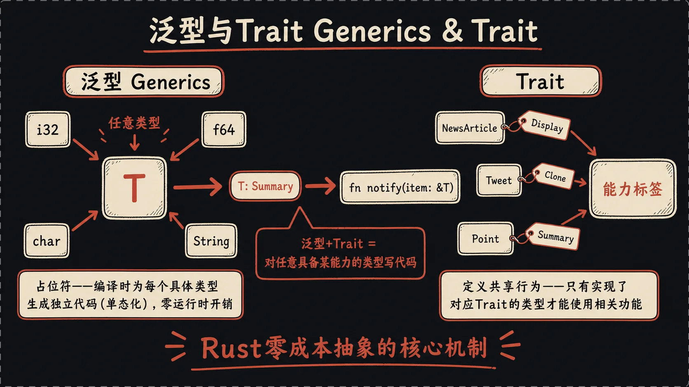
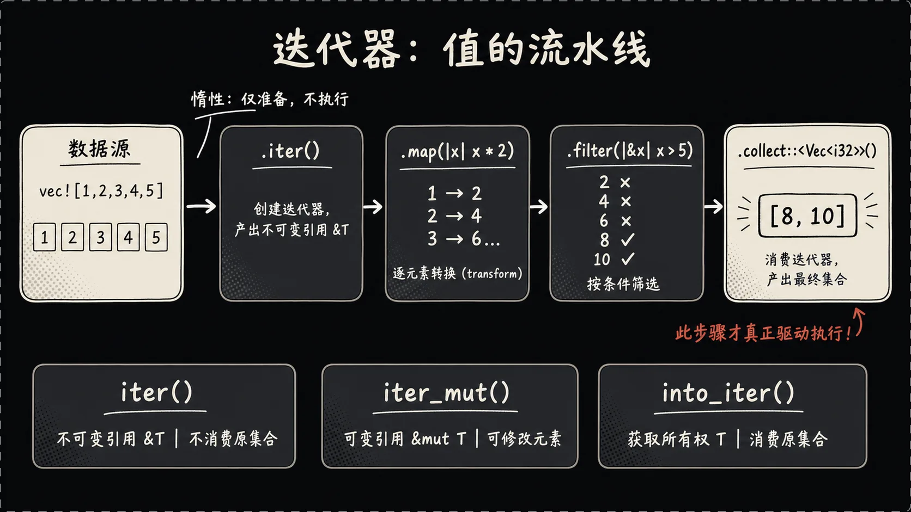

## 一、引言：求个最大值要写几个版本

上一篇我们用结构体和枚举把数据建模搞清楚了。但你写着写着会撞上一个让人想砸键盘的事——**重复代码**。

最经典的场景：写一个"求列表里最大值"的函数。给`i32`写一遍：

```rust
fn largest_i32(list: &[i32]) -> i32 {
    let mut largest = list[0];
    for &item in list {
        if item > largest {
            largest = item;
        }
    }
    largest
}
```

哦，业务里也要算`f64`的最大值，再来一遍：

```rust
fn largest_f64(list: &[f64]) -> f64 {
    let mut largest = list[0];
    for &item in list {
        if item > largest {
            largest = item;
        }
    }
    largest
}
```

代码逻辑一模一样，只是类型不同。

这就是为什么要有**泛型**——让你**写一份代码适配多种类型**。配合**Trait**约束类型必须具备的"能力"，再加上**迭代器**这种基于Trait的优雅设计，你就触到了Rust"零成本抽象"哲学的核心。这一篇我们把这套东西讲清楚。

## 二、泛型：一份代码适配多种类型

泛型的本质很简单：**在你需要写具体类型的位置上，放一个占位符（通常叫`T`），让编译器在调用现场填具体类型**。

### 函数泛型

求最大值的泛型版本：

```rust
fn largest<T: PartialOrd + Copy>(list: &[T]) -> T {
    let mut largest = list[0];
    for &item in list {
        if item > largest {
            largest = item;
        }
    }
    largest
}

let numbers = vec![34, 50, 25, 100, 65];
let chars = vec!['y', 'm', 'a', 'q'];
println!("{}", largest(&numbers));
println!("{}", largest(&chars));
```

`<T: PartialOrd + Copy>`是关键。它告诉编译器："这个函数有一个类型参数`T`，但`T`不能是任意东西——它必须实现了`PartialOrd`（能比较大小）和`Copy`（能按位复制）"。

为啥要写这俩约束？因为函数里用了`>`运算符，所以`T`必须能比较；又因为我们直接`= list[0]`复制了元素，所以`T`必须能复制。你不告诉编译器这些能力要求，它没法生成代码，就直接报错。

这就是Rust和某些动态语言的关键区别——**约束在签名上写明白**，不是等运行时调用了不存在的方法才崩。

### 结构体的泛型

把那个`Point`改造一下：

```rust
struct Point<T> {
    x: T,
    y: T,
}

let integer = Point { x: 5, y: 10 };
let float = Point { x: 1.0, y: 4.0 };
```

一个`Point`定义吃所有数值类型。还能两个类型参数混着用：

```rust
struct Point<T, U> {
    x: T,
    y: U,
}

let mixed = Point { x: 5, y: 4.0 };
```

### 枚举的泛型

其实你早就见过——上一篇的`Option<T>`和`Result<T, E>`就是标准库的泛型枚举：

```rust
enum Option<T> {
    Some(T),
    None,
}

enum Result<T, E> {
    Ok(T),
    Err(E),
}
```

### 方法泛型

`impl`块也能带泛型：

```rust
impl<T> Point<T> {
    fn x(&self) -> &T {
        &self.x
    }
}
```

注意这里`impl<T>`要写两次——一次声明类型参数，一次在`Point<T>`里用它。

更骚的是，**你可以只为特定的具体类型实现方法**：

```rust
impl Point<f32> {
    fn distance_from_origin(&self) -> f32 {
        (self.x.powi(2) + self.y.powi(2)).sqrt()
    }
}
```

`distance_from_origin`这个方法**只有`Point<f32>`才有**，`Point<i32>`根本不会有这个方法——因为整数没`sqrt`。这种"按类型特化方法"的能力非常实用。

### 单态化：零成本的秘密

很多人第一次见泛型会担心：这是不是会有运行时开销？类型擦除会拖慢速度吧？

**没有**。

Rust的泛型在编译期通过**单态化（monomorphization）**展开。意思是编译器扫一遍你代码里所有用到泛型的地方，**给每种具体类型生成一份独立的代码**。

你写了`Option<T>`，编译器看到你程序里用到了`Option<i32>`、`Option<String>`、`Option<bool>`，最终二进制里会有三份代码，分别是这三种类型的版本。

这就意味着：**泛型代码的运行时性能和你手写具体类型完全一样**。没有虚函数调用、没有装箱拆箱、没有反射。这就是Rust常说的**零成本抽象**——你享受了高级语法的便利，运行时一毛钱不多花。

代价是编译产物变大、编译变慢。Rust 愿意付这个代价换运行时零开销。

## 三、Trait：给类型贴"能力标签"



Trait是Rust版的"接口"——定义一组方法签名，让不同类型实现这些方法，就算它们"具备某种能力"。

我个人理解Trait最好的方式是把它当作**能力标签**：

- `Display` trait = "我能被格式化打印（`{}`格式符）"。
- `Debug` trait = "我能被调试打印（`{:?}`格式符）"。
- `Clone` trait = "我能被深拷贝"。
- `PartialOrd` trait = "我能和同类型比较大小"。
- `Iterator` trait = "我能源源不断产出值"。

任何类型只要"贴上"这些标签（实现这些trait），就能在需要这些能力的地方使用。

### 定义和实现Trait

```rust
pub trait Summary {
    fn summarize(&self) -> String;
}

pub struct NewsArticle {
    pub headline: String,
    pub author: String,
    pub content: String,
}

impl Summary for NewsArticle {
    fn summarize(&self) -> String {
        format!("{}, by {}", self.headline, self.author)
    }
}

pub struct Tweet {
    pub username: String,
    pub content: String,
}

impl Summary for Tweet {
    fn summarize(&self) -> String {
        format!("@{}: {}", self.username, self.content)
    }
}
```

`NewsArticle`和`Tweet`两个完全不同的类型，都实现了`Summary`，于是它俩在"能被summarize"这件事上变得等价。

Trait还能有**默认实现**：

```rust
pub trait Summary {
    fn summarize(&self) -> String {
        String::from("(暂无摘要)")
    }
}
```

谁实现`Summary`但不重写`summarize`，就用这个默认值。

### Trait作为参数

写函数时可以要求参数必须实现某个trait：

```rust
pub fn notify(item: &impl Summary) {
    println!("通知：{}", item.summarize());
}
```

这个函数接收"任何实现了`Summary`的类型的引用"。`&NewsArticle`能传，`&Tweet`能传，但`&String`不能传——因为`String`没实现`Summary`。

`impl Summary`这语法其实是糖，完整写法是：

```rust
pub fn notify<T: Summary>(item: &T) {
    println!("通知：{}", item.summarize());
}
```

`<T: Summary>`这里的`: Summary`就是**trait bound（trait约束）**。一回事，写法不同。日常一个trait用`impl`糖更简洁，多个trait或多个泛型参数时用尖括号语法更清晰。

多个trait约束用`+`：

```rust
fn notify<T: Summary + std::fmt::Display>(item: &T) {
    println!("{}", item);
    println!("摘要：{}", item.summarize());
}
```

约束多了挤在一行就难看，用`where`子句分开写：

```rust
fn some_function<T, U>(t: &T, u: &U) -> i32
where
    T: std::fmt::Display + Clone,
    U: Clone + std::fmt::Debug,
{
    42
}
```

这样签名一眼就能看清。

### 返回实现Trait的类型

```rust
fn returns_summarizable() -> impl Summary {
    Tweet {
        username: String::from("alice"),
        content: String::from("hello"),
    }
}
```

意思是"我返回一个东西，它实现了`Summary`，但具体啥类型你别管"。

**有个限制**：`impl Trait`作为返回值时只能返回**单一具体类型**。你不能写"if成立返回Tweet，否则返回NewsArticle"——它俩是不同类型，编译器懵了。这种动态分发场景要用`Box<dyn Summary>`，那是另一个话题。

### Derive：编译器帮你实现

手写`Clone`、`Debug`、`PartialEq`这种trait的实现，每个字段都要列一遍，纯体力活。Rust给了个糖：

```rust
#[derive(Debug, Clone, PartialEq)]
struct Point {
    x: i32,
    y: i32,
}
```

`#[derive(...)]`告诉编译器："你给我自动实现这几个trait，按字段一个一个来就行"。日常90%的"标准trait"靠derive就够了，不用手写。

常用的几个：

- `Debug`：让你能用`{:?}`打印。
- `Clone`：让你能调用`.clone()`深拷贝。
- `Copy`：让类型变成"赋值即拷贝"，通常和`Clone`一起derive。
- `PartialEq` / `Eq`：让你能用`==`比较。
- `PartialOrd` / `Ord`：让你能用`<`、`>`比较。
- `Hash`：让类型能当HashMap的key。
- `Default`：让你能调用`T::default()`得到默认值。

### 孤儿规则一句话

最后一条规矩：**你不能为外部类型实现外部trait**。要么trait是你的，要么类型是你的，至少占一头。这条规则避免了不同库给同一个类型实现同一个trait的冲突，绕过的办法是用元组结构体把外部类型包一层（newtype模式）。

## 四、常用标准集合

### Vec\<T\>：动态数组

```rust
let mut v: Vec<i32> = Vec::new();
v.push(1);
v.push(2);

let v = vec![1, 2, 3];
```

堆上分配的动态数组（对应其他语言的 ArrayList / list）；下标访问越界 panic，`v.get(i)` 返回 `Option<&T>` 安全但啰嗦，处理不可信输入时用后者。

### String：不是char数组

Rust 的 `String` 是 UTF-8 字节，**不支持 `s[0]` 索引**（一个"字符"可能占 1-4 字节）。

```rust
let mut s = String::from("hello");
s.push_str(", world");
s.push('!');

let s1 = String::from("hello");
let s2 = String::from(" world");
let s3 = s1 + &s2;

let s = format!("{}-{}-{}", "a", "b", "c");
```

`+` 会 **move 左操作数**——`s1` 在 `s1 + &s2` 之后就不能再用了，多段拼接首选 `format!`。

### HashMap\<K, V\>：键值对

```rust
use std::collections::HashMap;

let mut scores = HashMap::new();
scores.insert(String::from("Blue"), 10);
scores.insert(String::from("Yellow"), 50);

let team = String::from("Blue");
let score = scores.get(&team);
```

`get` 返回 `Option<&V>`，强迫你处理"key 不存在"。

## 五、闭包：能捕获环境的匿名函数

闭包就是个匿名函数，但能**捕获定义它的环境里的变量**。

```rust
let add = |a, b| a + b;
println!("{}", add(2, 3));
```

`|a, b|`是参数，`a + b`是函数体。类型推断让闭包很简洁——大多数时候不用标注类型，编译器从调用现场推断。

捕获环境变量：

```rust
let x = 10;
let add_x = |n| n + x;
println!("{}", add_x(5));
```

闭包有三种捕获方式，对应三个 trait：`Fn`（不可变借用）、`FnMut`（可变借用）、`FnOnce`（获取所有权，只能调一次）。编译器根据闭包内部实际做的事自动归类。`move` 关键字强制把捕获的变量 move 进闭包：

```rust
let x = String::from("hello");
let print_x = move || println!("{}", x);
print_x();
```

## 六、迭代器：值的流水线



迭代器是我最喜欢的Rust特性。它把"循环+处理"抽象成了**值的流水线**。

任何实现了`Iterator` trait的类型都是迭代器，核心就一个方法：

```rust
trait Iterator {
    type Item;
    fn next(&mut self) -> Option<Self::Item>;
}
```

`next()`要么返回`Some(下一个值)`，要么返回`None`表示结束。其他所有花里胡哨的方法都是基于`next()`衍生出来的。

### 三种获取迭代器的方式

- `iter()`：产出**不可变引用**`&T`。原集合不动。
- `iter_mut()`：产出**可变引用**`&mut T`。能修改。
- `into_iter()`：产出**所有权**`T`。会消费掉原集合。

```rust
let v = vec![1, 2, 3];
for x in v.iter() {
    println!("{}", x);
}
```

### 迭代器适配器：构建流水线

迭代器真正爽的地方是链式调用：

```rust
let v = vec![1, 2, 3, 4, 5];
let sum: i32 = v.iter().sum();
let doubled: Vec<i32> = v.iter().map(|x| x * 2).collect();
let evens: Vec<i32> = v.iter().filter(|&&x| x % 2 == 0).copied().collect();
```

常用适配器：

- `map`：每个元素应用一个函数。
- `filter`：保留满足条件的元素。
- `take(n)`：取前n个。
- `skip(n)`：跳过前n个。
- `enumerate`：把每个元素配上索引。
- `zip`：和另一个迭代器拉链组合。
- `chain`：拼接两个迭代器。

这些叫**迭代器适配器**，特点是**惰性**——你光调用`.map(...)`不会真的执行什么，它只是返回一个新迭代器对象。**直到你调用一个消费方法（`collect`、`sum`、`count`、`for_each`、`fold`等）才真正开始遍历**。

惰性带来的好处：你写一堆`.map().filter().take(5)`，编译器优化后基本等价于一个手写的循环，没有中间集合的分配。

### 一行实战流

```rust
let result: Vec<i32> = (1..=100)
    .filter(|x| x % 2 == 0)
    .map(|x| x * x)
    .take(5)
    .collect();
```

读起来像句英文：从1到100，过滤出偶数，每个平方，取前5个，收集成`Vec`。结果是`[4, 16, 36, 64, 100]`。

更牛的是性能——这段代码编译后的产物，**和你手写一个`for`循环+`if`判断+提前break的版本性能完全一样**。编译器能把整条链子内联展开。这就是"零成本抽象"，迭代器是这套哲学最好的展示。

## 七、小结与预告

- **泛型**：一份代码适配多种类型，单态化保证零开销。
- **Trait**：把类型的能力明确标注出来，配合 trait bound 让函数签名说人话。
- **闭包**：把行为当成值传来传去。
- **迭代器**：管道式语法处理数据流，编译后和手写循环一样快。

下一篇是系列最后一篇，聊**并发、异步与宏**——所有权系统在多线程下怎么继续帮你挡子弹。

---

*上一篇：[Rust快速入门：结构体、枚举与错误处理（三）](/posts/rust-quickstart-3/)*

*下一篇：[Rust快速入门：并发、异步与宏——从这里出发（五）](/posts/rust-quickstart-5/)*


---

本文由 AgentPlanFlow 生成
