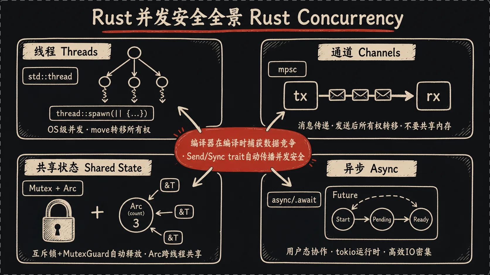

## 一、引言：最后一块拼图

前四篇结束你已经能写出**正确而优雅**的 Rust 代码了，但还有最后一块拼图——**让你的代码同时做多件事**。

举个例子：我前阵子写了个小爬虫，要从100个URL拉数据。最朴素的版本是一个一个请求，每个请求等网络IO要几百毫秒，跑完整个流程要好几分钟。但如果我能**同时**发出这100个请求呢？大部分时间都花在等服务器响应上，CPU闲着，为啥不让它们并行？

这就是并发要解决的问题。Rust在这块也是出了名的狠角色——slogan里那句"fearless concurrency"（无畏并发）不是口号，它真的把那些让其他语言程序员通宵debug的并发bug，在编译期就挡掉了。

并发主要有两种范式：

- **多线程**：操作系统级别的并发，每个线程有自己的栈，调度交给OS。
- **异步**：用户态的协作式并发，一个OS线程可以跑成千上万个任务。

这一篇我们都会涉及，最后再聊一下宏，给整个系列收尾。

## 二、线程：操作系统级的并发

Rust的标准库自带线程支持，用起来很直接：

```rust
use std::thread;
use std::time::Duration;

fn main() {
    let handle = thread::spawn(|| {
        for i in 1..10 {
            println!("子线程: {}", i);
            thread::sleep(Duration::from_millis(1));
        }
    });

    for i in 1..5 {
        println!("主线程: {}", i);
        thread::sleep(Duration::from_millis(1));
    }

    handle.join().unwrap();
}
```

`thread::spawn`接受一个闭包，把它扔到新线程里跑。返回一个`JoinHandle`，调`.join()`会等线程跑完。

如果你把`handle.join()`去掉，主线程跑完就退出了，子线程可能还没打印完就被强制干掉。

### move闭包：跨线程的所有权

线程里要用主线程的变量，闭包必须用`move`：

```rust
let v = vec![1, 2, 3];

let handle = thread::spawn(move || {
    println!("{:?}", v);
});

handle.join().unwrap();
```

为啥必须`move`？因为编译器不知道子线程会跑多久——`v`可能在主线程作用域结束后还在被子线程使用。要是允许借用，那就是野指针。所以Rust的规则简单粗暴：**跨线程必须move，把所有权拿走**。

去掉`move`试试，编译器会一脸严肃地告诉你这不行。

### 编译器替你挡数据竞争

来看一个想犯错都犯不了的例子：

```rust
let mut v = vec![1, 2, 3];
let handle1 = thread::spawn(|| {
    v.push(4);  // 借用 v
});
let handle2 = thread::spawn(|| {
    v.push(5);  // 又借用 v
});
```

C++里这种代码能编译过，跑起来概率性崩——两个线程同时操作同一个vector，可能正好同时resize，内存就花了。这种bug叫**数据竞争**，是并发里最让人头疼的东西，因为它**不一定每次都触发**，可能在你测试时风平浪静，上线之后高并发下偶尔崩一次。

Rust呢？**根本不编译**。

借用规则在跨线程时一样生效——两个`spawn`闭包都想借用`v`，第二个借用违反规则，编译器直接拦下。你想加`move`让它编译过？那只能一个线程move了，另一个就没东西可用了。怎么也写不出数据竞争的代码。

**这就是Rust并发的核心卖点**：编译期捕获数据竞争。不是运行时检测，不是测试时发现，是编译不通过。

那"我就是要多个线程操作同一份数据"咋办？接着往下看。

## 三、消息传递：通道（Channel）

Go有句口号大家都听过——"不要通过共享内存来通信，要通过通信来共享内存"。这哲学在Rust里也成立。

标准库提供了`mpsc`通道（multi-producer single-consumer，多生产者单消费者）：

```rust
use std::sync::mpsc;
use std::thread;

fn main() {
    let (tx, rx) = mpsc::channel();

    thread::spawn(move || {
        let val = String::from("hi");
        tx.send(val).unwrap();
        // 这之后 val 不能再用——所有权已经送走了
    });

    let received = rx.recv().unwrap();
    println!("收到: {}", received);
}
```

`mpsc::channel()`返回一对`(tx, rx)`——发送端和接收端。`tx.send(v)`把值送进通道（**所有权也被move进去了**，发完原线程就不能再用`v`），`rx.recv()`阻塞等待并收一个值。

不想阻塞？用`try_recv()`，立刻返回，没数据就返回错误。

### 多个发送者

`tx`可以`clone`，所有克隆都向同一个`rx`发送：

```rust
let (tx, rx) = mpsc::channel();
let tx1 = tx.clone();

thread::spawn(move || {
    tx.send(String::from("hello from t1")).unwrap();
});

thread::spawn(move || {
    tx1.send(String::from("hello from t2")).unwrap();
});

for received in rx {  // rx 实现了 Iterator
    println!("{}", received);
}
```

`rx`本身实现了`Iterator`，所以`for in rx`能用——收到的每个消息就是一次迭代。等所有发送端都drop掉，迭代器就结束。

来个稍微正经的例子——多个线程算平方然后汇总：

```rust
use std::sync::mpsc;
use std::thread;

let (tx, rx) = mpsc::channel();

for i in 1..=5 {
    let tx = tx.clone();
    thread::spawn(move || {
        tx.send(i * i).unwrap();
    });
}
drop(tx);  // 主线程的tx要drop，否则rx迭代不会结束

let results: Vec<i32> = rx.iter().collect();
println!("{:?}", results);
```

注意那个`drop(tx)`——主线程持有的`tx`不drop，`rx`就一直等"还可能有新消息"，永远不结束。坑过我一次，提前告诉你。

通道这种方式好处是**编译期就保证了没有共享可变状态**——数据在线程间"传递"而不是"共享"，所有权一次只在一个线程里。简单、清晰、无锁。

## 四、共享状态：Mutex + Arc

通道好用，但有些场景就是绕不开"多个线程读写同一份数据"。比如一个计数器，每个线程都要+1，最后汇总。这时候就要上锁了。

### Mutex：互斥锁

```rust
use std::sync::Mutex;

fn main() {
    let m = Mutex::new(5);

    {
        let mut num = m.lock().unwrap();
        *num = 6;
    }  // num 离开作用域，锁自动释放

    println!("{:?}", m);
}
```

`Mutex::new(v)`包装一个值。`.lock()`返回一个`MutexGuard`——你拿到这个guard就拿到了锁，可以解引用读写里面的值。

**关键**：guard离开作用域，锁**自动释放**。

这是Rust用RAII（资源获取即初始化）干掉的另一类经典bug——**忘记unlock**。C++里你有可能 `lock()` 之后忘了 `unlock()` 就 `return` 了，整个程序死锁。Rust把"释放锁"和"变量销毁"绑定，编译器替你管。

### Arc：跨线程的引用计数

Mutex光有还不够——多个线程怎么共享同一个Mutex？普通的`Rc<T>`（引用计数智能指针）只能单线程用，跨线程会报错。原因是`Rc`的引用计数不是原子操作，多线程下计数会乱。

`Arc<T>`（**A**tomic **R**eference **C**ounted）解决这个：

```rust
use std::sync::{Arc, Mutex};
use std::thread;

fn main() {
    let counter = Arc::new(Mutex::new(0));
    let mut handles = vec![];

    for _ in 0..10 {
        let counter = Arc::clone(&counter);
        let handle = thread::spawn(move || {
            let mut num = counter.lock().unwrap();
            *num += 1;
        });
        handles.push(handle);
    }

    for handle in handles {
        handle.join().unwrap();
    }

    println!("结果: {}", *counter.lock().unwrap());  // 10
}
```

`Arc<Mutex<T>>`是Rust并发的标准句式。

- 外层`Arc`：让多个线程能持有"指向同一份数据的引用"。每次`Arc::clone`只增加引用计数，不复制数据。
- 内层`Mutex`：保证同一时间只有一个线程能修改数据。

为啥不让`Arc`直接能修改？因为`Arc`本质是"只读共享"，要改的话必须配合内部可变性的工具（Mutex是其中之一）。Rust把"共享"和"可变"严格分开，跨线程也不例外。



## 五、Send和Sync：并发安全的底层机制

为啥`Rc<T>`不能跨线程而`Arc<T>`可以？这背后是两个特殊的标记trait：

- **`Send`**：实现了`Send`的类型，它的值可以**安全地转移**到另一个线程。
- **`Sync`**：实现了`Sync`的类型，它的不可变引用`&T`可以**安全地共享**到另一个线程。

绝大多数类型都自动实现了`Send`和`Sync`（编译器看字段都是Send/Sync就自动给你的复合类型也打上标记）。少数例外：

- `Rc<T>`不是`Send`——它的引用计数不是原子操作，跨线程会数据竞争。
- `RefCell<T>`不是`Sync`——它做运行时借用检查，多线程同时检查会乱。

`Arc<T>`和`Mutex<T>`就是为多线程设计的对应替代品——`Arc`是原子引用计数，`Mutex`是OS级互斥锁。把`Rc<T>`传给`thread::spawn`？编译器立刻报错"`Rc` is not Send"。

## 六、异步：成千上万个任务在一个线程上跳舞

线程很强，但有个硬伤——**每个线程要吃几MB的栈内存**。开1000个线程没问题，开10万个？操作系统就累趴下了。

但是写网络服务的场景下，大部分时间是在等IO——等客户端发数据、等数据库返回、等下游API响应。CPU闲得发慌，却被OS线程数限制住了。

异步就是为这种场景生的。核心思想：**一个OS线程上跑成千上万个"轻量任务"，等IO的时候自动切换到别的任务，IO好了再切回来**。

### async/await

```rust
async fn fetch_url(url: &str) -> Result<String, reqwest::Error> {
    let body = reqwest::get(url).await?.text().await?;
    Ok(body)
}
```

`async fn`定义一个异步函数。它的返回值不是`Result<String, ...>`，而是 **`Future<Output = Result<String, ...>>`**——一个"承诺将来会有这个值"的对象。

调用`async fn`**不会立刻执行**，只是返回一个Future。你必须`.await`它才会真正跑：

```rust
let result = fetch_url("https://example.com").await?;
```

`.await`在那一行的语义是："如果这个Future还没好，先把当前任务挂起，让运行时去跑别的任务；好了再回来继续"。

### 运行时（Runtime）

这里有个关键点：**Rust标准库不提供异步运行时**。`async/await`只是语法，背后的"调度器"需要第三方库。

最主流的是`tokio`：

```rust
use tokio;

#[tokio::main]
async fn main() {
    let result = fetch_url("https://example.com").await;
    println!("{:?}", result);
}
```

`#[tokio::main]`这个属性宏帮你在main函数前后包裹了tokio运行时的启动和关闭。其他选择还有`async-std`、`smol`，但日常生态用tokio最多。

### 并发等待多个Future

异步真正的爽点是并发：

```rust
use tokio::join;

async fn main_logic() {
    let (a, b, c) = join!(
        fetch_url("https://example.com/a"),
        fetch_url("https://example.com/b"),
        fetch_url("https://example.com/c"),
    );
}
```

`join!`宏让三个请求**同时发起**，全部完成后一起返回结果。等待时间是三者中最慢的那个，不是三者之和。这就是开头那个爬虫的解法——100个URL并发请求，总耗时基本等于最慢的那个。

还有`tokio::spawn`，类似`thread::spawn`但调度在用户态：

```rust
let handle = tokio::spawn(async {
    // 这里跑一个独立的异步任务
});
let result = handle.await.unwrap();
```

注意一个坑：**异步代码里不要用`std::thread::sleep`**——它会阻塞整个OS线程，把其他任务都卡住。用`tokio::time::sleep`，它是"假装睡眠"，会让出执行权给别的任务。

### 异步的坑

- **生态分裂**：tokio 和 async-std 的运行时不兼容。
- **trait 里写 async 方法很麻烦**：老版本要靠 `async-trait` 宏 workaround。
- **Future 不 Send**：捕获了非 Send 的东西就不能跨线程，错误信息劝退。

## 七、宏：写代码生成代码

宏是Rust的**元编程**机制——**写代码来生成代码**。它在编译期展开，所以运行时零开销。

### 声明宏：macro_rules!

最常见的形式：

```rust
macro_rules! say_hello {
    () => {
        println!("Hello!");
    };
}

say_hello!();
```

复杂一点，看`vec!`宏的简化版：

```rust
macro_rules! my_vec {
    ( $( $x:expr ),* ) => {
        {
            let mut temp = Vec::new();
            $(
                temp.push($x);
            )*
            temp
        }
    };
}

let v = my_vec![1, 2, 3];
```

`$( $x:expr ),*`这语法看起来像鬼画符，意思是"匹配零个或多个用逗号分隔的表达式，每个绑定到`$x`"。然后`$( ... )*`重复展开。

### Derive宏

`#[derive(Debug, Clone, PartialEq)]`这种就是**derive宏**——给你的类型自动生成trait的实现。

很多库都靠derive宏极大简化使用，比如`serde`这个序列化库：

```rust
#[derive(serde::Serialize, serde::Deserialize)]
struct User {
    name: String,
    age: u32,
}

let user = User { name: "alice".into(), age: 30 };
let json = serde_json::to_string(&user).unwrap();
```

`#[derive(Serialize)]`一行，编译器就帮你写完了"把这个结构体转JSON"需要的所有代码。如果手写，得一个字段一个字段去拼字符串。

### 过程宏

derive宏其实是**过程宏（procedural macro）**的一种。过程宏分三类：

- **derive宏**：上面演示过。
- **attribute-like宏**：像`#[tokio::main]`、`#[get("/")]`这种，挂在函数或类型上。
- **function-like宏**：长得像函数调用，比如`sqlx::query!("SELECT * FROM users")`——这种甚至能在编译期连数据库验证SQL语法。

过程宏的实现要单独开一个crate写，比声明宏复杂得多。但你日常**用**过程宏是不需要懂它怎么实现的——找现成的库用就行。

## 八、五篇结束，但你的Rust之旅才刚开始

这五篇够你写一个能跑的 Rust 项目了，但还有大片地图没碰：**`unsafe` / FFI**（绕过编译器、和 C/C++ 互操作），**嵌入式 / WebAssembly**（跑在 MCU 或浏览器里），**领域库**（Bevy、Axum、sqlx、Burn 等生态）。

下一步建议：去做项目，遇到问题查 Rust Book。

去写点什么吧。

代码不会自己出现。

---

*上一篇：[Rust快速入门：泛型、Trait与迭代器（四）](/posts/rust-quickstart-4/)*


---

本文由 AgentPlanFlow 生成
