## 一、引言：从 Android 2.3 开始

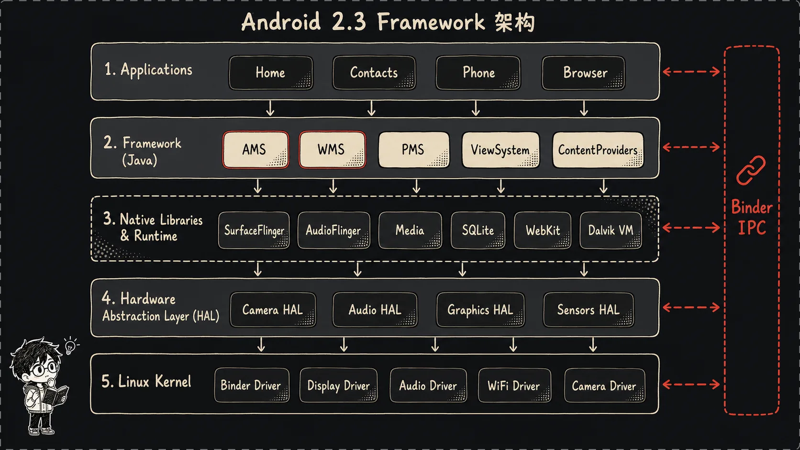

我第一次认真啃 Android Framework 的时候，最大的感觉不是“难”，而是“散”。一个 `startActivity()`  能牵出 ActivityManagerService，一个窗口显示能牵出 WindowManagerService 和 ViewRoot，再往下还有 SurfaceFlinger、Binder、Zygote、init。每个东西单独看都像是能讲一整本书，但合在一起的时候，脑子里很容易变成一团乱麻。

后来我发现，想看懂 Framework，不能一开始就扎进某个大类里硬啃。比如 Android 2.3 的 `ActivityManagerService.java` 就有 12484 行，路径是 `frameworks/base/services/java/com/android/server/am/ActivityManagerService.java`。如果上来就从第一行读到最后一行，读到一半大概率会忘了自己为什么打开它。AMS 确实很重要，但它不是孤岛。它的前面有 init、ServiceManager、Zygote、SystemServer；它的后面有 ActivityThread、WindowManager、ViewRoot、SurfaceFlinger。**先把这条链路串起来，再去读细节，会轻松很多。**

我选 Android 2.3，也就是 Gingerbread，原因很现实：它已经具备现代 Android Framework 的骨架，但源码还没有后面版本那么膨胀。不算内核，整套源码大概 5 到 6GB；ServiceManager 这种核心组件甚至只有 271 行 C 代码，路径是 `frameworks/base/cmds/servicemanager/service_manager.c`。你能在一个下午里把关键路径翻一遍，而不是在一堆模块和抽象层里迷路。

2.3 的架构已经很“Android”了：Linux 内核先起来，`init` 作为 PID 1 接管用户态；`init.rc` 拉起 `servicemanager`、`zygote`、`media` 等守护进程；Zygote 预加载 Java 世界，再 fork 出 `system_server`；SystemServer 注册 AMS、PMS、WMS 这些 Java 系统服务；Launcher 起来以后，点击图标，AMS 决定 Activity 怎么启动，必要时让 Zygote fork 新进程；最后 ActivityThread 创建 Activity，WindowManager 接上窗口，ViewRoot 走 measure、layout、draw，画面才出现在屏幕上。

这篇文章我就按这条线来讲：**开机 -> 应用显示**。它不是源码逐行注释，也不会把每个类的所有分支都铺开。**我的目标是让你脑子里先有一张完整地图。**以后你再看 AMS、WMS、Binder、View 系统时，知道自己站在哪一层，往上连着谁，往下又依赖谁。

为了方便核对，我用的源码基线是 AOSP `android-2.3.7_r1`。文中会直接标出真实源码路径和行号，比如 `system/core/init/init.c:652`、`frameworks/base/core/java/android/view/ViewRoot.java:702`。代码片段只摘关键 3 到 5 行，够印证流程就停，不拿大段源码刷屏。

## 二、从开机说起：init 进程与 init.rc

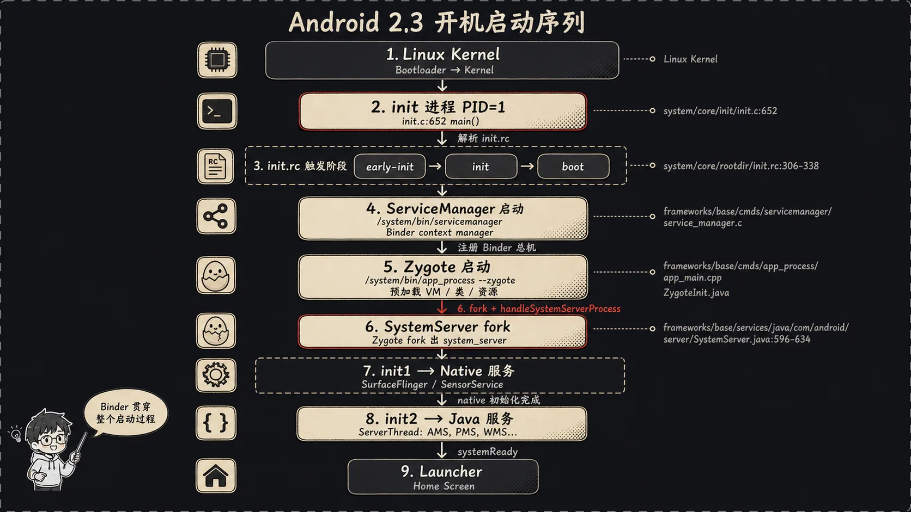

Android 是基于 Linux 的，所以开机第一段还是 Linux 那套：Bootloader 拉起内核，内核初始化驱动、调度器、内存管理，然后启动第一个用户态进程。这个进程就是 `init`，PID 是 1。你可以把它想成一家店开门时第一个到岗的人：它不是具体做咖啡、收银、打扫的人，但它决定谁先来、谁后到、出了问题谁重启。

Android 2.3 的 `init` 入口在 `system/core/init/init.c:652`：

这段代码是 Android 用户态启动链路的第一个 C 入口。先看它，是为了确认后面的 `init.rc`、属性服务、守护进程启动都不是凭空发生的，而是从这个 `main()` 开始排布。
它也能帮助我们把 Framework 之前的 Linux 用户态初始化放回正确位置。

```c
// init 进程的主入口，接收启动参数。
int main(int argc, char **argv)
// 进入 init 的初始化流程代码块。
{
// 初始化需要轮询的文件描述符数量。
int fd_count = 0;
// 准备 poll 使用的文件描述符数组。
struct pollfd ufds[4];
// 保存临时设备路径相关的字符串指针。
char *tmpdev;
```

这几行说明 `init` 首先是在 native 层准备自己的运行状态。后续文件系统、设备节点、属性服务和启动脚本解析，都会沿着这个入口继续展开。
所以 **Android Framework 的 Java 世界出现之前，系统已经先完成了一轮底层用户态铺垫**。

这个入口很朴素，没有 Java，没有 Binder，也没有什么 Framework。它做的是最底层的用户态初始化：准备文件系统、属性服务、日志、设备节点，然后解析启动脚本。真正把系统服务拉起来的，是 `init.rc`。

`init` 在 `system/core/init/init.c:693-701` 里读取配置：

这段代码把启动流程从 C 代码切到配置脚本。看它的原因是，真正定义哪些 Android 服务要启动、按什么阶段启动的，不在 Java Framework 里，而在这里读取的 rc 文件里。
它也是设备通用启动逻辑和硬件定制逻辑发生分叉的地方。

```c
// 打印正在读取配置文件的日志。
INFO("reading config file\n");
// 解析 Android 通用启动脚本 /init.rc。
init_parse_config_file("/init.rc");
// 导入内核命令行参数，供 init 后续使用。
import_kernel_cmdline(0);
// 读取硬件名称和版本，用于加载设备相关配置。
get_hardware_name(hardware, &revision);
```

执行到这里后，`init` 已经拿到了通用启动脚本和硬件信息。接下来它可以继续补充解析设备专属 rc，让厂商服务接入同一套启动阶段。
这个设计把固定的 Android 主线和可变的硬件差异分开了。

这里有两个点很关键。**第一，`/init.rc` 是通用脚本；第二，后面还会根据硬件名再解析 `/init.<hardware>.rc`。**所以不同设备厂商可以加自己的服务和属性，但主线启动流程还是在 `init.rc` 里。

`init.rc` 不是普通 shell 脚本，它是一套 Android init 自己的语法。里面有 action，也有 service。action 像“到某个阶段要做什么”，service 像“这个守护进程怎么启动、用什么用户、挂了怎么办”。Android 2.3 的阶段大概是 `early-init`、`init`、`early-fs`、`fs`、`post-fs`、`early-boot`、`boot`，源码里把这些 trigger 依次丢进 action 队列。看 `system/core/init/init.c:703-723`：

这段代码展示的是 init 把不同启动阶段排进队列。它值得看，是因为 Android 开机不是一次性把所有服务拉起，而是按阶段触发动作，逐步满足后续服务的依赖。
理解这个队列顺序，后面看服务为什么早启动或晚启动会更清楚。

```c
// 把 early-init 阶段的动作加入队列尾部。
action_for_each_trigger("early-init", action_add_queue_tail);
// 把 init 阶段的动作继续排入执行队列。
action_for_each_trigger("init", action_add_queue_tail);
// 把早期文件系统阶段的动作加入队列。
action_for_each_trigger("early-fs", action_add_queue_tail);
// 把 boot 阶段动作加入队列，准备启动主要服务。
action_for_each_trigger("boot", action_add_queue_tail);
```

这些 action 被排队后，`init` 会按顺序消费它们。也就是说，属性、文件系统、设备节点和服务启动都有了明确的先后关系。
这种阶段化启动避免了服务在依赖还没准备好时过早运行。

这像是搬家时的待办清单：先开门通风，再接电，再搬家具，最后把人叫进来。顺序乱了就很麻烦。比如属性服务还没起来，后面很多服务读写 property 就会出问题；设备节点还没准备好，媒体服务可能连硬件都摸不到。

`init.rc` 里有一段非常值得盯住，路径是 `system/core/rootdir/init.rc:306-338`：

这段 rc 定义的是 Binder 世界最先要有的服务入口。先看 `servicemanager`，是因为后面 Java 服务和 native 服务注册、查找都绕不开它。
它也是判断 Android 用户态核心服务是否稳定的关键节点。

```rc
# 定义 servicemanager 服务及其可执行文件路径。
service servicemanager /system/bin/servicemanager
# 指定该服务以 system 用户身份运行。
user system
# 标记为关键服务，异常退出会触发更严格的重启处理。
critical
# servicemanager 重启时联动重启 zygote。
onrestart restart zygote
```

这段执行后，Binder 服务发现的总入口会被拉起来。`critical` 和 `onrestart` 说明它不是普通守护进程，而是许多系统服务共同依赖的地基。
一旦它异常，依赖 Binder 注册和查找的进程也必须重新接上。

再往下是 Zygote 和 media：

这段 rc 把 Java 进程孵化器和它的通信 socket 一起声明出来。看它是为了把后面 `app_process`、`ZygoteInit`、AMS 启动应用进程的链路接回开机脚本。
它还说明 Zygote 是否启动 SystemServer，是从命令行参数传进去的。

```rc
# 定义 zygote 服务，并用 app_process 以 Zygote 模式启动。
service zygote /system/bin/app_process -Xzygote /system/bin --zygote --start-system-server
# 创建名为 zygote 的 Unix domain socket，供 AMS 等客户端发送 fork 命令。
socket zygote stream 666
# zygote 重启时联动重启 media 服务。
onrestart restart media
```

这段配置生效后，系统具备了 fork Java 进程的固定入口。后面 AMS 启动 App 时不会自己 fork，而是通过这个 socket 把请求交给 Zygote。
`--start-system-server` 也把 SystemServer 的诞生和 Zygote 绑定到了一起。

还有：

这段 rc 定义的是 native 媒体服务进程。它值得放在这里看，是因为 Android 的系统能力并不全在 Java 服务里，音频、相机、图形相关能力很多都先落在 native 进程。
这些服务同样需要合适的用户和组权限才能访问硬件资源。

```rc
# 定义 mediaserver 服务及其可执行文件路径。
service media /system/bin/mediaserver
# 指定 mediaserver 以 media 用户身份运行。
user media
# 赋予 mediaserver 访问系统、音频、相机、图形和网络相关资源的组权限。
group system audio camera graphics inet net_bt net_bt_admin net_raw
```

这段执行后，native 媒体服务会带着必要权限进入系统服务集合。它说明 Android 的权限边界不只在 Java permission 层，Linux 用户和组同样参与隔离。
后续 AudioFlinger、CameraService 等能力才能被上层通过 Binder 间接使用。

以及 `system/core/rootdir/init.rc:339-342` 的 boot animation：

这段 rc 展示的是一个相对独立但很直观的系统服务。看它的价值在于，开机动画虽然不属于核心调度链路，却能反映系统启动阶段是否已经走到图形服务可用。
它也展示了 init 如何用 `disabled` 控制服务不立即自动启动。

```rc
# 定义 boot animation 服务及其可执行文件路径。
service bootanim /system/bin/bootanimation
# 指定开机动画以 graphics 用户身份运行。
user graphics
# 赋予图形相关组权限，便于访问显示资源。
group graphics
# 标记该服务默认不随 class 自动启动，需要显式触发。
disabled
```

这段配置说明 boot animation 是 init 管理的一个服务，而不是 Framework 里随意启动的线程。它需要图形权限，也通常由系统在合适阶段显式拉起。
因此它既是用户看到的启动反馈，也是排查启动卡点的观察信号。

这几个服务一出来，Android 的味道就很浓了：

- **`servicemanager`** 是 Binder 服务管家，系统服务都要去它那里登记。
- **`zygote`** 是 Java 世界的孵化器，后面所有 App 进程基本都从它 fork 出来。
- **`media`** 里面有 AudioFlinger、CameraService 这类 native 媒体服务。
- **`bootanim`** 负责开机动画，平时看起来只是动画，实际上它也能帮你判断系统卡在了哪个阶段。

`servicemanager` 这段里有个 `critical`，还写了 `onrestart restart zygote` 和 `onrestart restart media`。这说明它不是普通服务。你可以把 ServiceManager 想成公司前台的电话总机，如果它挂了，别人还在办公室也没用，因为新来的电话不知道转给谁。Android 里很多 Java 服务、native 服务都靠它被找到，所以它一出问题，Zygote 和 media 这种依赖它的服务也要跟着重启。

到这里，系统已经从**“Linux 内核启动”**走到了**“Android 用户态服务启动”**。但这些服务之间怎么说话？答案就是 **Binder**。

## 三、Binder：Android 的“神经系统”

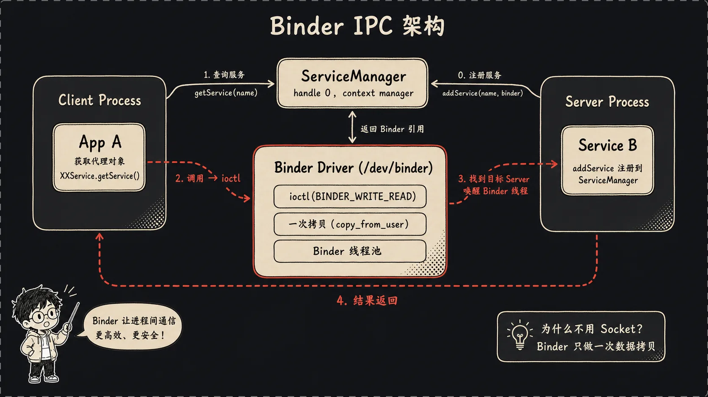

如果把 Android Framework 比成一座城市，Binder 就像神经系统加快递网络。AMS 在 `system_server` 进程里，App 在自己的进程里，SurfaceFlinger 在 native 进程里，ServiceManager 又是另一个进程。它们不在同一个地址空间，不能直接拿对方对象调用方法。可是写 Java 的时候，我们经常像本地调用一样写：

这行代码代表应用侧或客户端侧看到的 Binder 调用表象。先看它，是为了强调 Framework 对调用者隐藏了跨进程细节，让系统服务调用像普通对象方法一样出现。
后面解释 Binder 时，这种“看起来本地、实际远程”的反差就是核心。

```java
// 通过 ActivityManager 代理发起启动 Activity 的请求。
am.startActivity(...);
```

这行执行后，请求并不会停留在当前进程内部。它会被代理对象编码成 Binder 事务，最终送到 `system_server` 里的 AMS。
这说明 Framework API 的简洁性，很大一部分来自 Binder 代理层的封装。

看起来是一行普通方法调用，背后其实是跨进程通信。

Linux 原本就有 IPC：管道、消息队列、共享内存、Socket。Android 为什么还要 Binder？我自己的理解是，**Binder 解决的不是“能不能传数据”，而是“能不能把对象调用、权限身份、生命周期、线程调度这些事情揉到一起”。**Socket 能传字节流，但它不知道你调用的是哪个系统服务；共享内存很快，但同步和权限要自己处理；传统 RPC 可以封装调用，但跟 Linux 进程身份、安全模型、驱动级对象引用结合得没 Binder 这么深。

Binder 有几个**核心角色**：

第一，**Binder 驱动**，通常是 `/dev/binder`。它在内核里，负责转发事务、管理 Binder 引用、唤醒目标进程的 Binder 线程。

第二，**ServiceManager**。它是上下文管理者，拿到特殊句柄 0。别的服务启动后先来注册，客户端要找服务也先问它。

第三，**Client 和 Server 进程**。Client 手里拿的是一个代理对象，Server 进程里有真正实现。Client 发起调用，数据被写进 Parcel，通过 Binder 驱动送到 Server 的 Binder 线程，Server 执行完再把结果回传。

第四，**Binder 线程池**。一个进程如果提供 Binder 服务，通常不会只靠主线程处理请求，而是启动 Binder 线程池。这样多个客户端同时调用时，服务端能并发处理。

Android 2.3 的 native 服务注册模板在 `frameworks/base/include/binder/BinderService.h:34-52`，里面把这个套路写得很直白：

这段模板代码展示 native 服务如何把自己发布到 Binder 服务表。看它的原因是，很多 native 系统服务都复用这个模式：拿到 ServiceManager，再用服务名登记自身实现。
它把服务“上线”的最小动作压缩成了非常短的流程。

```cpp
// 定义发布服务的静态方法。
static status_t publish() {
// 获取 ServiceManager 的 Binder 代理。
sp<IServiceManager> sm(defaultServiceManager());
// 用服务名把新建服务实例注册到 ServiceManager。
return sm->addService(String16(SERVICE::getServiceName()), new SERVICE());
// 结束 publish 方法。
}
```

这段执行完后，客户端就可以通过服务名找到这个 native 服务。关键设计点是服务端不需要把地址告诉每个客户端，只要统一登记到 ServiceManager。
Binder 服务发现因此变成了集中式电话本模型。

再看线程池版本，`frameworks/base/include/binder/BinderService.h:42-47`：

这段代码比上一段多了 Binder 线程池的启动。看它是为了理解服务注册之后还需要有人处理请求，否则服务虽然能被找到，却没人响应事务。
它体现了 Binder 服务端的长期运行形态。

```cpp
// 获取当前进程的 Binder 进程状态对象。
sp<ProcessState> proc(ProcessState::self());
// 获取 ServiceManager 代理用于注册服务。
sp<IServiceManager> sm(defaultServiceManager());
// 将当前服务实例注册到 ServiceManager。
sm->addService(String16(SERVICE::getServiceName()), new SERVICE());
// 启动 Binder 线程池，准备并发处理客户端请求。
ProcessState::self()->startThreadPool();
// 当前线程加入 Binder 线程池并进入等待事务的循环。
IPCThreadState::self()->joinThreadPool();
```

这段执行后，服务进程就不只是完成注册，而是进入可接收 Binder 调用的状态。`startThreadPool()` 和 `joinThreadPool()` 说明 Binder 服务通常依靠线程池处理并发请求。
这也是系统服务能同时响应多个客户端调用的重要基础。

这几行代码特别适合用来理解 Binder。一个服务上线，大概就是三步：找到 ServiceManager，把自己注册进去，开 Binder 线程池等别人来调用。

一次 Binder 调用可以粗略想成打电话：

1. Client 查电话本，拿到目标服务的 Binder 代理。
2. Client 把方法编号和参数塞进 Parcel。
3. Client 通过 `ioctl(BINDER_WRITE_READ)` 把请求交给 Binder 驱动。
4. Binder 驱动找到目标进程，把事务放进目标 Binder 线程的队列。
5. Server 线程醒来，解 Parcel，调用真实对象。
6. 返回值再沿着 Binder 驱动回到 Client。

这里最容易误解的是“Client 拿到的是不是 Server 对象本身”。不是。**跨进程没有“直接拿对象”这回事。Client 拿到的是一个引用，一个能让 Binder 驱动定位到目标对象的句柄。**就像你拿到朋友的电话号码，不代表朋友本人被塞进了你口袋里；你只是有了联系他的入口。

Binder 还有一个非常重要的现实意义：**Framework 的很多边界就是 Binder 边界。**App 调 AMS，是 Binder；App 加窗口到 WMS，是 Binder；Java 层找 native 服务，也经常绕不开 Binder。你理解 Binder 之后，再看 Framework 就不会觉得“为什么一个方法突然跳进另一个进程”那么魔幻。

## 四、ServiceManager：服务的“电话本”

ServiceManager 是我很喜欢拿来入门 Android native 源码的文件，因为它短，而且位置极核心。Android 2.3 的 `frameworks/base/cmds/servicemanager/service_manager.c` 只有 271 行。它不像 AMS 那样一眼看不到头，但它**撑起了整套 Binder 服务发现机制**。

生活类比很简单：ServiceManager 就是电话本，也是总机。服务启动后先告诉它：“我叫 activity，这是我的 Binder。”客户端要找 AMS，就问它：“activity 在哪？”它把对应 Binder 句柄返回给客户端。以后客户端和 AMS 直接通过 Binder 驱动通信，不需要每次都让 ServiceManager 参与。

ServiceManager 启动后会打开 Binder 驱动，并把自己注册成 context manager。看 `frameworks/base/cmds/servicemanager/service_manager.c:259-269`：

这段代码是 ServiceManager 成为 Binder 世界固定入口的关键。看它是为了确认 ServiceManager 不是普通服务，它需要先打开 Binder 驱动，再申请 context manager 身份。
只有这个身份建立后，句柄 0 才有意义。

```c
// 打开 Binder 驱动并设置映射缓冲区大小。
bs = binder_open(128*1024);
// 尝试把当前进程注册为 Binder context manager。
if (binder_become_context_manager(bs)) {
// 注册失败时输出错误原因。
LOGE("cannot become context manager (%s)\n", strerror(errno));
// 无法成为 context manager 时直接退出启动流程。
return -1;
// 结束 context manager 注册失败分支。
}
```

这段执行成功后，**ServiceManager 才真正拥有“总机”身份**。后续服务注册和查询才能从固定 Binder 入口开始。
如果这里失败，整个 Binder 服务发现机制就没有中心节点可用。

后面一行很关键：

这两行把 ServiceManager 的处理函数挂到 Binder 循环上。看它的原因是，成为 context manager 只是拿到身份，真正提供查询和注册能力还要进入事件循环。
`svcmgr_handler` 就是后面分发请求的核心函数。

```c
// 保存 ServiceManager 自身的 Binder 句柄。
svcmgr_handle = svcmgr;
// 进入 Binder 循环，并把收到的事务交给 svcmgr_handler 处理。
binder_loop(bs, svcmgr_handler);
```

这段执行后，ServiceManager 会长期阻塞在 Binder 循环里等待请求。客户端发来的 addService、getService、checkService 都会被转到 handler。
它说明 ServiceManager 的核心工作是事件驱动的请求分发。

`binder_become_context_manager()` 这件事可以理解成“我就是这座城市的总机”。Binder 世界里大家约定句柄 0 指向它，所以客户端不需要先知道 ServiceManager 在哪，直接从固定入口找。

真正处理请求的是 `svcmgr_handler`。`frameworks/base/cmds/servicemanager/service_manager.c:218-233` 里可以看到三类核心操作：

这段代码展示 ServiceManager 如何识别查询类请求。先看它，是为了把 Java 或 native 层的 `getService` 调用对应到 native switch 分发逻辑。
它也说明服务名是从 Binder 消息体里解析出来的。

```c
// 根据 Binder 事务码分发不同的服务管理操作。
switch(txn->code) {
// 处理 getService 请求。
case SVC_MGR_GET_SERVICE:
// 处理 checkService 请求。
case SVC_MGR_CHECK_SERVICE:
// 从请求消息中读取 UTF-16 服务名。
s = bio_get_string16(msg, &len);
```

这段执行后，ServiceManager 知道客户端要查询哪个服务名。接下来它会在内部服务表里查找对应 Binder 引用，并把结果写回回复消息。
`getService` 和 `checkService` 共用读取服务名的入口，差异主要在找不到时的行为。

注册服务也在这里：

这段代码对应服务端调用 `addService` 的路径。看它是为了理解服务是怎样从一个 Binder 引用变成 ServiceManager 表里的条目的。
它还把注册行为和调用者身份校验联系起来。

```c
// 处理 addService 注册请求。
case SVC_MGR_ADD_SERVICE:
// 从消息中读取要注册的服务名。
s = bio_get_string16(msg, &len);
// 从消息中读取服务端传来的 Binder 引用。
ptr = bio_get_ref(msg);
// 调用注册逻辑，并带上发送者 euid 做权限判断。
if (do_add_service(bs, s, len, ptr, txn->sender_euid))
```

这段执行后，合法服务会被加入 ServiceManager 的服务表。客户端以后只需要拿服务名查询，就能拿到对应 Binder 引用。
这里的 `sender_euid` 也说明 Binder 调用天然携带调用方身份，方便服务管理层做权限控制。

所以 **ServiceManager 的核心动作就三个**：

- **`addService`**：服务端把自己登记进来。
- **`getService`**：客户端查服务，如果没有可能等待。
- **`checkService`**：客户端查服务，如果没有就直接返回空。

Java 层也有一个 `ServiceManager` 类，但它不是另一个真正的服务中心，而是客户端代理。Java 世界调用 `ServiceManager.getService("activity")`，最后还是通过 Binder 去问 native 的 servicemanager。这个设计有点像你手机通讯录 App 和运营商网络的关系：你点的是图形界面，真正打出去还是底层通信系统。

ServiceManager 的短小很有迷惑性。它代码少，不代表它不重要。恰恰相反，**因为它站在 Binder 服务发现的最前面，所以它必须尽量简单、稳定、少依赖。**越核心的地基越不能花里胡哨。

## 五、Zygote：Android 的“孵化器”

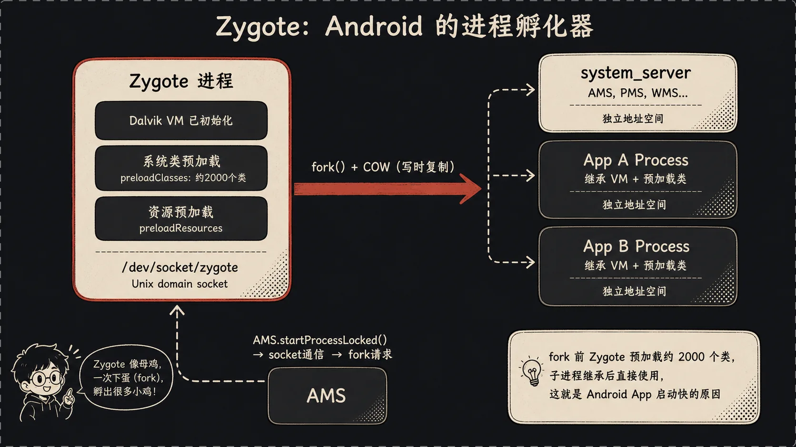

Zygote 是 Android 里特别聪明的设计。它的名字本来就是“受精卵”，我更喜欢把它想成一只提前把窝、温度、饲料都准备好的母鸡。普通应用进程不是从零开始搭灶台，而是从 Zygote 这里 fork 出来，天然继承了一大堆已经预加载好的东西。

`init.rc` 里定义 Zygote 的地方是 `system/core/rootdir/init.rc:327-328`：

这段配置是 Zygote 从开机脚本进入运行态的起点。看它是为了确认 Zygote 并不是 Java 代码自己启动的，而是由 init 按服务定义拉起。
同时，它把后面 SystemServer 的启动参数也提前放进了命令行。

```rc
# 定义 zygote 服务，并通过 app_process 传入 Zygote 模式和启动 SystemServer 的参数。
service zygote /system/bin/app_process -Xzygote /system/bin --zygote --start-system-server
# 创建 zygote socket，让 AMS 等进程可以向 Zygote 发送 fork 请求。
socket zygote stream 666
```

这段执行后，Zygote 进程和它的命令 socket 都会由 init 管理。后面所有普通 App 进程的创建，都会沿着这个 socket 请求进入 Zygote。
这说明 Android 把进程孵化入口固定在一个长期运行的服务上。

这里能看到几个关键词：**`app_process`、`--zygote`、`--start-system-server`、`socket zygote`**。Zygote 本质上不是一个神秘二进制，它是 `app_process` 按 Zygote 模式启动出来的 Dalvik VM 进程。

入口在 `frameworks/base/cmds/app_process/app_main.cpp`。`frameworks/base/cmds/app_process/app_main.cpp:150-159` 里判断参数：

这段 native 代码负责把 `app_process` 的命令行参数解释成 Zygote 启动模式。看它的原因是，Zygote 的 Java 入口并不是硬编码直接进入，而是由 native 层根据 `--zygote` 参数选择出来。
`--start-system-server` 也在这里被转换成布尔含义。

```cpp
// 判断当前参数是否要求进入 Zygote 模式。
if (0 == strcmp("--zygote", arg)) {
// 根据后续参数决定是否启动 SystemServer。
bool startSystemServer = (i < argc) ?
// 检查命令行中是否带有 --start-system-server。
strcmp(argv[i], "--start-system-server") == 0 : false;
// 启动 Dalvik 运行时，并进入 ZygoteInit Java 入口。
runtime.start("com.android.internal.os.ZygoteInit",
```

这段执行后，控制权会从 native `app_process` 交给 Java 层的 `ZygoteInit`。这一步是 Android 从 native 启动器进入 Java Framework 世界的关键跳转。
如果没有 `--zygote` 分支，`app_process` 也可以承担其他 Java 进程入口职责。

也就是说，native 的 `app_process` 最后把 Java 世界的入口交给了 `com.android.internal.os.ZygoteInit`。

`ZygoteInit` 的主流程在 `frameworks/base/core/java/com/android/internal/os/ZygoteInit.java`。看 `ZygoteInit.java:561-567`：

这段代码展示 Zygote 启动后最有价值的准备工作。看它是为了理解为什么 Zygote fork 出来的进程启动快：它先建立命令入口，再提前装载常用类和资源。
这也是写时复制能发挥作用的前提。

```java
// 注册 Zygote 的 Unix domain socket，等待外部 fork 命令。
registerZygoteSocket();
// 写入预加载开始的启动进度事件。
EventLog.writeEvent(LOG_BOOT_PROGRESS_PRELOAD_START,
// 记录当前开机后运行时间作为事件时间戳。
SystemClock.uptimeMillis());
// 预加载 Framework 常用 Java 类。
preloadClasses();
// 预加载系统常用资源，减少子进程重复加载成本。
preloadResources();
```

这段执行完后，Zygote 已经具备接收命令和快速 fork 的基础条件。后续子进程会继承这些预加载结果，只有写入时才复制内存页。
关键设计点是把公共初始化成本集中在父进程中支付一次。

这几行就是 Zygote 的精华。**先注册一个 Unix domain socket，让别人能给它发命令；再预加载系统类和资源。**预加载为什么有用？因为 fork 有写时复制，也就是 COW。父进程 Zygote 先把常用类、资源加载到内存，fork 子进程时，子进程一开始共享这些内存页。只要不写，就不用复制。于是**每个 App 不必重新加载一遍 Framework 类，启动速度和内存占用都能省下来**。

可以把它想成开餐馆。每来一桌客人再洗菜、切菜、烧水，会很慢。Zygote 是开门前先把基础配料备好。客人来了，厨房分一个小灶出去，基础配料直接用，只有客人点的特殊菜才单独处理。

Zygote 还负责启动 `system_server`。`ZygoteInit.java:576-582` 写得很直接：

这段代码决定当前 Zygote 是否要 fork 出 SystemServer。看它是为了把 `init.rc` 里的 `--start-system-server` 参数，和 Java 层真正启动系统服务进程的动作对应起来。
它也说明 SystemServer 是 Zygote 主流程中的特殊子进程。

```java
// 判断参数是否要求启动 SystemServer。
if (argv[1].equals("true")) {
// fork 并启动 system_server 进程。
startSystemServer();
// 如果参数既不是 true 也不是 false，则视为非法输入。
} else if (!argv[1].equals("false")) {
// 抛出异常并提示正确用法。
throw new RuntimeException(argv[0] + USAGE_STRING);
// 结束 SystemServer 启动参数判断。
}
```

这段执行后，如果参数为 true，`system_server` 就会作为 Zygote 的子进程出现。AMS、PMS、WMS 等 Java 系统服务随后都会在这个进程里注册和运行。
它说明 Android 的核心 Java 服务进程不是由 init 直接启动，而是由 Zygote fork 出来。

这个 `true` 就来自 `app_process` 收到的 `--start-system-server` 参数。也就是说，**`system_server` 是 Zygote fork 出来的第一个重量级 Java 子进程**。后面的 AMS、PMS、WMS 基本都跑在它里面。

Zygote 准备好以后，会进入 socket 监听循环。`ZygoteInit.java:587-592`：

这段代码让 Zygote 从初始化阶段进入常驻服务阶段。看它是为了理解 Zygote 后续如何持续接收 AMS 的进程启动请求。
不同 fork 模式下入口不同，但目标都是等待命令并创建子进程。

```java
// 打印开始接收 Zygote socket 连接的日志。
Log.i(TAG, "Accepting command socket connections");
// 判断是否启用 fork mode。
if (ZYGOTE_FORK_MODE) {
// 进入 fork mode 的命令处理循环。
runForkMode();
// 未启用 fork mode 时走 select 循环模式。
} else {
// 进入基于 select 的 socket 监听循环。
runSelectLoopMode();
```

这段执行后，Zygote 会停留在命令监听循环中。AMS 后续请求新建进程时，命令会通过 socket 到达这里，再触发 fork。
这说明 Zygote 的主体工作不是一次性启动，而是长期等待并响应进程创建请求。

普通 App 进程的诞生就发生在这里。AMS 需要启动新进程时，不是自己 fork，而是通过 `android.os.Process` 去连 Zygote socket。`frameworks/base/core/java/android/os/Process.java:43-47` 能看到 Java 进程管理类和 socket 名：

这段代码展示 Java 层进程管理入口和 Zygote socket 名的对应关系。看它是为了把 AMS 调用 `Process.start()` 的路径，和 init.rc 中声明的 `socket zygote` 对上。
服务名一致，才能让 Java 层准确找到 Zygote 命令通道。

```java
// 定义 Android Java 层的进程管理工具类。
public class Process {
// 定义该类使用的日志标签。
private static final String LOG_TAG = "Process";
// 空行，分隔日志字段和 Zygote socket 字段。
// 定义连接 Zygote 时使用的 socket 名称。
private static final String ZYGOTE_SOCKET = "zygote";
```

这段说明 Java 层写死了要连接名为 `zygote` 的 socket。只要它和 init 创建的 socket 名一致，AMS 就能通过 `Process` 把启动请求发给 Zygote。
这也是 Android 进程启动链路中配置名和代码常量互相对齐的例子。

这个名字和 `init.rc` 里的 `socket zygote stream 666` 对上了。AMS 调 `Process.start()`，Process 类向 Zygote socket 写命令，Zygote 收到后 fork，子进程再进入 `ActivityThread.main()`。这样一来，启动 App 进程这件事就变成了一条固定流水线。

Zygote 这套设计的妙处在于，它不是单纯为了“能启动进程”。Linux 本来就能 fork。**它真正解决的是“每个 Android App 都需要一套 Java 运行环境和 Framework 基础类，怎样让这个成本别每次都完整付一遍”。**这就是 Zygote 值得反复看的原因。

## 六、SystemServer：大管家上线

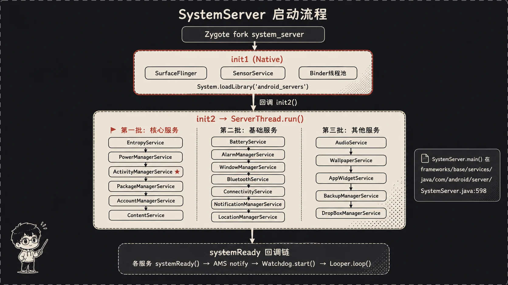

Zygote fork 出 `system_server` 以后，Android 的大管家就上线了。前面 init 像开店第一个到的人，ServiceManager 像电话本，Zygote 像孵化器；SystemServer 更像店长。它不一定亲自做所有事，但它负责把各个部门叫起来：电力、窗口、应用管理、包管理、通知、网络、定位、输入法。

SystemServer 的 Java 入口在 `frameworks/base/services/java/com/android/server/SystemServer.java:598`。`SystemServer.java:596-626` 里能看到两段关键动作：

这段代码展示 SystemServer 入口如何先穿过 native 层。看它是为了理解 `system_server` 并不是只启动 Java 服务，它还要先加载承载底层服务桥接的 native 库。
`init1()` 是 Java 主入口继续进入 native 初始化的门。

```java
// 声明 native 初始化入口，由 android_servers 库实现。
native public static void init1(String[] args);
// 空行，分隔 native 方法声明和 main 入口。
// 定义 SystemServer 的 Java 主入口。
public static void main(String[] args) {
// 加载 android_servers native 库。
System.loadLibrary("android_servers");
// 调用 native 初始化流程。
init1(args);
// 结束 main 方法。
}
```

这段执行后，SystemServer 会从 Java 入口进入 native 初始化。native 层可以先准备图形、传感器等更靠近底层的服务，再回到 Java 层继续启动 AMS、PMS、WMS。
这个设计说明 **SystemServer 是 Java 和 native 系统服务的汇合点**。

这说明 SystemServer 启动不是纯 Java。它先加载 `android_servers` 这个 native 库，然后调用 `init1()`。Android 2.3 里有很多 C++ 系统服务要先准备，比如 SurfaceFlinger、SensorService 这类和底层硬件、图形显示关系更近的服务。

然后 native 层会回到 Java 的 `init2()`。`SystemServer.java:628-632`：

这段代码是 SystemServer 回到 Java 服务注册阶段的入口。看它是为了定位 `ServerThread` 从哪里开始运行，因为后面大量系统服务都是在这个线程里依次创建的。
它也把启动过程从一次性函数调用转成带 Looper 的长期服务线程。

```java
// 定义 native 初始化后回调的 Java 第二阶段入口。
public static final void init2() {
// 打印进入 SystemServer 的日志。
Slog.i(TAG, "Entered the Android system server!");
// 创建负责启动 Java 系统服务的 ServerThread。
Thread thr = new ServerThread();
// 设置线程名，方便日志和调试识别。
thr.setName("android.server.ServerThread");
```

这段执行后，Java 系统服务启动线程已经创建并命名。接下来它会在自己的运行流程里按顺序注册关键服务。
这说明 SystemServer 的服务启动不是散落在各处，而是集中在 ServerThread 这条主线上。

`ServerThread` 就是 Java 系统服务注册的主战场。你可以把它想成开店早会：先叫关键岗位，再叫基础岗位，最后通知所有人“可以接客了”。

第一批是关键服务。`SystemServer.java:131-149`：

这段代码展示 ServerThread 开始启动最早的一批系统服务。看它是为了理解 SystemServer 注册服务的顺序是有依赖关系的，不是随便 new 一堆对象。
Entropy 和 Power 这类服务会被后续系统能力依赖。

```java
// 打印开始启动 Entropy Service 的日志。
Slog.i(TAG, "Entropy Service");
// 创建 EntropyService 并注册到 ServiceManager。
ServiceManager.addService("entropy", new EntropyService());
// 打印开始启动 Power Manager 的日志。
Slog.i(TAG, "Power Manager");
// 创建 PowerManagerService 实例，准备后续注册和使用。
power = new PowerManagerService();
```

这段执行后，基础服务开始进入 ServiceManager 或准备被其他服务引用。它说明 SystemServer 会先建立底层依赖，再启动更复杂的应用管理和窗口管理服务。
服务顺序本身就是 Framework 初始化设计的一部分。

AMS 和 PMS 也在这附近启动，`SystemServer.java:140-149`：

这段代码把应用调度中心和包档案中心接入启动流程。看它是为了确认 AMS、PMS 的创建发生得很早，因为后续启动 Home、解析 Intent、检查权限都依赖它们。
它们是 Java Framework 服务链路中的核心节点。

```java
// 打印开始启动 Activity Manager 的日志。
Slog.i(TAG, "Activity Manager");
// 启动 AMS，并取得系统 Context。
context = ActivityManagerService.main(factoryTest);
// 打印开始启动 Package Manager 的日志。
Slog.i(TAG, "Package Manager");
// 启动 PMS，并传入 AMS 创建出的系统 Context。
pm = PackageManagerService.main(context,
```

这段执行后，AMS 和 PMS 开始成为系统服务图的一部分。AMS 提供组件和进程调度能力，PMS 提供包、组件和权限档案。
这里也体现了 AMS 先产生系统 Context，再供 PMS 等服务继续使用的依赖关系。

注意 AMS 的启动方式和普通服务不太一样。很多服务是 `new XxxService()` 后 `ServiceManager.addService()`，而 AMS 通过 `ActivityManagerService.main(factoryTest)` 拉起来。AMS 太核心了，它不只是一个 Binder 服务，还要创建系统 Context、管理 Activity 栈、管理进程表，后面很多服务都依赖它。

WMS 稍后启动。`SystemServer.java:194-200`：

这段代码展示窗口管理服务的创建和注册。看它是为了把 Activity 生命周期管理和屏幕窗口显示之间的桥接点找出来。
WMS 需要 Context、Power 等依赖，因此会在关键基础服务之后启动。

```java
// 打印开始启动 Window Manager 的日志。
Slog.i(TAG, "Window Manager");
// 创建 WMS，并传入系统 Context 和电源服务引用。
wm = WindowManagerService.main(context, power,
// 根据工厂测试模式决定 WMS 的启动参数。
factoryTest != SystemServer.FACTORY_TEST_LOW_LEVEL);
// 将 WMS 注册为 window 系统服务。
ServiceManager.addService(Context.WINDOW_SERVICE, wm);
```

这段执行后，客户端就能通过 `Context.WINDOW_SERVICE` 找到 WMS。窗口层级、焦点、输入分发和 Surface 协调等能力开始由 WMS 接管。
它说明窗口系统也是通过 Binder 服务注册进入 Framework 的。

紧接着还有一行：

这行代码把 AMS 和 WMS 显式连接起来。看它的原因是，Activity 是否在前台由 AMS 管，而窗口是否显示、如何显示由 WMS 管，两者必须互相知道。
SystemServer 在这里完成了这两个核心服务之间的依赖注入。

```java
// 从 ServiceManager 取回 activity 服务并转成 AMS。
((ActivityManagerService)ServiceManager.getService("activity"))
// 把 WMS 引用设置给 AMS。
.setWindowManager(wm);
```

这段执行后，AMS 在调度 Activity 可见性和生命周期时就能通知或查询 WMS。Activity 启动不再只是进程和组件状态变化，也能和窗口显示状态联动。
关键设计点是 AMS 和 WMS 分工清晰，但通过 SystemServer 建立协作关系。

这行很有意思。AMS 和 WMS 是两个不同职责的系统服务，但 Activity 启动和窗口显示离不开彼此。AMS 决定哪个 Activity 在前台，WMS 决定窗口怎么摆、谁有焦点、输入给谁。SystemServer 在这里把它们接上了。

**SystemServer 注册服务不是随便排队。**Power 要早，因为系统电源状态影响很多服务；AMS 要早，因为后面服务可能需要 Context、进程和组件管理；PMS 要早，因为系统得知道装了哪些包、哪些组件；WMS 要在合适时机接入，因为 UI 显示、输入和 Activity 可见性都要它参与。

最后是 `systemReady` 回调链。`SystemServer.java:513-533`：

这段代码进入系统核心服务“准备完成”的回调阶段。看它是为了理解服务注册只是第一步，很多会触发第三方组件或 UI 的动作必须等核心服务稳定后才执行。
`Runnable` 里的内容就是延迟到 ready 阶段再做的工作。

```java
// 调用 systemReady，并传入系统准备完成后的回调。
.systemReady(new Runnable() {
// 定义 ready 回调真正执行的逻辑。
public void run() {
// 打印服务进入 ready 阶段的日志。
Slog.i(TAG, "Making services ready");
// 如果状态栏服务存在，则通知它进入第二阶段 ready。
if (statusBarF != null) statusBarF.systemReady2();
```

这段执行后，系统可以开始放开依赖核心服务稳定性的功能。状态栏、桌面、输入法、壁纸等组件通常要等到这个阶段才更安全。
它说明 Android 启动流程有“创建服务”和“服务 ready”两个层次。

这一步像开店前最后喊一句“各岗位检查完毕，可以营业”。有些服务不能太早启动第三方代码，比如桌面、输入法、壁纸、小部件，它们要等系统核心服务稳定以后再放开。

`ServerThread` 最后进入消息循环，`SystemServer.java:542`：

这行代码让 ServerThread 从启动过程转入长期事件处理。看它是为了理解 SystemServer 不是启动完就退出，而是要持续处理 Handler 消息、Binder 回调和系统事件。
没有 Looper，很多 Java 系统服务就无法在这个线程上接收异步任务。

```java
// 进入当前线程的消息循环，持续处理系统服务事件。
Looper.loop();
```

这行执行后，ServerThread 会一直运行，等待消息队列里的任务。SystemServer 因此成为一个常驻的 Java 系统进程，而不是短命初始化程序。
这也是 AMS、PMS、WMS 等服务能持续工作的线程基础。

到这里，**`system_server` 不再是“一次性启动脚本”，而是一个长期运行的 Java 进程。**AMS、PMS、WMS、Notification、Location 等服务都在里面处理 Binder 调用、Handler 消息和系统事件。**Android Framework 的 Java 中枢，基本就坐在这里。**

## 七、四大组件：应用模型的四个入口

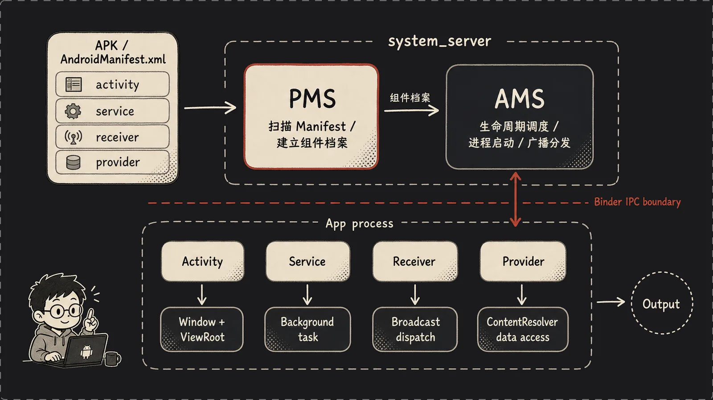


继续往 AMS 走之前，先把四大组件单独拎出来。Android 应用不是一个单纯的 `main()` 函数，而是一组由系统按需调度的入口：Activity 负责界面，Service 负责后台能力，BroadcastReceiver 负责事件接收，ContentProvider 负责结构化数据共享。它们大多先写进 `AndroidManifest.xml`，由 PMS 扫描成组件档案；真正运行时，再由 AMS 按 Intent、权限、进程和生命周期状态把它们调起来。

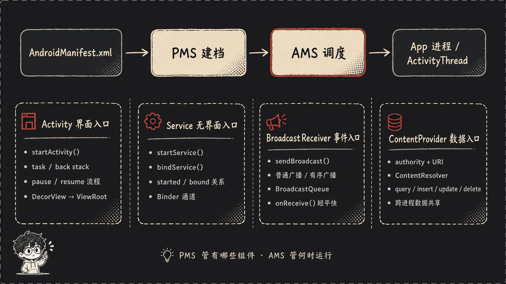

这也是 Android 应用模型和普通 Java 程序差异最大的地方。你写的类不一定由你自己 `new` 出来，很多时候是系统先根据 Manifest 找到组件记录，再决定是否启动目标进程，最后由目标进程里的 ActivityThread 反射创建组件对象并回调生命周期方法。**PMS 负责“系统知道有哪些组件”，AMS 负责“这些组件什么时候、在哪个进程、以什么状态运行”。**

先看 Activity。Activity 最直观，它代表一个可交互界面，但 Framework 眼里的 Activity 不是一个普通页面类，而是任务栈里的一个可调度记录。Launcher 点击图标、别的应用发 `Intent`、应用自己调用 `startActivity()`，最后都会进到 AMS。AMS 要解析目标 Activity，检查权限和 intent-filter，选择或创建 task，判断当前前台 Activity 是否要 pause，再安排目标 Activity 进入 launch、start、resume 流程。

Activity 的生命周期方法，比如 `onCreate()`、`onStart()`、`onResume()`、`onPause()`、`onStop()`，不是应用自己随便调用的，而是 AMS 通过 Binder 把调度消息发给应用进程，再由 ActivityThread 在主线程里执行。这里有个很重要的细节：**Activity 进入 resumed，不等于屏幕上已经有像素。**resumed 只说明它在组件生命周期上到了前台交互状态；真正显示还要等 DecorView 加到 WindowManager，ViewRoot 完成 measure、layout、draw，SurfaceFlinger 合成出画面。后面沿着 Activity 启动往下走，就是因为它能把 Zygote、ActivityThread、WMS 和 ViewRoot 全部串起来。

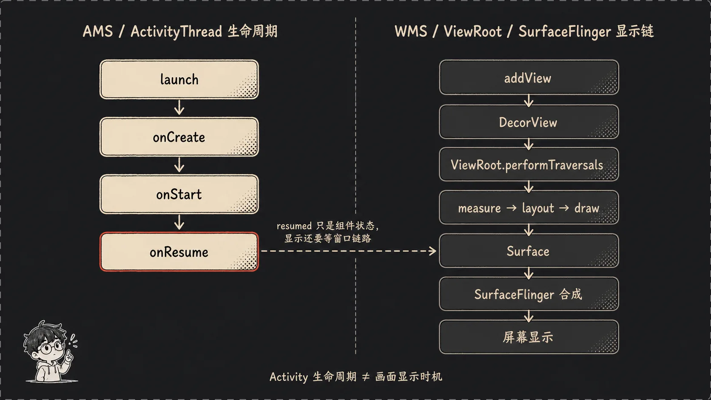

再看 Service。Service 没有界面，但它也不是“后台线程”的同义词。它更像系统托管的一段无界面能力：音乐播放、下载队列、远程 Binder 接口、同步任务，都可以通过 Service 暴露。`startService()` 偏向“把这个任务启动起来”，Service 会走 `onCreate()`、`onStartCommand()`，在 Android 2.3 里还会兼容更早的 `onStart()`；`bindService()` 偏向“建立一个可调用连接”，客户端拿到 `IBinder` 后可以和 Service 交互。

Service 的麻烦在于它有两套关系：started 和 bound。一个 Service 可能只被 start，可能只被 bind，也可能既被 start 又被 bind。AMS 要记录谁启动了它、谁绑定了它、目标进程是否存在、连接断开后要不要重连、Service 超时是否要触发 ANR。它还会影响进程优先级：带有活跃 Service 的进程通常不能简单当作普通后台缓存进程处理。**Service 是组件入口，不是线程；耗时工作仍然要放到工作线程或任务队列里。**

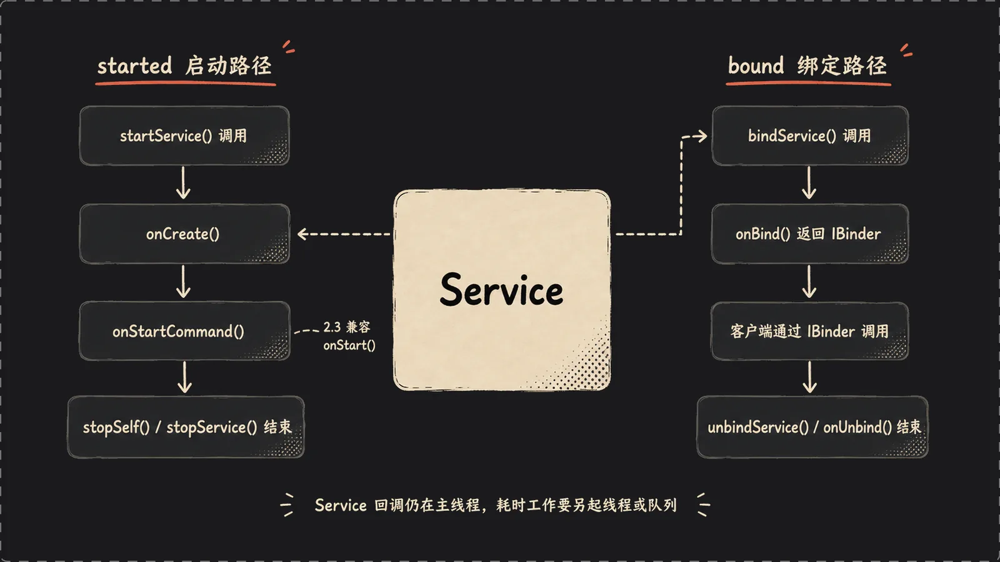

BroadcastReceiver 是事件入口。系统广播、电量变化、安装卸载、网络变化、应用自己发出的 Intent，都可能进入广播队列。Receiver 可以静态声明在 Manifest 里，让 PMS 扫描后长期知道“这个应用能接什么事件”；也可以在运行时注册，跟当前进程或某个组件的生命周期绑在一起。AMS 分发广播时会维护广播队列，并区分普通广播和有序广播：普通广播更像把事件发给一批接收者；有序广播则按优先级一个个派发，前一个 Receiver 可以设置结果，甚至中止继续分发。

Receiver 最容易踩的坑是把它当成“可以慢慢干活的后台入口”。不是。`onReceive()` 通常应该短平快：读一下 Intent、做轻量判断、记录状态，必要时再转交给 Service 或其他任务队列。如果它在主线程里做网络请求、长时间 IO 或复杂计算，不只是当前应用卡，严重时还会拖住有序广播队列。**BroadcastReceiver 的价值是接住事件，不是承包事件之后的所有工作。**

最后是 ContentProvider。Provider 是数据入口，核心标识不是类名，而是 authority 和 URI。调用方通常不直接拿 Provider 对象，而是通过 `ContentResolver` 访问类似 `content://authority/path/1` 这样的 URI，再发起 `query()`、`insert()`、`update()`、`delete()`、`getType()` 等操作。PMS 负责解析 Provider 声明里的 authority、读写权限、导出状态；AMS 负责在访问发生时启动或复用 Provider 所在进程，等待 Provider 发布出来，再把对应 Binder 通道交给调用方。

Provider 的特殊之处在于它可能很早参与进程启动。很多应用进程起来后，会先安装 Provider，再创建 Activity；跨进程访问 Provider 时，调用方甚至可能间接把目标应用进程拉起来。它解决的是结构化数据跨进程访问，权限也经常围绕 URI 展开，比如读权限、写权限和临时授权。理解 Provider 时，不要只把它看成数据库封装，它更像 Android 应用之间共享数据的一扇系统门。

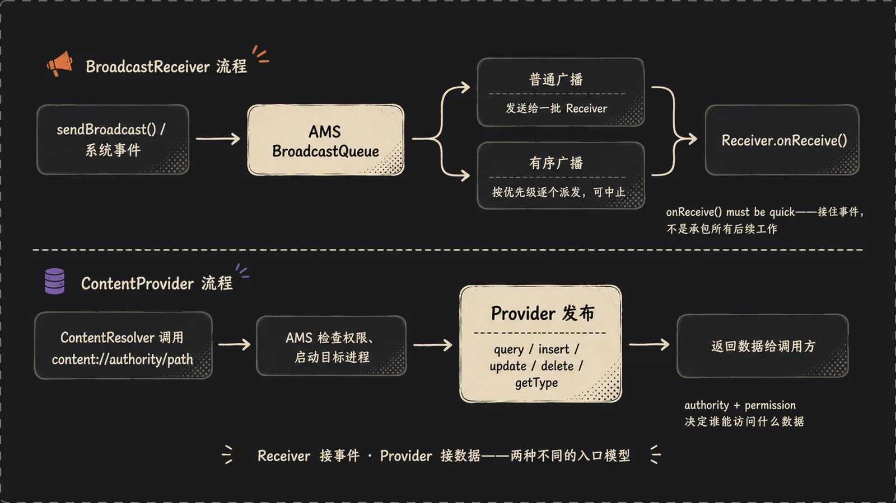

所以四大组件可以先这样记：

- **Activity**：界面入口，重点是 task、back stack、生命周期和窗口显示之间的衔接。
- **Service**：无界面能力入口，重点是 started、bound、Binder 连接和进程优先级。
- **BroadcastReceiver**：事件入口，重点是广播队列、有序广播、超时和短生命周期。
- **ContentProvider**：数据入口，重点是 authority、URI、权限和跨进程数据访问。

这四个入口的价值不在于“类名不同”，而在于它们把应用能力拆成了几种系统能理解、能管理、能回收的形态。界面要有前后台和任务栈，后台能力要有启动和绑定关系，事件要有队列和超时，数据访问要有 authority 和权限。Framework 能统一调度应用，靠的正是这些入口被声明、建档、解析、分发。

## 八、ActivityManagerService：进程与组件的指挥官

AMS 是 Android Framework 里最容易把人劝退的类之一。Android 2.3 的 `frameworks/base/services/java/com/android/server/am/ActivityManagerService.java` 正好 12484 行。它太大了，因为它管的事太多：四大组件、进程、Activity 栈、广播、服务绑定、ContentProvider 发布、OOM adj、ANR、前后台切换，很多东西最后都要汇到它这里。

我习惯把 AMS 想成调度中心。城市里有人要开店、有人要送货、有人要占路施工，不能每个人自己说了算，要有一个中心知道“谁在前台、谁能启动、谁该被杀、谁卡住了”。AMS 做的就是这个。

先看启动 Activity 的入口。`ActivityManagerService.java:2076-2083`：

这段代码是客户端请求启动 Activity 后进入 AMS 的公开入口。看它是为了知道 Launcher 或其他 App 的 `startActivity()` 最终会落到哪里。
参数很多，正好说明启动 Activity 不是单纯传一个 Intent，还要携带调用者、返回目标、权限授予和请求码等上下文。

```java
// 定义启动 Activity 的 Binder 入口，并接收调用方线程代理。
public final int startActivity(IApplicationThread caller,
// 接收目标 Intent、解析类型和临时授权的 Uri 列表。
Intent intent, String resolvedType, Uri[] grantedUriPermissions,
// 接收 Uri 授权模式和用于返回结果的目标 Binder。
int grantedMode, IBinder resultTo,
// 接收结果标识、请求码和是否仅在需要时启动的标记。
String resultWho, int requestCode, boolean onlyIfNeeded,
```

这段代码说明 AMS 拿到的是一次完整的启动请求上下文。后续它会基于这些信息做权限、任务栈、目标组件和结果回传相关判断。
**关键设计点是 Activity 启动从入口处就被纳入系统级调度，而不是由调用方自行决定。**

真正往下交给 ActivityStack，`ActivityManagerService.java:2081-2083`：

这段代码把 AMS 的入口请求转交给 ActivityStack。看它是为了理解 AMS 本身并不把所有栈细节塞在入口方法里，而是交给专门管理 Activity 栈的对象继续处理。
这也让启动流程从“收到请求”进入“等待并安排栈状态”的阶段。

```java
// 把调用方、Intent 和解析类型交给主 Activity 栈处理。
return mMainStack.startActivityMayWait(caller, intent, resolvedType,
// 继续传递 Uri 授权、结果目标和结果标识。
grantedUriPermissions, grantedMode, resultTo, resultWho,
// 传递请求码、启动条件、调试标记和额外选项。
requestCode, onlyIfNeeded, debug, null, null);
```

这段执行后，ActivityStack 会继续解析目标、处理 task、pause 当前 Activity，并决定是否需要启动进程。AMS 入口方法因此保持为调度入口，具体栈迁移交给栈管理逻辑。
这说明 AMS 内部也按职责拆出了关键子模块。

这里的 `mMainStack` 就是 Activity 栈管理的核心入口之一。AMS 收到 startActivity 请求后，不只是“创建一个 Activity”这么简单。它要先做一堆判断：Intent 能不能解析到目标组件？调用方有没有权限？目标 Activity 应该进哪个 task？当前前台 Activity 要不要 pause？目标进程是否已经存在？如果不存在，要不要先启动进程？

进程启动这件事走 `startProcessLocked()`。`ActivityManagerService.java:1819-1820`：

这段代码是 AMS 决定创建应用进程时进入的内部方法。看它是为了把 Activity 启动流程和 Zygote fork 流程接上：只有目标进程不存在或需要新进程时，才会走到这里。
方法名里的 `Locked` 也提示它运行在 AMS 内部锁保护的状态更新区间。

```java
// 定义启动进程的内部方法，并传入目标进程记录。
private final void startProcessLocked(ProcessRecord app,
// 接收启动原因类型和原因名称，便于记录进程由谁托管启动。
String hostingType, String hostingNameStr) {
```

这段执行时，AMS 已经有了要启动的进程记录。接下来它会计算 uid、gids、调试标记等启动参数，再把真正 fork 的动作交给 Zygote。
这说明 AMS 管的是进程策略和状态，不直接承担底层 fork。

中间会计算 uid、gids、debugFlags。真正向 Zygote 发起进程启动请求的是 `ActivityManagerService.java:1874-1876`：

这段代码是 AMS 调用 Zygote 创建应用进程的关键点。看它是为了确认目标进程入口是 `android.app.ActivityThread`，而不是具体的 Activity 类。
它也展示了进程名、uid、gid 和调试标记如何一起传给底层进程启动 API。

```java
// 请求创建新进程，并指定 Java 入口类为 ActivityThread。
int pid = Process.start("android.app.ActivityThread",
// 根据进程管理模式传入进程名，并设置 uid/euid。
mSimpleProcessManagement ? app.processName : null, uid, uid,
// 传入附加组、调试标记和额外 zygote 参数。
gids, debugFlags, null);
```

这段执行后，`Process.start()` 会通过 Zygote socket 发出 fork 请求，并返回新进程 pid。新进程进入的是 ActivityThread 主入口，再由它接收 AMS 的 launch 消息创建具体 Activity。
关键设计点是 AMS 启动的是应用进程容器，Activity 实例创建发生在目标进程内部。

这三行把前面 Zygote 那章接上了。**AMS 自己不 fork，它调用 `Process.start()`；`Process` 连接名为 `zygote` 的 socket；Zygote fork 子进程；子进程启动 `android.app.ActivityThread`。**所以你看到一个 App 图标被点开，背后不是 Launcher 直接 new Activity，而是 Launcher 通过 Binder 请求 AMS，AMS 通过 Zygote 创建或复用目标进程，再由目标进程里的 ActivityThread 创建 Activity。

AMS 还要管进程优先级。Android 是移动系统，内存紧张时必须杀进程，但不能乱杀。前台 Activity、可见 Activity、Service、后台缓存进程，优先级不一样。AMS 会维护 OOM adj，把这些状态告诉底层 low memory killer。你可以把它想成医院急诊分诊：资源不够时，先保命，再保重要功能，最后才处理不活跃的后台缓存。

ANR 也绕不开 AMS。主线程卡住、广播超时、Service 超时，最后要由 AMS 判断和弹框。ANR 的本质不是“线程慢了一点”，而是系统约定某类操作必须在限定时间回应，否则用户就失去控制感。AMS 站在调度中心的位置，最适合做这个判断。

AMS 还有一个启动完成阶段的入口，`ActivityManagerService.java:6089-6100`：

这段代码是 AMS 接收 SystemServer ready 通知的入口。看它是为了理解 AMS 在系统服务注册完成后，还要进行一次全局 ready 阶段切换。
这个阶段通常会触发 Home 启动、延迟初始化和第三方组件放行。

```java
// 定义 AMS 的系统 ready 回调入口。
public void systemReady(final Runnable goingCallback) {
// 进入 AMS 对象锁，保护 ready 状态检查和更新。
synchronized(this) {
// 如果系统已经 ready，则避免重复执行初始化。
if (mSystemReady) {
// 如果有回调，仍然执行传入的后续动作。
if (goingCallback != null) goingCallback.run();
// 直接返回，结束重复 ready 调用。
return;
```

这段执行后，AMS 会根据 `mSystemReady` 决定是跳过重复初始化，还是继续进入真正的 ready 流程。它说明 ready 阶段必须具备幂等保护，避免系统服务重复放开组件。
这也是 SystemServer 和 AMS 之间启动阶段协作的关键接口。

这和 SystemServer 那章的 `systemReady` 回调链对上了。系统服务不是“注册完就万事大吉”，还要等系统真的 ready，才能启动 Home、放开第三方组件、跑一些延迟初始化。

如果只记一句话：**AMS 管的是“应用组件和进程的秩序”。**谁能启动，谁在前台，谁该暂停，谁要 fork，谁卡住了，谁可以被杀，基本都要问它。

## 九、PackageManagerService 与 WindowManagerService

PMS 和 WMS 经常和 AMS 一起出现。AMS 像调度中心，PMS 像档案室，WMS 像舞台监督。

先说 PMS。一个 APK 装到系统里，不是把文件丢进目录就结束。系统要知道这个包叫什么、版本多少、声明了哪些 Activity、Service、Receiver、Provider，要哪些权限，支持哪些 intent-filter。PMS 在安装或扫描时解析 `AndroidManifest.xml`，把这些信息整理起来，并持久化到 `/data/system/packages.xml`。以后 AMS 收到一个 Intent，要找目标 Activity，离不开 PMS 提供的包和组件信息。

用生活里的话讲，PMS 就像小区物业的住户档案。有人按门铃说要找“能处理 ACTION_VIEW 的那户”，AMS 自己不可能挨家挨户问，它要去 PMS 的档案里查。查到了，才知道目标组件在哪个包、哪个进程、需要什么权限。

PMS 在 SystemServer 里很早启动。前面看过 `SystemServer.java:148-150`：

这段代码再次从 PMS 角度看 SystemServer 的服务启动顺序。看它是为了强调包管理必须早于 Home 启动和 Intent 解析，否则 AMS 无法知道目标组件在哪里。
PMS 的输入依赖前面 AMS 创建出来的系统 Context。

```java
// 打印开始启动 Package Manager 的日志。
Slog.i(TAG, "Package Manager");
// 调用 PMS 主入口，并传入系统 Context。
pm = PackageManagerService.main(context,
// 根据工厂测试模式决定 PMS 的扫描行为。
factoryTest != SystemServer.FACTORY_TEST_OFF);
```

这段执行后，PMS 会开始扫描和整理包信息。AMS 后续解析 Intent、检查组件和权限时，就能从 PMS 拿到可靠的包档案。
**关键设计点是包信息先被系统集中建档，再供组件调度服务查询。**

它必须早，因为后面启动 Home、解析 Intent、检查权限，都要依赖包信息。没有 PMS，AMS 就像拿着订单但没有地址簿。

再说 WMS。WindowManagerService 管窗口，不管 View 里面具体怎么画。它关心的是：系统里有哪些窗口，哪个窗口在上面，焦点给谁，输入事件发给谁，屏幕旋转时怎么重新布局，Activity 切换时窗口怎么显示和隐藏。

SystemServer 启动 WMS 的位置在 `SystemServer.java:194-197`：

这段代码从 WMS 角度展示窗口服务如何进入 ServiceManager。看它是为了确认 App 进程里的 WindowManager 客户端最终能通过 Binder 找到系统侧 WMS。
它也说明 WMS 创建时需要系统 Context 和电源管理信息。

```java
// 打印开始启动 Window Manager 的日志。
Slog.i(TAG, "Window Manager");
// 创建 WMS，并注入系统 Context 与 PowerManagerService。
wm = WindowManagerService.main(context, power,
// 根据工厂测试模式决定是否启用低层级窗口功能。
factoryTest != SystemServer.FACTORY_TEST_LOW_LEVEL);
// 把 WMS 注册成 window 系统服务。
ServiceManager.addService(Context.WINDOW_SERVICE, wm);
```

这段执行后，WMS 就可以被客户端通过 `window` 服务名访问。后续窗口添加、焦点变化、输入分发和 Surface 协调都会进入这个服务。
它说明窗口管理是系统级集中裁决，而不是每个 App 自己决定层级和焦点。

AMS 和 WMS 接上也在这里，`SystemServer.java:199-200`：

这段代码再次强调 AMS 和 WMS 的协作关系。看它是为了理解 Activity 生命周期和窗口可见性不能完全分离，AMS 必须知道 WMS 这个窗口管理者。
SystemServer 负责在服务都创建出来后，把引用接到正确位置。

```java
// 从 ServiceManager 查询 activity 服务并转为 AMS。
((ActivityManagerService)ServiceManager.getService("activity"))
// 将 WMS 实例注入 AMS。
.setWindowManager(wm);
```

这段执行后，AMS 可以在 Activity 切换、resume、pause 等流程中使用 WMS。它说明 Android 没有把“组件状态”和“窗口状态”混成一个服务，而是用明确引用把两个服务协同起来。
**这种分工让 AMS 专注调度，WMS 专注窗口。**

这两行很适合用来理解它俩的关系。**AMS 负责 Activity 生命周期和栈，WMS 负责窗口树和显示状态。**一个 Activity 进入 resume，不代表屏幕上马上有东西；它还得把自己的窗口加到 WMS，WMS 再和底层图形系统协作。窗口需要一个 Surface，应用往 Surface 的缓冲区画内容，SurfaceFlinger 负责把多个 Surface 合成到屏幕上。

这里容易有个误会：**WMS 不是负责画按钮文字的。**按钮怎么画，是 View 系统和 Canvas 的事；WMS 负责的是“这个窗口有没有资格显示、放在哪、层级多少、输入给谁”。就像舞台监督不演戏，但他决定哪个演员站前面、灯打哪边、什么时候换场。

PMS、AMS、WMS 三个服务合在一起，支撑了“启动一个界面”这件事：

- **PMS** 告诉系统目标 Activity 是谁，声明了什么。
- **AMS** 决定这个 Activity 能不能启动、放到哪个 task、进程是否存在。
- **WMS** 接管窗口层级、焦点、Surface 和输入分发。

只看其中一个都会觉得缺一块。把三者放在一起，Android 应用模型就清楚多了。

## 十、View System：从 XML 到像素

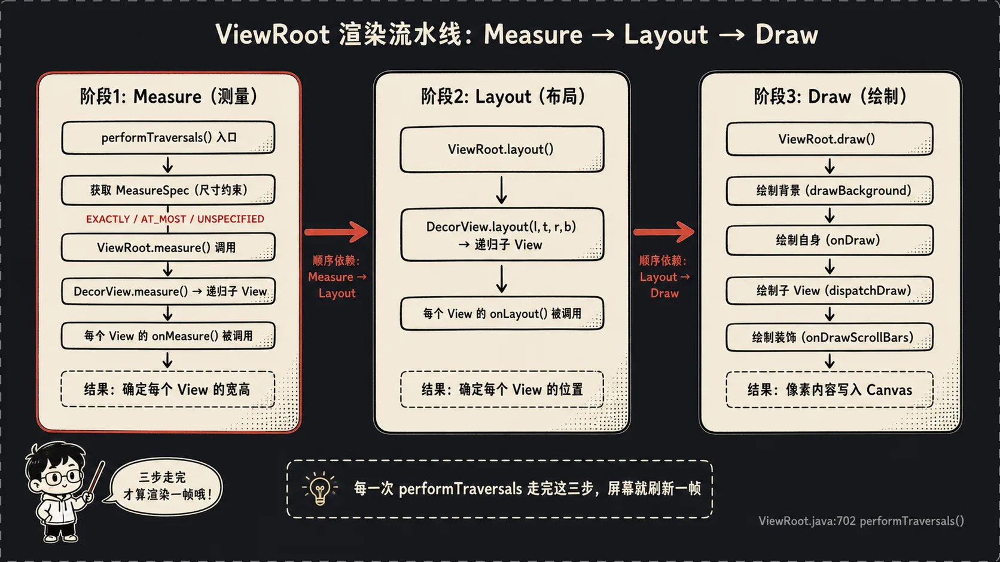

我们平时写 Activity，经常是：

这行代码是应用开发者最常接触到的 UI 入口。看它是为了把日常 API 和后面的 PhoneWindow、DecorView、ViewRoot 流程连起来。
它虽然短，但会触发 XML inflate 和窗口内容树挂载。

```java
// 将 main 布局资源设置为当前 Activity 的内容视图。
setContentView(R.layout.main);
```

这行执行后，布局 XML 会被解析成 View 树，并挂到 Activity 的窗口结构中。后续 ViewRoot 才有一棵树可以 measure、layout 和 draw。
它说明应用代码里的一行 UI 调用，背后会进入完整的窗口和渲染流程。

这行代码看起来很简单，但它只是把门推开。XML 会被 inflate 成一棵 View 树，外面包着 PhoneWindow 和 DecorView，最后这棵树要交给 ViewRoot。真正把 View 树变成屏幕上的像素，要走 **`measure -> layout -> draw`**。

我喜欢把 View 系统类比成装修房子。XML 是装修图纸，View 是家具和墙面，DecorView 是整套房子的外壳，ViewRoot 是项目经理。项目经理要先量尺寸，再摆位置，最后安排刷漆和安装。

Android 2.3 的关键入口在 `frameworks/base/core/java/android/view/ViewRoot.java:702`：

这段代码是 ViewRoot 一次 traversal 的入口。看它是为了确认 measure、layout、draw 的总调度不是分散发生的，而是从 `performTraversals()` 这个核心方法开始。
`host` 保存的是根 View，也就是后续遍历的起点。

```java
// 定义一次 View 树遍历的核心方法。
private void performTraversals() {
// cache mView since it is used so much below... // 说明缓存 mView 是因为后面频繁使用它。
// 将当前根 View 缓存到局部变量 host。
final View host = mView;
```

这段执行后，ViewRoot 拿到了本次遍历要处理的根 View。接下来所有尺寸计算、位置安排和绘制调用，都会围绕这个 host 展开。
**关键设计点是 ViewRoot 负责调度整棵 View 树，而不是某个单独控件。**

`performTraversals()` 这个方法名很形象：遍历整棵 View 树。它不是只处理根 View，而是一层层递进去，让每个 ViewGroup 和子 View 都参与测量、布局和绘制。

第一步是 measure。`ViewRoot.java:832-839`：

这段代码进入 traversal 的测量阶段。看它是为了理解根 View 的测量不是凭空决定大小，而是先根据窗口尺寸和布局参数构造 MeasureSpec。
MeasureSpec 会把父级约束传给整棵 View 树。

```java
// 根据期望窗口宽度和布局宽度生成根 View 的宽度测量规格。
childWidthMeasureSpec = getRootMeasureSpec(desiredWindowWidth, lp.width);
// 根据期望窗口高度和布局高度生成根 View 的高度测量规格。
childHeightMeasureSpec = getRootMeasureSpec(desiredWindowHeight, lp.height);
// 调用根 View 的 measure，递归测量整棵 View 树。
host.measure(childWidthMeasureSpec, childHeightMeasureSpec);
```

这段执行后，根 View 和子 View 会得到各自的测量尺寸。后续 layout 阶段会基于这些 measured width 和 measured height 决定最终位置。
这说明 View 系统先解决“多大”，再解决“在哪”。

Measure 解决的问题是“你想要多大”。父容器会给子 View 一个约束，子 View 在约束里算出自己的 measuredWidth 和 measuredHeight。这个约束就是 MeasureSpec，里面揉了尺寸和模式。模式大概有三类：精确大小、最大不能超过、你自己看着办。生活里就像租房摆桌子：房东告诉你客厅最多这么宽，你的桌子可以小一点，但不能把墙顶穿。

第二步是 layout。layout 解决的是“你放在哪里”。ViewRoot 里有 relayout、setFrame、全局布局监听等流程，`ViewRoot.java:1179-1189` 附近能看到布局后触发全局布局：

这段代码展示 layout 完成后通知全局布局监听器的节点。看它是为了理解布局不只是设置坐标，还会触发依赖布局完成的观察者回调。
很多上层逻辑会通过 ViewTreeObserver 感知布局变化。

```java
// 判断是否需要触发全局布局监听。
if (triggerGlobalLayoutListener) {
// 清除重新计算全局属性的标记。
attachInfo.mRecomputeGlobalAttributes = false;
// 分发全局布局完成事件给监听器。
attachInfo.mTreeObserver.dispatchOnGlobalLayout();
// 结束全局布局监听触发分支。
}
```

这段执行后，注册过全局布局监听的代码会收到回调。它说明 ViewRoot 不仅推进布局流程，还负责把布局变化广播给观察者。
这为依赖最终尺寸或位置的 UI 逻辑提供了同步点。

真正每个子 View 的位置，主要由各个 ViewGroup 的 `onLayout()` 决定。比如 LinearLayout 按方向排，FrameLayout 叠起来，RelativeLayout 按规则摆。ViewRoot 像总项目经理，但每个房间怎么摆家具，还得房间负责人说了算。

第三步是 draw。`ViewRoot.java:1254-1258`：

这段代码进入 traversal 的绘制前检查和绘制阶段。看它是为了理解 draw 之前还有一次 pre-draw 回调机会，监听器可以取消本次绘制。
只有条件满足时，ViewRoot 才会真正调用 `draw()`。

```java
// 分发 pre-draw 事件，并记录是否取消绘制。
boolean cancelDraw = attachInfo.mTreeObserver.dispatchOnPreDraw();
// 只有未取消绘制且不是新 Surface 时才继续绘制。
if (!cancelDraw && !newSurface) {
// 清除全量重绘标记。
mFullRedrawNeeded = false;
// 调用 draw，开始把 View 树绘制到 Canvas。
draw(fullRedrawNeeded);
```

这段执行后，根 View 会沿着 View 树递归绘制内容。绘制结果最终进入窗口的 Surface 缓冲区，再交给 SurfaceFlinger 合成。
关键设计点是 draw 阶段也可以被观察者拦截或延后，不是无条件发生。

`draw()` 里会拿到 Canvas，然后让根 View 开始绘制。绘制也是递归的：ViewGroup 先画自己，再画 children，子 View 再画自己的背景、内容、滚动条等。`ViewRoot.java:1406` 和 `ViewRoot.java:1522` 都能看到 `mView.draw(canvas)` 这样的调用。

理解 View 绘制，最重要的是别把三步混在一起：

- **measure**：算尺寸。问的是“你多大”。
- **layout**：定位置。问的是“你在哪”。
- **draw**：画内容。问的是“你长什么样”。

很多 UI 问题其实都能归到这三类。文字被截断，可能是 measure 给小了；控件位置不对，可能是 layout 规则错了；背景没显示，可能是 draw 或 invalidation 的问题。你调试 View 时先问自己“这是尺寸问题、位置问题，还是绘制问题”，思路会清楚很多。

ViewRoot 还有一个容易被忽视的角色：**它是 App 进程里 View 树和 WMS 的连接点。**Activity 的窗口被 add 到 WindowManager 后，会创建 ViewRoot，ViewRoot 通过 Binder 和 WMS 通信，申请窗口布局、Surface、输入通道。也就是说，View 系统看起来是 App 内部的 UI 树，但它能显示出来，是因为背后接上了 WMS 和 SurfaceFlinger。

## 十一、一个 Activity 的完整旅程

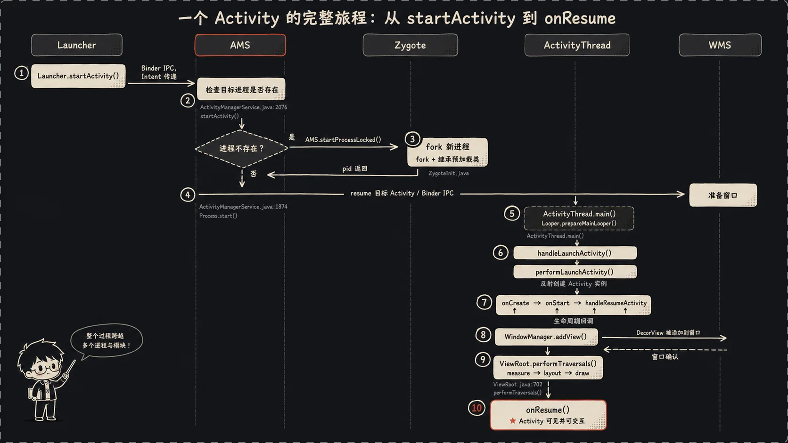

前面讲了很多组件，现在把它们串成一条完整链路。我们就拿最普通的场景：用户在 Launcher 上点一个应用图标，目标 Activity 最后显示在屏幕上。

第一步，Launcher 自己也是一个 App。用户点图标后，Launcher 调用 `startActivity()`。这个调用不会在 Launcher 进程里直接创建目标 Activity，而是通过 Binder 进到 `system_server` 里的 AMS。

第二步，AMS 收到请求。入口可以对应到 `ActivityManagerService.java:2076-2083` 的 `startActivity()`。AMS 会找 PMS 解析目标组件，检查权限，判断 Activity 栈和 task。这里 AMS 像交通指挥员，不是车来了就放行，它要看路线、红绿灯、目标车位。

第三步，如果目标进程已经存在，AMS 会复用它；如果不存在，AMS 调 `startProcessLocked()`。在 `ActivityManagerService.java:1874-1876`，AMS 调用：

这段代码在完整旅程里再次标出 AMS 到 Zygote 的关键跳点。看它是为了把前面分散讲过的 Zygote、Process、ActivityThread 合并回一次真实启动链路。
它说明点击图标后，如果进程不存在，系统启动的是 ActivityThread 所在的应用进程。

```java
// 请求 Zygote 创建以 ActivityThread 为入口的新应用进程。
int pid = Process.start("android.app.ActivityThread",
// 传入进程名以及 uid/euid。
mSimpleProcessManagement ? app.processName : null, uid, uid,
// 传入进程附加组、调试标记和额外参数。
gids, debugFlags, null);
```

这段执行后，AMS 会拿到新进程 pid，并继续等待目标进程和 ActivityThread 建立调度关系。随后 ActivityThread 才会接收 launch 消息，反射创建目标 Activity。
这再次强调 AMS 负责调度和发起进程创建，具体 Activity 实例在应用进程内产生。

这一步把请求发给 Zygote。`Process.java:46` 里的 `ZYGOTE_SOCKET = "zygote"`，对应 `init.rc:328` 的 `socket zygote stream 666`。Zygote 收到命令后 fork 自己，子进程带着预加载好的类和资源起跑。

第四步，子进程进入 `ActivityThread.main()`。虽然这篇文章重点引用的是题目里列的核心路径，但这里要知道一个事实：**App 进程的 Java 主线程不是 Activity 本身，而是 ActivityThread。**它会准备 Looper，和 AMS 建立 Binder 关系，接收 AMS 发来的 launch、resume、pause 等调度消息。

第五步，AMS 让目标进程 launch Activity。ActivityThread 收到消息后，会创建 LoadedApk、ClassLoader，反射创建 Activity 实例，调用 `attach()`，再走 `onCreate()`。我们平时写的 `setContentView()` 通常就在 `onCreate()` 里发生。XML 被 inflate 成 View 树，挂到 PhoneWindow 的 DecorView 下面。

第六步，Activity 进入 resume。AMS 的 Activity 栈状态更新，ActivityThread 调用 Activity 的 `onResume()`。这里有个细节：**生命周期上的 resumed，不等于像素已经完全画到屏幕。**它说明 Activity 到了前台交互状态，但窗口真正显示还要走 WindowManager 和 ViewRoot。

第七步，ActivityThread 把 DecorView 加到 WindowManager。WindowManagerImpl 在 App 进程里只是客户端侧入口，它会创建 ViewRoot，并通过 Binder 找 WMS。WMS 接到新窗口后，决定层级、焦点、布局参数，并协调 Surface。

第八步，ViewRoot 开始第一次 traversal。入口就是 `ViewRoot.java:702` 的 `performTraversals()`。它先 measure，`ViewRoot.java:832-839` 算根 View 的 MeasureSpec 并调用 `host.measure()`；再 layout，确定 View 树位置；最后 draw，`ViewRoot.java:1254-1258` 触发 `draw(fullRedrawNeeded)`。

第九步，应用把内容画进 Surface 对应的缓冲区。SurfaceFlinger 在 native 层负责合成多个窗口的 Surface，比如状态栏、导航相关窗口、应用窗口、弹窗。最终硬件显示屏拿到合成后的帧，用户才看到 Activity。

把这条链路写成一行就是：

**Launcher 点击图标 -> Binder 调 AMS.startActivity -> PMS 解析目标组件 -> AMS 判断栈和进程 -> 必要时 Process.start -> Zygote fork -> ActivityThread.main -> AMS 调度 launch/resume -> Activity 创建并 setContentView -> WindowManager.addView -> ViewRoot.performTraversals -> SurfaceFlinger 合成 -> 屏幕显示。**

这条线很长，但它不是乱的。每个组件都只负责自己那一段：

- **init** 负责把地基服务拉起来。
- **ServiceManager** 负责让服务能被找到。
- **Binder** 负责跨进程通信。
- **Zygote** 负责快速 fork Java 进程。
- **SystemServer** 负责注册系统服务。
- **PMS** 负责包和组件档案。
- **AMS** 负责组件生命周期和进程调度。
- **WMS** 负责窗口秩序。
- **ViewRoot** 负责把 View 树走完 measure、layout、draw。
- **SurfaceFlinger** 负责最终合成显示。

我觉得看 Framework 最怕的就是把“调用链”和“职责链”混在一起。调用链是代码怎么一步步跑，职责链是每个模块为什么存在。只盯调用链，很快会迷失在分支里；只看职责，又容易讲得空。把两者拼起来，才算真的理解。

## 十二、总结：拼图完整了

回头看 Android 2.3 Framework，它其实没有一上来就把你扔进巨大迷宫。**它的主线很清楚：内核启动后交给 init，init 解析 `init.rc` 拉起 servicemanager 和 zygote；ServiceManager 建好 Binder 服务电话本；Zygote 预加载 Java 世界并 fork 出 SystemServer；SystemServer 注册 AMS、PMS、WMS 等服务；Launcher 发起 startActivity；AMS 调度组件和进程；PMS 提供包信息；WMS 接窗口；ViewRoot 遍历 View 树；SurfaceFlinger 合成画面。**

我建议你后面继续看源码时，不要按文件大小硬啃，而是按问题切进去。

比如你想看开机，就盯 `system/core/init/init.c:652` 的 `main()`，再看 `system/core/rootdir/init.rc:306-338` 里几个关键服务怎么定义。你会明白 Android 不是凭空从 Java 开始的，它先有 Linux 用户态启动框架。

想看 Binder，就从 `frameworks/base/cmds/servicemanager/service_manager.c` 开始。它只有 271 行，能让你看到 context manager、addService、getService 这些最核心的东西。再配合 `frameworks/base/include/binder/BinderService.h:34-52`，你能理解 native 服务如何注册、如何启动 Binder 线程池。

想看进程启动，就顺着 `frameworks/base/cmds/app_process/app_main.cpp` 到 `frameworks/base/core/java/com/android/internal/os/ZygoteInit.java`。重点看 `registerZygoteSocket()`、`preloadClasses()`、`preloadResources()`、`startSystemServer()` 和 `runSelectLoopMode()`。这条线看懂了，App 进程为什么快、system_server 为什么从 Zygote 来，就都顺了。

想看系统服务，就看 `frameworks/base/services/java/com/android/server/SystemServer.java:596-634` 的入口，再往上看 `ServerThread` 注册服务的顺序。别一开始就钻某个服务内部，先搞清楚它什么时候被创建、什么时候 addService、什么时候 systemReady。

想看 Activity 启动，就从 `frameworks/base/services/java/com/android/server/am/ActivityManagerService.java:2076` 的 `startActivity()` 开始，顺到 `startProcessLocked()`，再看 `ActivityStack` 如何安排 resume。AMS 很大，但你只沿着一条 startActivity 主线走，就不会被广播、服务、ContentProvider 的分支拖走。

想看 UI 渲染，就盯 `frameworks/base/core/java/android/view/ViewRoot.java:702` 的 `performTraversals()`。先把 measure、layout、draw 三步在脑子里分清楚，再去看 ViewGroup 的具体实现。以后遇到自定义 View 问题，你会更容易判断到底卡在哪一步。

还有一个很实用的方法：**多用 `dumpsys`。**看 AMS 就 `dumpsys activity`，看窗口就 `dumpsys window`，看包就 `dumpsys package`。源码告诉你系统"应该怎么工作"，`dumpsys` 告诉你设备上"现在实际是什么状态"。两边对着看，进步最快。

Android 2.3 虽然老，但它的骨架非常适合学习。后面的 Android 加了更多权限模型、渲染管线、SystemUI 拆分、多用户、SELinux、ART、Treble 等东西，复杂度上去了，但很多基本问题还是这几个：**进程怎么来，服务怎么找，组件怎么调度，窗口怎么显示，View 怎么画。**先从 2.3 把这条线走通，再去看新版本，你会发现自己不是在背碎片，而是在给已有地图加新道路。

---

本文由 AgentPlanFlow 生成
