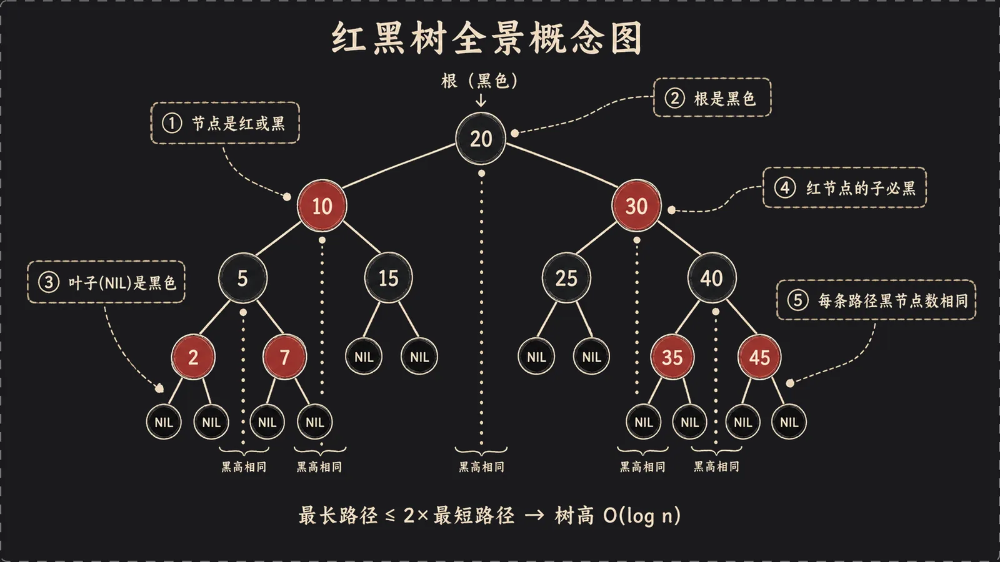
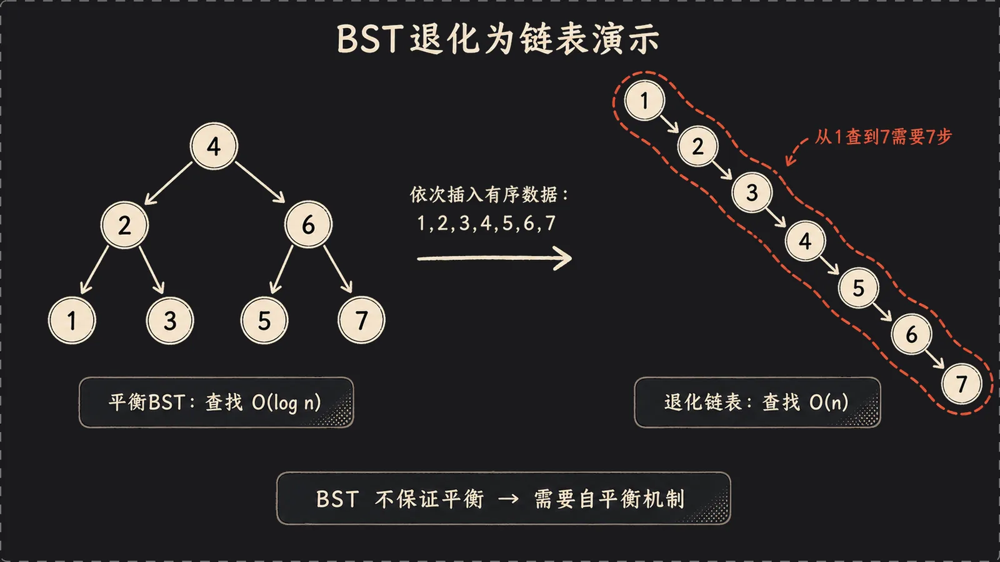
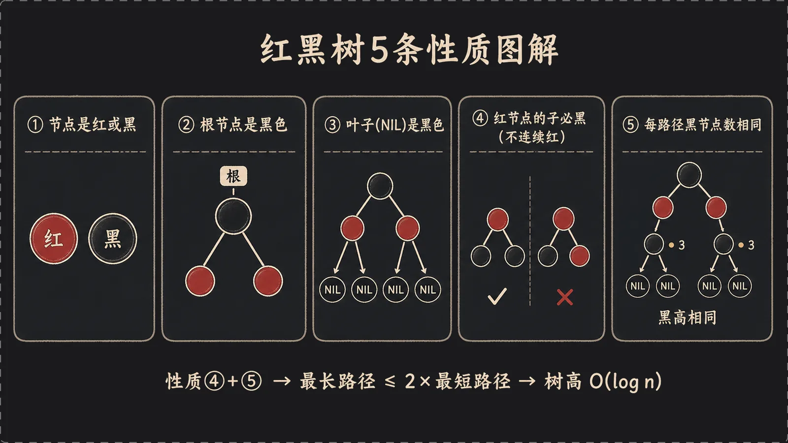
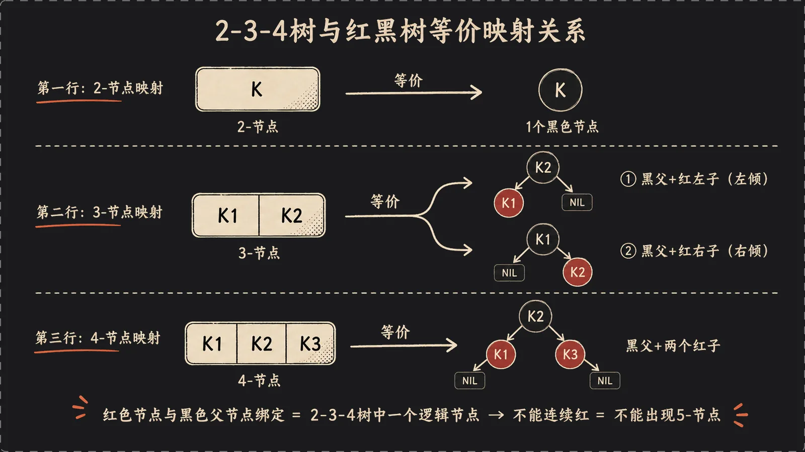
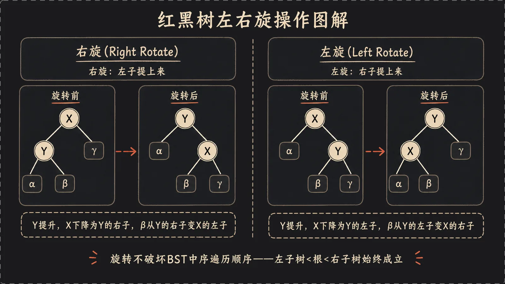
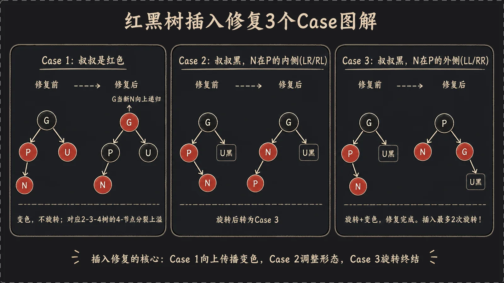
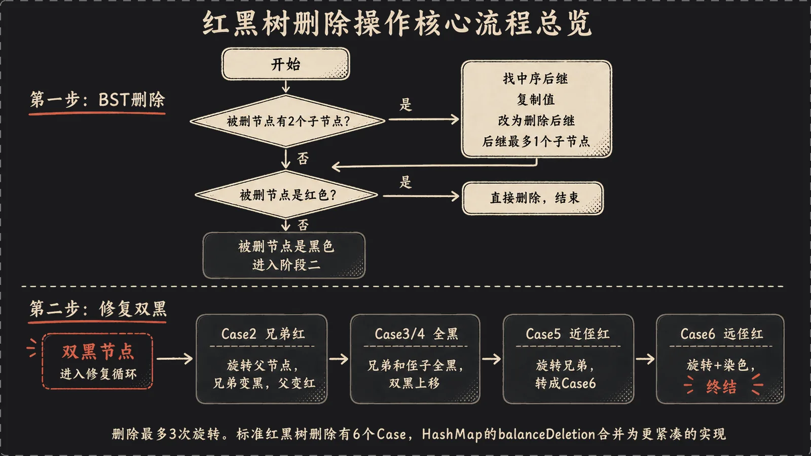

## 一、引言：从 HashMap 的 O(n) 退化说起

先讲个真事。你写了个服务，用 `HashMap<String, User>` 缓存用户数据，平时跑得飞快。某天压测，QPS 突然崩了，CPU 飙到 100%，但内存和网络都很闲。你抓火焰图一看——大量时间卡在 `HashMap.get()` 上。一个哈希表的查找，怎么会慢成这样？

答案是：**哈希冲突**。HashMap 内部是一个数组，每个数组位置（叫"桶"，bucket）挂一条链表，key 通过 `hashCode` 算出该落在哪个桶。理想情况下，每个桶里就一两个元素，`get` 几乎是 O(1)。但如果一大堆 key 算出来的桶位置都一样——要么是 hash 函数烂，要么是有人故意构造碰撞——这些元素全堆在同一条链表里。这时候 `get` 就退化成了**链表的线性扫描，O(n)**。几万个 key 挤一个桶，每次查找扫几万个节点，不慢才怪。

这事儿在 Java 7 时代真能要命。更恶劣的是，攻击者可以**故意构造一批 hashCode 相同的字符串**，往你的服务里灌，让某个桶的链表无限长，单次请求就能把 CPU 打满——这是一种经典的哈希碰撞 DoS 攻击（CVE 编号都有）。Java 7 的 HashMap 对此毫无还手之力。

于是 Java 8 动了刀子。它给 HashMap 加了个机制：**当某个桶的链表长度超过阈值（默认 8），并且数组容量足够大时，把这条链表转成一棵红黑树。** 链表的 O(n) 查找，瞬间变成红黑树的 O(log n)。原本扫几万个节点的最坏情况，现在最多走十几层。攻击者再怎么构造碰撞，单桶性能也有了 O(log n) 的兜底。

红黑树就是这么钻进千万 Java 程序员每天都在用的 HashMap 里的。但红黑树本身又是个让无数人头疼的东西——五条性质背不下来，插入删除一堆 case，旋转转得人晕头转向。这篇文章我想换个讲法：**从最朴素的二叉查找树开始，看它怎么退化、为什么需要平衡，一步步推出红黑树的设计，再用 2-3-4 树这把钥匙打通所有 case，最后回到 HashMap 源码，看工业级实现到底是怎么落地的。** 一条线穿到底，你会发现红黑树没那么玄。

## 二、二叉查找树（BST）的困境



要理解红黑树为什么长这样，得先看它要解决的问题。一切的起点是**二叉查找树（Binary Search Tree, BST）**。

BST 的规则极其简单，一句话：**对任意节点，左子树所有值都比它小，右子树所有值都比它大。** 就这一条。基于这条规则，查找一个值就像查字典——从根开始，比当前节点小就往左走，大就往右走，相等就找到了。每走一步排除掉一半的可能，理想情况下查找是 O(log n)。

插入也一样。要插入一个新值，就按查找的路径一路往下走，走到空位置（叶子下面）就挂上去。比如往空树里依次插入 `5, 3, 8, 1, 4`，你会得到一棵漂亮的、左右大致均衡的树，5 是根，3 和 8 是它的左右孩子，1、4 挂在 3 下面。查找任意一个值，最多走 3 步。

听起来很美好，对吧？**但 BST 有个致命弱点：它的形态完全取决于插入顺序。**

来看反例。如果我按 `1, 2, 3, 4, 5` 这个有序顺序插入会怎样？插 1，它是根。插 2，比 1 大，挂到 1 的右边。插 3，比 1 大往右走，比 2 大再往右，挂到 2 的右边。插 4、插 5 同理……最后你得到的不是一棵树，而是一根**一头沉到底的链表**：1→2→3→4→5，每个节点只有右孩子。这时候查找 5 要走遍所有 5 个节点，O(log n) 彻底退化成了 **O(n)**。

这不是什么罕见的边界情况。现实里数据本来就经常是有序或近乎有序的——按时间戳插入、按自增 ID 插入、导入一批已排序的数据……一不留神就触发退化。BST 在最坏情况下和链表没区别，这就让它在工程上变得不可靠：你没法保证别人喂给你的数据是乱序的。

退化的**根本原因**很清楚：BST 只管维护"左小右大"的顺序性，**完全没有任何机制去强制它保持平衡**。树往哪长、长成什么形状，全凭数据的运气。

那解决思路也就呼之欲出了：**得让树在插入删除的过程中，自己动手把自己捋平，别长歪。** 这类会自我调整、始终保持"差不多平衡"的 BST，统称**平衡二叉查找树（self-balancing BST）**。

最早的经典方案是 **AVL 树**。它的思路非常刚：要求**任意节点的左右子树高度差不超过 1**，一旦插入或删除破坏了这个约束，立刻通过旋转把它扳回来。AVL 把平衡卡得死死的，所以它的树高非常矮，查找极快。但代价是——为了维持这么严格的平衡，它在插入删除时可能需要做**很多次旋转**，写操作的开销不小。

AVL 很优秀，但它不是唯一答案。还有一种更"工程化"、在严格平衡和维护成本之间取了个巧妙折中的方案。它不追求绝对的矮，只要求"别太歪"，换来的是极低的调整开销。这就是我们今天的主角——**红黑树**。

## 三、红黑树：规则驱动的自平衡



红黑树（Red-Black Tree）的玩法很特别。它不像 AVL 那样直接拿"高度差"说事，而是给每个节点染上**红色或黑色**，然后定下**五条性质**当作铁律。只要这五条始终被满足，这棵树就自动保证了"近似平衡"。换句话说，红黑树是**用染色规则间接地约束了树的形状**。

我们一条条看，而且每条都讲清楚它为什么存在——背规则没用，理解动机才记得住。

**性质 1：每个节点要么是红色，要么是黑色。**

这是最基础的设定，染色是红黑树的核心机制。颜色不是装饰，它是用来"记账"的——记录这棵树当前的平衡状态。后面所有的约束都建立在颜色之上。

**性质 2：根节点是黑色。**

这条主要是为了**简化边界处理**。后面你会看到，插入修复时如果新节点的父亲是红色会触发一堆操作；而根节点没有父亲，强制它黑色能省掉不少特判。另外，根黑色也保证了整棵树"从顶上看"是稳的。

**性质 3：每个叶子节点（NIL，空节点）是黑色。**

注意这里的"叶子"指的不是有值的末端节点，而是它们底下那些**空指针**。红黑树在概念上把所有 null 看作统一的黑色 NIL 节点。这么做是为了**统一空节点的处理**——计算路径上的黑色节点数时，不用对 null 做特殊判断，每条路径都明确地终止于一个黑色 NIL。实现上通常用一个共享的哨兵节点表示所有 NIL。

**性质 4：红色节点的两个子节点必须都是黑色。**（换句话说，不能有两个红色节点相连）

这是**关键约束之一**。它的效果是：**红色节点不能扎堆，任何一条从根到叶的路径上，红色节点都不可能连续出现。** 这就限制住了红色的"密度"。为什么要限制红色密度？因为红色节点是"可以白嫖的高度"——它不计入我们马上要讲的黑高。如果红色能连续堆叠，树就能在不增加黑高的情况下无限长高，平衡也就名存实亡了。所以这条性质本质上是给"路径能有多长"上了一道闸。

**性质 5：从任意节点出发，到它子树中所有叶子（NIL）的路径，包含的黑色节点数量相同。**

这是**最强的约束**，红黑树平衡性的真正基石。我们把"从某节点到叶子路径上的黑色节点数"叫做**黑高（black-height）**。性质 5 要求：**每个节点的所有下行路径，黑高必须一致。** 这意味着黑色节点是严格"对齐"的，整棵树的黑色骨架是完美平衡的。

现在把性质 4 和性质 5 放一起，神奇的结论就出来了。

设某条从根到叶的路径上有 b 个黑节点（黑高 b）。由性质 5，**所有路径的黑节点数都是 b**——这是公共部分。那路径之间的长度差异从哪来？只能来自红节点。而由性质 4，红节点不能连续，所以一条路径上红节点数最多和黑节点数相当，**最长的路径最多也就是"黑红黑红……"交替**，长度不超过 2b；最短的路径则是"全黑"，长度恰好 b。

**于是：最长路径长度 ≤ 2 × 最短路径长度。** 没有任何一条路径能比别的路径长出一倍以上。这就是红黑树"近似平衡"的精确含义——它不像 AVL 那样要求左右高度差 ≤ 1，而是允许差到将近一倍，但绝不会更离谱。

由此可以证明，n 个节点的红黑树，**树高被严格控制在 O(log n)**（具体是 2·log₂(n+1) 这个量级）。查找、插入、删除全部稳定在 **O(log n)**，再也没有退化成链表的可能。这就是红黑树用五条染色规则换来的东西。

## 四、换个视角：2-3-4 树与红黑树的等价关系



讲到这儿，很多人对红黑树的痛苦才刚开始。因为接下来是插入、删除的一堆 case：叔叔红了怎么办、侄子黑了怎么办、什么时候左旋什么时候右旋……如果**孤立地去背这些规则**，那真是噩梦，背了忘、忘了背，考完试一周全还给老师。

但其实有一把钥匙，能让这些 case 从"鬼画符"变成"理所当然"。这把钥匙就是：**红黑树本质上是一棵 2-3-4 树的二叉树表示。** 理解了这句话，后面所有操作你都能"想明白"，而不是"背下来"。

先说 **2-3-4 树**是啥。它是一种多叉的平衡查找树，每个节点可以装 1 到 3 个 key，对应有 2 到 4 个孩子：

- **2-节点**：含 1 个 key，有 2 个孩子（就是普通 BST 节点）。
- **3-节点**：含 2 个 key，有 3 个孩子。
- **4-节点**：含 3 个 key，有 4 个孩子。

2-3-4 树天生就是完美平衡的——所有叶子都在同一层。它靠"节点能装多个 key"以及"节点满了就分裂、上溢到父节点"来维持平衡，根本不需要旋转。问题是多叉节点实现起来麻烦，内存布局也不友好。于是人们想：**能不能用纯二叉的结构，把 2-3-4 树模拟出来？** 答案就是红黑树。

映射规则是这样的，记住红色的含义——**红色节点表示"我和我的黑色父亲，本来是同一个 2-3-4 节点里的兄弟 key"**：

- **2-节点（1 个 key）** → 1 个**黑色节点**。干干净净，就它自己。
- **3-节点（2 个 key）** → 1 个**黑父 + 1 个红子**。那个红子既可以挂在左边，也可以挂在右边（所以红黑树里 3-节点有"左倾"和"右倾"两种形态）。黑父和红子合起来，代表 2-3-4 树里那个装了俩 key 的节点。
- **4-节点（3 个 key）** → 1 个**黑父 + 左右两个红子**。这三个节点合起来，就是 2-3-4 树里装了仨 key 的那个胖节点。

**核心洞察来了：红色节点是和它的黑色父节点"绑定"在一起的，它们在逻辑上属于 2-3-4 树中的同一个节点。** 红色不是一个独立的层级，它是"黏"在黑父身上的。所以当你数黑高的时候，红节点不算数——因为它压根没占 2-3-4 树的层级，它和黑父是平级的。这下你也彻底明白了性质 5 为什么只数黑节点：**黑高 = 2-3-4 树的真实高度。** 2-3-4 树完美平衡（所有叶子同层），翻译过来就是红黑树黑高处处相等。

再看性质 4（不能连续红）的本质。两个红节点相连意味着什么？意味着一个 2-3-4 逻辑节点里塞进了**三个以上的 key**——那就成了非法的"5-节点"，2-3-4 树里不存在这种东西。所以**禁止连续红，本质就是禁止出现 5-节点**。一旦插入导致某个逻辑节点要变成 5-节点，红黑树就必须做点什么把它拆开——这恰好对应 2-3-4 树里的"节点分裂、中间 key 上溢到父节点"。

这一节是全文最值钱的部分。把它嚼透了，再回头看插入删除的 case，你会有种"哦原来如此"的通透感：所谓的变色和旋转，不过是在二叉结构上**模拟 2-3-4 树的分裂与合并**而已。所有操作都有据可依，不再是凭空背诵的咒语。

## 五、旋转：红黑树的唯一"武器"



在动手讲插入删除之前，得先把唯一的"物理操作"讲清楚——**旋转（rotation）**。

红黑树调整自己只有两种手段：**变色**和**旋转**。变色只是改一下节点的颜色属性，不动树的结构，成本极低。而旋转是**真正改变树形状**的操作——它重新安排节点之间的父子关系，把树的某个局部"扭"一下。可以说，变色负责"记账"，旋转负责"搬家"。

旋转分**左旋**和**右旋**，互为镜像。

**左旋（以节点 x 为支点）**：把 x 的右孩子 y 提上来，让 y 取代 x 的位置，而 x 降下去变成 y 的左孩子。原本 y 的左子树（那些值介于 x 和 y 之间的节点）改挂到 x 的右边。一句话：**右子提上来，自己变左子。**

**右旋（以节点 x 为支点）**：左旋的镜像。把 x 的左孩子 y 提上来，x 降下去变成 y 的右孩子，y 原本的右子树改挂到 x 的左边。一句话：**左子提上来，自己变右子。**

举个具体数字。假设有三个节点，5 是根，它的右孩子是 7，7 的左孩子是 6（满足 BST：6 在 5 和 7 之间）。现在对 5 做左旋：7 升上来当根，5 降下去成为 7 的左孩子，而原本 7 的左孩子 6（值在 5 和 7 之间）改挂到 5 的右边。旋转后：根是 7，7 的左孩子是 5，5 的右孩子是 6。你检查一下中序遍历——旋转前是 `5, 6, 7`，旋转后还是 `5, 6, 7`。

**这就是旋转最关键的性质：它不破坏 BST 的有序性，中序遍历的结果完全不变。** 这一点至关重要，意味着我们可以放心大胆地旋转去调整树的形态，而完全不用担心搞乱"左小右大"的根本规则。旋转只动结构，不动顺序。

下面是左旋的典型实现（这里用红黑树常见的、带父指针的写法，跟 HashMap 源码风格一致）：

```java
// 对节点 p 做左旋：p 的右孩子 r 上位，p 降为 r 的左孩子
static <K,V> TreeNode<K,V> rotateLeft(TreeNode<K,V> root, TreeNode<K,V> p) {
    TreeNode<K,V> r, pp, rl;
    if (p != null && (r = p.right) != null) {
        // r 的左子树 rl 改挂到 p 的右边（rl 的值在 p 和 r 之间）
        if ((rl = p.right = r.left) != null)
            rl.parent = p;
        // r 接管 p 原来的父节点 pp
        if ((pp = r.parent = p.parent) == null)
            (root = r).red = false;          // r 成了新根，根必须黑
        else if (pp.left == p)
            pp.left = r;
        else
            pp.right = r;
        // p 降为 r 的左孩子
        r.left = p;
        p.parent = r;
    }
    return root;                              // 返回（可能更新过的）根
}
```

右旋就是把上面所有 `left` 和 `right` 对调，逻辑完全对称，这里不重复贴了。

在红黑树里，旋转的作用是**调整树的形态、为变色创造条件**。很多时候光靠变色没法同时满足性质 4 和性质 5，这时就得先旋转，把节点挪到合适的位置，再配合变色把规则补齐。记住这个分工：**旋转改形状，变色补规则，两者配合才能在 O(1) 的局部操作里恢复平衡。**

## 六、插入操作：新节点染红，然后修复



终于到插入了。先抛出**总原则**：**新插入的节点，一律先染成红色。**

为什么是红色不是黑色？回想性质 5——每条路径黑高相等。如果新节点染黑，那它所在的那条路径凭空多了一个黑节点，黑高立刻失衡，性质 5 当场破裂，而黑高失衡是最难修的。反过来，染红只可能违反性质 4（连续红），而性质 4 的违规是**局部的、好修的**。所以"新节点染红"是个聪明的选择：宁可踩个容易补的坑，也别踩难填的坑。

插入流程分三步：

1. **按 BST 规则把新节点插到正确位置**（左小右大一路往下走）。
2. **把新节点染红。**
3. **检查并修复**：看看染红后有没有违反性质 4。

最幸运的情况：**新节点的父亲是黑色。** 那红色新节点挂在黑父下面，性质 4 没破（黑父的孩子是红的，完全合法），性质 5 也没破（红节点不增加黑高），啥都不用干，插入完成。皆大欢喜。

麻烦出在**父亲是红色**的时候——红父 + 红子，连续红了，违反性质 4。这时候要怎么修，**取决于"叔叔节点"的颜色**（叔叔 = 父亲的兄弟，也就是祖父的另一个孩子）。下面三个 case，我用"父亲在祖父左边"的情形讲，右边的完全对称。

**Case 1：叔叔是红色。**

此时父亲红、叔叔红、祖父必然黑（因为原来父亲是红的，按性质 4 它的父亲只能是黑）。这个局面用 2-3-4 树的视角看一目了然：祖父（黑）+ 父亲（红）+ 叔叔（红）正好是个 **4-节点**，现在又来了个红色新节点要往里塞——4-节点装满了，**溢出了**！2-3-4 树的处理是"节点分裂，中间 key 上移到父节点"。翻译成红黑树操作就是：**把父亲和叔叔都染黑，把祖父染红**，然后**把祖父当成新插入的红节点，向上递归继续检查**。

```java
// Case 1：叔叔 xppr 是红色 —— 对应 2-3-4 树的 4-节点上溢分裂
xp.red = false;          // 父亲染黑
xppr.red = false;        // 叔叔染黑
xpp.red = true;          // 祖父染红
x = xpp;                 // 把祖父当作新的"问题节点"，继续向上循环
```

这一步就是把溢出的红色"往上甩"。甩到祖父之后，祖父变红可能又和它的父亲撞红，于是循环继续往上。最坏情况一路甩到根，所以**变色可能发生 O(log n) 次**——但注意，Case 1 只变色不旋转，开销很小。

**Case 2：叔叔是黑色，且新节点在"内侧"（LR 或 RL 形态）。**

"内侧"指的是：父亲是祖父的左孩子，但新节点是父亲的右孩子（形成 `左-右` 的拐弯，简称 LR）；或者镜像的 RL。这种拐弯的形状没法直接靠一次旋转摆平。所以 Case 2 的任务是**把它掰直**：对父节点做一次旋转（LR 就左旋父亲），把它转成"外侧"的直线形态，也就是 **Case 3**。Case 2 本身不结束战斗，它只是个"转化器"。

**Case 3：叔叔是黑色，且新节点在"外侧"（LL 或 RR 形态）。**

"外侧"指父亲是祖父的左孩子、新节点也是父亲的左孩子（一条直线 `左-左`，简称 LL）；或镜像的 RR。这是终结局面：**把父亲染黑、祖父染红，然后对祖父做一次旋转**（LL 就右旋祖父）。旋转后父亲上位变成这个局部的黑色根，左右各挂一个红节点，性质 4 和性质 5 同时满足，**修复彻底结束**。

把 Case 2 和 Case 3 串起来看 HashMap 风格的代码（这里仍以父在左为例）：

```java
// 叔叔是黑色（或不存在）
if (x == xp.right) {                 // Case 2：内侧 LR —— 先左旋父亲掰直
    root = rotateLeft(root, x = xp); // 旋转后 x 指向原来的父亲
    xpp = (xp = x.parent) == null ? null : xp.parent;
}
if (xp != null) {                    // Case 3：外侧 LL —— 变色 + 右旋祖父
    xp.red = false;                  // 父亲染黑
    if (xpp != null) {
        xpp.red = true;              // 祖父染红
        root = rotateRight(root, xpp);
    }
}
```

**核心结论：插入操作最多只需要 2 次旋转**（Case 2 一次 + Case 3 一次，或者 Case 3 单独一次）。变色虽然可能因为 Case 1 不断上甩而发生 O(log n) 次，但旋转——这个最贵的物理操作——被死死摁在了常数级。**插入旋转 ≤ 2 次，这是红黑树相对 AVL 的核心优势之一**，记住它，第八节讲 HashMap 选型时还要用。

## 七、删除操作：比插入更复杂，但思路一样



删除是红黑树里公认最绕的部分。但别慌，思路和插入是一脉相承的，只是 case 多一些。

先说删除为什么难。**难点在于：当被删的节点是黑色时，它所在路径的黑高会凭空少 1，性质 5 当场破裂。** 这个"少了一个黑"的麻烦，我们叫它**双黑（double black）**问题——可以想象成被删黑节点的位置上，"欠"了一重黑色债务需要还。红节点被删就没这问题，因为红色不计入黑高，删了无伤大雅。

删除流程是这样的：

1. **先做标准 BST 删除。** BST 删除有个经典技巧：如果要删的节点有两个孩子，就找它的**中序后继**（右子树里最小的节点）来顶替它的值，然后转而去删那个后继。后继最多只有一个孩子，删起来简单。所以**实际被物理删除的节点，最多只有一个孩子**，这大大简化了讨论。
2. **如果实际删除的节点是红色** → 直接删，红色不影响黑高，**结束**，啥都不用修。
3. **如果实际删除的节点是黑色** → 它的位置产生了双黑，**进入修复流程**。

修复双黑的逻辑，核心是想办法"把欠的那重黑色补回来"——要么从兄弟那边借一个黑过来，要么把双黑继续往上传递。修复要看**兄弟节点和两个侄子节点的颜色**，标准实现一般分 6 个 case（同样以"被删节点是父亲的左孩子"为例，右孩子镜像）：

- **Case 1：被删节点是新的根。** 双黑到了根上，直接把多余的黑色丢掉，结束。
- **Case 2：兄弟是红色。** 红兄弟意味着父亲必然是黑的。**把兄弟染黑、父亲染红，然后对父亲做旋转**，让红兄弟上位。这一步本身不解决双黑，但它把局面**转化**成了兄弟为黑的情形（Case 4/5/6），相当于换个姿势再打。
- **Case 3：兄弟黑，且兄弟的两个孩子也全黑。** 没法从兄弟那借到黑色（它自己也很穷）。办法是**把兄弟染红**——这样兄弟那条路径也少一个黑，和当前路径"扯平"了，于是**把双黑上移到父亲**，对父亲继续修复。如果父亲原来是红的，到这儿把它染黑就彻底结束；如果父亲是黑的，双黑继续往上传。
- **Case 4：兄弟黑、孩子全黑，但父亲是红色。** 这其实是 Case 3 里"父亲红"的收尾分支：**父亲染黑、兄弟染红**，黑色债务由红父亲一肩扛下，结束。（很多教材把 3 和 4 合并讲。）
- **Case 5：兄弟黑，近侄子红、远侄子黑。**（近/远是相对被删节点而言）这种形态没法直接终结，需要**对兄弟做旋转、并交换兄弟和近侄子的颜色**，把它转化成 Case 6。又是个"转化器"，和插入里的 Case 2 异曲同工。
- **Case 6：兄弟黑、远侄子红。** 终结局面！**把兄弟染成父亲的颜色、父亲染黑、远侄子染黑，然后对父亲做旋转**。一次旋转加几次变色，双黑被彻底消除，**修复结束**。

```java
// 删除修复的骨架（被删节点 x 在父亲 xp 左侧），节选自典型实现思路
if (xpr.red) {                  // Case 2：兄弟红 —— 旋转转化为黑兄弟情形
    xpr.red = false; xp.red = true;
    root = rotateLeft(root, xp);
    xpr = xp.right;
}
// ... 兄弟为黑后，再依据侄子颜色走 Case 3/4/5/6 ...
```

删除的 case 看着吓人，但你用 2-3-4 树的视角去想就顺了：所谓双黑修复，本质是 2-3-4 树里"节点 key 不够了，要么向兄弟借一个 key（旋转），要么和兄弟合并、向父亲借一个 key（变色上移）"。借得到就旋转终结（Case 5/6），借不到就合并上移（Case 3/4）。

**核心结论：删除操作最多 3 次旋转**（比如 Case 2 转化一次 + Case 5 转化一次 + Case 6 终结一次）。比插入的 2 次多一次，但依然是**常数级**，没有退化成 O(log n)。这又是一个关键数字，请和"插入 ≤ 2 次"一起记住。

## 八、回到 Java HashMap：源码级剖析

理论铺垫完了，现在回到开头那个让人头疼的 HashMap，看看红黑树在真实的工业级代码里到底是怎么用的。读 JDK 源码你会发现，HashMap 对红黑树的运用远比"把链表换成树"精妙得多。

### 8.1 为什么需要红黑树

Java 7 的 HashMap 结构是**数组 + 链表**：数组是桶，每个桶挂一条单向链表，冲突的元素往链表后面追加。正常情况没问题，但前面说过，一旦大量 key 落进同一个桶，链表变长，`get`/`put` 退化成 O(n)。

更要命的是安全问题。HTTP 请求的参数、JSON 的字段名，往往会被框架塞进 HashMap。攻击者只要**精心构造一批 hashCode 相同的字符串**作为参数名发过来，就能把某个桶的链表撑到几万长，服务端一次解析请求就 O(n²) 地空转，CPU 直接打满——这就是著名的**哈希碰撞拒绝服务攻击（Hash Collision DoS）**。Java 7 的链表对此束手无策。

Java 8 的对策是引入树化。它定义了几个关键阈值：

- `TREEIFY_THRESHOLD = 8`：当一个桶里的链表长度达到 8，触发树化判断。
- `MIN_TREEIFY_CAPACITY = 64`：但只有当桶数组总容量 ≥ 64 时才真的转红黑树，否则优先扩容。
- `UNTREEIFY_THRESHOLD = 6`：当树的节点数降到 6 及以下，退化回链表。

为什么树化阈值是 8？JDK 注释里给了答案：在 hash 均匀的理想情况下，单个桶里节点数服从泊松分布，长度达到 8 的概率低到约千万分之一。**正常使用根本走不到树化，只有在 hash 严重冲突（烂 hash 函数或恶意攻击）时才会触发。** 红黑树是个"兜底保险"，把最坏情况从 O(n) 钉死在 O(log n)，攻击者再怎么折腾也讨不到便宜。

### 8.2 TreeNode 的精妙双重结构

> 图待补：HashMap TreeNode双重结构——同一组节点同时在红黑树和双向链表中。上半部分红黑树视角，下半部分双向链表视角，标注"一份数据两套索引"。（Codex 额度不足，请稍后用 image-generator 重出）

这是 HashMap 树化设计里我最佩服的一笔。来看 `TreeNode` 的字段定义：

```java
static final class TreeNode<K,V> extends LinkedHashMap.Entry<K,V> {
    TreeNode<K,V> parent;   // 红黑树：父节点
    TreeNode<K,V> left;     // 红黑树：左孩子
    TreeNode<K,V> right;    // 红黑树：右孩子
    TreeNode<K,V> prev;     // 双向链表：前驱（用于树化/退化时遍历）
    boolean red;            // 红黑树：颜色
    // 注意：next 字段继承自 Node（经由 LinkedHashMap.Entry）
}
```

看出门道了吗？`TreeNode` 通过 `parent/left/right` 构成了**红黑树**的连接；同时它还有 `prev`，再加上从父类 `Node` 继承来的 `next`，又构成了一条**双向链表**！也就是说：

**每一个树节点，同时存在于两条数据结构里——既是红黑树的一个节点，又是双向链表的一个节点。** 同一组对象，被两套指针同时索引着。

这个"双重身份"设计妙在哪？它让 HashMap 在不同场景下都能选最优路径：

- **查找（get）走树**：按 hash 比较大小，O(log n) 直达目标。
- **遍历整个桶走链表**：沿 `next` 指针顺序扫，O(n) 一遍过，不用做树的中序遍历那套递归。
- **扩容拆分走链表**：resize 时要把一个桶拆成"低位桶"和"高位桶"两部分，沿 `next` 链表顺序遍历、按 hash 位分流，简单高效。
- **退化重建走链表**：树节点数变少要退回链表时，直接沿 `next` 把 `TreeNode` 转回普通 `Node` 就行，根本不用拆红黑树结构。

一句话，**红黑树负责"快速查找"，双向链表负责"快速顺序遍历和结构变换"**。两套索引各管一摊，互相配合。这种"空间换灵活"的双向索引，是 HashMap 树化实现的点睛之笔。

### 8.3 treeifyBin：链表变树的入口

> 图待补：链表树化流程图——Node链表→TreeNode双向链表→treeify构建红黑树→balanceInsertion修复，4步流程。（Codex 额度不足，请稍后用 image-generator 重出）

当 `put` 之后发现某个桶的链表长度达到 `TREEIFY_THRESHOLD`（8），就会调用 `treeifyBin`。它的逻辑分两步走：

```java
final void treeifyBin(Node<K,V>[] tab, int hash) {
    int n, index; Node<K,V> e;
    // 第一道关卡：容量太小，先扩容而不是树化
    if (tab == null || (n = tab.length) < MIN_TREEIFY_CAPACITY)
        resize();
    else if ((e = tab[index = (n - 1) & hash]) != null) {
        // 把 Node 链表逐个转成 TreeNode，并串成双向链表
        TreeNode<K,V> hd = null, tl = null;
        do {
            TreeNode<K,V> p = replacementTreeNode(e, null);
            if (tl == null) hd = p;
            else { p.prev = tl; tl.next = p; }   // 维护 prev/next 双向链
            tl = p;
        } while ((e = e.next) != null);
        // 对这条 TreeNode 双向链表执行真正的树化
        if ((tab[index] = hd) != null)
            hd.treeify(tab);
    }
}
```

注意**第一道关卡**：如果桶数组容量小于 64，HashMap 宁可 `resize()` 扩容也不树化。为什么？因为容量小的时候，冲突很可能只是"桶太少挤在一起"造成的假象，扩容（桶变多）能让元素自然分散，链表自己就短了，根本用不着上红黑树这么重的家伙。**这是个很务实的优化——先用便宜的办法试试，不行再上重武器。**

过了这关，才进入正题：先把单向的 `Node` 链表整体转成 `TreeNode` 链表（同时用 `prev`/`next` 串成双向链表，为日后退化和遍历铺路），然后调用 `treeify` 真正建树。

`treeify` 干的事，本质就是**第六节讲的红黑树插入，重复 n 次**：

```java
final void treeify(Node<K,V>[] tab) {
    TreeNode<K,V> root = null;
    for (TreeNode<K,V> x = this, next; x != null; x = next) {
        next = (TreeNode<K,V>)x.next;
        x.left = x.right = null;
        if (root == null) {                  // 第一个节点当根，染黑
            x.parent = null;
            x.red = false;
            root = x;
        } else {
            K k = x.key; int h = x.hash;
            Class<?> kc = null;
            for (TreeNode<K,V> p = root;;) {  // 从根开始找插入位置（BST 下行）
                int dir, ph;
                K pk = p.key;
                if ((ph = p.hash) > h) dir = -1;        // 按 hash 决定左右
                else if (ph < h) dir = 1;
                // hash 相同时：尝试用 Comparable 比较，再不行用 tieBreakOrder 兜底
                else if ((kc == null && (kc = comparableClassFor(k)) == null) ||
                         (dir = compareComparables(kc, k, pk)) == 0)
                    dir = tieBreakOrder(k, pk);
                TreeNode<K,V> xp = p;
                if ((p = (dir <= 0) ? p.left : p.right) == null) {
                    x.parent = xp;
                    if (dir <= 0) xp.left = x;
                    else xp.right = x;
                    root = balanceInsertion(root, x);  // 每插一个就立刻修复
                    break;
                }
            }
        }
    }
    moveRootToFront(tab, root);   // 确保桶头指针指向红黑树的根
}
```

这里有几个细节值得品。**第一，比较顺序很讲究**：先按 `hash` 比大小决定往左还是往右；hash 撞了的话，尝试 key 是否实现了 `Comparable` 来比；还比不出来（没实现 Comparable，或者比出来相等），就用 `tieBreakOrder` ——它拿 `System.identityHashCode` 这种"最后的裁判"强行定个序。**为什么要费这么大劲也要分出左右？** 因为红黑树必须有确定的大小关系才能建树，绝不能因为两个 key 不可比就乱放。**第二，每插入一个节点立刻 `balanceInsertion` 修复**，保证建树过程中树始终合法。**第三，最后 `moveRootToFront`** ——红黑树旋转后，根节点可能已经不是当初桶里的第一个元素了，但 HashMap 要求桶数组的那个槽必须指向树根，所以得把根挪到链表头、对齐桶指针。

### 8.4 balanceInsertion：插入修复的 Java 实现

`balanceInsertion` 就是第六节那套插入修复 case 的 JDK 实现。我们挑最关键的"叔叔颜色判断"那段看，你会发现它和我们前面推导的 Case 1/2/3 严丝合缝：

```java
// 已知 x 红、父 xp 红（违反性质4），xpp 是祖父。此处父在祖父左侧的分支：
if (xp == (xppl = xpp.left)) {
    if ((xppr = xpp.right) != null && xppr.red) {
        // ---- Case 1：叔叔 xppr 红 → 父叔染黑、祖父染红、问题上移 ----
        xppr.red = false;
        xp.red = false;
        xpp.red = true;
        x = xpp;                       // 把祖父当新问题节点，继续向上循环
    }
    else {
        // ---- 叔叔黑 ----
        if (x == xp.right) {           // Case 2：内侧 LR → 左旋父亲掰直
            root = rotateLeft(root, x = xp);
            xpp = (xp = x.parent) == null ? null : xp.parent;
        }
        if (xp != null) {              // Case 3：外侧 LL → 变色 + 右旋祖父
            xp.red = false;
            if (xpp != null) {
                xpp.red = true;
                root = rotateRight(root, xpp);
            }
        }
    }
}
// else 分支：父在祖父右侧，完全镜像（rotateLeft/rotateRight 对调）
```

对照着看，标准红黑树的三个 case 在这儿一一对应，连变量命名都很直白（`xpp` = x's parent's parent = 祖父，`xppr` = 祖父的右孩子 = 叔叔）。

这里藏着 HashMap 实现的一个**小巧思**：注意 Case 2 处理完之后，代码**没有 `else`、没有 `break`，而是直接"跌落"（fall-through）到 Case 3 的那段变色 + 旋转代码**。这是因为 Case 2 的使命本就是"把内侧形态掰成外侧形态"，掰完之后它和 Case 3 要做的事一模一样。与其复制一遍旋转变色逻辑，不如让 Case 2 处理完顺势流进 Case 3，**两个 case 共用同一段终结代码**。读源码时如果不知道这个设计意图，会觉得这段逻辑跳来跳去很奇怪；知道了就会心一笑——省代码省得漂亮。

### 8.5 balanceDeletion：删除修复

`balanceDeletion` 对应第七节的删除双黑修复，是 HashMap 红黑树里最长最绕的方法。它的整体结构是一个大循环，循环里依据"被修复节点在父亲的左边还是右边"分成镜像的两大块，每块内部再按兄弟和侄子的颜色分支处理。这里不逐行贴了（贴出来又是一大屏），给个对应关系表，方便你拿着 JDK 源码逐段对号入座：

| 标准删除 case | HashMap balanceDeletion 中的体现 |
| --- | --- |
| Case 2：兄弟红 | 兄弟 `xpr.red` 为真 → 兄弟染黑、父染红、对父旋转，重取兄弟 |
| Case 3/4：兄弟黑、侄全黑 | 两个侄子都黑（或为 null）→ 兄弟染红，`x = xp` 双黑上移 |
| Case 5：近侄红、远侄黑 | 远侄黑而近侄红 → 旋转兄弟 + 变色，转化为 Case 6 |
| Case 6：远侄红 | 远侄红 → 兄弟取父色、父染黑、远侄染黑、对父旋转，终结 |

整体思路和我们推导的完全一致——能从兄弟借黑色就旋转终结，借不到就染红上移。源码绕只是因为它把左右镜像和各种 null 判断都摊开写在一个方法里了，逻辑骨架并不神秘。

### 8.6 untreeify：优雅的退化

红黑树虽好，但维护它有开销（每个 TreeNode 比普通 Node 占更多内存，操作也更重）。当一个桶里的节点因为删除或扩容拆分而变少时，就没必要继续维持红黑树了——这时候触发**退化（untreeify）**，把树变回链表。

退化的时机有两个：一是扩容时，桶被拆分成高低两部分后，**某一部分的节点数 ≤ `UNTREEIFY_THRESHOLD`（6）**，这部分就退化；二是树本身节点删到很少。退化实现简单得让人感动：

```java
final Node<K,V> untreeify(HashMap<K,V> map) {
    Node<K,V> hd = null, tl = null;
    // 直接沿 next 指针遍历双向链表，把每个 TreeNode 换成普通 Node
    for (Node<K,V> q = this; q != null; q = q.next) {
        Node<K,V> p = map.replacementNode(q, null);
        if (tl == null) hd = p;
        else tl.next = p;
        tl = p;
    }
    return hd;   // 返回重建好的普通链表头
}
```

看到妙处了吗？退化**根本不碰红黑树的 `left/right/parent` 那套结构，而是直接沿着 `next` 指针把双向链表走一遍**，逐个把 `TreeNode` 替换成普通 `Node`。因为第 8.2 节说过——TreeNode 本来就一直维护着一条双向链表！所以退化是干净利落的 **O(n) 顺序遍历**，完全不需要去解构那棵树。这正是"双重结构"设计在退化场景下的红利兑现：当初多花的那点 `prev`/`next` 指针，此刻让退化变得几乎零成本。

### 8.7 为什么是红黑树而不是 AVL

> 图待补：AVL vs 红黑树对比图——左侧严格平衡AVL(高度差≤1, 插入O(log n)次旋转)，右侧红黑树(宽松平衡, 插入最多2次旋转)。（Codex 额度不足，请稍后用 image-generator 重出）

最后一个灵魂问题：AVL 树更平衡、查找更快，HashMap 为什么选红黑树而不是 AVL？

关键在于**使用场景**。HashMap 是**读写混合**的，而且 `put`（写）非常频繁——它不是那种"建好一次、之后只读"的结构。写操作频繁，就意味着**插入和删除时的调整开销至关重要**。

把前面记住的数字搬出来对比：

- **红黑树**：插入最多 **2 次旋转**，删除最多 **3 次旋转**。
- **AVL 树**：为了维持"高度差 ≤ 1"的严格平衡，插入删除可能需要**沿着回溯路径一路旋转，最多 O(log n) 次**。

旋转是改变树结构的物理操作，是这里最贵的成本。红黑树把旋转次数死死摁在常数级，AVL 却可能旋转 log n 次。在写频繁的场景下，这个差距是压倒性的。

那查找性能差多少呢？几乎不差。AVL 更严格平衡，树高确实矮一点点，但——**HashMap 单个桶里的元素通常就几十个**（别忘了树化阈值才 8，真正长到需要树的桶都是少数，而且元素数也不会太夸张）。在这种规模下，红黑树和 AVL 的树高差距也就 1～2 层，查找时多比较一两次，**实际性能差异可以忽略不计**。

于是这道选择题就清楚了：**查找性能两者几乎打平，但插入删除的旋转开销红黑树完胜。** 对一个写操作频繁的哈希表来说，红黑树是更划算的选择。

这也是工程世界里最常见的道理——**没有最好的数据结构，只有最适合场景的 trade-off**。AVL 适合"读远多于写、查找性能压榨到极致"的场景；红黑树适合"读写混合、增删频繁"的场景。HashMap 选红黑树，TreeMap、Linux 内核选红黑树，C++ 的 std::map 选红黑树，都是同一个理由：它在"足够平衡"和"调整够便宜"之间，找到了那个甜点。

## 九、LeetCode 实战

理论讲完，刷几道题落地一下。红黑树本身在面试里很少要你手写（太长了），但理解 BST 的查找、插入、删除、平衡，以及会用语言自带的红黑树容器（Java 的 TreeMap/TreeSet），是高频考点。

### 9.1 [938. 二叉搜索树的范围和](https://leetcode.cn/problems/range-sum-of-bst/)（简单）——BST遍历基础

**题意**：给一棵 BST 和区间 `[low, high]`，求所有值落在区间内的节点之和。

**思路**：普通遍历当然能做，但要用上 BST 性质**剪枝**——如果当前节点值小于 low，那它的左子树全都更小，整条左子树不用看；大于 high 同理砍右子树。

```java
class Solution {
    public int rangeSumBST(TreeNode root, int low, int high) {
        if (root == null) return 0;
        if (root.val < low)  return rangeSumBST(root.right, low, high); // 砍左
        if (root.val > high) return rangeSumBST(root.left, low, high);  // 砍右
        // 当前节点在区间内：自己 + 左 + 右
        return root.val + rangeSumBST(root.left, low, high)
                        + rangeSumBST(root.right, low, high);
    }
}
```

### 9.2 [98. 验证二叉搜索树](https://leetcode.cn/problems/validate-binary-search-tree/)（中等）——理解BST性质

**题意**：判断一棵二叉树是不是合法 BST。

**思路**：最优雅的办法是**中序遍历**。BST 的中序遍历结果必然严格递增，所以遍历时只要拿当前值和前一个值比，发现没递增就返回 false。

```java
class Solution {
    private long prev = Long.MIN_VALUE;   // 记录中序的前一个值
    public boolean isValidBST(TreeNode root) {
        if (root == null) return true;
        if (!isValidBST(root.left)) return false;   // 先遍历左子树
        if (root.val <= prev) return false;         // 必须严格大于前一个
        prev = root.val;
        return isValidBST(root.right);              // 再遍历右子树
    }
}
```

注意 `prev` 用 `long` 防止节点值是 `Integer.MIN_VALUE` 时的边界坑。

### 9.3 [450. 删除二叉搜索树中的节点](https://leetcode.cn/problems/delete-node-in-a-bst/)（中等）——理解删除的第一步

**题意**：在 BST 中删除指定 key 的节点，保持 BST 性质。

**思路**：这正是第七节讲的"BST 删除"那一步！先找到目标：比它大往右、小往左。找到后分情况——只有一个孩子或没孩子，直接用孩子顶替；有两个孩子，就找**右子树最小值（中序后继）**来替身，再去右子树删掉那个后继。

```java
class Solution {
    public TreeNode deleteNode(TreeNode root, int key) {
        if (root == null) return null;
        if (key < root.val)      root.left  = deleteNode(root.left, key);
        else if (key > root.val) root.right = deleteNode(root.right, key);
        else {                                  // 找到了要删的节点
            if (root.left == null)  return root.right;   // 至多一个孩子
            if (root.right == null) return root.left;
            // 两个孩子：用右子树最小节点（后继）替换当前值
            TreeNode succ = root.right;
            while (succ.left != null) succ = succ.left;
            root.val = succ.val;
            root.right = deleteNode(root.right, succ.val); // 删掉那个后继
        }
        return root;
    }
}
```

把这道题和第七节对照着看，你就明白红黑树删除的"第一步 BST 删除"具体是怎么回事了——红黑树只是在这之后多了个"双黑修复"罢了。

### 9.4 [1382. 将二叉搜索树变平衡](https://leetcode.cn/problems/balance-a-binary-search-tree/)（中等）——理解平衡的本质

**题意**：给一棵可能很不平衡的 BST，把它重建成一棵平衡 BST。

**思路**：这题直击"平衡"的本质。**中序遍历**把 BST 拉成一个有序数组，然后对有序数组**二分递归建树**——每次取中点当根，左半边建左子树、右半边建右子树。中点当根，天然保证左右节点数均衡，树高自然就是 O(log n)。

```java
class Solution {
    private List<Integer> vals = new ArrayList<>();
    public TreeNode balanceBST(TreeNode root) {
        inorder(root);                       // 1. 中序拿到有序序列
        return build(0, vals.size() - 1);    // 2. 二分重建
    }
    private void inorder(TreeNode node) {
        if (node == null) return;
        inorder(node.left);
        vals.add(node.val);
        inorder(node.right);
    }
    private TreeNode build(int lo, int hi) {
        if (lo > hi) return null;
        int mid = (lo + hi) >>> 1;           // 取中点当根，保证均衡
        TreeNode root = new TreeNode(vals.get(mid));
        root.left  = build(lo, mid - 1);
        root.right = build(mid + 1, hi);
        return root;
    }
}
```

这种"重建"是另一种平衡思路——红黑树是**增量维持**平衡（每次操作就地修复），而这种是**离线一次性**重建。两种思路都值得装进脑子。

### 9.5 [220. 存在重复元素 III](https://leetcode.cn/problems/contains-duplicate-iii/)（困难）——TreeSet 红黑树实战

**题意**：数组中是否存在两个下标 i、j，满足 `|i - j| <= indexDiff` 且 `|nums[i] - nums[j]| <= valueDiff`。

**思路**：这题是 Java `TreeSet`（底层就是红黑树）的经典用武之地。维护一个大小不超过 `indexDiff` 的**滑动窗口**，窗口内元素放进 TreeSet。对每个新元素，用 TreeSet 的 **`ceiling`**（找 ≥ 它的最小值）查一下窗口里有没有和它差距 ≤ valueDiff 的数——这正是红黑树 O(log n) 有序查找的能力。

```java
class Solution {
    public boolean containsNearbyAlmostDuplicate(int[] nums, int indexDiff, int valueDiff) {
        TreeSet<Long> window = new TreeSet<>();   // 用 Long 防止减法溢出
        for (int i = 0; i < nums.length; i++) {
            long cur = nums[i];
            // ceiling: 窗口里 >= (cur - valueDiff) 的最小值
            Long c = window.ceiling(cur - (long) valueDiff);
            if (c != null && c <= cur + (long) valueDiff) return true;
            window.add(cur);
            if (i >= indexDiff) window.remove((long) nums[i - indexDiff]); // 维持窗口大小
        }
        return false;
    }
}
```

`window.ceiling(...)` 这一句，背后就是红黑树在 O(log n) 时间里完成的有序定位。会用 TreeSet/TreeMap 的 `ceiling`/`floor`/`higher`/`lower`，很多滑动窗口加有序查找的题就迎刃而解了。

## 十、应用场景全景

红黑树是工业界用得最广的平衡树，没有之一。扫一眼它都藏在哪：

- **Java TreeMap / TreeSet**：底层直接就是红黑树，提供有序的键值对和集合，支持范围查询、`ceiling`/`floor` 等有序操作。
- **Java HashMap / ConcurrentHashMap（Java 8+）**：桶内链表过长时树化成红黑树，就是本文剖析的主角。
- **Linux CFS 调度器**：完全公平调度器用红黑树按进程的 `vruntime`（虚拟运行时间）排序，每次 O(log n) 取出最该运行的进程（最左节点）。
- **nginx 定时器**：用红黑树管理海量超时事件，按到期时间排序，快速找到最近要触发的定时器。
- **C++ STL 的 std::map / std::set**：标准库的有序关联容器，绝大多数实现都用红黑树。
- **Linux epoll**：内核用红黑树管理被监听的文件描述符（fd），增删查都是 O(log n)。

把这些场景抽象一下，本质都是同一句话：**任何需要"动态维护一组有序数据、并且高效地增、删、查"的地方，红黑树都是默认之选。** 哈希表保证不了有序，普通 BST 保证不了平衡，AVL 写操作太贵——红黑树恰好在"有序 + 平衡 + 增删便宜"之间取得了最佳平衡。

## 十一、LeetCode 强化刷题推荐列表

按从易到难的梯度刷，把 BST 和有序容器吃透：

| 题号 | 题目 | 难度 | 考点 | 推荐理由 |
| --- | --- | --- | --- | --- |
| [938](https://leetcode.cn/problems/range-sum-of-bst/) | 二叉搜索树的范围和 | 简单 | BST 剪枝遍历 | 入门，体会 BST 性质带来的剪枝 |
| [108](https://leetcode.cn/problems/convert-sorted-array-to-binary-search-tree/) | 将有序数组转换为二叉搜索树 | 简单 | 二分建平衡 BST | 理解"中点当根=平衡"的本质 |
| [235](https://leetcode.cn/problems/lowest-common-ancestor-of-a-binary-search-tree/) | 二叉搜索树的最近公共祖先 | 简单 | BST 性质应用 | 用大小关系一路下行找 LCA |
| [653](https://leetcode.cn/problems/two-sum-iv-input-is-a-bst/) | 两数之和 IV - 输入 BST | 简单 | BST 遍历 + 查找 | BST 上做 two-sum，多种解法 |
| [98](https://leetcode.cn/problems/validate-binary-search-tree/) | 验证二叉搜索树 | 中等 | 中序递增性质 | 必刷，吃透 BST 的定义 |
| [450](https://leetcode.cn/problems/delete-node-in-a-bst/) | 删除二叉搜索树中的节点 | 中等 | BST 删除 + 后继 | 红黑树删除第一步的原型 |
| [1382](https://leetcode.cn/problems/balance-a-binary-search-tree/) | 将二叉搜索树变平衡 | 中等 | 离线重建平衡 | 对比增量平衡，理解平衡本质 |
| [230](https://leetcode.cn/problems/kth-smallest-element-in-a-bst/) | 二叉搜索树中第K小的元素 | 中等 | 中序遍历定位 | 中序第 k 个就是答案 |
| [173](https://leetcode.cn/problems/binary-search-tree-iterator/) | 二叉搜索树迭代器 | 中等 | 中序遍历的栈实现 | 把中序拆成迭代器，经典设计 |
| [220](https://leetcode.cn/problems/contains-duplicate-iii/) | 存在重复元素 III | 困难 | TreeSet 滑动窗口 | 红黑树有序查找实战 |
| [732](https://leetcode.cn/problems/my-calendar-iii/) | 我的日程安排表 III | 困难 | TreeMap 区间计数 | 用有序 map 维护差分 |
| [715](https://leetcode.cn/problems/range-module/) | Range 模块 | 困难 | TreeMap 区间合并 | 有序结构维护动态区间集 |

入门先把 938/108/235/653 刷顺，建立 BST 直觉；中等的 98/450/1382/230/173 是核心，把 BST 的查找、删除、平衡、中序全练到；困难的 220/732/715 主打"会用 TreeMap/TreeSet 解题"，这才是红黑树在工程和面试里最实际的用法。

## 十二、总结

一条线走下来，我们从 BST 的退化困境出发，看它如何呼唤平衡；从五条性质理解红黑树如何用染色约束形状；用 2-3-4 树这把钥匙打通了所有 case；又顺着 HashMap 源码看了工业级实现的精妙。最后收三个核心：

1. **五条性质是红黑树的"宪法"，所有操作都必须遵守它。** 尤其是性质 4（不连续红）和性质 5（黑高相等），两者联手把树高锁死在 O(log n)。记不住别的，记住这两条的"合力"。
2. **2-3-4 树的等价关系是理解所有 case 的钥匙。** 红色节点和黑父绑定成一个逻辑节点，插入的 Case 1 是 4-节点上溢分裂，删除的修复是向兄弟借 key 或合并——一旦从这个视角看，旋转和变色就不再是咒语，而是有据可循的推导。
3. **插入最多 2 次旋转、删除最多 3 次旋转，这是红黑树的核心竞争力。** 它不追求 AVL 那种极致平衡，而是用"宽松平衡 + 极低旋转开销"换来了写操作的高效，这正是它在工程界横扫一切的原因。

再回到 HashMap：它对红黑树的运用，绝不是"把链表换成树"这么简单。它设计了一套 **TreeNode 树 + 双向链表的双重索引**——查找走树拿 O(log n)，遍历、扩容、退化走链表保持高效；它有 `MIN_TREEIFY_CAPACITY` 的"先扩容再树化"的务实策略；它有 Case 2 fall-through 到 Case 3 的代码巧思。整套设计让**查找、遍历、扩容、退化全部高效**，这才是工业级代码的功力。

---

本文由 AgentPlanFlow 生成
