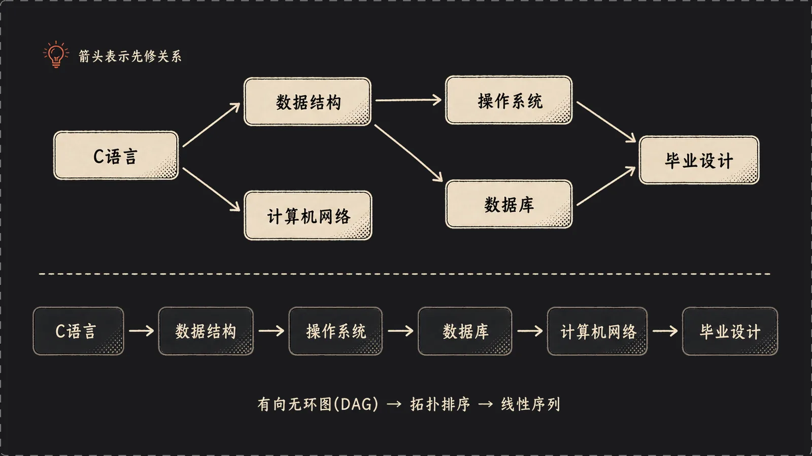
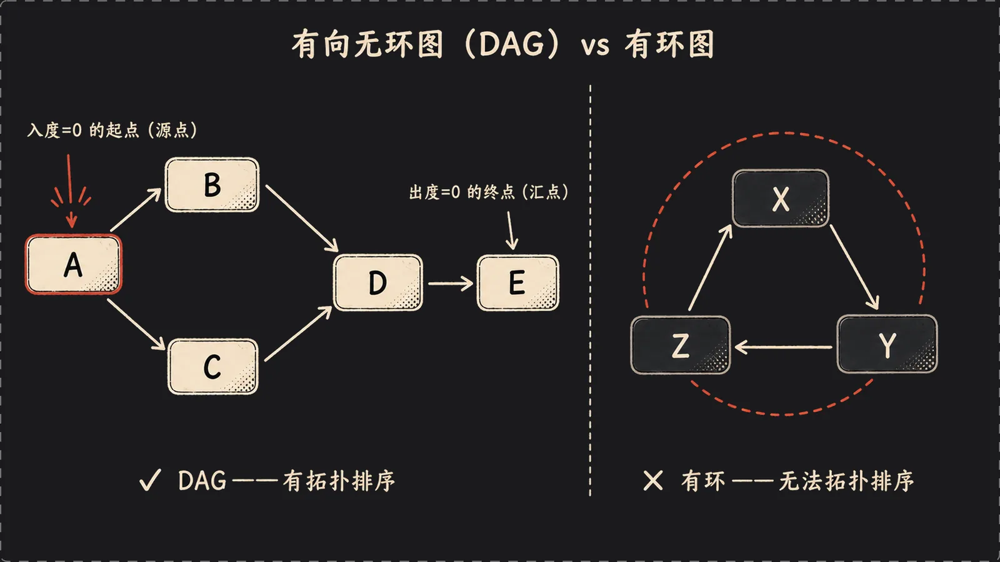
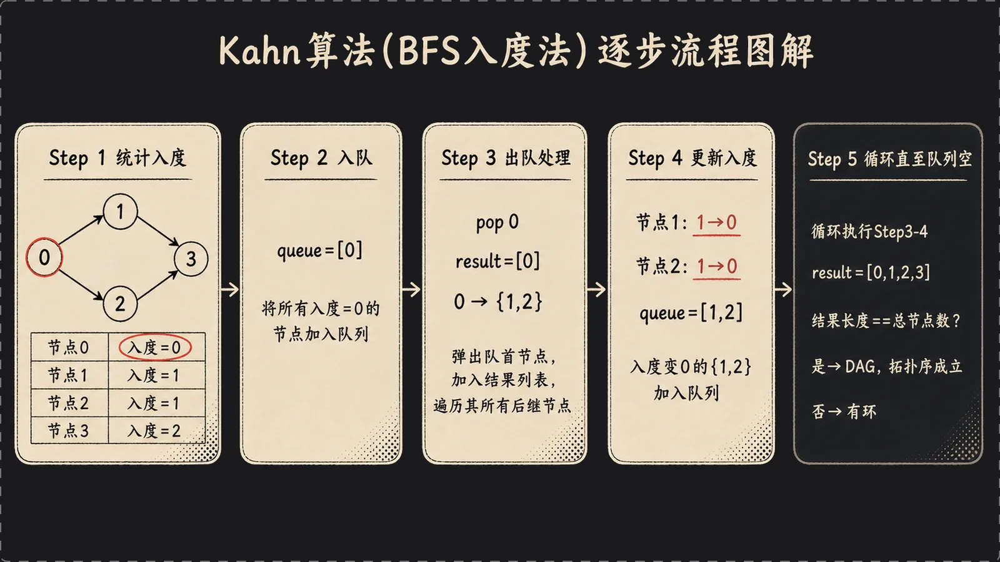
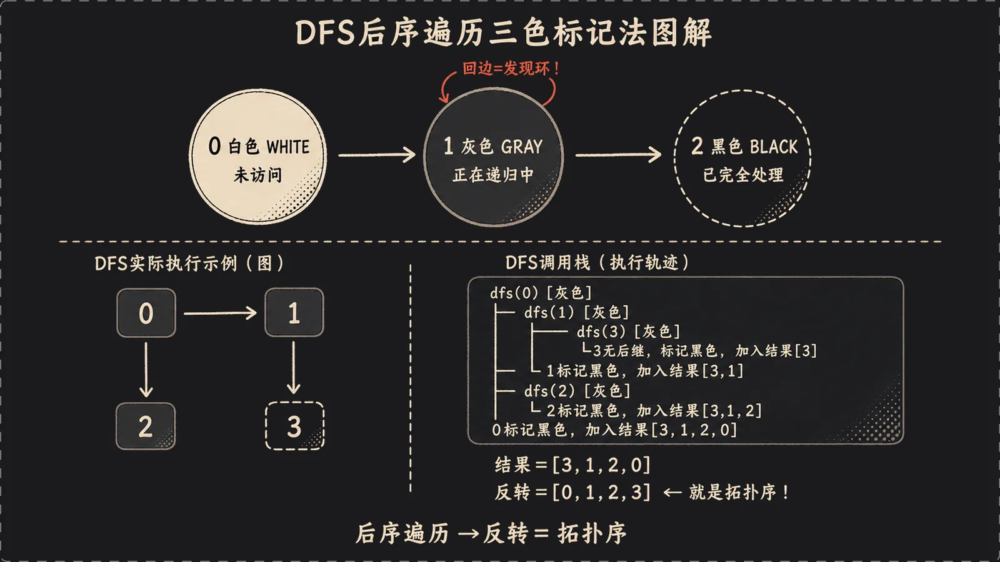
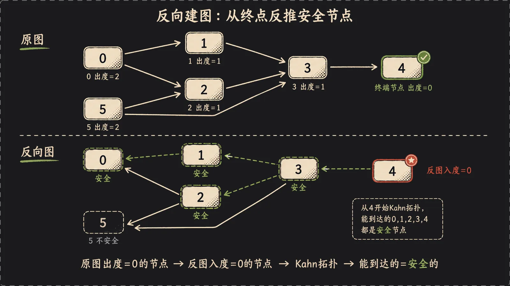
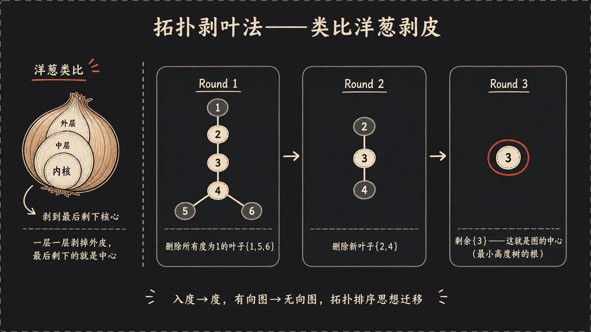
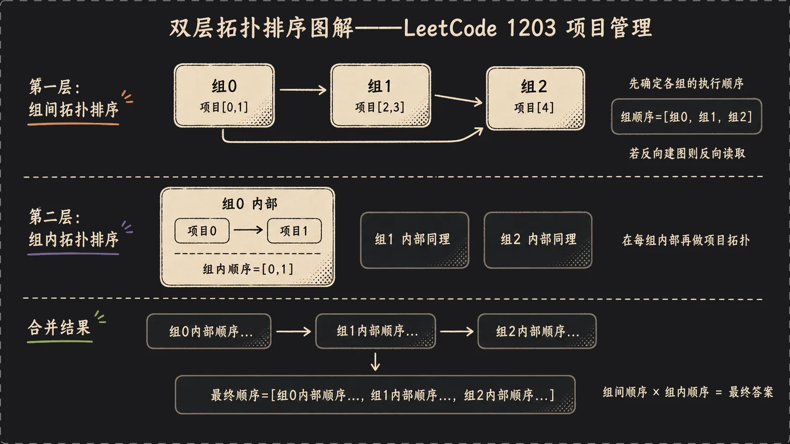

## 一、引言：从"先修课"说起

还记得大学选课的时候吗？你打开教务系统，兴冲冲地想选《操作系统》，结果系统弹出一行红字：「该课程需先修《数据结构》」。你只好回去先选《数据结构》，结果它又告诉你得先修《C 语言程序设计》。一层套一层，像剥洋葱。

这事儿其实就是拓扑排序最朴素的样子。我们手里有一堆任务，任务之间有先后依赖——A 必须在 B 之前完成。问题来了：**能不能排出一个合理的顺序，让你按这个顺序一路做下去，每做一件事的时候,它依赖的前置都已经搞定了？**

把它抽象一下。每门课是一个"节点"，「修 A 前必须先修 B」就是一条从 B 指向 A 的"有向边"。一堆节点加一堆有向边，这就是一张**有向图**。拓扑排序要干的事，就是把这张图里所有节点排成一条直线，使得**每一条边都从前面指向后面**——没有任何一条边是"往回指"的。

一句话总结本质：**拓扑排序就是把一个有向无环图的节点排成线性序列，让所有的依赖边都"从前指向后"。** 它不保证答案唯一（后面会讲为什么），但只要图里没有环，它一定排得出来。如果排不出来，那一定是依赖关系打了死结——比如 A 要先修 B，B 又要先修 A，谁也别想毕业。

这套思路用处大得超乎你想象。编译器决定先编译哪个文件、npm 安装包时的顺序、Excel 重算公式的次序、操作系统检测死锁……背后全是它。今天咱们就从概念一路捋到 LeetCode 实战，把它彻底吃透。

## 二、前置概念：有向无环图（DAG）



聊拓扑排序，绕不开它的舞台——**DAG**（Directed Acyclic Graph，有向无环图）。我们先把几个基础概念摆清楚。

**顶点、有向边、路径。** 顶点（vertex）就是图里的点，比如一门课。有向边（directed edge）是带箭头的连线，`B → A` 表示"先 B 后 A"。路径（path）是顺着箭头能一路走过去的一串顶点，比如 `C语言 → 数据结构 → 操作系统` 就是一条路径。

**DAG 是什么。** 拆开看：Directed（有向，边有方向）、Acyclic（无环，顺着箭头走永远回不到起点）、Graph（图）。重点在"无环"这俩字。

**为什么环是拓扑排序的天敌？** 假设有个环 `A → B → C → A`。拓扑排序要求 A 排在 B 前，B 排在 C 前，C 又排在 A 前。那 A 到底排第几？它既要在自己前面又要在自己后面，逻辑上自相矛盾。所以**只要图里有环，就根本不存在合法的拓扑序**。反过来,这也给了我们一个副产品：拓扑排序天生就能检测环。

接下来是两个核心量化指标，刷题时天天用：

**入度（in-degree）和出度（out-degree）。** 入度是指向某个节点的边的数量，出度是从某个节点射出去的边的数量。我特别喜欢用一个实物类比：**入度 = 这件事还有几个前置没搞定。** 你要做的事，入度是 3，说明还有 3 件事卡在它前面；等那 3 件都做完了，它的入度归零，这件事就可以开干了。这个直觉是后面 Kahn 算法的灵魂，记牢。

**邻接表 vs 邻接矩阵。** 存图有两种主流方式。邻接矩阵是个 V×V 的二维数组，`matrix[i][j] = 1` 表示有边 `i → j`，查任意两点间是否有边是 O(1)，但占用 O(V²) 空间，遍历所有边也要 O(V²)。邻接表是给每个节点挂一个"它指向谁"的列表，空间是 O(V+E)，遍历也是 O(V+E)。拓扑排序绝大多数情况用**邻接表**——因为图通常是稀疏的（边远少于 V²），而且我们的核心操作就是"遍历某节点的所有后继"，邻接表干这个又快又省。

**最后，拓扑序的严格定义：** 对图中每一条边 `u → v`，节点 u 在序列中都出现在 v 之前。注意一个关键点——**拓扑序通常不唯一**。比如两门课谁也不依赖谁，那它俩谁先谁后都行。只要满足所有边的"前→后"约束，就都是合法答案。这也是为什么很多 LeetCode 题会说"返回任意一种合法顺序即可"。

## 三、Kahn 算法（BFS 入度法）——正向思维



讲算法。第一个，也是我最推荐你优先掌握的——**Kahn 算法**，本质是 BFS 配合入度统计。

**核心直觉就一句话：哪些任务可以立刻开始？答案是没有任何前置依赖的，也就是入度为 0 的。** 想想现实中你做项目，第一步永远是找出那些"不依赖别人、马上能动手"的活儿，先把它们干了。干完之后，原本依赖它们的任务，前置就少了一个；当某个任务的所有前置都干完（入度归零），它也变成"可以立刻开始"了。Kahn 算法就是把这个朴素过程程序化。

逐步推导一遍：

1. **统计所有节点的入度。** 遍历每条边，边指向的那个节点入度 +1。
2. **构建邻接表。** 记录每个节点指向哪些后继。
3. **入度为 0 的节点全部入队。** 这批是"第一波能开工"的。
4. **循环：出队一个节点 → 加入结果序列 → 把它的每个后继入度减 1 → 谁减到 0 就入队。** 这一步是核心。出队意味着"这件事做完了"，那么所有依赖它的后继，前置都少了一个，自然要减一；减到 0 的后继，现在没有任何阻碍，可以入队等待处理。
5. **收尾判断：结果序列长度 == 总节点数？** 相等说明所有节点都成功排进去了，这是个 DAG，结果就是合法拓扑序。如果小于总数，说明有一批节点入度始终降不到 0——它们卡在一个环里彼此等待，**图中有环**。

**时间复杂度 O(V+E)。** 每个节点入队出队各一次，贡献 O(V)；每条边在"后继入度减 1"时恰好被处理一次，贡献 O(E)。加起来就是 O(V+E)，非常漂亮。这里的关键洞察是**每条边只被"减一次"**，不会重复。

**为什么 Kahn 天然适合"按层并行"？** 注意第 4 步里，"同一时刻入度为 0"的那一批节点，彼此之间没有依赖关系——否则它们就不会同时入度为 0。所以这一批可以**并发执行**！这正是 Make/Bazel 这类构建工具能 `-j` 多线程并行编译的理论基础：同一层的任务互不依赖，开多个线程一起跑。

**一个小坑：队列用什么数据结构？** 默认用普通 FIFO 队列就行。但如果题目要求"字典序最小的拓扑序"，就得换成**优先队列（小根堆）**，每次取编号最小的入度为 0 节点。如果把队列换成**栈**（后进先出），你会得到另一种合法的拓扑序——不是字典序，但同样满足约束。数据结构的选择不影响"是否合法"，只影响"是哪一个合法解"。

## 四、DFS 后序遍历法——逆向思维



第二种思路，DFS 后序遍历法。它和 Kahn 是两个方向看同一个问题，理解了它，你对拓扑排序的认识会立体很多。

**Kahn 问的是"谁能第一个做"，DFS 问的是"谁是最后一个做的"。** 最后一个节点是谁？是**出度为 0 的节点**——它不指向任何人，没有后继，所有人都不等它，它当然可以排在最末尾。

DFS 实现拓扑排序，最经典的工具是**三色标记法**，用来追踪每个节点的状态：

- **白色 (0)：未访问。** 还没碰过这个节点。
- **灰色 (1)：正在递归中。** 这个节点的 DFS 已经开始、但还没结束，它正躺在当前的递归调用栈里。
- **黑色 (2)：已处理完毕。** 它和它能到达的所有后继都已经处理完，已经加入结果。

**算法流程：** 对每个还是白色的节点启动 DFS。进入某节点，先把它染灰，然后递归访问它所有的后继；**当所有后继都递归处理完（返回时），把当前节点加入结果序列，并染黑。** 最后，把整个结果序列**反转**，就是拓扑序。

**环检测怎么做？** 在 DFS 过程中，如果你走到一个**灰色**节点——注意是灰色不是黑色——说明你顺着边又绕回了一个"正在递归栈里、还没处理完"的祖先节点。这条边叫**回边（back edge）**，它的存在铁证如山地说明：图里有环。这就是 DFS 检测环的方式。（碰到黑色节点不算环，那只是"这条路我之前从别处走过了"，正常的重复访问而已。）

**和 Kahn 对比一下：**

- DFS 递归实现往往更简洁，代码量少。
- 但 DFS 吃递归栈，**深图（链很长的图）可能栈溢出**，几万个节点的链一递归就爆。这种时候 Kahn 的迭代式反而更稳。
- 环检测方式不同：DFS 是"递归中遇到灰色节点"，Kahn 是"最后结果长度不够"。

**最关键、也最容易绕晕的理解：为什么是"后序遍历再反转"？** 后序的含义是——**先把一个节点所有的后继都处理完，最后才处理它自己。** 也就是说，一个节点被加入结果序列时，它指向的所有节点其实已经先被加进去了。所以在原始的后序结果里，后继排在前驱**前面**——这恰好和拓扑序反着来。把它一反转，就变成"前驱在前、后继在后"，正好就是我们要的拓扑序。理解了这层，DFS 拓扑排序就再也不会忘。

## 五、两种算法对比

把两种算法摆在一起看，心里就有谱了：

| 维度 | Kahn（BFS 入度法） | DFS 后序反转法 |
| --- | --- | --- |
| 思维方向 | 正向：从入度 0 的起点推进 | 逆向：从出度 0 的终点回溯 |
| 环检测方式 | 结果长度 < 总节点数 | 递归中遇到灰色节点（回边） |
| 并行友好度 | 高，同层节点可并发 | 低，递归本质串行 |
| 递归风险 | 无，纯迭代 | 深图可能栈溢出 |
| 字典序支持 | 容易，队列换成小根堆即可 | 不直接支持，需额外处理 |
| 实现难度 | 直观，新手友好 | 简洁，但要理解"反转" |

**结论：** 面试和日常刷题，**首选 Kahn**——直观、好调试、容易支持字典序、不怕深图。DFS 适合那些递归思维更自然的场景，或者你已经在做 DFS 遍历、顺手把拓扑序一起求了。两种都要会，但 Kahn 是你的主力武器。

## 六、由浅入深：LeetCode 实战

光说不练假把式。咱们从最基础的判断可行性，一路爬到困难的双层拓扑，每道题都过一遍。

### 6.1 [LeetCode 207. 课程表](https://leetcode.cn/problems/course-schedule/)（中等）——判断可行性

**题意：** 总共有 `numCourses` 门课，编号 0 到 numCourses-1。给定先修关系数组 `prerequisites`，其中 `[a, b]` 表示**修课程 a 之前必须先修课程 b**。问你能不能修完所有课程？返回 true 或 false。

**思路：** 经典的"判断有向图是否有环"。建图 → 统计入度 → 跑 Kahn BFS → 比较成功排序的课程数和总课程数。能全排进去（无环）就返回 true。

**Kotlin：**

```kotlin
class Solution {
    fun canFinish(numCourses: Int, prerequisites: Array<IntArray>): Boolean {
        val graph = Array(numCourses) { mutableListOf<Int>() }
        val indegree = IntArray(numCourses)
        for (p in prerequisites) {
            val a = p[0]; val b = p[1]  // 先修 b 再修 a，边 b -> a
            graph[b].add(a)
            indegree[a]++
        }
        val q = ArrayDeque<Int>()
        for (i in 0 until numCourses) if (indegree[i] == 0) q.addLast(i)
        var count = 0
        while (q.isNotEmpty()) {
            val cur = q.removeFirst()
            count++
            for (next in graph[cur]) if (--indegree[next] == 0) q.addLast(next)
        }
        return count == numCourses
    }
}
```

**C++：**

```cpp
class Solution {
public:
    bool canFinish(int numCourses, vector<vector<int>>& prerequisites) {
        vector<vector<int>> graph(numCourses);   // 邻接表
        vector<int> indegree(numCourses, 0);      // 入度数组

        // 关键：[a, b] 表示先修 b 再修 a，所以边是 b -> a
        for (auto& p : prerequisites) {
            int a = p[0], b = p[1];
            graph[b].push_back(a);   // b 指向 a
            indegree[a]++;           // a 的入度加一
        }

        queue<int> q;
        for (int i = 0; i < numCourses; i++)
            if (indegree[i] == 0) q.push(i);   // 入度为 0 的先入队

        int count = 0;                          // 已经"修完"的课程数
        while (!q.empty()) {
            int cur = q.front(); q.pop();
            count++;
            for (int next : graph[cur]) {       // 遍历后继
                if (--indegree[next] == 0)      // 入度减到 0 就入队
                    q.push(next);
            }
        }
        return count == numCourses;             // 全修完 = 无环
    }
};
```

**Rust：**

```rust
use std::collections::VecDeque;

impl Solution {
    pub fn can_finish(num_courses: i32, prerequisites: Vec<Vec<i32>>) -> bool {
        let n = num_courses as usize;
        let mut graph = vec![vec![]; n];
        let mut indegree = vec![0; n];
        for p in &prerequisites {
            let a = p[0] as usize;
            let b = p[1] as usize;  // 先修 b 再修 a，边 b -> a
            graph[b].push(a);
            indegree[a] += 1;
        }
        let mut q: VecDeque<usize> = VecDeque::new();
        for i in 0..n { if indegree[i] == 0 { q.push_back(i); } }
        let mut count = 0;
        while let Some(cur) = q.pop_front() {
            count += 1;
            for j in 0..graph[cur].len() {
                let next = graph[cur][j];
                indegree[next] -= 1;
                if indegree[next] == 0 { q.push_back(next); }
            }
        }
        count == n
    }
}
```

**一个最容易翻车的细节：建图方向别反了。** `[a, b]` 的语义是"修 a 前必须先修 b"，所以 b 是前置、a 是后继，边应该是 `b → a`。很多人下意识写成 `a → b`，结果整张图反了，答案自然错。读题时一定盯紧这个方向。

### 6.2 [LeetCode 210. 课程表 II](https://leetcode.cn/problems/course-schedule-ii/)（中等）——输出顺序

**题意：** 在 207 的基础上更进一步——不只问能不能修完，还要**返回一个可行的修课顺序**。如果不可能修完（有环），返回空数组。

**思路：** 和 207 几乎一模一样。Kahn 算法在出队的时候，本来就是按拓扑序在处理节点，我们只要**把出队顺序记录下来**当答案就行。从"能不能"到"怎么做"，核心逻辑没变，就多了记录这一步。

**Kotlin：**

```kotlin
class Solution {
    fun findOrder(numCourses: Int, prerequisites: Array<IntArray>): IntArray {
        val graph = Array(numCourses) { mutableListOf<Int>() }  // 邻接表
        val indegree = IntArray(numCourses)                      // 入度

        for (p in prerequisites) {
            val a = p[0]; val b = p[1]   // [a, b]: 先修 b 再修 a
            graph[b].add(a)              // 边 b -> a
            indegree[a]++
        }

        val queue = ArrayDeque<Int>()
        for (i in 0 until numCourses)
            if (indegree[i] == 0) queue.addLast(i)

        val order = IntArray(numCourses)  // 记录拓扑序
        var idx = 0
        while (queue.isNotEmpty()) {
            val cur = queue.removeFirst()
            order[idx++] = cur            // 出队顺序就是答案
            for (next in graph[cur]) {
                if (--indegree[next] == 0)
                    queue.addLast(next)
            }
        }

        // 如果没排满，说明有环，返回空数组
        return if (idx == numCourses) order else IntArray(0)
    }
}
```

**C++：**

```cpp
class Solution {
public:
    vector<int> findOrder(int numCourses, vector<vector<int>>& prerequisites) {
        vector<vector<int>> graph(numCourses);
        vector<int> indegree(numCourses, 0);
        for (auto& p : prerequisites) {
            int a = p[0], b = p[1];
            graph[b].push_back(a);
            indegree[a]++;
        }
        queue<int> q;
        for (int i = 0; i < numCourses; i++)
            if (indegree[i] == 0) q.push(i);
        vector<int> order;
        while (!q.empty()) {
            int cur = q.front(); q.pop();
            order.push_back(cur);
            for (int next : graph[cur])
                if (--indegree[next] == 0) q.push(next);
        }
        return order.size() == numCourses ? order : vector<int>{};
    }
};
```

**Rust：**

```rust
use std::collections::VecDeque;

impl Solution {
    pub fn find_order(num_courses: i32, prerequisites: Vec<Vec<i32>>) -> Vec<i32> {
        let n = num_courses as usize;
        let mut graph = vec![vec![]; n];
        let mut indegree = vec![0; n];
        for p in &prerequisites {
            let a = p[0] as usize;
            let b = p[1] as usize;
            graph[b].push(a);
            indegree[a] += 1;
        }
        let mut q: VecDeque<usize> = VecDeque::new();
        for i in 0..n { if indegree[i] == 0 { q.push_back(i); } }
        let mut order = Vec::new();
        while let Some(cur) = q.pop_front() {
            order.push(cur as i32);
            for j in 0..graph[cur].len() {
                let next = graph[cur][j];
                indegree[next] -= 1;
                if indegree[next] == 0 { q.push_back(next); }
            }
        }
        if order.len() == n { order } else { vec![] }
    }
}
```

对比 207，你看，逻辑骨架完全一致，差别就是把 `count++` 换成了 `order[idx++] = cur`，外加最后返回的是数组而非布尔值。这就是为什么我说掌握了 Kahn，这一类题就是同一套模板的变奏。

### 6.3 [LeetCode 802. 找到最终的安全状态](https://leetcode.cn/problems/find-eventual-safe-states/)（中等）——反向建图



**题意：** 有向图，从某个节点出发，如果**所有可能的路径最终都会停在一个出度为 0 的终端节点**（不会陷入环、不会无限走下去），这个起点就叫"安全节点"。返回所有安全节点，升序排列。

**思路：** 正着想很别扭——要判断一个节点的"所有路径"是不是都安全，得往下递归搜一大片。换个方向就豁然开朗了：**反向建图！** 原图中出度为 0 的终端节点，在反向图里入度就是 0。我们从这些反图的"起点"出发跑 Kahn 拓扑排序，能被这个过程访问到（在反图里入度能降到 0）的节点，就是安全的。这是拓扑排序非常经典的一个变形——**从"终点"反推**。

**Kotlin：**

```kotlin
class Solution {
    fun eventualSafeNodes(graph: Array<IntArray>): List<Int> {
        val n = graph.size
        val rgraph = Array(n) { mutableListOf<Int>() }
        val indegree = IntArray(n)
        for (u in 0 until n) {
            for (v in graph[u]) {
                rgraph[v].add(u)      // 反向边
                indegree[u]++          // 原图出度 = 反图入度
            }
        }
        val q = ArrayDeque<Int>()
        for (i in 0 until n) if (indegree[i] == 0) q.addLast(i)
        val safe = BooleanArray(n)
        while (q.isNotEmpty()) {
            val cur = q.removeFirst()
            safe[cur] = true
            for (prev in rgraph[cur]) {
                if (--indegree[prev] == 0) q.addLast(prev)
            }
        }
        return (0 until n).filter { safe[it] }.toList()
    }
}
```

**C++：**

```cpp
class Solution {
public:
    vector<int> eventualSafeNodes(vector<vector<int>>& graph) {
        int n = graph.size();
        vector<vector<int>> rgraph(n);
        vector<int> indegree(n, 0);
        for (int u = 0; u < n; u++) {
            for (int v : graph[u]) {
                rgraph[v].push_back(u);  // 反向边
                indegree[u]++;            // 原图出度 = 反图入度
            }
        }
        queue<int> q;
        for (int i = 0; i < n; i++)
            if (indegree[i] == 0) q.push(i);
        vector<bool> safe(n, false);
        while (!q.empty()) {
            int cur = q.front(); q.pop();
            safe[cur] = true;
            for (int prev : rgraph[cur])
                if (--indegree[prev] == 0) q.push(prev);
        }
        vector<int> ans;
        for (int i = 0; i < n; i++) if (safe[i]) ans.push_back(i);
        return ans;
    }
};
```

**Rust：**

```rust
use std::collections::VecDeque;

impl Solution {
    pub fn eventual_safe_nodes(graph: Vec<Vec<i32>>) -> Vec<i32> {
        let n = graph.len();
        let mut rgraph: Vec<Vec<usize>> = vec![vec![]; n]; // 反向图
        let mut indegree = vec![0usize; n];                // 反图中的入度

        // 原图 u -> v，反图里建 v -> u
        for u in 0..n {
            for &v in &graph[u] {
                let v = v as usize;
                rgraph[v].push(u);   // 反向边
                indegree[u] += 1;    // 原图出度 = 反图入度
            }
        }

        let mut queue: VecDeque<usize> = VecDeque::new();
        // 原图出度为 0（即反图入度为 0）的终端节点先入队
        for i in 0..n {
            if indegree[i] == 0 { queue.push_back(i); }
        }

        let mut safe = vec![false; n];
        while let Some(cur) = queue.pop_front() {
            safe[cur] = true;                // 能走到这里的都安全
            for &prev in &rgraph[cur] {      // 反图后继 = 原图前驱
                indegree[prev] -= 1;
                if indegree[prev] == 0 {
                    queue.push_back(prev);
                }
            }
        }

        (0..n).filter(|&i| safe[i]).map(|i| i as i32).collect()
    }
}
```

体会一下这个"反向"的精髓：一个节点安全，当且仅当它指向的所有节点都安全。在反图里跑拓扑，相当于从"绝对安全的终点"一层层往回确认安全性。卡在环里的节点入度永远降不到 0，自然就被排除了。

### 6.4 [LeetCode 310. 最小高度树](https://leetcode.cn/problems/minimum-height-trees/)（中等）——拓扑剥叶



**题意：** 给一棵 n 个节点的**无向树**（n-1 条边、连通无环），如果选某个节点当根，树就有一个高度。找出所有能让树高最小的根节点，返回它们的编号。答案最多 2 个。

**思路：** 这题严格说不是传统拓扑排序，但它用的是**同一种"逐层剥叶子"的思想**，值得放在这儿讲。直觉是：最矮的树，根一定在树的"正中心"。怎么找中心？**像剥洋葱一样，从最外圈不断往里剥叶子节点**——叶子就是度为 1 的节点。剥掉一圈，新的一圈节点又变成叶子，继续剥。最后剩下的 1 个或 2 个节点，就是树的中心，也就是答案。

**思想迁移在哪？** 在无向图里没有"入度"，但有"度"。这里把"入度为 0 才能处理"的逻辑，迁移成了"度为 1（叶子）才剥掉"。本质都是 BFS 的层层推进。

**Kotlin：**

```kotlin
class Solution {
    fun findMinHeightTrees(n: Int, edges: Array<IntArray>): List<Int> {
        if (n == 1) return listOf(0)   // 单节点特判

        val graph = Array(n) { mutableListOf<Int>() }
        val degree = IntArray(n)
        for (e in edges) {             // 无向图，两端都要加
            graph[e[0]].add(e[1])
            graph[e[1]].add(e[0])
            degree[e[0]]++
            degree[e[1]]++
        }

        // 第一圈叶子：度为 1
        var leaves = ArrayDeque<Int>()
        for (i in 0 until n) if (degree[i] == 1) leaves.addLast(i)

        var remaining = n
        // 剥到只剩 2 个或更少为止
        while (remaining > 2) {
            val size = leaves.size
            remaining -= size
            repeat(size) {
                val leaf = leaves.removeFirst()
                for (next in graph[leaf]) {
                    if (--degree[next] == 1)   // 邻居变成新叶子
                        leaves.addLast(next)
                }
            }
        }
        return leaves.toList()   // 剩下的就是中心
    }
}
```

**C++：**

```cpp
class Solution {
public:
    vector<int> findMinHeightTrees(int n, vector<vector<int>>& edges) {
        if (n == 1) return {0};
        vector<vector<int>> graph(n);
        vector<int> degree(n, 0);
        for (auto& e : edges) {
            graph[e[0]].push_back(e[1]);
            graph[e[1]].push_back(e[0]);
            degree[e[0]]++;
            degree[e[1]]++;
        }
        queue<int> leaves;
        for (int i = 0; i < n; i++)
            if (degree[i] == 1) leaves.push(i);
        int remaining = n;
        while (remaining > 2) {
            int sz = leaves.size();
            remaining -= sz;
            for (int i = 0; i < sz; i++) {
                int leaf = leaves.front(); leaves.pop();
                for (int next : graph[leaf])
                    if (--degree[next] == 1) leaves.push(next);
            }
        }
        vector<int> ans;
        while (!leaves.empty()) {
            ans.push_back(leaves.front()); leaves.pop();
        }
        return ans;
    }
};
```

**Rust：**

```rust
use std::collections::VecDeque;

impl Solution {
    pub fn find_min_height_trees(n: i32, edges: Vec<Vec<i32>>) -> Vec<i32> {
        let n = n as usize;
        if n == 1 { return vec![0]; }
        let mut graph = vec![vec![]; n];
        let mut degree = vec![0; n];
        for e in &edges {
            let u = e[0] as usize;
            let v = e[1] as usize;
            graph[u].push(v);
            graph[v].push(u);
            degree[u] += 1;
            degree[v] += 1;
        }
        let mut leaves: VecDeque<usize> = VecDeque::new();
        for i in 0..n { if degree[i] == 1 { leaves.push_back(i); } }
        let mut remaining = n;
        while remaining > 2 {
            let sz = leaves.len();
            remaining -= sz;
            for _ in 0..sz {
                let leaf = leaves.pop_front().unwrap();
                for &next in &graph[leaf] {
                    degree[next] -= 1;
                    if degree[next] == 1 { leaves.push_back(next); }
                }
            }
        }
        leaves.into_iter().map(|x| x as i32).collect()
    }
}
```

注意那个 `while (remaining > 2)` 和按层 `repeat(size)` 的写法——必须**整层整层地剥**，不能一个一个乱剥，否则没法保证最后剩下的是中心。

### 6.5 [LeetCode 329. 矩阵中的最长递增路径](https://leetcode.cn/problems/longest-increasing-path-in-a-matrix/)（困难）——拓扑序 + DP

**题意：** 给一个 `m × n` 的整数矩阵，从任意格子出发，每次可以走上下左右四个方向，但**只能走到比当前值严格更大的格子**。求最长的严格递增路径长度。

**思路：** 把每个格子看成一个图节点，**值小的格子指向相邻值大的格子**，这就构成了一个 DAG（因为严格递增，不可能成环）。最长递增路径 = DAG 上的最长路径。怎么求？**按拓扑序做 DP。** 用 Kahn：出度为 0 的格子（局部最大值，四周没有更大的）先入队，反向递推每个格子能延伸的最长长度。

这里我用一个稍微好理解的角度：建图时统计每个格子的**出度**（指向多少个更大的邻居），从出度为 0 的格子开始反向 BFS，一层层就是路径长度。

**Kotlin：**

```kotlin
class Solution {
    fun longestIncreasingPath(matrix: Array<IntArray>): Int {
        val m = matrix.size; val n = matrix[0].size
        val outdeg = Array(m) { IntArray(n) }
        val dirs = arrayOf(intArrayOf(0,1), intArrayOf(0,-1), intArrayOf(1,0), intArrayOf(-1,0))
        for (i in 0 until m) for (j in 0 until n) {
            for (d in dirs) {
                val ni = i + d[0]; val nj = j + d[1]
                if (ni in 0 until m && nj in 0 until n && matrix[ni][nj] > matrix[i][j])
                    outdeg[i][j]++
            }
        }
        val q = ArrayDeque<Pair<Int,Int>>()
        for (i in 0 until m) for (j in 0 until n)
            if (outdeg[i][j] == 0) q.addLast(i to j)
        var length = 0
        while (q.isNotEmpty()) {
            length++
            repeat(q.size) {
                val (i,j) = q.removeFirst()
                for (d in dirs) {
                    val ni = i + d[0]; val nj = j + d[1]
                    if (ni in 0 until m && nj in 0 until n && matrix[ni][nj] < matrix[i][j]) {
                        if (--outdeg[ni][nj] == 0) q.addLast(ni to nj)
                    }
                }
            }
        }
        return length
    }
}
```

**C++：**

```cpp
class Solution {
public:
    int longestIncreasingPath(vector<vector<int>>& matrix) {
        int m = matrix.size(), n = matrix[0].size();
        vector<vector<int>> outdeg(m, vector<int>(n, 0)); // 出度
        int dirs[4][2] = {{0,1},{0,-1},{1,0},{-1,0}};

        // 统计出度：指向比自己大的邻居
        for (int i = 0; i < m; i++)
            for (int j = 0; j < n; j++)
                for (auto& d : dirs) {
                    int ni = i + d[0], nj = j + d[1];
                    if (ni>=0 && ni<m && nj>=0 && nj<n
                        && matrix[ni][nj] > matrix[i][j])
                        outdeg[i][j]++;
                }

        // 出度为 0 的格子（局部最大值）入队
        queue<pair<int,int>> q;
        for (int i = 0; i < m; i++)
            for (int j = 0; j < n; j++)
                if (outdeg[i][j] == 0) q.push({i, j});

        int length = 0;
        while (!q.empty()) {            // 按层 BFS，层数就是路径长度
            int sz = q.size();
            length++;
            while (sz--) {
                auto [i, j] = q.front(); q.pop();
                for (auto& d : dirs) {  // 反向找更小的邻居
                    int ni = i + d[0], nj = j + d[1];
                    if (ni>=0 && ni<m && nj>=0 && nj<n
                        && matrix[ni][nj] < matrix[i][j]) {
                        if (--outdeg[ni][nj] == 0)
                            q.push({ni, nj});
                    }
                }
            }
        }
        return length;
    }
};
```

**Rust：**

```rust
use std::collections::VecDeque;

impl Solution {
    pub fn longest_increasing_path(matrix: Vec<Vec<i32>>) -> i32 {
        let m = matrix.len();
        let n = matrix[0].len();
        let mut outdeg = vec![vec![0; n]; m];
        let dirs = [(0,1),(0,-1),(1,0),(-1,0)];
        for i in 0..m { for j in 0..n {
            for (di, dj) in dirs {
                let ni = i as i32 + di;
                let nj = j as i32 + dj;
                if ni >= 0 && ni < m as i32 && nj >= 0 && nj < n as i32
                    && matrix[ni as usize][nj as usize] > matrix[i][j] {
                    outdeg[i][j] += 1;
                }
            }
        }}
        let mut q: VecDeque<(usize, usize)> = VecDeque::new();
        for i in 0..m { for j in 0..n {
            if outdeg[i][j] == 0 { q.push_back((i, j)); }
        }}
        let mut length = 0;
        while !q.is_empty() {
            length += 1;
            let sz = q.len();
            for _ in 0..sz {
                let (i, j) = q.pop_front().unwrap();
                for (di, dj) in dirs {
                    let ni = i as i32 + di;
                    let nj = j as i32 + dj;
                    if ni >= 0 && ni < m as i32 && nj >= 0 && nj < n as i32
                        && matrix[ni as usize][nj as usize] < matrix[i][j] {
                        let ni = ni as usize;
                        let nj = nj as usize;
                        outdeg[ni][nj] -= 1;
                        if outdeg[ni][nj] == 0 { q.push_back((ni, nj)); }
                    }
                }
            }
        }
        length
    }
}
```

**关键理解：拓扑序上的 DP，就是从"已经确定最优解"的节点，递推到"还没确定"的节点。** 局部最大值的格子，它的最长路径显然是 1（无处可去），这是确定的。然后从它反推回去，每个格子的最长路径 = 它指向的所有更大邻居的最长路径里的最大值 + 1。按拓扑序处理，保证你算某个格子时，它依赖的格子都已经算完了。这正是拓扑 DP 的核心威力。

### 6.6 [LeetCode 1203. 项目管理](https://leetcode.cn/problems/sort-items-by-groups-respecting-dependencies/)（困难）——双层拓扑



**题意：** 有 n 个项目，分属 m 个小组（有的项目没分组）。约束有两层：**组间有依赖**（某些组的项目要排在另一些组前面），**组内项目也有依赖**。要求返回一个项目排列，同时满足两层约束，并且**同一个组的项目必须连续排在一起**。不可能就返回空。

**思路：** 这题是拓扑排序"作为工具"而非"背模板"的绝佳例子。核心是**分治 + 双层拓扑**：

1. **先做组间拓扑**——把每个组看成一个大节点，根据组间依赖排出组的先后顺序。
2. **再做组内拓扑**——在每个组内部，对组里的项目按组内依赖排序。
3. **合并**——按组的拓扑序，把每个组内部排好序的项目依次拼接起来。

预处理时有个技巧：没有分组的项目（`group[i] == -1`），给它单独分配一个新组号，这样处理起来统一。

**Kotlin：**

```kotlin
class Solution {
    fun sortItems(n: Int, m: Int, group: IntArray,
                  beforeItems: List<List<Int>>): IntArray {
        var groupCount = m
        val grp = group.copyOf()
        // 没分组的项目，各自成立一个新组
        for (i in 0 until n) if (grp[i] == -1) grp[i] = groupCount++

        // 两套图：组间 + 组内（按项目）
        val groupGraph = Array(groupCount) { mutableListOf<Int>() }
        val groupIndeg = IntArray(groupCount)
        val itemGraph  = Array(n) { mutableListOf<Int>() }
        val itemIndeg  = IntArray(n)

        for (cur in 0 until n) {
            for (pre in beforeItems[cur]) {
                if (grp[pre] != grp[cur]) {     // 跨组依赖 -> 组间边
                    groupGraph[grp[pre]].add(grp[cur])
                    groupIndeg[grp[cur]]++
                } else {                        // 同组依赖 -> 组内边
                    itemGraph[pre].add(cur)
                    itemIndeg[cur]++
                }
            }
        }

        // 通用 Kahn 拓扑，返回拓扑序（有环则长度不足）
        fun topo(nodes: List<Int>, graph: Array<MutableList<Int>>,
                 indeg: IntArray): List<Int> {
            val q = ArrayDeque<Int>()
            for (node in nodes) if (indeg[node] == 0) q.addLast(node)
            val res = mutableListOf<Int>()
            while (q.isNotEmpty()) {
                val cur = q.removeFirst()
                res.add(cur)
                for (next in graph[cur])
                    if (--indeg[next] == 0) q.addLast(next)
            }
            return res
        }

        // 第一层：组间拓扑
        val groupOrder = topo((0 until groupCount).toList(),
                              groupGraph, groupIndeg)
        if (groupOrder.size < groupCount) return IntArray(0)  // 组间有环

        // 第二层：组内拓扑（先把项目按组归类）
        val itemsInGroup = Array(groupCount) { mutableListOf<Int>() }
        for (i in 0 until n) itemsInGroup[grp[i]].add(i)

        val ans = mutableListOf<Int>()
        for (g in groupOrder) {
            val items = itemsInGroup[g]
            if (items.isEmpty()) continue
            val sorted = topo(items, itemGraph, itemIndeg)
            if (sorted.size < items.size) return IntArray(0)   // 组内有环
            ans.addAll(sorted)        // 拼接：保证同组连续
        }
        return ans.toIntArray()
    }
}
```

**C++：**

```cpp
class Solution {
public:
    vector<int> sortItems(int n, int m, vector<int>& group,
                          vector<vector<int>>& beforeItems) {
        int groupCount = m;
        vector<int> grp = group;
        for (int i = 0; i < n; i++)
            if (grp[i] == -1) grp[i] = groupCount++;

        vector<vector<int>> groupGraph(groupCount), itemGraph(n);
        vector<int> groupIndeg(groupCount, 0), itemIndeg(n, 0);

        for (int cur = 0; cur < n; cur++) {
            for (int pre : beforeItems[cur]) {
                if (grp[pre] != grp[cur]) {
                    groupGraph[grp[pre]].push_back(grp[cur]);
                    groupIndeg[grp[cur]]++;
                } else {
                    itemGraph[pre].push_back(cur);
                    itemIndeg[cur]++;
                }
            }
        }

        auto topo = [&](vector<int>& nodes, vector<vector<int>>& graph,
                        vector<int>& indeg) -> vector<int> {
            queue<int> q;
            for (int node : nodes) if (indeg[node] == 0) q.push(node);
            vector<int> res;
            while (!q.empty()) {
                int cur = q.front(); q.pop();
                res.push_back(cur);
                for (int next : graph[cur])
                    if (--indeg[next] == 0) q.push(next);
            }
            return res;
        };

        vector<int> allGroups(groupCount);
        iota(allGroups.begin(), allGroups.end(), 0);
        auto groupOrder = topo(allGroups, groupGraph, groupIndeg);
        if (groupOrder.size() < groupCount) return {};

        vector<vector<int>> itemsInGroup(groupCount);
        for (int i = 0; i < n; i++) itemsInGroup[grp[i]].push_back(i);

        vector<int> ans;
        for (int g : groupOrder) {
            auto& items = itemsInGroup[g];
            if (items.empty()) continue;
            auto sorted = topo(items, itemGraph, itemIndeg);
            if (sorted.size() < items.size()) return {};
            ans.insert(ans.end(), sorted.begin(), sorted.end());
        }
        return ans;
    }
};
```

**Rust：**

```rust
use std::collections::VecDeque;

impl Solution {
    pub fn sort_items(n: i32, m: i32, group: Vec<i32>,
                      before_items: Vec<Vec<i32>>) -> Vec<i32> {
        let n = n as usize;
        let m = m as usize;
        let mut group_count = m;
        let mut grp: Vec<usize> = group.iter().map(|&x| x as usize).collect();
        for i in 0..n { if grp[i] == usize::MAX { grp[i] = group_count; group_count += 1; } }

        let mut group_graph = vec![vec![]; group_count];
        let mut group_indeg = vec![0; group_count];
        let mut item_graph = vec![vec![]; n];
        let mut item_indeg = vec![0; n];

        for cur in 0..n {
            for &pre in &before_items[cur] {
                let pre = pre as usize;
                if grp[pre] != grp[cur] {
                    group_graph[grp[pre]].push(grp[cur]);
                    group_indeg[grp[cur]] += 1;
                } else {
                    item_graph[pre].push(cur);
                    item_indeg[cur] += 1;
                }
            }
        }

        fn topo(nodes: &[usize], graph: &[Vec<usize>],
                indeg: &mut [usize]) -> Vec<usize> {
            let mut q = VecDeque::new();
            for &node in nodes { if indeg[node] == 0 { q.push_back(node); } }
            let mut res = Vec::new();
            while let Some(cur) = q.pop_front() {
                res.push(cur);
                for j in 0..graph[cur].len() {
                    let next = graph[cur][j];
                    indeg[next] -= 1;
                    if indeg[next] == 0 { q.push_back(next); }
                }
            }
            res
        }

        let all_groups: Vec<usize> = (0..group_count).collect();
        let group_order = topo(&all_groups, &group_graph, &mut group_indeg);
        if group_order.len() < group_count { return vec![]; }

        let mut items_in_group = vec![vec![]; group_count];
        for i in 0..n { items_in_group[grp[i]].push(i); }

        let mut ans = Vec::new();
        for g in group_order {
            let items = &items_in_group[g];
            if items.is_empty() { continue; }
            let sorted = topo(items, &item_graph, &mut item_indeg);
            if sorted.len() < items.len() { return vec![]; }
            ans.extend(sorted.iter().map(|&x| x as i32));
        }
        ans
    }
}
```

这道题最能体现拓扑排序的思维价值——它不是某道"套公式"的题，而是要你**自己识别出"这里有两层依赖，分别建图分别拓扑再合并"**。能独立想到这一步，说明你真正理解了拓扑排序是个什么工具，而不是背下了某段代码。

## 七、三种语言标准实现模板

刷题时常用三种语言，这里给一份同一个 Kahn 算法在 Kotlin、C++、Rust 下的标准模板，注释标了各自的坑，可以直接拿去用。

**Kotlin：**

```kotlin
fun topoSort(n: Int, edges: Array<IntArray>): List<Int> {
    // 坑：用 MutableList 建邻接表灵活；队列优先选 ArrayDeque
    //     （ArrayDeque 是 Kotlin/Java 推荐的双端队列实现，比 LinkedList 快）
    val graph = Array(n) { mutableListOf<Int>() }
    val indeg = IntArray(n)
    for (e in edges) {           // e = [u, v] 表示 u -> v
        graph[e[0]].add(e[1])
        indeg[e[1]]++
    }
    val q = ArrayDeque<Int>()
    for (i in 0 until n) if (indeg[i] == 0) q.addLast(i)
    val res = mutableListOf<Int>()
    while (q.isNotEmpty()) {
        val cur = q.removeFirst()
        res.add(cur)
        for (next in graph[cur]) if (--indeg[next] == 0) q.addLast(next)
    }
    return if (res.size == n) res else emptyList()  // 空 = 有环
}
```

**C++：**

```cpp
vector<int> topoSort(int n, vector<vector<int>>& edges) {
    // 坑1：旧标准里 vector<vector<int>> 的 >> 要写成 > >（C++11 起已无此问题）
    // 坑2：已知规模时给 graph[i].reserve() 可减少 vector 扩容开销
    vector<vector<int>> graph(n);
    vector<int> indeg(n, 0);
    for (auto& e : edges) {        // e = {u, v} 表示 u -> v
        graph[e[0]].push_back(e[1]);
        indeg[e[1]]++;
    }
    queue<int> q;
    for (int i = 0; i < n; i++) if (indeg[i] == 0) q.push(i);
    vector<int> res;
    while (!q.empty()) {
        int cur = q.front(); q.pop();
        res.push_back(cur);
        for (int next : graph[cur])
            if (--indeg[next] == 0) q.push(next);
    }
    return res.size() == (size_t)n ? res : vector<int>{}; // 空 = 有环
}
```

**Rust：**

```rust
use std::collections::VecDeque;

fn topo_sort(n: usize, edges: &[(usize, usize)]) -> Vec<usize> {
    // 坑1：所有权——遍历邻接表用 &graph[cur] 借用，别 move
    // 坑2：队列用 VecDeque，push_back / pop_front
    // 坑3：LeetCode 给的常是 i32，记得 as usize 转换，别直接当下标
    let mut graph: Vec<Vec<usize>> = vec![vec![]; n];
    let mut indeg = vec![0usize; n];
    for &(u, v) in edges {          // (u, v) 表示 u -> v
        graph[u].push(v);
        indeg[v] += 1;
    }
    let mut q: VecDeque<usize> = VecDeque::new();
    for i in 0..n {
        if indeg[i] == 0 { q.push_back(i); }
    }
    let mut res = Vec::new();
    while let Some(cur) = q.pop_front() {
        res.push(cur);
        // 先收集后继再改 indeg，规避借用冲突；这里直接读取后立即改是安全的
        for j in 0..graph[cur].len() {
            let next = graph[cur][j];
            indeg[next] -= 1;
            if indeg[next] == 0 { q.push_back(next); }
        }
    }
    if res.len() == n { res } else { Vec::new() }  // 空 = 有环
}
```

三份代码骨架完全一样，差异都在语言特性上。Kotlin 注意 `ArrayDeque` 的选择，C++ 注意 `reserve` 和老编译器的尖括号，Rust 最需要小心的是所有权借用和 `usize`/`i32` 的转换——这几个坑踩过一次就记住了。

## 八、应用场景全景

拓扑排序绝不只是刷题用，它在工程里无处不在：

- **编译系统。** Make、Bazel、Maven 的依赖解析核心就是拓扑排序——决定先编译哪个模块，并据此并行调度。
- **包管理器。** npm、pip、apt 安装依赖时，靠拓扑排序确定安装顺序，同时检测循环依赖（出环就报错）。
- **任务调度。** 项目管理里的 PERT/CPM 关键路径法，在拓扑序基础上算每个任务的最早/最晚开始时间。
- **电子表格求值。** Excel 单元格公式互相引用，重算时必须按拓扑序——被引用的先算。
- **指令调度。** 编译器做指令重排优化时，靠拓扑序保证数据依赖不被破坏。
- **死锁检测。** 操作系统的资源分配图里，一旦出现环就意味着死锁，本质是拓扑排序的环检测。

你看，它们底层全是同一件事：**梳理依赖、排出顺序、检测死结。**

## 九、LeetCode 强化刷题推荐列表

按难度梯度刷，效果最好：

| 题号 | 题目名称 | 难度 | 核心考点 | 推荐理由 |
| --- | --- | --- | --- | --- |
| [207](https://leetcode.cn/problems/course-schedule/) | 课程表 | 中等 | Kahn 判环 | 拓扑排序入门第一题，必刷 |
| [210](https://leetcode.cn/problems/course-schedule-ii/) | 课程表 II | 中等 | Kahn 输出序列 | 在 207 上输出顺序，模板巩固 |
| [802](https://leetcode.cn/problems/find-eventual-safe-states/) | 找到最终的安全状态 | 中等 | 反向建图 | 学会"从终点反推"的经典变形 |
| [310](https://leetcode.cn/problems/minimum-height-trees/) | 最小高度树 | 中等 | 拓扑剥叶 | 把度数概念迁移到无向树 |
| [444](https://leetcode.cn/problems/sequence-reconstruction/) | 序列重建 | 中等 | 唯一拓扑序判断 | 判断拓扑序是否唯一，思维进阶 |
| [1136](https://leetcode.cn/problems/parallel-courses/) | 并行课程 | 中等 | 分层拓扑 | 求最少学期数，理解"按层推进" |
| [269](https://leetcode.cn/problems/alien-dictionary/) | 火星词典 | 困难 | 建图 + 拓扑 | 难点在从字符串对比推出边 |
| [329](https://leetcode.cn/problems/longest-increasing-path-in-a-matrix/) | 矩阵中的最长递增路径 | 困难 | 拓扑序 + DP | DAG 上 DP 的典范 |
| [1857](https://leetcode.cn/problems/largest-color-value-in-a-directed-graph/) | 有向图中最大颜色值 | 困难 | 拓扑 + 计数 DP | 拓扑序上维护颜色计数 |
| [2050](https://leetcode.cn/problems/parallel-courses-iii/) | 并行课程 III | 困难 | 拓扑 + 最长路 DP | 带权 DAG 求完成时间 |
| [1203](https://leetcode.cn/problems/sort-items-by-groups-respecting-dependencies/) | 项目管理 | 困难 | 双层拓扑 | 拓扑作为工具的综合大题 |
| [1462](https://leetcode.cn/problems/course-schedule-iv/) | 课程表 IV | 中等 | 拓扑 + 可达性 | 拓扑序上传递可达关系 |

刷题节奏建议：**入门**先把 207/210 刷到闭着眼能写；**进阶**做 802/310/444/1136，体会各种变形；**DAG-DP** 攻 329/1857/2050，把拓扑和动态规划结合的套路吃透；**综合**最后啃 1203/269，这俩能写出来，拓扑排序这块就算出师了。

## 十、总结

捋了这么多，三个核心要点请刻进脑子：

1. **入度为 0 的随时可以做（Kahn）。** 这是正向思维的灵魂——找到没有前置依赖的节点先处理，处理完更新后继的入度。
2. **DFS 后序反转（另一种视角）。** 逆向思维——先处理完所有后继再处理自己，最后反转就是拓扑序。
3. **结果数量判断环。** Kahn 里结果长度小于总节点数，就一定有环；DFS 里递归遇到灰色节点即有环。

最后想多说一句：**别死记代码，要记住"依赖关系的拓扑本质"。** 你会发现，从课程表到反向安全状态，从矩阵 DP 到双层项目管理，代码骨架几乎一样，变的只是"怎么建图"和"求什么"。一旦你能在一个新问题里敏锐地看出"这里有依赖关系，可以拓扑"，剩下的就是水到渠成。

---

本文由 AgentPlanFlow 生成
