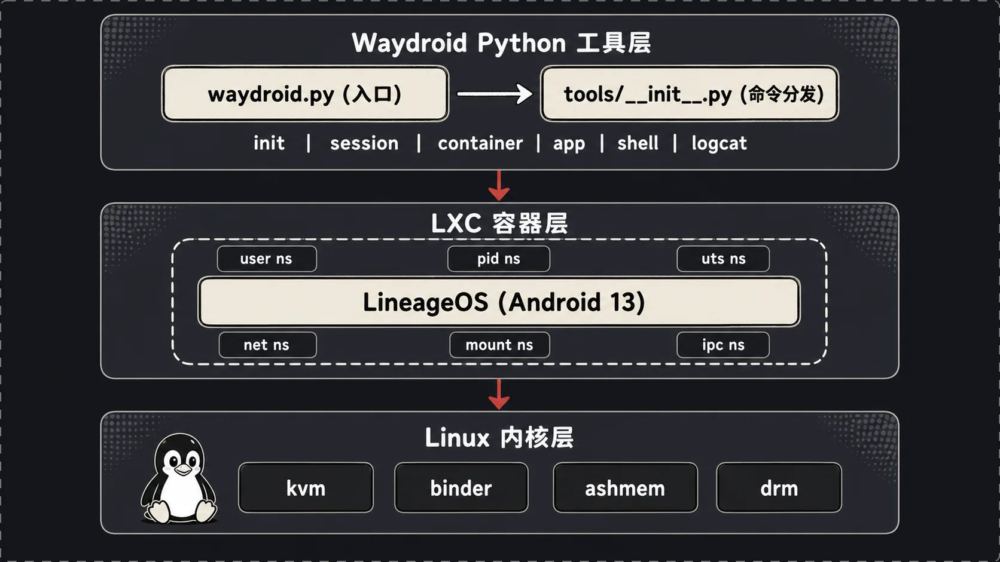
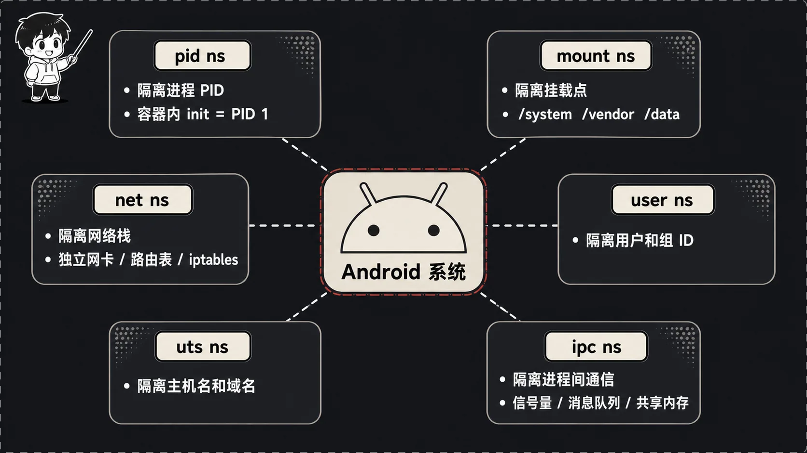
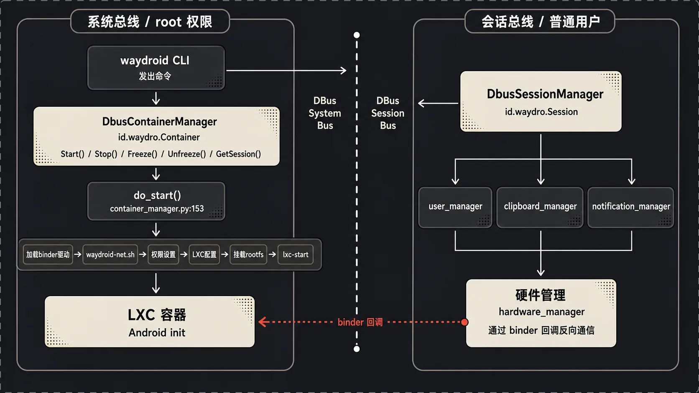
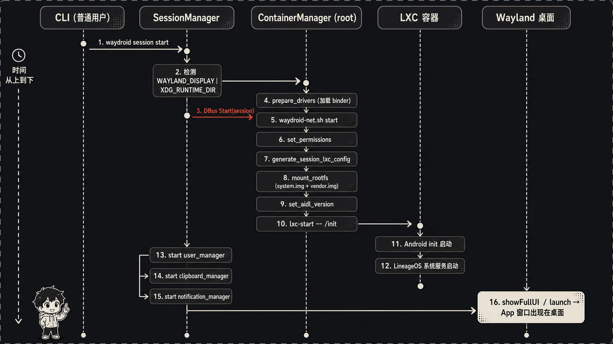
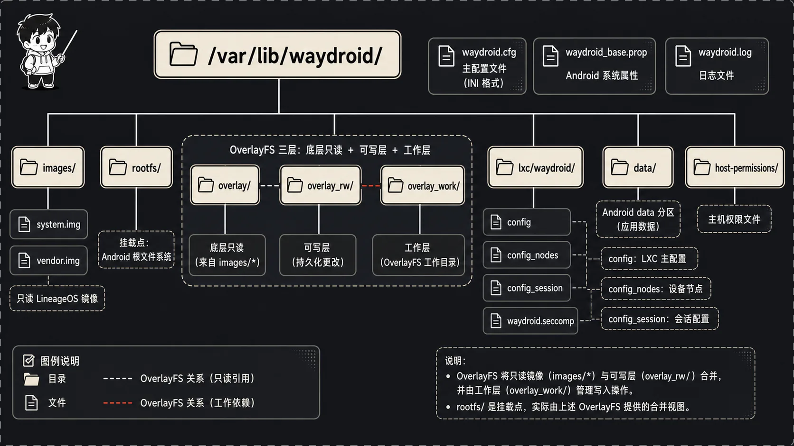

## 先说说我为什么会盯上 Waydroid

事情的起因很无聊。我在 Linux 上日常办公，但有几个 App 死活只有安卓版——银行的、打卡的、还有个只在手机上能扫码的内部工具。每次我都得掏出手机，烦得很。

最直接的念头当然是装个安卓模拟器。我也试过，体验只能用"惨"来形容。传统模拟器（比如基于 QEMU 的那一套）干的是一件很重的活：它要在你的 x86 机器上完整模拟出一台 ARM 手机，从 CPU 指令到外设全部翻译一遍。指令级翻译这件事天然就慢，GPU 还经常走软件渲染，结果就是开个微信都卡，玩游戏更别想。本质上你是在用一台电脑"假装"成另一台电脑，中间隔了一整层翻译。

那有没有办法不翻译呢？如果我的 CPU 本来就是 ARM64（现在不少笔记本是），安卓的二进制其实可以直接跑；就算是 x86，安卓也有 x86 镜像。真正卡脖子的不是 CPU，而是"安卓要的那一整套运行环境"——它要 init 进程、要 binder、要自己的文件系统布局、要一堆系统服务。这些东西没法直接塞进我的桌面 Linux 里，会打架。

Waydroid 的思路就特别讨巧：**别模拟，直接跑，但是把安卓关进一个"隔离间"里**。它用容器技术把整个安卓系统装起来，安卓进程直接在我的内核上原生执行，GPU 也能直接访问硬件。性能基本接近原生，App 显示还能无缝贴到我的 Wayland 桌面上。这篇我就顺着源码，把 Waydroid 是怎么搭起来的从头到尾捋一遍。仓库我已经拉到本地了，下面所有的行号引用都来自这份代码。

## LXC 到底是个啥，它和虚拟机有什么不一样

聊 Waydroid 绕不开 LXC（Linux Containers），这是它的容器底座。但我发现很多人一听"容器"就脑补成虚拟机，这俩差得远。

虚拟机是连内核一起虚拟的。你在 VirtualBox 里跑一个系统，那个系统有自己独立的内核，宿主机的内核管不着它，中间隔着一层 hypervisor。安全是安全，但开销大、启动慢。

LXC 完全不是这个路子。**LXC 跑的进程和你桌面上的进程共享同一个 Linux 内核**，没有第二个内核，没有 hypervisor。那它"容器"在哪呢？答案是：内核给这些进程划了一圈"看不见的墙"。安卓的 init 进程跑起来之后，它低头一看——"嗯，我是 1 号进程，我有自己的根文件系统，有自己的网络接口，这台'设备'就是我的"。但其实它和我的 Firefox、我的终端，用的是同一个内核，只是内核给它呈现了一个被裁剪、被隔离的世界。

打个比方：虚拟机是给你盖了一栋独立的房子，水电煤气全独立；LXC 是在一个大开间里用屏风给你隔出一个工位，你以为这就是你的全世界，其实地基、承重墙、电路都是和别人共用的。这样的好处显而易见——没有翻译开销，没有第二个内核的内存占用，启动就是普通进程启动的速度。

那"屏风"是用什么做的？这就引出了整件事的核心：命名空间（namespace）。

## 六个命名空间，给安卓搭了一个假的"全世界"



Waydroid 的 README 第 10 行写得明明白白：

> Waydroid uses Linux namespaces (user, pid, uts, net, mount, ipc) to run a full Android system in a container

就这一句话，信息量很大。Linux 内核提供了好几种命名空间，每一种都负责"骗"被隔离的进程，让它在某一个维度上以为自己独占整台机器。Waydroid 用了六个，我一个个说，这是理解整套架构的地基。

**pid 命名空间**——隔离进程号。安卓的 init 在容器里看自己的 PID 是 1，它管理的所有进程编号也都是从这个命名空间里发的。但在我的宿主机上 `ps` 一看，这个 init 可能是个 PID 三万多的普通进程。安卓以为自己是开机第一个进程，其实它只是我系统里一个晚到的住户。

**mount 命名空间**——隔离文件系统挂载。这个对安卓特别关键，因为安卓的目录结构跟普通 Linux 完全两样，它要 `/system`、`/vendor`、`/data`、`/apex` 这一套。有了 mount 命名空间，容器里挂的这些东西宿主机完全看不见，宿主机的 `/home`、`/etc` 容器里也碰不着。后面会讲到 Waydroid 怎么把一堆设备节点和目录精确地"投喂"进这个命名空间。

**net 命名空间**——隔离网络栈。容器有自己的网卡、自己的路由表、自己的防火墙规则。你看 `data/configs/config_3` 里那几行：

```
lxc.net.0.type = veth
lxc.net.0.link = waydroid0
lxc.net.0.name = eth0
```

它创建了一对虚拟网卡（veth pair），一头叫 `eth0` 待在容器里给安卓用，另一头接到宿主机的 `waydroid0` 网桥上。安卓看到的是一张干净的 `eth0`，根本不知道流量是从我宿主机的网桥绕出去的。

**uts 命名空间**——隔离主机名。小但有用，容器可以有自己的 hostname。配置里 `lxc.uts.name = waydroid` 就是干这个的，安卓的主机名是 `waydroid`，跟我电脑的主机名互不影响。

**ipc 命名空间**——隔离 System V IPC 那套进程间通信资源（消息队列、信号量、共享内存）。安卓内部进程之间的这类通信被关在容器里，不会和宿主机的 IPC 资源串台。

**user 命名空间**——隔离用户和权限，这个最微妙也最重要。它能把容器内的 root（uid 0）映射成宿主机上一个普普通通的非特权用户。这样即便安卓里有进程以 root 自居，对宿主机来说它也没什么了不起的权力，逃逸出来也是个普通用户。安全上这是关键一道闸。

把这六道墙摞在一起，效果就是：安卓 init 启动后环顾四周，PID 是 1、有独立网卡、有完整的安卓文件系统、主机名是自己的——它彻头彻尾地相信自己跑在一台独立的安卓设备上。可这一切都是内核用命名空间给它编织出来的幻觉，底下还是我那一个内核。

## 三层架构：Python 工具 → LXC 容器 → Android 系统

理解了容器原理，再看 Waydroid 整体就清楚了。我习惯把它拆成三层，从上到下。

### 第一层：Waydroid 的 Python 管理工具

最上面是一套用 Python 写的命令行管理工具，也就是你敲的那个 `waydroid` 命令。入口文件 `waydroid.py` 短得可爱，统共就 11 行：

```python
import os
import sys
import tools

if __name__ == "__main__":
    os.umask(0o0022)
    sys.exit(tools.main())
```

设个 umask，然后把活全甩给 `tools.main()`。真正的调度中心在 `tools/__init__.py` 的 `main()` 函数里（第 25 到 166 行）。这个函数干的事说白了就是"按命令分发"——它解析你敲的参数，看 `args.action` 是什么，然后路由到对应模块。我把它的分发逻辑摘出来你感受一下：

```python
if args.action == "init":
    ...
    actions.init(args)
elif args.action == "session":
    if args.subaction == "start":
        actions.session_manager.start(args)
    ...
elif args.action == "container":
    actionNeedRoot(args.action)
    if args.subaction == "start":
        actions.container_manager.start(args)
    ...
elif args.action == "app":
    ...
elif args.action == "shell":
    helpers.lxc.shell(args)
elif args.action == "logcat":
    helpers.lxc.logcat(args)
```

`init`、`session`、`container`、`app`、`prop`、`shell`、`logcat`、`status`——你能想到的子命令都在这儿分了岔。注意一个细节：第 26 到 29 行定义了个 `actionNeedRoot`，像 `container`、`shell`、`logcat` 这些直接操作内核和容器的动作必须 root；而 `session`、`app` 这些是普通用户能干的。这个权限分层不是随便定的，它直接对应了后面要讲的"两个管理器"的设计。

还有个隐藏彩蛋：第 49 到 50 行，如果你啥参数都不带直接敲 `waydroid`，它会默认走 `first-launch`，也就是帮你拉起完整 UI。

### 第二层：LXC 容器

中间层就是我们前面聊的 LXC 容器。Waydroid 不自己造容器轮子，而是直接调系统装好的 LXC 工具（`lxc-start`、`lxc-stop`、`lxc-info` 这些），所有的容器操作都封装在 `tools/helpers/lxc.py` 里。

容器的配置是拼出来的。基础配置在 `data/configs/config_base`，里面定义了根文件系统路径、要保留的 capability、自动挂载哪些东西：

```
lxc.rootfs.path = /var/lib/waydroid/rootfs
lxc.arch = LXCARCH
lxc.autodev = 0
lxc.mount.auto = cgroup:ro sys:ro proc
lxc.include = /var/lib/waydroid/lxc/waydroid/config_nodes
lxc.include = /var/lib/waydroid/lxc/waydroid/config_session
```

注意最后那两行 `lxc.include`。`config_base` 只是个骨架，真正的设备节点列表（`config_nodes`）和会话相关配置（`config_session`）是 Waydroid 运行时动态生成再 include 进来的。为什么要动态生成？因为每台机器的硬件不一样啊——你有几块 GPU、有没有摄像头、framebuffer 叫什么名字，都得现场探测。`lxc.py` 的 `generate_nodes_lxc_config()`（第 40 行起）就是干这个的，它用一堆 `make_entry` 把宿主机上真实存在的设备一个个加进容器的挂载表里。

容器启动的那一下，核心就在 `lxc.py` 的 `start()`（第 400 行）：

```python
def start(args):
    command = ["lxc-start", "-P", tools.config.defaults["lxc"],
               "-F", "-n", "waydroid", "--", "/init"]
    tools.helpers.run.user(args, command, output="background")
    wait_for_running(args)
```

看最后那个 `/init` ——这就是容器内的 1 号进程，是安卓自己的 init。LXC 把命名空间、文件系统、设备节点全都铺好之后，最后一脚把安卓的 `/init` 踹起来，剩下的事就交给安卓自己了。

### 第三层：Android 系统

最底下是真正的安卓，一个基于 LineageOS 的定制镜像，目前是 Android 13（README 第 17 到 18 行说得很清楚）。它主要由两个镜像文件组成：`system.img`（安卓系统本体）和 `vendor.img`（厂商层，HAL、驱动适配那些）。

这俩镜像怎么变成容器能用的根文件系统？靠 `tools/helpers/images.py` 的 `mount_rootfs()`（第 162 到 204 行）。它做的事很直观：先把 `system.img` 挂到 `/var/lib/waydroid/rootfs`，再把 `vendor.img` 挂到 `rootfs/vendor`：

```python
def mount_rootfs(args, images_dir, session):
    cfg = tools.config.load(args)
    helpers.mount.mount(args, images_dir + "/system.img",
                        tools.config.defaults["rootfs"], umount=True)
    ...
    helpers.mount.mount(args, images_dir + "/vendor.img",
                        tools.config.defaults["rootfs"] + "/vendor")
```

中间那段我省略的是 OverlayFS 的逻辑。Waydroid 默认开 overlay（`mount_overlays`），把只读的镜像和一个可写层叠在一起。这样安卓运行时往系统目录写东西不会污染原始镜像，OTA 升级的时候底层镜像一换、上层改动还能保留。这个设计挺关键，待会儿讲目录结构时还会回到它。

## 插一段：binder 是怎么被"喂"进容器的

前面 `do_start` 里第一步就是 `prepare_drivers_once`，我得专门把 binder 这条线拎出来讲，因为它是安卓的命根子，也是 Waydroid 兼容性折腾最多的地方。

安卓所有跨进程通信几乎都走 binder。它不是普通的 socket，而是一个内核驱动，提供 `/dev/binder`、`/dev/vndbinder`、`/dev/hwbinder` 三个节点，分别给普通应用、vendor 进程、HAL 用。问题来了：桌面 Linux 默认根本没装 binder 驱动，就算装了，那几个节点也可能被宿主机自己的安卓相关程序占着名字。Waydroid 得想办法在不打架的前提下，给容器准备好这三个节点。

看 `tools/helpers/drivers.py` 第 14 到 31 行，它给每种 binder 准备了一串候选名字：

```python
BINDER_DRIVERS = [
    "anbox-binder",
    "puddlejumper",
    "bonder",
    "binder"
]
```

为什么搞这么多怪名字？就是为了避让。`probeBinderDriver()`（第 67 行起）先挨个探测 `/dev/` 下这些节点存不存在，如果一个都没有，就用列表里第一个名字（`anbox-binder`）去 `modprobe binder_linux`，把驱动以这个自定义设备名加载进来：

```python
command = ["modprobe", "binder_linux",
           "devices=\"{}\"".format(devices)]
```

新内核更常见的是 binderfs——一个专门挂载 binder 节点的文件系统。这时候逻辑走第 98 到 107 行：先 `mount -t binder binder /dev/binderfs`，再用一段手写的 ioctl（`allocBinderNodes`，第 43 行，里头连 `_IOWR` 宏都用 Python 的位运算重新拼了一遍）往 binder-control 里动态注册节点，最后软链回 `/dev/`。整套下来，容器里的安卓拿到的就是干净的 `/dev/binder`、`/dev/vndbinder`、`/dev/hwbinder`（在 `generate_nodes_lxc_config` 第 75 到 77 行 bind 进容器），它完全不知道这几个节点在宿主机上其实顶着 `anbox-binder` 这种马甲。`init` 时探测出来的名字会被记进 `waydroid.cfg`，之后启动直接 `loadBinderNodes` 读配置复用（第 169 行），不用每次重探。

ashmem（匿名共享内存）也是类似套路，`probeAshmemDriver`（第 111 行）尝试 `modprobe ashmem_linux`，新内核没有 ashmem 就回退到 memfd（还记得 `make_base_props` 里那句 `sys.use_memfd=true` 吗，就是为这准备的）。这些不起眼的探测和回退，正是 Waydroid 能跑在五花八门内核上的底气。

## 组件之间是怎么对话的：两个管理器和一座 DBus 桥



讲到这里有个绕不过去的问题。前面说了，操作容器（`lxc-start` 那些）必须 root，但启动 session、贴 Wayland 窗口这些又得在你普通用户的桌面会话里做。一个要 root、一个不能 root，这俩怎么协作？

Waydroid 的答案是拆成**两个独立的进程/服务**，中间用 DBus 通信：

- **Container Manager**（容器管理器）：以 root 跑，挂在 DBus **系统总线**上，服务名 `id.waydro.Container`。它管的是脏活累活——加载驱动、操作 LXC、挂文件系统。
- **Session Manager**（会话管理器）：以你普通用户跑，挂在 DBus **会话总线**上，服务名 `id.waydro.Session`。它管的是和你桌面相关的事——Wayland、剪贴板、通知、应用列表。

这两座桥的定义短到离谱，全在 `tools/helpers/ipc.py`，就 4 行有效代码（第 8 到 11 行）：

```python
def DBusContainerService(object_path="/ContainerManager", intf="id.waydro.ContainerManager"):
    return dbus.Interface(dbus.SystemBus().get_object("id.waydro.Container", object_path), intf)

def DBusSessionService(object_path="/SessionManager", intf="id.waydro.SessionManager"):
    return dbus.Interface(dbus.SessionBus().get_object("id.waydro.Session", object_path), intf)
```

`DBusContainerService()` 走系统总线找 root 那边的容器管理器，`DBusSessionService()` 走会话总线找用户这边的会话管理器。整个 Waydroid 跨进程调用，全靠这两个函数当桥。

Container Manager 这边对外暴露了哪些方法？看 `tools/actions/container_manager.py` 里 `DbusContainerManager` 这个类（第 19 行起），用 `@dbus.service.method` 装饰的方法就是它的对外接口：`Start`、`Stop`、`Freeze`、`Unfreeze`、`GetSession`。其中 `Start` 那个尤其值得看一眼（第 27 行起），它收到请求后干的第一件事不是马上启动，而是**校验身份**：

```python
def Start(self, session, sender, conn):
    dbus_info = dbus.Interface(conn.get_object("org.freedesktop.DBus", ...), ...)
    uid = dbus_info.GetConnectionUnixUser(sender)
    if str(uid) not in ["0", session["user_id"]]:
        raise RuntimeError("Cannot start a session on behalf of another user")
    ...
    do_start(self.args, session)
```

它会问 DBus："刚才发请求的这个连接，背后是哪个 uid？"如果既不是 root、也不是 session 自称的那个用户，直接拒绝——你不能替别人开 session。这是个很扎实的安全边界，毕竟容器管理器是 root 权限，不能谁来喊一嗓子就给开。

Session Manager 那边对应在 `tools/actions/session_manager.py`，`DbusSessionManager` 类（第 16 行起）反而很简单，对外就一个 `Stop` 方法。它的主要逻辑不在被调用，而在主动发起——它是那个"先动手"的角色，后面讲启动流程会看到。

还有一个常被忽略但很重要的角色：**初始化器** `tools/actions/initializer.py`。你第一次跑 `waydroid init` 时所有的活都在这——下载系统/vendor 镜像、探测 vendor 类型、设置 binder 节点、生成 LXC 配置、创建 overlay 目录。`init()` 函数（第 124 行起）是主流程，`setup_config()`（第 37 行起）负责探测硬件和拉取 OTA 信息。它还有个 DBus 接口 `DbusInitializer`（第 176 行起），配合 GTK 图形界面让普通用户也能点几下完成初始化，中间动到下载这种需要授权的操作还会走 polkit 认证（`ensure_polkit_auth`，第 217 行）。这一层只在初始化时露面，跑起来之后就隐身了，所以容易被忘掉。

## 从 `waydroid session start` 到 App 显示，一条完整的链路



光看静态结构不过瘾，咱们跟着一次真实启动走一遍。我敲下 `waydroid session start`，背后到底发生了什么？

**第一步，Session Manager 起来，先做环境检查。** `main()` 把请求路由到 `session_manager.start()`（`session_manager.py` 第 40 行）。它做的第一件正经事是抢占会话总线的名字 `id.waydro.Session`，抢不到说明已经有 session 在跑了，直接退。然后它要确认你的图形环境靠不靠谱——读 `WAYLAND_DISPLAY`（第 50 到 67 行）：

```python
wayland_display = session["wayland_display"]
if wayland_display == "None" or not wayland_display:
    logging.warning('WAYLAND_DISPLAY is not set, defaulting to "wayland-0"')
    wayland_display = session["wayland_display"] = "wayland-0"
...
if not os.path.exists(wayland_socket_path):
    logging.error(f"Wayland socket '{wayland_socket_path}' doesn't exist; "
                  "are you running a Wayland compositor?")
    sys.exit(1)
```

它得确认那个 Wayland socket 真实存在，因为安卓最后要把画面渲染到这个 socket 上。这里还有个贴心提醒：如果你用 `sudo` 跑 session，`XDG_RUNTIME_DIR` 会丢，它会专门报错让你别用 sudo（第 62 行）——因为 session 本就该是普通用户的事。

**第二步，Session Manager 隔空喊 Container Manager 干活。** 环境 OK 之后，它通过那座 DBus 桥，调用 root 那边容器管理器的 `Start` 方法（第 98 行）：

```python
try:
    tools.helpers.ipc.DBusContainerService().Start(session)
except dbus.DBusException as e:
    ...
    logging.error("WayDroid container is not listening")
```

注意这里 `session` 是个字典，装着你的 uid、pid、Wayland 显示、数据目录这些信息一起递过去。普通用户的 session 进程，就这样把"请帮我把容器拉起来"的请求，递给了 root 权限的容器服务。

**第三步，Container Manager 的 `do_start`，重头戏。** 这是整个启动里最忙的一段，在 `container_manager.py` 第 153 到 221 行。我按顺序拆给你看它干了哪些事：

```python
def do_start(args, session):
    ...
    prepare_drivers_once(args)            # 1. 加载 binder/ashmem 驱动

    # 2. 拉起网络
    command = [tools.config.tools_src + "/data/scripts/waydroid-net.sh", "start"]
    tools.helpers.run.user(args, command)
    ...
    set_permissions(args)                 # 3. 给一堆设备节点放权限

    # 4. 生成本次 session 专属的 LXC 配置
    helpers.lxc.generate_session_lxc_config(args, session)
    ...
    # 5. 挂载 rootfs（前面讲过的 system.img / vendor.img）
    cfg = tools.config.load(args)
    helpers.images.mount_rootfs(args, cfg["waydroid"]["images_path"], session)

    helpers.protocol.set_aidl_version(args)  # 6. 设定 AIDL 协议版本

    helpers.lxc.start(args)               # 7. lxc-start，启动安卓 init！
    services.hardware_manager.start(args) # 8. 拉起硬件管理服务

    args.session = session
```

一步步说：先 `prepare_drivers_once`（第 134 行）把 binder 和 ashmem 驱动探测、加载好——binder 是安卓进程间通信的命脉，没它安卓根本起不来；接着跑 `waydroid-net.sh` 把前面提到的 `waydroid0` 网桥和 veth 配起来；然后 `set_permissions`（第 68 行）把 GPU 渲染节点、framebuffer、video 这些设备的权限放开，好让容器里的安卓能直接摸硬件——这正是 Waydroid 性能接近原生的关键，安卓是真的在直接用你的 GPU；再生成本次会话专属的 LXC 配置（把 Wayland socket、数据目录这些 bind 进容器），挂好 rootfs，设好 AIDL 协议版本。

万事俱备，第 218 行 `helpers.lxc.start(args)` 一调，`lxc-start` 把安卓的 `/init` 拉起来。这一刻，安卓系统在那六道命名空间围成的隔离间里，正式开机了。

**第四步，安卓 init 在容器里跑自己的开机流程。** 这部分就是标准安卓启动了——init 解析 rc 脚本、起 zygote、起 system_server、把各种系统服务拉齐。Waydroid 的 Python 工具这时候是插不上手的，它只能在外面等。`lxc.py` 的 `wait_for_running()`（第 388 行）就在轮询容器状态，最多等 10 秒确认容器 `RUNNING`。

**第五步，Session Manager 回过头来拉起用户态服务。** 容器起来后，控制权回到 `session_manager.start()` 的第 107 到 110 行，它依次启动三个面向桌面的服务：

```python
services.user_manager.start(args, session, unlocked_cb)
services.clipboard_manager.start(args)
services.notification_manager.start(args, session)
service(args, mainloop)
```

`user_manager` 负责等安卓用户解锁、把安卓里已安装的 App 同步成桌面上的 `.desktop` 快捷方式（这就是为什么你能在应用菜单里直接看到安卓 App 的图标）；`clipboard_manager` 打通两边剪贴板；`notification_manager` 把安卓通知转发到你的桌面通知中心。最后 `service()` 进入 DBus 主循环，session 就常驻了。

**第六步，App 终于显示。** 到这一步系统已经在跑，但你还得让窗口冒出来。两条路：敲 `waydroid show-full-ui` 会走到 `app_manager.py` 的 `showFullUI()`（第 118 行），它通过安卓内部的 `IPlatform` 服务把 `policy_control` 设成 `null*`，把完整桌面铺出来；或者 `waydroid app launch <包名>` 走 `launch()`（第 74 行），调 `platformService.launchApp()` 单独拉起某个 App。这俩最终都是通过 binder 调用安卓内部服务，让对应画面渲染到我们一开始校验过的那个 Wayland socket 上——画面就贴到我桌面上了。

从我按下回车，到微信窗口出现在屏幕上，这一整条链路就走完了。环境检查 → DBus 跨进程 → 驱动/网络/权限 → 挂载 → lxc-start → 安卓开机 → 用户态服务 → 显示，环环相扣。

## 不止隔离：capability、seccomp 和 AppArmor 的收紧

光靠命名空间把安卓"圈起来"还不够。命名空间隔离的是"视野"，但容器里的进程仍然可能有很大的内核权限。Waydroid 在这之上又叠了几道收紧的措施，这部分藏在 LXC 配置里，很容易被略过，但我觉得挺能体现它的安全意识。

先看 `config_base` 第 8 行那一长串 `lxc.cap.keep`：

```
lxc.cap.keep = audit_control sys_nice wake_alarm setpcap setgid setuid
               sys_ptrace sys_admin block_suspend sys_time net_admin
               net_raw net_bind_service kill dac_override ... sys_chroot
```

注意是 `cap.keep` 而不是 `cap.drop`——它用的是白名单策略：**默认把所有 capability 全丢掉，只保留这里列出来的这些**。安卓确实需要不少特权，比如 `net_admin`（配网络）、`sys_nice`（调度优先级）、`sys_time`（设系统时间）、`wake_alarm`（定时唤醒），但像挂载任意文件系统、加载内核模块这类没列进来的能力，容器里的安卓压根拿不到。白名单比黑名单安全，因为新出现的危险 capability 默认就是被拒的。

再看 `config_3` 里这几行：

```
lxc.apparmor.profile = unconfined
lxc.seccomp.profile = /var/lib/waydroid/lxc/waydroid/waydroid.seccomp
lxc.no_new_privs = 1
```

`lxc.seccomp.profile` 指向一份 seccomp 规则，它在系统调用这一层做过滤——哪些 syscall 容器能调、哪些直接拦掉。这份 `waydroid.seccomp` 在 `set_lxc_config()`（`lxc.py` 第 167 行）时从源码目录拷进工作目录。`lxc.no_new_privs = 1` 则是禁止容器内进程通过 setuid 之类的手段提权，一旦设上，子进程再怎么 exec 也拿不到比父进程更高的权限。

AppArmor 那行默认写的是 `unconfined`，但 `lxc.py` 里有段动态逻辑（`get_apparmor_status` 第 130 行 + `set_lxc_config` 第 169 到 171 行）：如果检测到宿主机 AppArmor 是开着的、而且系统里装了 `lxc-waydroid` 这个 profile，它会用 sed 把配置里的 `unconfined` 全替换成真正的 profile 名。也就是说，能上 AppArmor 的环境它就上，上不了就退回 unconfined，不强求但也不浪费。

把这几样和前面的六个命名空间、user namespace 的 uid 映射放在一起看，Waydroid 的安全模型就立体了：命名空间限制"能看到什么"，capability/seccomp/AppArmor 限制"能做什么"，user namespace 限制"就算越权了能造成多大破坏"。三层叠起来，一个 root 跑的安卓容器才算被拴得比较稳。

## 跑起来之后：冻结、休眠和那个一直在循环的硬件服务

容器起来不是终点。Waydroid 还得管它的"生老病死"，这活归 `services/hardware_manager.py`，它是 `do_start` 最后一步拉起来的（`container_manager.py` 第 219 行）。

这个服务有意思的地方是它跑在一个死循环的线程里（第 61 到 64 行）：

```python
def service_thread():
    while not stopping:
        IHardware.add_service(
            args, enableNFC, enableBluetooth, suspend, reboot, upgrade, shutdownRequest)
```

它通过 binder 往安卓里注册了一个 `IHardware` 服务，把一堆回调函数交给安卓调。安卓里发生的硬件相关事件——要休眠了、要重启了、收到 OTA 升级了——都会反过来回调到这些 Python 函数。这是个很巧的双向桥：前面讲的是 Python 通过 DBus/binder 调安卓，这里反过来，是安卓调 Python。

挑两个回调说。`suspend()`（第 22 行）对应你笔记本合盖休眠，它读配置决定怎么处理：

```python
def suspend():
    cfg = tools.config.load(args)
    if cfg["waydroid"]["suspend_action"] == "stop":
        tools.actions.session_manager.stop(args)
    else:
        tools.actions.container_manager.freeze(args)
```

默认走 `freeze`（配置默认值在 `config/__init__.py` 第 41 行）。冻结是什么？它最终调 `lxc-freeze`（`lxc.py` 第 414 行），利用 cgroup 的 freezer 把容器里所有进程一把全暂停——不是杀掉，是定格，CPU 一点不占，但内存状态原样保留。等你重新用，`unfreeze` 一下瞬间满血复活。这就是为什么 Waydroid 后台挂着也不怎么耗电：不用的时候它被冻成一尊雕像了。`waydroid app list` 那段（`app_manager.py` 第 98 到 114 行）甚至会临时 unfreeze 一下读完应用列表再 freeze 回去，很省。

`upgrade()`（第 33 行）则演示了 OTA 怎么做：停容器 → 卸 rootfs → 换镜像 → 重新挂 rootfs → 重启。因为有前面讲的 OverlayFS，底层镜像换掉了，你在可写层的改动还在，升级体验是无缝的。

理解了 freeze 这个机制，你再看 `main()` 里 `container freeze`/`unfreeze` 这两个子命令（`tools/__init__.py` 第 82 到 85 行）就知道它们是干嘛的了——手动把容器定格或解冻，调试时偶尔用得上。

## 这些东西都堆在 `/var/lib/waydroid/` 里



最后看看落到磁盘上是什么样。Waydroid 的工作目录是 `/var/lib/waydroid/`，这个值定义在 `tools/config/__init__.py` 第 33 行（`defaults["work"]`），底下那一串路径都是基于它拼出来的（第 47 到 55 行）。我把目录树画一下：

```
/var/lib/waydroid/
├── images/              # 安卓镜像：system.img、vendor.img
├── rootfs/              # 挂载出来的安卓根文件系统（容器的 / 就是这）
├── overlay/             # OverlayFS 只读叠加层（放定制文件）
├── overlay_rw/          # OverlayFS 可写层（system/ 和 vendor/ 的运行时改动）
│   ├── system/
│   └── vendor/
├── overlay_work/        # OverlayFS 的工作目录（内核用来做原子操作）
├── lxc/
│   └── waydroid/        # LXC 配置：config、config_nodes、config_session、seccomp
├── data/                # 安卓的 data 分区（你的 App 数据、设置都在这）
├── host-permissions/    # 从宿主机拷过来的权限声明文件
├── waydroid.cfg         # Waydroid 主配置（init 时生成）
├── waydroid.log         # 日志
├── waydroid.prop        # 本次 session 的属性
└── waydroid_base.prop   # 基础 Android 属性（init 时生成）
```

挑几个重点说。

`images/` 和 `rootfs/` 的关系前面讲过了：镜像是死的，rootfs 是把镜像挂上来之后容器实际看到的根。

`overlay`、`overlay_rw`、`overlay_work` 这三兄弟是 OverlayFS 的标准三件套，对应 `images.py` 里 `mount_overlay` 那段。简单说，OverlayFS 把只读的下层（镜像）和可写的上层（`overlay_rw`）叠成一个看起来可读写的整体，`overlay_work` 是内核搞原子写入需要的临时空间。这套机制让"系统镜像保持干净、改动单独存放"成为可能——也是 OTA 升级时能直接换底层镜像的底气。`overlay_rw/` 下面分 `system/` 和 `vendor/`，对应两个镜像各自的可写层，这俩目录是 `initializer.py` 第 157 到 160 行在 init 时创建的。

`lxc/waydroid/` 是容器配置的家。`set_lxc_config()`（`lxc.py` 第 143 行）会把 `config_base` 加上 LXC 版本对应的 `config_1`/`config_3`/`config_4` 拼成最终的 `config`，再把动态探测出来的 `config_nodes` 和会话级的 `config_session` 放进来，seccomp 过滤规则也拷在这。

`data/` 是安卓的 data 分区，你装的 App、登的账号、改的设置全在这儿。它和宿主机隔离，但实际存储位置会根据是不是多用户场景有所不同（session 模式下其实绑的是你家目录下的 `~/.local/share/waydroid/data`，见 `config/__init__.py` 第 72 行的 `session_defaults`）。

`waydroid.cfg` 和那两个 `.prop` 文件是配置层。`.cfg` 记录你 init 时选的镜像源、vendor 类型、架构这些（哪些 key 会落盘见 `config_keys`，第 19 行）；`waydroid_base.prop` 则是 `make_base_props()`（`images.py` 第 219 行）根据你宿主机硬件生成的一大坨安卓属性——用什么 gralloc、什么 egl、什么 vulkan 驱动，全在这判断好写死，安卓启动时直接读。

## 收个尾

回头看，Waydroid 这套设计其实特别"克制"。它没有重新发明任何东西：容器用现成的 LXC，跨进程通信用现成的 DBus，安卓用现成的 LineageOS 镜像。它真正的活儿是当一个聪明的"装配工"——用 Python 把这些零件按正确的顺序、正确的权限边界拼起来，再用六个命名空间给安卓造一个足够逼真的"假手机"环境。

我最喜欢的是它那条权限分界线：root 的容器管理器只碰内核和硬件，普通用户的会话管理器只碰桌面，中间隔着一座 DBus 桥和一道身份校验。这种"该 root 的地方 root，不该 root 的地方坚决不 root"的洁癖，是很多项目缺的。

如果你想自己深挖，我的建议是顺着这篇的脉络读代码：先 `tools/__init__.py` 看分发，再 `session_manager.py` 和 `container_manager.py` 看那场跨进程协作，最后 `lxc.py` 看容器配置怎么拼出来。把 `do_start` 那二十几行吃透，你就摸到 Waydroid 的七寸了。


---

本文由 AgentPlanFlow 生成
