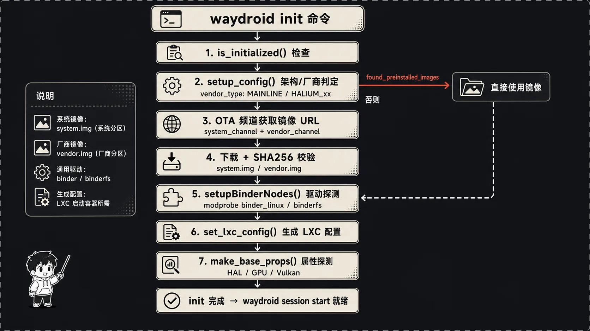
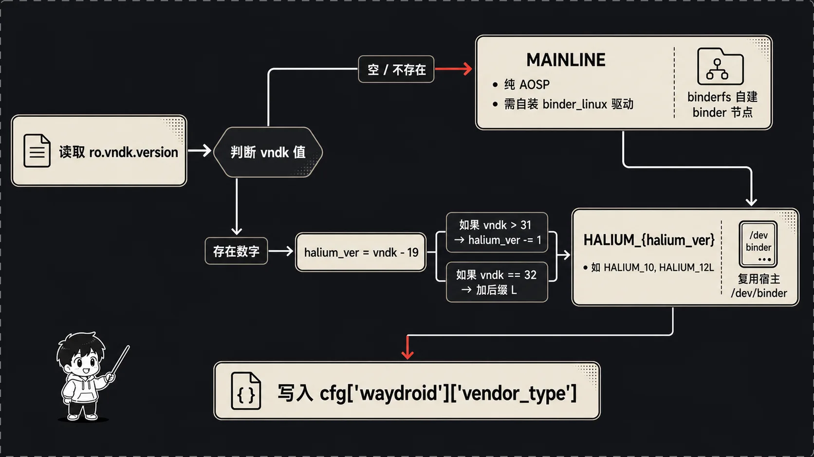
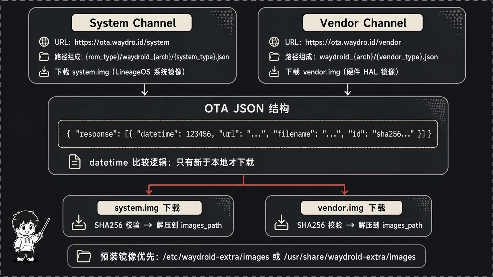

## 装完之后那条命令，到底在忙什么

我第一次在笔记本上折腾 Waydroid 的时候，按文档把包装好，然后敲了那条所有教程都会让你敲的命令：

```
sudo waydroid init
```

然后呢？终端开始刷日志，说在下载镜像、在探测什么 vendor type、在生成 LXC 配置，几分钟后回到提示符，告诉我可以 `waydroid session start` 了。当时我就好奇——这短短一条命令，背后到底替我干了多少活？为什么非得 `sudo`？它怎么知道要下载哪个镜像、要不要装驱动？

后来我把源码翻了一遍，发现 `waydroid init` 其实是整个项目里最"重"的一条命令。它要在你这台陌生的机器上，从零摸清硬件、拉对镜像、铺好驱动、写好配置，最后把一个能跑安卓的容器骨架立起来。这篇我就顺着代码，把这条命令从按下回车到结束的每一步拆开讲。所有行号都来自我本地这份仓库。

先看入口。你敲 `waydroid init`，`tools/__init__.py` 的 `main()` 把它路由到这儿（第 57 到 62 行）：

```python
if args.action == "init":
    if args.client:
        actions.remote_init_client(args)
    else:
        actionNeedRoot(args.action)
        actions.init(args)
```

两条岔路。带 `--client` 的话走 `remote_init_client`，那是给图形界面用的（文章最后会讲）；命令行直接跑的话，先 `actionNeedRoot` 检查你是不是 root——这就是为什么必须 `sudo`，因为接下来要装内核模块、写 `/var/lib/waydroid`、操作设备节点，全是特权活。检查过了，进 `actions.init(args)`，真正的主流程开始了。

## 主流程长什么样：init() 这个总指挥

`init()` 函数在 `tools/actions/initializer.py` 第 124 行，它是整场初始化的总指挥。我先把它的骨架贴出来，后面再一段段展开：

```python
def init(args):
    if is_initialized(args) and not args.force:
        logging.info("Already initialized")

    if not setup_config(args):
        return
    ...
    if args.images_path not in tools.config.defaults["preinstalled_images_paths"]:
        helpers.images.get(args)
    else:
        helpers.images.remove_overlay(args)
    if not os.path.isdir(tools.config.defaults["rootfs"]):
        os.mkdir(tools.config.defaults["rootfs"])
    if not os.path.isdir(tools.config.defaults["overlay"]):
        os.mkdir(tools.config.defaults["overlay"])
        os.mkdir(tools.config.defaults["overlay"]+"/vendor")
    if not os.path.isdir(tools.config.defaults["overlay_rw"]):
        ...
    helpers.drivers.probeAshmemDriver(args)
    helpers.lxc.setup_host_perms(args)
    helpers.lxc.set_lxc_config(args)
    helpers.lxc.make_base_props(args)
    ...
```

读下来节奏很清楚：先判断要不要重来（`is_initialized` + `force`）→ 探测硬件配置（`setup_config`）→ 搞定镜像（下载或用预装）→ 建目录 → 装 ashmem 驱动 → 拷权限 → 生成 LXC 配置 → 生成基础属性。我把这条链拆成下面几节，挨个说。

开头那个 `is_initialized(args)` 值得先看一眼，它在第 19 行，就两个判断：

```python
def is_initialized(args):
    return os.path.isfile(args.config) and os.path.isdir(tools.config.defaults["rootfs"])
```

判断 Waydroid 是否已经初始化过，靠的就是两样东西同时存在：配置文件 `waydroid.cfg` 和根文件系统目录 `rootfs/`。这俩在不在，就是 Waydroid 判断"我装好了没"的全部依据。如果已经初始化、又没带 `--force`，它只是打一行日志提个醒，但注意——代码这里并没有 `return`，它会继续往下跑，相当于一次"幂等的重新初始化"。真要强制全量重来才需要 `--force`。

## 重新初始化时，别把正在跑的容器搞崩

`init()` 不只服务于"全新安装"，你也可能在容器已经跑着的时候再敲一次 init（比如换个镜像源重来）。这种情况它处理得很小心，在 `setup_config` 之后、下镜像之前有一段（第 131 到 147 行）：

```python
status = "STOPPED"
session = None
if os.path.exists(tools.config.defaults["lxc"] + "/waydroid"):
    status = helpers.lxc.status(args)
if status != "STOPPED":
    ...
    container = tools.helpers.ipc.DBusContainerService()
    session = container.GetSession()
    container.Stop(False)
```

先查容器当前状态，如果不是 STOPPED，它会通过 DBus 拿到当前 session 信息、再把容器停掉——总不能一边换镜像一边让旧容器跑着，那文件系统就乱套了。注意它把 `session` 存了下来。等后面镜像、配置全部刷新完，函数末尾（第 165 到 174 行）又会拿这个 `session` 把容器重新拉起来：

```python
if status != "STOPPED":
    ...
    container.Start(session)
```

这么一来，对正在用 Waydroid 的人来说，一次重新 init 就是"短暂停一下、刷新完自动恢复"，session 不丢。这种对运行中状态的体贴，是区分"能用的工具"和"好用的工具"的细节。

## setup_config：摸清这台机器的底细

`setup_config()`（第 37 行）是 init 的第一件正经事，任务是搞清楚"我现在站在一台什么样的机器上"。它依次定下几个关键变量：

```python
def setup_config(args):
    cfg = tools.config.load(args)
    args.arch = helpers.arch.host()
    cfg["waydroid"]["arch"] = args.arch

    args.vendor_type = get_vendor_type(args)
    cfg["waydroid"]["vendor_type"] = args.vendor_type

    helpers.drivers.setupBinderNodes(args)
    cfg["waydroid"]["binder"] = args.BINDER_DRIVER
    ...
```

先拿 CPU 架构。`helpers.arch.host()`（`arch.py` 第 21 行）干的不只是抄一下 `platform.machine()`，它做了一层映射加体检：

```python
mapping = {
    "i686": "x86", "x86_64": "x86_64",
    "aarch64": "arm64", "armv7l": "arm", "armv8l": "arm"
}
```

把内核报的 `aarch64` 翻成 Waydroid 镜像命名里用的 `arm64`。更细的是它后面那个 `maybe_remap`（第 36 行）——x86 平台会去翻 `/proc/cpuinfo`，要是连 SSSE3 都不支持直接报错（安卓镜像编译时就指望有这个指令集），`x86_64` 但缺 SSE4.2 的话还会贴心地降级回 32 位 `x86`。这一步定下来的架构，直接决定后面下载哪个镜像，所以它宁可在这儿把话说死。

这里得插一句：上面那些 `host_get(args, "...")` 到底是怎么读到属性的？看 `props.py` 第 10 行，答案朴素得有点出乎意料：

```python
def host_get(args, prop):
    if which("getprop") is not None:
        command = ["getprop", prop]
        return subprocess.run(command, ...).stdout.decode('utf-8').strip()
    else:
        return ""
```

它就是调宿主机上的 `getprop` 命令。普通桌面 Linux 压根没有 `getprop` 这个程序，`which` 返回 None，于是所有 `host_get` 一律返回空字符串——这恰恰是 MAINLINE 判定的根基：读不到任何 Android 属性，就说明你不是个 Android 底层环境。而在 Halium 设备上 `getprop` 是现成的，那一堆属性才有值。理解了这点，前面 `vendor_type` 为什么靠 `ro.vndk.version` 是否为空来区分，就顺理成章了。

说回正题，定完架构，是整个初始化里我觉得最有意思的一步：判定 `vendor_type`。

## vendor_type：你是纯净 AOSP，还是站在厂商 HAL 上



Waydroid 能跑在两类完全不同的环境上，这个区别它叫 `vendor_type`：

- **MAINLINE**：普通桌面 Linux、或者主线内核的设备。这种机器上根本没有现成的 Android 硬件抽象层（HAL），Waydroid 得自带一套 vendor 镜像，还得自己想办法把 binder 驱动装上。
- **HALIUM_xx**：本身就是个跑着类 Android 底层的设备（典型就是装了 Halium 的手机/平板）。这种机器上厂商的 HAL、binder 节点都现成的，Waydroid 可以直接蹭，不用自己造。

那它怎么知道自己是哪一类？看 `get_vendor_type()`（第 22 到 35 行），核心就一个属性 `ro.vndk.version`：

```python
def get_vendor_type(args):
    vndk_str = helpers.props.host_get(args, "ro.vndk.version")
    ret = "MAINLINE"
    if vndk_str != "":
        vndk = int(vndk_str)
        if vndk > 19:
            halium_ver = vndk - 19
            if vndk > 31:
                halium_ver -= 1 # 12L -> Halium 12
            ret = "HALIUM_" + str(halium_ver)
            if vndk == 32:
                ret += "L"
    return ret
```

逻辑是这样的：普通 Linux 桌面压根没有 `ro.vndk.version` 这个属性，`host_get` 返回空字符串，那就老老实实当 MAINLINE。但如果你在一个 Halium 设备上，这属性是有值的——它是 Android 的 VNDK 版本号。VNDK 版本和 Android 大版本是挂钩的（比如 28 对应 Android 9，30 对应 Android 11），Waydroid 用 `vndk - 19` 这个偏移把它换算成 Halium 的代号。

中间那两行 `if vndk > 31` 和 `if vndk == 32` 是处理 Android 12L 这个奇葩版本的——12L 的 VNDK 是 32，按公式算会和 13 撞车，所以专门减一再补个 "L" 后缀，得到 `HALIUM_12L`。这种"为某个具体版本打补丁"的代码我特别喜欢，它诚实地记录了现实世界的不规整。

判定完 `vendor_type`，紧接着 `setup_config` 调 `setupBinderNodes(args)` 把 binder 节点也安排上——这部分逻辑不小，我后面单独开一节讲。

## 镜像从哪来：先翻口袋，没有再上网买



知道了架构和 vendor_type，下一个问题是 system.img 和 vendor.img 从哪来。`setup_config` 第 50 到 66 行的策略很务实——**先翻本地口袋，翻不到再上网下**。

```python
preinstalled_images_paths = tools.config.defaults["preinstalled_images_paths"]
for preinstalled_images in preinstalled_images_paths:
    if os.path.isdir(preinstalled_images):
        system_path = preinstalled_images + "/system.img"
        vendor_path = preinstalled_images + "/vendor.img"
        ...
        if system_exists and vendor_exists:
            has_preinstalled_images = True
            args.images_path = preinstalled_images
            break
```

预装路径有两个，定义在 `config/__init__.py` 第 37 行：`/etc/waydroid-extra/images` 和 `/usr/share/waydroid-extra/images`。有些发行版会把镜像随包一起塞进去，这时候 Waydroid 直接用，省一次几百兆的下载。注意它检查的时候用 `os.path.isfile(...) or stat.S_ISBLK(...)`，也就是说镜像既可以是普通文件，也可以是块设备——挺灵活。

如果本地确实有预装镜像，`setup_config` 把 OTA 相关字段都标成 "None"，然后直接 return，根本不走网络。这条快捷路径走完，初始化就轻松多了。

但大多数人（包括当年的我）是没有预装镜像的，那就得走 OTA 下载，逻辑在第 77 到 121 行。这里得先讲清楚 Waydroid 的"频道"体系。

它把镜像源拆成两条独立的频道，配置默认值在 `config/__init__.py` 第 76 行起：

```python
channels_defaults = {
    "system_channel": "https://ota.waydro.id/system",
    "vendor_channel": "https://ota.waydro.id/vendor",
    "rom_type": "lineage",
    "system_type": "VANILLA"
}
```

- **System Channel** 提供的是 Android 系统本体（`system.img`），它和具体硬件无关，只跟你选的 ROM 类型（`lineage`）和系统类型（`VANILLA` 纯净版 / `GAPPS` 带谷歌服务）有关。
- **Vendor Channel** 提供的是 vendor 镜像（`vendor.img`），这玩意儿是和硬件强绑定的——不同设备的 HAL 不一样，得拿对应的那一份。

这里的 `system_type` 就是你常听说的"装不装谷歌服务"那个选择：`VANILLA` 是纯净 LineageOS，`GAPPS` 是带 Google 服务的版本。它最终会拼进 system OTA 的 URL 文件名里（`VANILLA.json` 还是 `GAPPS.json`），所以选哪个，下到的就是哪套镜像。命令行里可以用参数指定，图形界面那个初始化窗口则给了个下拉框让你二选一。

这些默认值可以被 `/usr/share/waydroid-extra/channels.cfg` 覆盖，`load_channels()`（`config/load.py` 第 35 行）负责读取：它先把上面那套默认值铺好，再用配置文件里有的字段逐个覆盖（第 44 到 46 行），所以你哪怕只在 cfg 里写一行自定义源，其余的也会自动走默认。这种"默认 + 局部覆盖"的合并方式，比"要么全用默认要么全自己写"友好得多。发行版打包者想换成自己的镜像服务器，改这一个文件就行，不用碰代码。

System OTA 的 URL 是拼出来的（第 91 到 92 行）：

```python
args.system_ota = args.system_channel + "/" + args.rom_type + \
    "/waydroid_" + args.arch + "/" + args.system_type + ".json"
```

比如在 arm64 上拼出来大概是 `https://ota.waydro.id/system/lineage/waydroid_arm64/VANILLA.json`。注意拿到的不是镜像本身，而是一个 JSON 索引，里面记着最新镜像的下载地址、文件名、SHA256、时间戳。

Vendor OTA 的拼法更讲究，因为要匹配到对的硬件（第 98 到 111 行）：

```python
device_codename = helpers.props.host_get(args, "ro.product.device")
args.vendor_type = None
for vendor in [device_codename, get_vendor_type(args)]:
    vendor_ota = args.vendor_channel + "/waydroid_" + \
        args.arch + "/" + vendor.replace(" ", "_") + ".json"
    vendor_request = helpers.http.retrieve(vendor_ota)
    if vendor_request[0] == 200:
        args.vendor_type = vendor
        args.vendor_ota = vendor_ota
        break
```

它先拿设备代号（`ro.product.device`）去试——万一你这台机器恰好有专属的 vendor 镜像呢，那当然用最贴合的。设备代号那条 URL 返回 404 的话，就退而求其次用前面算出来的 `vendor_type`（MAINLINE 或 HALIUM_xx）的通用镜像。两个都试不出 200 就直接报错"找不到 vendor 频道"。这个"先精确后通用"的回退顺序，保证了既能照顾特殊设备、又能兜住绝大多数普通机器。

URL 都拼好、JSON 索引都能访问，`setup_config` 把这些信息（包括 OTA 地址、vendor_type）写进 `waydroid.cfg` 落盘，自己的活就干完了。真正下载是回到 `init()` 里调 `helpers.images.get(args)`。

## 下载与校验：宁可删了重来，也不让坏镜像上车

镜像下载在 `tools/helpers/images.py` 的 `get()`（第 25 到 82 行）。它对 system 和 vendor 各跑一遍同样的流程，我以 system 为例：

```python
system_request = helpers.http.retrieve(system_ota)
...
system_responses = json.loads(system_request[1].decode('utf8'))["response"]
...
for system_response in system_responses:
    if system_response['datetime'] > int(cfg["waydroid"]["system_datetime"]):
        images_zip = helpers.http.download(
            args, system_response['url'], system_response['filename'], cache=False)
        logging.info("Validating system image")
        with open(images_zip, 'rb') as f:
            if sha256sum(f) != system_response['id']:
                with suppress(OSError):
                    os.remove(images_zip)
                raise ValueError("Downloaded system image hash doesn't match, ...")
            ...
            with zipfile.ZipFile(f, 'r') as zip_ref:
                zip_ref.extractall(args.images_path)
        cfg["waydroid"]["system_datetime"] = str(system_response['datetime'])
        tools.config.save(args, cfg)
        os.remove(images_zip)
        break
```

几个点我觉得做得很扎实：

第一，它先比 `datetime`。JSON 里每个镜像都带时间戳，只有比本地记录的 `system_datetime` 更新，才会真正下载。这就是 Waydroid 的增量更新机制——你重复跑 init，已经是最新的镜像它就跳过，不会傻乎乎重下。第一次初始化时本地时间戳是 0（`config/__init__.py` 第 35 行 `system_datetime` 默认 "0"），所以必下。

第二，SHA256 校验。下完之后 `sha256sum(f)` 算一遍哈希，和 JSON 里的 `id` 字段比对。这个 `sha256sum` 函数（第 15 行）写得也讲究，用 128KB 的 buffer 加 `memoryview` 分块读，避免把整个几百兆的 zip 一口气读进内存：

```python
def sha256sum(f):
    h = hashlib.sha256()
    b = bytearray(128*1024)
    mv = memoryview(b)
    for n in iter(lambda: f.readinto(mv), 0):
        h.update(mv[:n])
    f.seek(0)
    return h.hexdigest()
```

第三，校验失败的处理很干脆——`os.remove(images_zip)` 把坏文件删掉，然后抛异常。它宁可让你重来，也绝不把一个哈希对不上的镜像解压上车。这种"出错就清干净现场"的洁癖，能省掉一大堆"为什么我解压出来的镜像是坏的"的诡异问题。

校验过了才 `extractall` 解压到 `images_path`，更新时间戳并保存配置，最后删掉 zip。vendor 镜像走一模一样的流程。两个都搞定，`get()` 末尾调 `remove_overlay` 清掉旧的 overlay，镜像这块就齐活了。

## Binder：MAINLINE 要自己造，HALIUM 直接蹭

> 图待补：Waydroid Binder 驱动探测流程图——MAINLINE binderfs 路径 vs HALIUM 宿主复用路径，含三组驱动名列表（Codex 超时，请稍后用 image-generator 重出）

回过头补上前面欠的 binder 这一课。安卓的进程间通信几乎全靠 binder，它是个内核驱动，对外是 `/dev/binder`、`/dev/vndbinder`、`/dev/hwbinder` 三个节点。`setupBinderNodes()`（`drivers.py` 第 121 行）根据 `vendor_type` 走两条完全不同的路。

先看那三组候选驱动名（第 14 到 31 行）：

```python
BINDER_DRIVERS = ["anbox-binder", "puddlejumper", "bonder", "binder"]
VNDBINDER_DRIVERS = ["anbox-vndbinder", "vndpuddlejumper", "vndbonder", "vndbinder"]
HWBINDER_DRIVERS = ["anbox-hwbinder", "hwpuddlejumper", "hwbonder", "hwbinder"]
```

每组都有好几个名字，最后一个才是标准名 `binder`/`vndbinder`/`hwbinder`，前面几个是各种"马甲名"。为什么要马甲？因为在 HALIUM 设备上，标准的 `/dev/binder` 已经被宿主系统自己的安卓底层占着了，Waydroid 不能去抢，得用一套自己的名字另开节点。

**MAINLINE 模式**（第 125 到 146 行）：这种机器上一个 binder 节点都没有，得从头造。先调 `probeBinderDriver(args)`（第 67 行）。它先扫一圈 `/dev/` 下有没有现成节点，没有就用 `anbox-binder` 这套名字去加载内核模块：

```python
command = ["modprobe", "binder_linux",
           "devices=\"{}\"".format(devices)]
```

现代内核更可能用的是 binderfs——一种专门管 binder 节点的文件系统。这时走第 98 到 107 行：先 `mount -t binder binder /dev/binderfs` 把它挂起来，然后调 `allocBinderNodes`（第 43 行）动态注册节点。这个函数挺硬核，它要往 binder-control 发一个 `BINDER_CTL_ADD` 的 ioctl，而 Python 标准库里没有这个常量，作者干脆把 Linux 的 `_IOWR` 宏用位运算重新拼了一遍：

```python
def IOC(direction, _type, nr, size):
    return (direction << DIRSHIFT) | (_type << TYPESHIFT) | (nr << NRSHIFT) | (size << SIZESHIFT)
...
BINDER_CTL_ADD = IOWR(98, 1, 264)
```

注册完再软链回 `/dev/`。回到 `setupBinderNodes`，它再确认这三个节点确实都出现了，把实际用的名字记到 `args.BINDER_DRIVER` 之类的变量里，任何一个没找到就直接抛 `OSError`——binder 没整好，后面安卓根本起不来，这里就必须卡死。

**HALIUM 模式**（第 147 行的 else 分支）：简单多了，因为宿主已经有 binder 了，直接用现成的就行。注意它遍历的是 `BINDER_DRIVERS[:-1]`——**砍掉了列表最后一个标准名 `binder`**，只在那些马甲名里找。这正是前面说的"不抢宿主的标准节点，只认自己的马甲"。

探测出来的这三个名字最后被 `setup_config` 写进 `waydroid.cfg` 的 `binder`/`vndbinder`/`hwbinder` 字段。以后每次启动容器，`loadBinderNodes`（第 169 行）直接读配置复用，不用再探一遍。

顺带一提，`init()` 主流程里还单独调了一次 `probeAshmemDriver`（第 161 行）装 ashmem（匿名共享内存）驱动，装不上也不强求——新内核没有 ashmem 时安卓会回退用 memfd。

## 建目录、拷权限：容易被略过的两步

镜像和驱动之间，`init()` 还夹了几步不起眼但少不了的活。

一是建目录（第 152 到 160 行）。它把 `rootfs/`、`overlay/`、`overlay_rw/` 这几个目录挨个建出来，注意 `overlay` 下要建 `vendor` 子目录、`overlay_rw` 下要同时建 `system` 和 `vendor`：

```python
if not os.path.isdir(tools.config.defaults["overlay_rw"]):
    os.mkdir(tools.config.defaults["overlay_rw"])
    os.mkdir(tools.config.defaults["overlay_rw"]+"/system")
    os.mkdir(tools.config.defaults["overlay_rw"]+"/vendor")
```

这是为 OverlayFS 铺路。Waydroid 默认不会让安卓直接写进只读的 system/vendor 镜像，而是叠一个可写层在上面：下层是镜像（只读），上层是 `overlay_rw/system` 和 `overlay_rw/vendor`（可写），安卓运行时的所有写入都落到可写层。这么做有两个好处——原始镜像永远干净，OTA 升级时底层镜像整个换掉、你在可写层的改动还能保留下来。`overlay/` 那个目录则是给你放自定义系统文件用的另一种叠加。这几个目录现在建好是空的，等 `session start` 时才会被真正挂成 overlay。

二是拷权限，`setup_host_perms(args)`（`lxc.py` 第 352 行）。这步只在 Treble 设备上才真干活（第 357 行，非 treble 直接 return），它把宿主机 `/vendor/etc/permissions/` 和 `/odm/etc/permissions/` 下的 NFC、红外（consumerir）相关的权限声明文件，拷贝到 Waydroid 的 `host-permissions` 目录：

```python
copy_list.extend(glob.glob("/vendor/etc/permissions/android.hardware.nfc.*"))
...
for filename in copy_list:
    shutil.copy(filename, tools.config.defaults["host_perms"])
```

这些文件后面会被 bind 进容器（`generate_nodes_lxc_config` 里那行 `vendor/etc/host-permissions`），让容器里的安卓知道"这台设备有 NFC / 有红外"。普通桌面机器没这些硬件，这步基本是空转，但对 Halium 手机就有意义了。

## 生成 LXC 配置：拼积木拼出一份容器配置

> 图待补：LXC 配置生成流程图：基础配置+版本兼容片段+设备节点配置+AppArmor/Seccomp — 从 config_base 到完整 LXC 配置（Codex 超时/资源不足，请稍后用 image-generator 重出）

镜像和驱动都齐了，接下来 `set_lxc_config()`（`lxc.py` 第 143 到 181 行）负责把 LXC 容器的配置文件生成出来。这步最体现"兼容性工程"的味道——它要适配从老到新好几个版本的 LXC。

先拿 LXC 版本号（`get_lxc_version`，第 19 行，靠 `lxc-info --version` 取首位数字），然后按版本拼配置片段：

```python
config_snippets = [ config_paths + "base" ]
if lxc_ver <= 2:
    config_snippets.append(config_paths + "1")
else:
    for ver in range(3, 5):
        snippet = config_paths + str(ver)
        if lxc_ver >= ver and os.path.exists(snippet):
            config_snippets.append(snippet)
```

`config_base` 是所有版本都要的骨架；LXC 1/2 这种老版本追加 `config_1`，新版本（3 以上）则按版本号往上加 `config_3`、`config_4`。为什么要分版本？因为 LXC 在 3.0 前后把一堆配置项改了名——老版本写 `lxc.network.type`，新版本写 `lxc.net.0.type`；老版本 `lxc.aa_profile`，新版本 `lxc.apparmor.profile`。Waydroid 用分片段的方式优雅地绕开了这堆改名，你装的是哪个版本就拼对应的那几片。

拼完之后还有几道收尾（第 163 到 178 行）：

```python
# 把所有片段 cat 成一个 config
command = ["sh", "-c", "cat {} > \"{}\"".format(...)]
# 替换架构占位符
command = ["sed", "-i", "s/LXCARCH/{}/".format(platform.machine()), ...]
# 复制 seccomp 配置
command = ["cp", "-fpr", seccomp_profile, lxc_path + "/waydroid.seccomp"]
```

`config_base` 里有一行 `lxc.arch = LXCARCH`，这个 `LXCARCH` 是占位符，这里用 sed 替换成真实架构（`platform.machine()` 的原始值，比如 `aarch64`）。然后把 seccomp 系统调用过滤规则 `waydroid.seccomp` 拷过去——这份规则限制容器里能调哪些系统调用，是命名空间之外又一道安全收口。

AppArmor 那段（第 169 到 171 行）是动态的：

```python
if get_apparmor_status(args):
    command = ["sed", "-i", "-E",
               "/lxc.aa_profile|lxc.apparmor.profile/ s/unconfined/{}/g".format(LXC_APPARMOR_PROFILE),
               lxc_path + "/config"]
    tools.helpers.run.user(args, command)
```

`get_apparmor_status`（第 130 行）会查三件事：`aa-enabled` 命令、systemd 里 apparmor 服务是否 active、以及 `lxc-waydroid` 这个 profile 有没有真的加载进内核。三个条件都满足才动手，用 sed 把配置里默认的 `unconfined` 全替换成真正的 profile 名。换句话说——能上 AppArmor 的环境它就上，上不了就保持 `unconfined`，绝不因为环境不具备就报错卡住。这种"有则加固、无则不强求"的写法，在这份代码里反复出现。

最后是生成设备节点配置：

```python
nodes = generate_nodes_lxc_config(args)
config_nodes_tmp_path = args.work + "/config_nodes"
with open(config_nodes_tmp_path, "w") as f:
    f.writelines(node + "\n" for node in nodes)
...
Path(os.path.join(lxc_path, "config_session")).touch()
```

`generate_nodes_lxc_config`（第 40 行）是这步的核心，它现场扫描宿主机上真实存在的设备，逐条生成 `lxc.mount.entry` 把它们 bind 进容器。看里头那个 `make_entry` 的用法就明白了——它默认带 `optional` 和 `check=True`，意思是"这个设备存在才挂、不存在就跳过，不报错"：

```python
make_entry("/dev/zero")
make_entry("/dev/ashmem")
make_entry("/dev/kgsl-3d0")     # 高通 GPU
make_entry("/dev/mali0")        # ARM Mali GPU
render, _ = tools.helpers.gpu.getDriNode(args)
make_entry(render)              # DRI 渲染节点
for n in glob.glob("/dev/fb*"):       # framebuffer
    make_entry(n)
for n in glob.glob("/dev/video*"):    # 摄像头/编解码
    make_entry(n)
for n in glob.glob("/dev/dma_heap/*"):
    make_entry(n)
```

高通的 `kgsl-3d0`、ARM 的 `mali0`、Mesa 的 DRI 节点……它把各家 GPU 的节点都列上，反正不存在的会自动跳过，存在的就精确投喂进容器。framebuffer、video、dma_heap 这些更是直接 `glob` 通配一把全收。binder 三件套也在这儿 bind（第 75 到 77 行），用的是前面探测出来的真实节点名。这就是为什么 LXC 配置必须运行时动态生成而不能写死——每台机器的硬件清单都不一样，写死一份配置换台机器就跑不起来了。

非 MAINLINE（也就是 Halium）还会多挂一些东西，比如把宿主的 `/dev/hwbinder` 映射成容器里的 `host_hwbinder`、把整个 `/vendor` rbind 进去（第 79 到 82 行），因为 Halium 设备的 HAL 就指着用宿主现成的那一套。

最后还 `touch` 出一个空的 `config_session` 占位文件。它现在是空的，等每次 `waydroid session start` 时才由 `generate_session_lxc_config` 填上 Wayland socket、PulseAudio socket、用户数据目录这些和当前登录会话强相关的挂载。把"机器级"的设备配置（`config_nodes`，init 时定）和"会话级"的配置（`config_session`，每次启动定）拆开，是个很清爽的分层——前者一次生成长期复用，后者随用户会话变化。

## 基础属性：把宿主硬件翻译成 Android 能懂的话

LXC 配置之后是 `make_base_props()`（`images.py` 第 219 行）。这函数特别长，但干的事一句话能说清：**把宿主机的硬件情况，翻译成一堆 Android 系统属性，写进 `waydroid_base.prop`，让安卓启动时照着用对的驱动**。

安卓启动时会读一堆 `ro.hardware.*` 属性来决定加载哪个 HAL，但 Waydroid 跑在一台它一无所知的机器上，这些属性得现场探测。核心是两个辅助函数。

`find_hal()`（第 220 行）按名字去文件系统里捞 HAL 库。比如找 gralloc（图形内存分配器），它会拿 `ro.hardware` 之类的属性值，去 `/vendor/lib/hw/`、`/system/lib64/hw/` 这些目录里看有没有 `gralloc.<值>.so` 这个文件，找到就说明这个 HAL 能用：

```python
for lib in ["/odm/lib", "/odm/lib64", "/vendor/lib", "/vendor/lib64", ...]:
    hal_file = lib + "/hw/" + hardware + "." + prop + ".so"
    if os.path.isfile(hal_file):
        return prop
```

`find_hidl()`（第 236 行）则是查 HIDL 服务，它用 gbinder 连上 `/dev/hwbinder`，看某个接口在不在已注册的服务列表里。这个只在 HALIUM 模式有意义（第 237 行 MAINLINE 直接返回 False，因为压根没有 hwbinder 服务）。

围绕这两个工具，`make_base_props` 探测了一长串东西，我挑几个有代表性的说说。

gralloc（图形内存分配器）这块的回退逻辑最能说明问题（第 258 到 271 行）。先 `find_hal("gralloc")` 找现成的，找不到再 `find_hidl` 查 HIDL 服务，还没有就看宿主有没有 DRI 渲染节点：有的话退到 `gbm` + `mesa`（走 Mesa 的开源驱动，这是绝大多数 Linux 桌面的情况），连 DRI 都没有就只能 `swiftshader` 纯软件渲染兜底，同时关掉硬件编解码（`debug.stagefright.ccodec=0`）。一层套一层，保证在任何机器上都有路可走，区别只是快慢。

Vulkan（第 292 到 296 行）类似，`find_hal` 找不到就根据 DRI 节点名去 `getVulkanDriver` 猜一个。camera（第 298 到 305 行）在非 Treble 且 MAINLINE 时直接给 `v4l2`——也就是让安卓走标准的 V4L2 接口去用你的 USB 摄像头。OpenGL ES 版本（第 307 到 310 行）读不到就硬给个 `196610`（也就是 3.2）。

还有几条和硬件无关、但很关键的属性。开头第 248 到 252 行：宿主没有 `/dev/ashmem` 就写 `sys.use_memfd=true`（呼应前面 ashmem 装不上时的 memfd 回退），再加上 `ro.adb.secure=1`、`ro.debuggable=0` 这两条出于安全考虑写死的。第 312 到 318 行还会把 OTA 地址写成 `waydroid.system_ota` / `waydroid.vendor_ota` 属性塞进去（用的是预装镜像就改成 `waydroid.updater.disabled=true`，告诉容器内的更新器别更新了），以及把 Waydroid 自己的版本号写进 `waydroid.tools_version`。MAINLINE 还会补一个 `ro.vndk.lite=true`。

设备身份信息则从两个地方凑（第 323 到 338 行）：先试 `ro.product.vendor.*` 属性，没有就去翻 `/proc/device-tree/` 里的 brand/device/manufacturer/model/name，拼成 `ro.product.waydroid.*`，再带上宿主的 build fingerprint。这样容器里的安卓"自报家门"时，显示的是接近你这台真机的设备信息，而不是一台来历不明的虚拟设备。

函数最后这一段我觉得是点睛之笔（第 341 到 346 行）：

```python
cfg = tools.config.load(args)
for k, v in cfg["properties"].items():
    for idx, elem in enumerate(props):
        if (k+"=") in elem:
            props.pop(idx)
    props.append(k+"="+v)
```

它把你在 `waydroid.cfg` 的 `[properties]` 段里写的自定义属性合并进来，而且是**覆盖式**的——同名的先删掉自动探测的值，再用你的值。这意味着自动探测错了的话，你永远可以在配置里手动改回来，最终以你说的为准。这种"自动为主、人工兜底"的设计，对一个要适配无数硬件的项目来说太重要了。

到这里，`make_base_props` 写完 `waydroid_base.prop`，`init()` 的主流程也基本走完了：架构和 vendor 摸清了、镜像下好校验过了、binder 和 ashmem 驱动铺好了、rootfs 和 overlay 目录建好了、LXC 配置和基础属性都生成了。一个能跑安卓的容器骨架，立起来了。

## 还有一条路：让图形界面在后台帮你跑 init

前面讲的都是命令行 `sudo waydroid init` 这条同步路径——日志哗哗刷、你盯着终端等。但 Waydroid 还有一套给图形界面用的异步初始化，藏在 `DbusInitializer` 里（第 176 行），值得一说，因为它的进程模型挺巧。

桌面环境（比如那个 GTK 初始化窗口）不方便用 root 跑、也不能让界面卡在那儿等下载。于是 Waydroid 把 init 拆成"前台 UI + 后台 root 服务"两半，中间用 DBus 连起来。`DbusInitializer` 暴露一个 `Init()` 方法（第 184 行），UI 通过系统总线远程调它：

```python
def Init(self, params, sender=None, conn=None):
    ...
    if no_auth or ensure_polkit_auth(sender, conn, "id.waydro.Initializer.Init"):
        self.worker_thread = remote_init_server(self.args, self, params)
